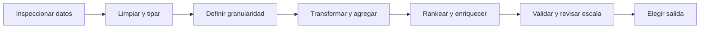

# Empieza aquí: de datos crudos a resultados confiables

Este conjunto desarrolla el documento compartido con explicaciones, ejemplos y conexiones con tus notas de pregrado y maestría. La carpeta usada es **Obsidian/freelance**, que ya existía en tu vault.

## La idea que conecta todo

**SQL y Spark transforman datos; calidad comprueba su significado; testing verifica el comportamiento; DevOps permite entregar y operar los cambios.** Antes de elegir una función, define qué representa una fila y qué pregunta necesitas responder.

Abre [[Obsidian/freelance/Data Engineering/Mapa de estudio.canvas|el mapa visual navegable]] para recorrer las conexiones. Cada nota conceptual tiene un ejemplo, una advertencia concreta, una regla para recordar y una pregunta con respuesta desplegable.

## Ruta sugerida

1. **Comprender filas y SQL.** Lee las siete notas SQL en orden. Predice las salidas antes de ejecutar.
2. **Hacer confiable la entrada.** Estudia las dos notas de calidad y vuelve al parser con casos inválidos.
3. **Resolver sobre pocos datos.** Ejecuta el laboratorio SQL y explica cada CTE en voz alta.
4. **Comprender la distribución.** Lee Spark 01–04 antes de memorizar APIs.
5. **Construir resultados.** Continúa Spark 05–08 y el laboratorio de centroides. Delta y Lambda son ampliaciones posteriores.
6. **Entregar sin romper.** Estudia DevOps y Testing, y diseña pruebas para tu transformación.
7. **Repasar con criterio.** Usa las preguntas y la lista de dominio; vuelve a las notas cuando no puedas justificar una decisión.

No hay un plazo obligatorio: avanza cuando puedas resolver una variación del ejemplo.

## Notas por bloque

### SQL

- [[Obsidian/freelance/Data Engineering/SQL/01 Cómo piensa SQL|Cómo piensa SQL: filas, claves y granularidad]]
- [[Obsidian/freelance/Data Engineering/SQL/02 Índices y filtros eficientes|Índices y SARGability: buscar sin revisar todo]]
- [[Obsidian/freelance/Data Engineering/SQL/03 Planes estadísticas y particiones|Planes, estadísticas y particionamiento]]
- [[Obsidian/freelance/Data Engineering/SQL/04 CTE y transformaciones de partidos|CTE, CASE y transformación de partidos]]
- [[Obsidian/freelance/Data Engineering/SQL/05 Parsing SQLite y normalización|Parsing SQLite y limpieza de texto]]
- [[Obsidian/freelance/Data Engineering/SQL/06 Ranking Top N y quintiles|Ventanas: ranking, Top N y quintiles]]
- [[Obsidian/freelance/Data Engineering/SQL/07 Conjuntos joins y ausencias|Conjuntos, joins y registros sin correspondencia]]

### Calidad

- [[Obsidian/freelance/Data Engineering/Calidad/01 Dimensiones de calidad|Calidad de datos: seis preguntas y su contexto]]
- [[Obsidian/freelance/Data Engineering/Calidad/02 Validación Unicode y contratos|Validación, Unicode y contratos de datos]]

### Spark

- [[Obsidian/freelance/Data Engineering/Spark/01 Arquitectura y procesamiento distribuido|Spark: arquitectura y procesamiento distribuido]]
- [[Obsidian/freelance/Data Engineering/Spark/02 Lazy DAG stages y shuffle|Lazy evaluation, DAG, jobs, stages y shuffle]]
- [[Obsidian/freelance/Data Engineering/Spark/03 Joins cache y optimización|Joins, cache y optimización en Spark]]
- [[Obsidian/freelance/Data Engineering/Spark/04 Schemas y DataFrames|Schemas, DataFrames y vistas temporales en PySpark]]
- [[Obsidian/freelance/Data Engineering/Spark/05 Ventanas y métricas de jugadores|Ventanas y métricas: elegir el mejor jugador]]
- [[Obsidian/freelance/Data Engineering/Spark/06 Datos anidados y JSON|Arrays, structs y JSON sin saturar el Driver]]
- [[Obsidian/freelance/Data Engineering/Spark/07 Centroides distancia y UDF|Centroides, distancia euclidiana y funciones UDF]]
- [[Obsidian/freelance/Data Engineering/Spark/08 Formatos particiones y salida|Parquet, JSON, CSV y archivos de salida]]
- [[Obsidian/freelance/Data Engineering/Spark/09 Parquet y Delta Lake|Parquet y Delta Lake: archivo frente a tabla]]
- [[Obsidian/freelance/Data Engineering/Spark/10 Arquitectura Lambda|Arquitectura Lambda: historia completa y datos recientes]]

### DevOps

- [[Obsidian/freelance/Data Engineering/DevOps/01 DevOps DataOps y CALMS|DevOps y DataOps: entregar cambios y aprender de ellos]]
- [[Obsidian/freelance/Data Engineering/DevOps/02 Git Azure Repos y Pull Requests|Git, Azure Repos y Pull Requests]]

### Testing

- [[Obsidian/freelance/Data Engineering/Testing/01 Pruebas y pirámide|Pruebas: niveles, objetivos y pirámide]]
- [[Obsidian/freelance/Data Engineering/Testing/02 Regresión y pruebas de datos|Regresión, retesting e invariantes de datos]]

### Laboratorios

- [[Obsidian/freelance/Data Engineering/Laboratorios/01 Laboratorio SQL resuelto|Laboratorio SQL resuelto: del texto al ranking]]
- [[Obsidian/freelance/Data Engineering/Laboratorios/02 Laboratorio Spark guiado|Laboratorio Spark: aggregate, join back y salida]]

## Repaso y procedencia

- [[Obsidian/freelance/Data Engineering/01 Repaso y preguntas razonadas|01 Repaso y preguntas razonadas]]
- [[Obsidian/freelance/Data Engineering/02 Fuentes alcance y cobertura|02 Fuentes alcance y cobertura]]

## Puentes con lo que ya estudiaste

- [[Obsidian/posgrado/master/MATEMÁTICAS Y PROGRAMACIÓN IA/modelo relacional y sql analitico/01 Tablas, claves y granularidad de los experimentos|01 Tablas, claves y granularidad de los experimentos]] — La unidad de análisis evita duplicar resultados tanto en ventas como en experimentos.
- [[Obsidian/posgrado/master/MATEMÁTICAS Y PROGRAMACIÓN IA/modelo relacional y sql analitico/05 CTE, ranking y auditoría de resultados|05 CTE, ranking y auditoría de resultados]] — Los empates y etapas SQL se trasladan a equipos y jugadores.
- [[Obsidian/posgrado/master/MATEMÁTICAS Y PROGRAMACIÓN IA/ingenieria de software para machine learning/04 Pruebas unitarias, integración y pruebas semánticas|04 Pruebas unitarias, integración y pruebas semánticas]] — Los invariantes de ML sirven como modelo para validar pipelines.
- [[Obsidian/pregrado/big data/extract transform load|extract transform load]] — La extracción, transformación y carga reciben controles explícitos de calidad.
- [[Obsidian/pregrado/Documentos/Computacion ditribuida/computacion distribuida|computacion distribuida]] — La coordinación entre procesos explica los costos de Spark.
- [[Obsidian/pregrado/Documentos/Bases de datos/fundamentos/Indixacion y procesos almacenados|Indixacion y procesos almacenados]] — Aquí se amplía cuándo un índice ayuda y cuándo cuesta más.

## Qué está verificado

El laboratorio SQLite pasó 18 comprobaciones y conserva resultados. El laboratorio PySpark tiene sintaxis revisada, pero no fue ejecutado por ausencia de PySpark. Los datos de práctica son sintéticos; el notebook mencionado por el spec no estaba adjunto.
