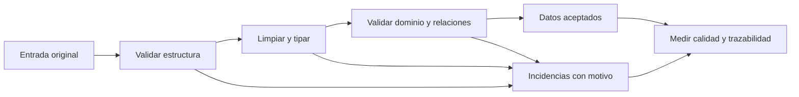

# Validación, Unicode y contratos de datos

## Un contrato hace explícito qué esperas

Un contrato de datos describe campos, tipos, obligatoriedad, significado y reglas de compatibilidad. Un schema `goles: integer` no expresa por sí solo que los goles deban ser no negativos ni que la fuente esté completa. Por eso contrato, esquema y validación de negocio se complementan.



Conserva el valor original junto al limpio y el motivo de rechazo. Si solo borras las filas problemáticas, tu reporte puede parecer perfecto aunque hayas perdido la mitad de la población.

## Limpieza demostrable

Para `" Ecuador "`, `"ECUADOR"`, `"ecuador"`, `"ECUADOR."` y `"\u00A0Ecuador"`, puedes proponer: convertir NBSP a espacio común, recortar extremos, quitar un punto final permitido y convertir mayúsculas. Esa regla es específica para un catálogo que acepte esas variantes; no la apliques indiscriminadamente a cualquier campo.

```python
# Python puro: demostración de una regla acordada para estos ejemplos.
def normalizar_pais(texto):
    if texto is None:
        return None
    limpio = texto.replace("\u00a0", " ").strip()
    if limpio.endswith("."):
        limpio = limpio[:-1].rstrip()
    return limpio.upper()

variantes = [" Ecuador ", "ECUADOR", "ecuador", "ECUADOR.", "\u00a0Ecuador"]
assert {normalizar_pais(x) for x in variantes} == {"ECUADOR"}
```

`\u00A0` y `\xa0` representan el mismo carácter. No es la secuencia literal de seis caracteres barra-u-0-0-A-0: importa si el archivo contiene un escape que el lector decodifica o texto literal. Inspecciona `repr(texto)` y, si hace falta, los códigos con `ord`. Python y SQLite no tienen exactamente las mismas reglas de mayúsculas y trim.

## Comprobar después de limpiar

Cuenta nulos, vacíos, NBSP restantes, filas que cambiaron y nombres sin correspondencia en el catálogo. Comprueba que distintos nombres válidos no hayan colapsado por una regla demasiado agresiva. Para Irán/Iran utiliza equivalencias conocidas; no supongas que quitar tildes resuelve todas las identidades.

## Tipos y nulos en Spark

Un `cast` puede lanzar un error bajo modo ANSI o devolver NULL en otros casos/configuraciones. Para errores esperables, una conversión tolerante como `try_cast` permite etiquetar la incidencia y conservar el original; después cuenta los fallos y valida límites. La política concreta depende de versión y configuración, como explica la [documentación de Spark sobre ANSI y conversiones](https://spark.apache.org/docs/latest/sql-ref-ansi-compliance.html).

Para coordenadas, no basta `isNotNull`: valores NaN o infinitos también son problemáticos. Valida finitud y sistema de coordenadas antes de promediar. Las fechas fuera del período descrito en el spec se deben reportar; no inventes el año correcto si no tienes una regla autorizada de corrección.

## Ejercicio

Diseña una tabla de incidencias con `id_origen`, `campo`, `valor_original`, `regla` y `motivo`. Explica cómo reconciliarías `filas_recibidas = filas_aceptadas + filas_rechazadas` cuando la clasificación es excluyente por fila; una fila puede tener varias incidencias y por eso no debes usar el número de incidencias como número de filas rechazadas.

> [!tip] Regla para recordar
> Limpia con una regla explícita y conserva evidencia de lo que cambió.

## Comprueba que lo entendiste

> [!question]- ¿Eliminar todas las filas con problemas prueba que el dataset final es representativo?
> No. Puede sesgarlo. Debes contar y explicar exclusiones y evaluar si la población restante responde a la pregunta.

## Conexiones

- [[Obsidian/freelance/Data Engineering/SQL/05 Parsing SQLite y normalización|05 Parsing SQLite y normalización]] — muestra las funciones SQLite y sus limitaciones.
- [[Obsidian/freelance/Data Engineering/Spark/04 Schemas y DataFrames|04 Schemas y DataFrames]] — implementa el contrato estructural en PySpark.
- [[Obsidian/freelance/Data Engineering/Testing/02 Regresión y pruebas de datos|02 Regresión y pruebas de datos]] — permite comprobar que la limpieza no rompe identidades.

Volver a [[Obsidian/freelance/Data Engineering/00 Empieza aquí|la ruta de estudio]].
