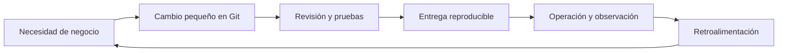

# DevOps y DataOps: entregar cambios y aprender de ellos

## Qué es y qué problema resuelve

DevOps reúne desarrollo y operación mediante colaboración, automatización y aprendizaje continuo. Imagina que escribiste un cálculo perfecto en tu computadora, pero en producción falla por una versión distinta o nadie sabe detectar resultados incorrectos. Entregar software implica mucho más que escribir la función: hay que poder construirlo, probarlo, ejecutarlo, observarlo y recuperarlo.

DataOps aplica prácticas colaborativas y automatizadas al recorrido de los datos. Además del código, cambian las fuentes, esquemas, volúmenes y distribuciones. Un pipeline puede ejecutar sin excepciones y producir un reporte equivocado: por eso necesita controles sobre los datos de entrada y salida.



## CALMS explicado con un mismo ejemplo

Quieres cambiar la limpieza de nombres de países.

| Pilar | Significado | Acción concreta |
|---|---|---|
| Culture | Responsabilidad compartida | Desarrollo y operación acuerdan qué hacer con países desconocidos |
| Automation | Automatizar pasos repetibles | Ejecutar tests y empaquetar cada cambio |
| Lean | Reducir esperas y trabajo innecesario | Entregar una regla pequeña en vez de acumular veinte cambios |
| Measurement | Medir para decidir | Comparar porcentaje de países sin correspondencia antes y después |
| Sharing | Compartir conocimiento | Documentar la regla, incidentes y recuperación |

Comprar una herramienta de CI no crea por sí sola esa cultura. Tampoco automatizar todo garantiza calidad: una regla equivocada se puede aplicar automáticamente a millones de filas.

## CI, entrega y despliegue

**Integración continua (CI)** valida cambios integrados frecuentemente: pruebas, análisis y construcción. **Entrega continua** mantiene una versión preparada para liberar, aunque la publicación pueda requerir una decisión. **Despliegue continuo** publica automáticamente los cambios que superan los controles acordados. «CD» puede referirse a ambas últimas ideas; aclara el contexto.

Una secuencia didáctica sería:

```text
Commit → validar código → probar transformaciones → construir artefacto
       → probar integración → validar datos de muestra → preparar entrega
       → desplegar según política → observar errores, latencia y calidad
```

En DataOps añade trazabilidad de la versión del código, datos de entrada y reglas. La **idempotencia** significa que repetir una ejecución con la misma entrada no duplica efectos: un proceso que inserta otra vez todas las ventas al reintentarse necesita corrección aunque su transformación sea correcta.

## Cuándo sirve y qué medir

Sirve cuando los cambios deben llegar de forma frecuente y confiable. Mide cuánto tarda un cambio en llegar, frecuencia de entrega, fallos producidos por cambios y tiempo de recuperación. Para datos añade retraso de actualización, filas rechazadas y cambios de esquema. Las métricas ayudan a localizar cuellos de botella; no son un incentivo para desplegar cambios innecesarios.

## Error común y ejercicio

No confundas **observabilidad** con «hay un log»: debes poder investigar qué pasó usando señales como logs, métricas y trazas. Diseña tres alertas para una carga diaria: no llegó el archivo, aumentaron los rechazos y el total de ventas cambió inesperadamente. Para cada alerta explica quién puede actuar y qué evidencia necesita.

> [!tip] Regla para recordar
> Entregar incluye operar, observar y aprender; DataOps agrega la confiabilidad de los datos.

## Comprueba que lo entendiste

> [!question]- ¿Una ejecución sin errores demuestra buena calidad de datos?
> No. Puede haber duplicados, ausencias o reglas de negocio mal aplicadas sin excepciones. Hay que verificar propiedades del resultado.

## Conexiones

- [[Obsidian/freelance/Data Engineering/DevOps/02 Git Azure Repos y Pull Requests|02 Git Azure Repos y Pull Requests]] — implementa el historial, revisión y validación del cambio.
- [[Obsidian/freelance/Data Engineering/Testing/01 Pruebas y pirámide|01 Pruebas y pirámide]] — elige verificaciones automáticas con distinto alcance.
- [[Obsidian/freelance/Data Engineering/Calidad/01 Dimensiones de calidad|01 Dimensiones de calidad]] — define qué significa que los datos sean confiables.
- [[Obsidian/pregrado/big data/extract transform load|extract transform load]] — el flujo ETL se vuelve operable y repetible al agregar controles y observación.

Volver a [[Obsidian/freelance/Data Engineering/00 Empieza aquí|la ruta de estudio]].
