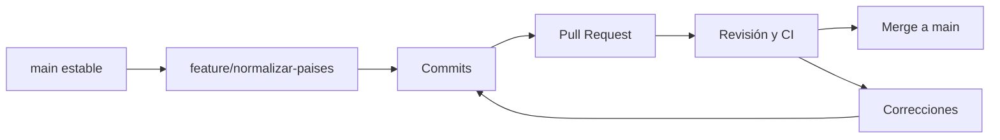

# Git, Azure Repos y Pull Requests

## Qué es cada cosa

Git mantiene versiones del proyecto mediante commits relacionados entre sí. Azure DevOps es una plataforma con varios servicios; Azure Repos es el servicio para alojar y colaborar sobre repositorios. Git también se usa localmente y con otros proveedores. Un pull request pertenece al flujo de colaboración de la plataforma: no es un objeto básico de Git como un commit.

| Concepto | Modelo mental | Ejemplo |
|---|---|---|
| Commit | Instantánea identificada y conectada con sus padres | Cambio de la regla de puntos |
| Branch | Referencia móvil a una línea del historial | feature/normalizar-paises |
| Tag | Nombre asociado a un punto del historial | v1.2.0 |
| Pull Request | Propuesta revisable de integración | Llevar feature hacia main |
| Merge | Integración de historias | Incorporar el cambio aprobado |

Un commit no garantiza que el programa funcione. Un tag no crea una rama de trabajo. Un PR puede recibir comentarios y validaciones antes de integrarse.

## Un cambio normal



Una revisión útil comprueba la intención, casos límite, compatibilidad y pruebas. La CI aporta evidencia automática; la persona revisora aporta contexto y criterio. Ninguna reemplaza completamente a la otra.

## Hotfix en Git Flow

Un hotfix nace desde la versión estable que necesita reparación. Si `main` representa exactamente producción, este ejemplo sirve; si producción corresponde a un tag anterior, hay que partir de ese estado real.

```bash
# Ejemplo de estudio; ejecutar solo dentro de un repositorio de práctica.
git switch main
git pull --ff-only
git switch -c hotfix/corregir-puntos
# Editar el archivo y probar la corrección.
git add reglas.py
git commit -m "Corrige la puntuación de empates"
```

En un flujo Git Flow, la corrección se integra a `main` y también a `develop`, o se propaga según el estado de las ramas de release. Si solo arreglas producción, una entrega futura podría reintroducir el defecto desde otra rama.

```text
main ─────●────────● corrección publicada
           \      /
hotfix      ●────●
                  \ integración de la corrección
develop ───────────●──────── futuro trabajo
```

## No todos los proyectos necesitan develop

Git Flow mantiene ramas como `develop`, `release/*`, `feature/*` y `hotfix/*`. Un flujo más simple puede usar `main` y ramas cortas. La estrategia depende de cómo se entregan versiones y cuánto trabajo paralelo existe; no memorices una lista de ramas como obligación universal. Las ramas largas aumentan la divergencia y pueden complicar la integración.

## Ejercicio

Distingue cuatro acontecimientos: guardar el código en el historial, marcar la versión publicada, proponer integrar una corrección y crear una línea de trabajo. Las respuestas son commit, tag, PR y branch. Después dibuja cómo devolverías una corrección urgente a la línea de desarrollo futuro.

Referencia para la distinción entre plataforma y servicio: [Azure Repos](https://learn.microsoft.com/en-us/azure/devops/repos/get-started/what-is-repos?view=azure-devops). Para practicar ramas e integración: [Pro Git](https://git-scm.com/book/en/v2/Git-Branching-Basic-Branching-and-Merging).

> [!tip] Regla para recordar
> Commit guarda; branch abre una línea; tag marca; PR propone integrar.

## Comprueba que lo entendiste

> [!question]- ¿Un hotfix siempre nace de develop?
> No. Parte del estado estable que requiere corrección. En Git Flow suele ser main, siempre comprobando qué versión está realmente en producción.

## Conexiones

- [[Obsidian/freelance/Data Engineering/DevOps/01 DevOps DataOps y CALMS|01 DevOps DataOps y CALMS]] — explica por qué este flujo acorta la retroalimentación.
- [[Obsidian/freelance/Data Engineering/Testing/02 Regresión y pruebas de datos|02 Regresión y pruebas de datos]] — define qué validar antes de integrar la corrección.

Volver a [[Obsidian/freelance/Data Engineering/00 Empieza aquí|la ruta de estudio]].
