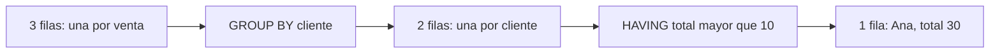

# Cómo piensa SQL: filas, claves y granularidad

## Qué es y para qué sirve

SQL expresa qué conjunto de datos necesitas. El motor decide cómo obtenerlo. Antes de escribir funciones, completa esta frase: **«Una fila representa…»**. Eso es la granularidad. Si no la conoces, puedes sumar dos veces una venta o comparar cosas distintas sin recibir ningún error de sintaxis.

Imagina tres ventas: Ana compra 10 y 20; Luis compra 7. En el detalle hay tres filas, una por venta. Después de agrupar por cliente hay dos filas: Ana tiene 30 y Luis tiene 7. No perdiste una venta: cambiaste la unidad que representa cada fila.



## Orden lógico, paso a paso

Piensa en `FROM/JOIN → WHERE → GROUP BY → HAVING → SELECT → ORDER BY → LIMIT`. Es una guía conceptual; el plan físico puede reorganizar operaciones equivalentes. Las ventanas se calculan sobre las filas resultantes del filtrado y agrupación, antes de limitar el resultado final.

```sql
-- SQLite; ejemplo completo sin crear tablas.
WITH ventas(cliente, total) AS (
  VALUES ('Ana', 10), ('Ana', 20), ('Luis', 7)
)
SELECT cliente, SUM(total) AS total_compras
FROM ventas
WHERE total > 0
GROUP BY cliente
HAVING SUM(total) > 10
ORDER BY total_compras DESC;
```

`WHERE` retira ventas individuales; `HAVING` retira grupos. `COUNT(*)` cuenta filas; `COUNT(email)` solo valores no nulos. Una clave primaria identifica filas, mientras una clave foránea representa una relación con otra tabla. Dos personas pueden llamarse Ana: en datos reales agrupa por `cliente_id`, no únicamente por nombre.

## Familias de instrucciones

| Familia | Pregunta | Ejemplos |
|---|---|---|
| DDL | ¿Qué estructura existe? | CREATE, ALTER, DROP, TRUNCATE |
| DML | ¿Qué datos modifico? | INSERT, UPDATE, DELETE, MERGE |
| DQL | ¿Qué datos consulto? | SELECT |
| DCL | ¿Quién tiene permiso? | GRANT, REVOKE |
| Control transaccional | ¿Confirmo o revierto? | COMMIT, ROLLBACK |

La clasificación depende de la bibliografía; `SELECT` también se incluye en DML. La tabla no promete soporte universal: SQLite no tiene `TRUNCATE`, `MERGE` ni permisos `GRANT/REVOKE` como un servidor SQL.

## Error común y práctica

Seleccionar `cliente, producto, SUM(total)` agrupando solo por cliente deja `producto` sin significado único. SQLite puede tolerar columnas no agrupadas, pero no es una regla portable ni una justificación de negocio. Agrega tres productos de Ana y explica por qué un único producto no puede describir todo el grupo.

> [!tip] Regla para recordar
> Define la fila antes de definir la fórmula.

## Comprueba que lo entendiste

> [!question]- ¿GROUP BY cliente conserva todas las ventas como filas?
> No. Conserva una fila por cliente y resume sus ventas; una ventana permite añadir un cálculo sin reducir el detalle.

## Conexiones

- [[Obsidian/freelance/Data Engineering/SQL/04 CTE y transformaciones de partidos|04 CTE y transformaciones de partidos]] — divide una transformación sin perder de vista qué representa cada fila.
- [[Obsidian/posgrado/master/MATEMÁTICAS Y PROGRAMACIÓN IA/modelo relacional y sql analitico/01 Tablas, claves y granularidad de los experimentos|01 Tablas, claves y granularidad de los experimentos]] — la misma pregunta sobre granularidad aparece en tus experimentos de IA.

Volver a [[Obsidian/freelance/Data Engineering/00 Empieza aquí|la ruta de estudio]].
