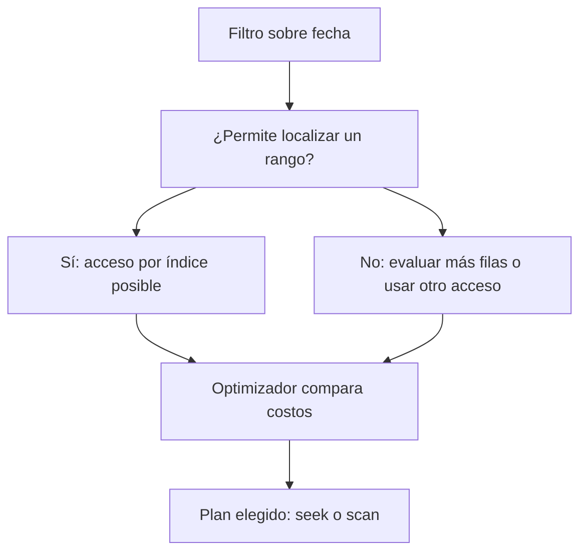

# Índices y SARGability: buscar sin revisar todo

## Intuición

Un índice se parece al índice alfabético de un libro: pagas espacio y mantenimiento para encontrar páginas más rápido. Un predicado es la condición que decide si una fila cumple el filtro. Un filtro SARGable permite usar una estructura de acceso para buscar por su clave; **posibilita** un acceso eficiente, no obliga al optimizador a escogerlo.

## De una función a un rango

```sql
-- SQL Server, columna fecha de tipo fecha/hora e índice sobre fecha.
SELECT fecha, total FROM ventas WHERE YEAR(fecha) = 2026;

SELECT fecha, total FROM ventas
WHERE fecha >= '20260101' AND fecha < '20270101';
```

En la primera forma hay que evaluar el año de la columna, salvo que el motor pueda transformar el predicado o exista un índice apropiado sobre una expresión. En la segunda forma, el índice puede ubicar el comienzo y recorrer el intervalo. El límite superior exclusivo incluye cualquier hora y precisión del 31 de diciembre.

Lo mismo ocurre con `CAST(cliente_id AS VARCHAR(20)) = '123'`: transformar la clave puede dificultar su búsqueda. Si la columna es entera, compara con `cliente_id = 123`. Las conversiones implícitas también importan: comprueba qué lado convierte el motor.



## Índices de filas en SQL Server

| Concepto | Qué contiene o hace |
|---|---|
| Clustered | Sus hojas contienen los datos de la tabla; solo una organización clustered |
| Nonclustered | Estructura adicional con claves y localizador de fila |
| Heap | Tabla sin índice clustered |
| Key lookup | Consulta al clustered para recuperar columnas ausentes en un nonclustered |
| RID lookup | Búsqueda equivalente por localizador en un heap |
| Covering | Índice que ya contiene todas las columnas necesarias para esa consulta |

Una primary key es una restricción de identidad; no es sinónimo universal de clustered. La organización del índice tampoco garantiza el orden de salida: usa `ORDER BY`.

```sql
-- SQL Server: ejemplo de cobertura para este patrón de consulta.
CREATE INDEX ix_ventas_cliente
ON ventas(cliente_id) INCLUDE (fecha, total);
```

Esto puede ayudar a buscar ventas de un cliente y devolver fecha/total sin lookups. Si casi todas las filas cumplen, un scan puede costar menos que miles de búsquedas. `<>`, `NOT` y otros filtros negativos no están prohibidos: depende de cuántas filas excluyan y del plan. Todos los índices adicionales cuestan almacenamiento y trabajo al insertar, borrar o actualizar.

## Práctica

Imagina un millón de filas: una consulta devuelve 10 y otra 950 000. ¿Añadirías el mismo índice sin medir? No: compara lecturas, tiempo y mantenimiento. El objetivo es reducir el costo total del trabajo real.

> [!tip] Regla para recordar
> Un índice ayuda cuando evita suficiente trabajo para compensar su costo.

## Comprueba que lo entendiste

> [!question]- ¿Un Index Seek demuestra que toda la consulta es rápida?
> No. Puede leer un rango enorme, hacer muchos lookups o alimentar un join costoso. Hay que mirar el plan completo y métricas reales.

## Conexiones

- [[Obsidian/freelance/Data Engineering/SQL/03 Planes estadísticas y particiones|03 Planes estadísticas y particiones]] — explica cómo el motor decide entre accesos.
- [[Obsidian/pregrado/Documentos/Bases de datos/fundamentos/Indixacion y procesos almacenados|Indixacion y procesos almacenados]] — amplía tu introducción a los índices con costos y condiciones concretas.

Volver a [[Obsidian/freelance/Data Engineering/00 Empieza aquí|la ruta de estudio]].
