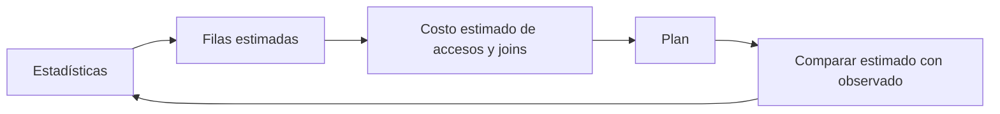

# Planes, estadísticas y particionamiento

## Qué decide el optimizador

El optimizador compara formas de ejecutar una consulta. Las **estadísticas** describen distribuciones: cuántas filas hay, valores frecuentes y rangos de valores, a menudo mediante histogramas. La **cardinalidad** de un operador es cuántas filas produce; la selectividad expresa qué proporción cumple un filtro. Aquí «filtro muy selectivo» significa que deja pocas filas.



Si el motor espera 10 clientes y recibe 200 000, puede haber elegido una estrategia de búsquedas repetidas o poca memoria para un ordenamiento. Actualizar estadísticas puede ayudar, pero también hay correlaciones entre columnas, parámetros y distribuciones difíciles de estimar. No atribuyas cualquier lentitud a estadísticas antiguas.

| Acceso | Idea | Cuándo puede convenir |
|---|---|---|
| Index Seek | Ubicar clave/rango en el índice | Pocas filas o rango útil |
| Index Scan | Recorrer el índice | Muchas filas o índice estrecho que cubre la consulta |
| Table Scan | Recorrer la tabla | Tabla pequeña o lectura de gran parte de ella |

## Plan estimado frente a real

En SQL Server, el plan estimado no ejecuta la consulta; el plan real añade información de ejecución. Un plan real de una modificación ejecuta esa modificación: para aprender utiliza consultas `SELECT` y datos de práctica. Observa filas estimadas/reales, lecturas, sorts, lookups y derrames a disco; el porcentaje de costo mostrado suele ser una estimación, no un cronómetro.

SQLite ofrece `EXPLAIN QUERY PLAN SELECT ...`: muestra accesos como `SCAN` y `SEARCH`, pero no equivale al plan real instrumentado de SQL Server. En SQL Server existe `UPDATE STATISTICS tabla`; SQLite usa `ANALYZE`. No intercambies comandos entre motores.

## Particionar no es indexar

Particionar divide una tabla en segmentos según una clave, por ejemplo año de venta. La eliminación de particiones permite saltarse segmentos si el motor puede deducir que el filtro los excluye. Un índice ubica claves dentro de una estructura; ambos mecanismos pueden complementarse.

```text
Ventas
├── 2024: no leer
├── 2025: no leer
└── 2026: leer para el reporte anual
```

Si consultas todos los años, no eliminaste ningún segmento. En una tabla pequeña, el costo de gestionar muchas particiones puede superar la ganancia. Una clave de partición que nadie filtra ofrece poco beneficio de lectura, aunque facilite mantenimiento o retención. El particionamiento físico tampoco es el `PARTITION BY` lógico de una ventana.

## Ejercicio de diagnóstico

Una consulta sigue lenta después de crear un índice. Revisa, en orden: corrección de la consulta, filas leídas frente a devueltas, estimaciones frente a resultados, columnas recuperadas, joins y ordenamientos. Cambia una cosa y vuelve a medir con una carga representativa.

> [!tip] Regla para recordar
> Mide filas y trabajo real; una etiqueta del plan no basta.

## Comprueba que lo entendiste

> [!question]- ¿Una tabla particionada por año acelera buscar cualquier cliente?
> No necesariamente: sin filtro temporal puede necesitar leer todas las particiones. Un índice por cliente podría ser más relevante.

## Conexiones

- [[Obsidian/freelance/Data Engineering/SQL/02 Índices y filtros eficientes|02 Índices y filtros eficientes]] — es la estructura de acceso que el plan puede elegir.
- [[Obsidian/freelance/Data Engineering/Spark/03 Joins cache y optimización|03 Joins cache y optimización]] — traslada el diagnóstico por planes a Spark.

Volver a [[Obsidian/freelance/Data Engineering/00 Empieza aquí|la ruta de estudio]].
