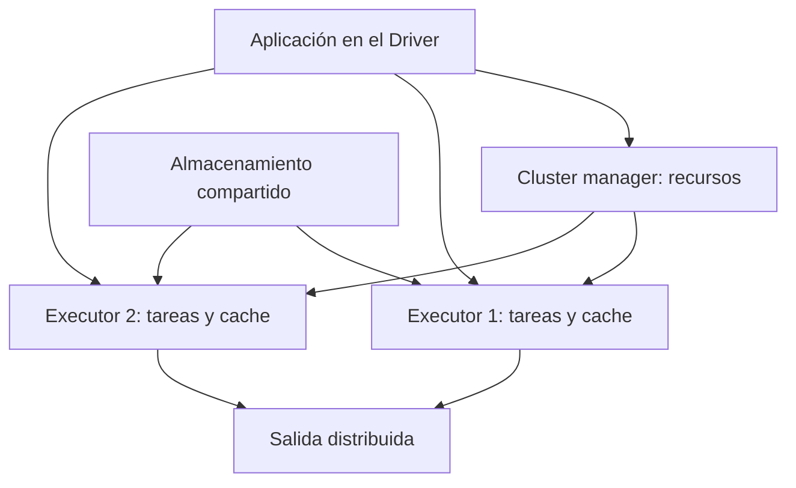

# Spark: arquitectura y procesamiento distribuido

## Intuición: coordinar trabajo repartido

Spark es un motor de procesamiento que divide datos y trabajo en particiones. Una partición es una porción lógica del conjunto; no equivale necesariamente a un archivo, a una máquina o a una carpeta. Varias tareas pueden procesar particiones distintas a la vez.

| Pieza | Responsabilidad | Lo que no debes confundir |
|---|---|---|
| Driver | Ejecuta la lógica principal y coordina planificación | No debe recibir todos los datos para calcularlo todo |
| Executor | Ejecuta tareas y puede conservar particiones | Es un proceso; una máquina puede alojar procesos según configuración |
| Cluster manager | Asigna recursos | No es el sistema de archivos |
| Almacenamiento | Conserva entradas y salidas | HDFS es una opción, no un requisito de Spark |

Standalone, YARN y Kubernetes son opciones de gestión de recursos. El lugar donde vive el Driver depende del modo de despliegue. En desarrollo, `local[2]` ejecuta localmente con dos hilos de trabajo: permite estudiar paralelismo, pero no demuestra tolerancia a fallos de varias máquinas.

## Qué ganas y qué pagas

Si procesar cuatro fragmentos independientes demora diez segundos por fragmento, cuatro trabajadores podrían reducir la parte paralelizable hacia diez segundos. El tiempo total también incluye lectura, planificación, comunicación y escritura. No esperes dividir todo el tiempo exactamente por cuatro.

**Escalabilidad** es capacidad de manejar más carga al aumentar recursos; **paralelismo** es trabajo simultáneo; **rendimiento** puede referirse a latencia o cantidad de trabajo por unidad de tiempo. Más nodos pueden ayudar con grandes volúmenes y empeorar un trabajo muy pequeño por sobrecostos.

Spark puede reconstruir particiones perdidas mediante dependencias o lineage y reintentar tareas. Esto requiere que los datos de origen y el cálculo sigan disponibles; no sustituye backups ni garantiza que sobreviva a cualquier fallo del Driver. Evita efectos externos no idempotentes dentro de tareas: un reintento podría repetir una escritura.

## Spark, Hadoop y MapReduce

Hadoop es un ecosistema; MapReduce es un modelo/motor de procesamiento dentro de él. Spark puede usar almacenamiento del ecosistema Hadoop y aprovechar memoria para reutilizar resultados intermedios. Eso ayuda en cargas iterativas, pero no significa que Spark nunca use disco: puede derramar datos, escribir shuffle y leer almacenamiento externo.

## Ejercicio

Tienes 100 particiones y 4 núcleos disponibles para tareas. No se ejecutan necesariamente 100 tareas simultáneas: avanzan en tandas según recursos. Predice qué cambia al duplicar núcleos si el cuello de botella es una única clave enorme que concentra trabajo en una tarea.

> [!tip] Regla para recordar
> El Driver coordina, los Executors trabajan y el almacenamiento conserva.

## Comprueba que lo entendiste

> [!question]- ¿Necesitas HDFS para usar Spark?
> No. Puede leer y escribir otros almacenamientos compatibles. HDFS no es Driver, Executor ni gestor de recursos.

## Conexiones

- [[Obsidian/freelance/Data Engineering/Spark/02 Lazy DAG stages y shuffle|02 Lazy DAG stages y shuffle]] — explica cómo se convierte el plan en trabajo.
- [[Obsidian/freelance/Data Engineering/Spark/08 Formatos particiones y salida|08 Formatos particiones y salida]] — distingue particiones de ejecución y archivos de salida.
- [[Obsidian/pregrado/Documentos/Computacion ditribuida/computacion distribuida|computacion distribuida]] — conecta nodos, memoria separada y coordinación con procesos Spark.

Volver a [[Obsidian/freelance/Data Engineering/00 Empieza aquí|la ruta de estudio]].
