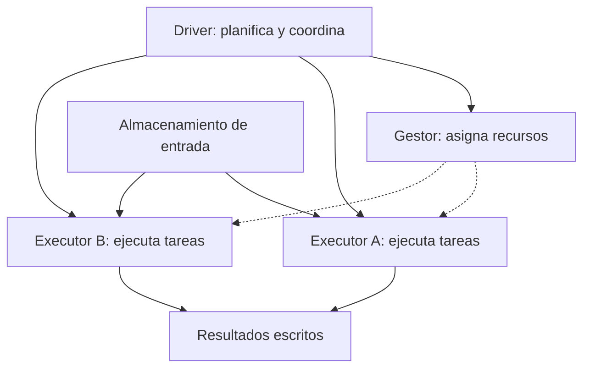

# Cómo funciona Spark: desde una tabla hasta un cálculo repartido

## 1. Qué es Spark y qué problema resuelve

**Apache Spark es un motor que ejecuta cálculos sobre datos y puede repartir ese trabajo entre varios procesos y máquinas.** Tú describes una transformación; Spark planifica tareas, las ejecuta y combina los resultados que lo necesitan.

Imagina archivos con millones de ventas. Quieres eliminar importes inválidos y sumar por país. Una sola computadora puede ser suficiente para algunos tamaños y operaciones. Cuando el trabajo supera sus recursos o tarda demasiado, repartir lectura y cálculo puede ayudar.

Spark no es necesariamente donde se guardan las ventas de forma permanente. Puede leerlas de un almacenamiento, procesarlas y escribir el resultado en otro. Tampoco necesita cargar toda la entrada en la memoria de tu computadora antes de empezar.

## 2. La idea de partición

Una **partición** es una porción lógica del conjunto de datos. Pensemos en estas seis filas y supongamos que están distribuidas así:

| Partición P0 | Partición P1 |
|---|---|
| EC, 10 | EC, 20 |
| PE, 5 | PE, 7 |
| EC, −2 | EC, 3 |

Cada fila representa una venta. Una tarea puede trabajar sobre P0 y otra sobre P1. Si hay recursos disponibles, ambas pueden ejecutarse a la vez.

Partición no significa máquina. Una máquina puede procesar muchas particiones, y una partición grande puede hacer que una tarea tarde mucho. Tampoco hay una equivalencia universal entre partición y archivo: depende del formato, la lectura y las transformaciones.

La distribución de esta tabla es una **suposición didáctica**. No es una promesa sobre dónde Spark colocará cada fila al ejecutar cualquier código.

## 3. Quién hace qué

| Pieza | Explicación sencilla | En el ejemplo de ventas |
|---|---|---|
| Driver | Proceso que dirige la aplicación y planifica el trabajo | Decide qué tareas se necesitan para el filtro y la suma |
| Executor | Proceso que ejecuta tareas y conserva datos cuando corresponde | Procesa porciones de ventas y sus resultados |
| Cluster manager | Administrador que asigna recursos a la aplicación | Proporciona recursos para ejecutar los procesos |
| Almacenamiento | Lugar donde persisten entradas o salidas | Contiene archivos de ventas y el reporte final |

Un **cluster** es un conjunto de recursos de cómputo coordinados. Un **nodo** suele ser una máquina; un **proceso** es un programa en ejecución dentro de una máquina. Un Executor es un proceso, no el nombre de una máquina.

El Driver recibe recursos mediante el gestor y coordina tareas con los Executors. Los Executors normalmente leen sus porciones desde las fuentes, intercambian datos cuando hace falta y escriben salidas. No envían necesariamente toda la entrada al Driver. Este reparto se describe en la [guía oficial de arquitectura de Spark](https://spark.apache.org/docs/latest/cluster-overview.html).



Es un esquema de responsabilidades. El número de Executors, las máquinas y la ubicación del Driver dependen del entorno. Spark también puede funcionar localmente para estudiar.

## 4. Qué es un DataFrame

Un **DataFrame** describe datos organizados en columnas con tipos, como `pais: string` e `importe: integer`. Puedes pensar en una tabla lógica cuyas filas se procesan por particiones.

Al escribir operaciones sobre un DataFrame, normalmente construyes un plan. No estás necesariamente creando de inmediato una tabla completa en la memoria de Python. Spark SQL y la API de DataFrames expresan operaciones que el motor puede analizar y optimizar. [Spark SQL y DataFrames](https://spark.apache.org/docs/latest/sql-programming-guide.html).

## 5. Sigue el cálculo completo con las seis ventas

Queremos **sumar únicamente importes positivos por país**. El −2 del ejemplo se excluye porque así definimos esta pregunta didáctica; en un negocio real podría representar una devolución legítima que deba incluirse.

### Paso A: cada tarea filtra sus filas

P0 pasa de `(EC,10), (PE,5), (EC,−2)` a `(EC,10), (PE,5)`.

P1 conserva `(EC,20), (PE,7), (EC,3)`.

No hay que reunir datos de otros lugares para decidir si 10 es positivo. Cada partición puede aplicar el filtro por sí misma.

### Paso B: cada partición calcula sumas parciales

| Partición | Suma parcial EC | Suma parcial PE |
|---|---:|---:|
| P0 | 10 | 5 |
| P1 | 20 + 3 = 23 | 7 |

Para esta suma, combinar valores localmente puede reducir lo que hace falta intercambiar. Ese tipo de agregación parcial no se aplica idénticamente a todas las operaciones.

### Paso C: reunir las contribuciones de una misma clave

Los importes de EC están repartidos entre P0 y P1. Para obtener el total, hay que reunir `EC:10` con `EC:23`. Lo mismo ocurre con PE.

Ese intercambio por clave se llama **shuffle**. No significa «mandarlo todo al Driver». Las tareas de la siguiente etapa reciben los datos necesarios para combinar cada grupo. Una misma partición de destino puede contener varios países; no necesitas un Executor por país.

### Paso D: combinar

- EC: `10 + 23 = 33`.
- PE: `5 + 7 = 12`.

El resultado tiene dos filas. Cambió la granularidad: al principio una fila era una venta; al final una fila es el total de un país.

### Paso E: mostrar o guardar

Si pides `show()`, Spark obtiene las filas necesarias para mostrar una salida limitada. Si pides guardar, las tareas pueden escribir resultados en el almacenamiento. Si pides `collect()`, todas las filas resultantes viajan al Driver y deben caber allí.

En este ejemplo hay solo dos resultados, pero en otras consultas pueden existir millones. El tamaño importante para `collect()` es el resultado que estás trayendo.

## 6. El código, después de entender la operación

Ejemplo completo para un entorno con PySpark y Java compatibles:

```python
from pyspark.sql import SparkSession, functions as F

spark = (
    SparkSession.builder
    .master("local[2]")
    .appName("EntenderSpark")
    .getOrCreate()
)

ventas = spark.createDataFrame(
    [("EC", 10), ("PE", 5), ("EC", -2),
     ("EC", 20), ("PE", 7), ("EC", 3)],
    "pais string, importe int",
)

validas = ventas.filter(F.col("importe") > 0)
resumen = validas.groupBy("pais").agg(
    F.sum("importe").alias("total")
)

resumen.explain("formatted")
resumen.orderBy("pais").show()
spark.stop()
```

Salida esperada:

```text
+----+-----+
|pais|total|
+----+-----+
|  EC|   33|
|  PE|   12|
+----+-----+
```

| Expresión | Cómo leerla |
|---|---|
| `SparkSession` | Punto de entrada para trabajar con DataFrames y SQL |
| `local[2]` | Ejecutar localmente con dos hilos de trabajo; no crea dos máquinas |
| `createDataFrame` | Crear datos de ejemplo con nombres y tipos de columna |
| `F.col("importe")` | Referirse a una columna en una expresión del motor |
| `filter(...)` | Conservar filas que cumplen la condición |
| `groupBy("pais")` | Definir qué filas deben resumirse juntas |
| `agg(F.sum(...))` | Calcular la suma de cada grupo |
| `alias("total")` | Nombrar la columna calculada |
| `explain(...)` | Inspeccionar el plan de ejecución |
| `show()` | Solicitar una salida para mostrar; dispara trabajo |

La lista Python sirve solo para este ejemplo pequeño. En una carga grande, la entrada suele leerse desde archivos u otra fuente, evitando construir toda esa lista en el Driver. El plan puede incluir operaciones adicionales, como el ordenamiento final; no tendrá obligatoriamente las dos particiones del dibujo.

**Verificación de esta nota:** salida calculada y contrastada con Python, y sintaxis revisada. El ejemplo PySpark no se ejecutó aquí porque PySpark no está instalado.

## 7. Por qué Spark espera antes de calcular

Imagina que primero seleccionas columnas, después filtras y luego sumas. Si Spark ve la receta completa antes de ejecutarla, puede buscar una forma de hacer menos trabajo, como leer columnas necesarias y descartar datos antes.

Esto se llama **evaluación diferida o lazy evaluation**. Las transformaciones describen el cálculo; las acciones piden obtener o guardar un resultado. Leer metadatos o inferir tipos puede provocar trabajo antes de una acción: lazy no significa que absolutamente nada ocurra mientras escribes el plan.

Para entender jobs, stages y tareas, continúa en [[Obsidian/freelance/Data Engineering/Spark/02 Lazy DAG stages y shuffle|la ejecución interna paso a paso]].

## 8. Memoria, disco y fallos

Spark usa memoria y almacenamiento. Puede conservar resultados para reutilizarlos, escribir datos intermedios del shuffle o recurrir a disco si no caben ciertas operaciones. No exige que todo el historial quepa a la vez en RAM.

Por defecto, reutilizar una variable DataFrame no garantiza que su resultado esté guardado. Cache o persistencia permiten pedir esa conservación; una acción materializa el trabajo. Son útiles cuando la reutilización compensa sus costos.

Si una tarea falla, Spark puede reintentar o reconstruir datos mediante sus dependencias, siempre que las fuentes y demás condiciones lo permitan. Esto no sustituye copias de seguridad ni garantiza recuperarse de cualquier fallo. Una tarea reintentada tampoco debería duplicar efectos externos, como enviar dos veces un correo. La [guía de programación](https://spark.apache.org/docs/latest/rdd-programming-guide.html) explica evaluación, persistencia y recuperación por dependencias.

## 9. Spark también puede procesar un flujo

Un cálculo batch trabaja sobre una entrada delimitada. Structured Streaming permite expresar consultas sobre datos que siguen llegando y actualizar resultados. Su modo predeterminado usa microlotes: procesa nuevas porciones de datos de manera repetida.

No tienes que escribir un bucle que lance el programa manualmente por cada venta. El motor administra la ejecución de la consulta de streaming. Su recuperación depende de configuración, fuentes y destinos; «usar streaming» no resuelve automáticamente duplicados o eventos tardíos. [Guía oficial de Structured Streaming](https://spark.apache.org/docs/latest/streaming/getting-started.html).

Esto permite usar Spark en un camino histórico o uno reciente de [[Obsidian/freelance/Data Engineering/Spark/10 Arquitectura Lambda|arquitectura Lambda]], pero son conceptos distintos.

## 10. Cuándo el reparto ayuda y cuándo estorba

Para datos grandes, tareas independientes pueden avanzar en paralelo. Para seis filas, coordinar Spark suele costar más que sumarlas directamente. Duplicar máquinas tampoco divide siempre el tiempo entre dos: lectura, red, una clave enorme o la escritura pueden limitar el trabajo.

Si tienes 100 particiones y capacidad para 4 tareas a la vez, se procesan en tandas. Una tarea mucho más lenta que las otras puede dominar el final. Eso explica por qué importan tanto la distribución como la cantidad de recursos.

Spark puede trabajar con almacenamientos del ecosistema Hadoop, pero no requiere HDFS. Hadoop reúne varios componentes; Spark es un motor de procesamiento y MapReduce es otro modelo/motor de procesamiento de ese ecosistema. No los uses como sinónimos.

## Comprueba que lo entendiste

> [!question]- ¿Quién calcula las sumas de las particiones: el Driver o los Executors?
> Las tareas se ejecutan en los Executors. El Driver coordina. Un resultado pequeño puede volver al Driver, pero eso no significa que haya calculado allí todas las filas.

> [!question]- ¿Por qué filtrar importes no exige el mismo intercambio que sumar por país?
> Para filtrar una fila basta su importe. Para el total de un país necesitas combinar las contribuciones repartidas entre particiones.

> [!question]- ¿Spark obliga a guardar todos los datos en RAM?
> No. Utiliza memoria, almacenamiento y procesamiento por particiones. Los recursos necesarios dependen del plan y de las operaciones.

## Conexiones

- [[Obsidian/freelance/Data Engineering/Spark/02 Lazy DAG stages y shuffle|Jobs, stages y shuffle]].
- [[Obsidian/freelance/Data Engineering/Spark/03 Joins cache y optimización|Joins y persistencia]].
- [[Obsidian/freelance/Data Engineering/Spark/04 Schemas y DataFrames|Tipos y DataFrames]].
- [[Obsidian/freelance/Data Engineering/Spark/08 Formatos particiones y salida|Particiones y archivos de salida]].
- [[Obsidian/pregrado/Documentos/Computacion ditribuida/computacion distribuida|Computación distribuida]].

Volver a [[Obsidian/freelance/Data Engineering/00 Empieza aquí|la ruta de estudio]].
