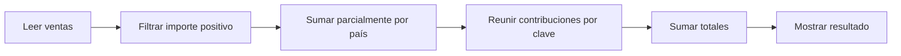

# Cómo ejecuta Spark una consulta: lazy, DAG, jobs, stages y shuffle

## 1. Primero ubica esta nota

En [[Obsidian/freelance/Data Engineering/Spark/01 Arquitectura y procesamiento distribuido|Cómo funciona Spark]] seguimos seis ventas hasta obtener EC = 33 y PE = 12. Aquí explicamos cómo organiza Spark ese trabajo. Todos los términos describen partes de la misma ejecución, no herramientas que debas instalar por separado.

## 2. Transformación: describir un resultado

```python
# Fragmento: ventas es el DataFrame creado en la nota anterior.
from pyspark.sql import functions as F

validas = ventas.filter(F.col("importe") > 0)
resumen = validas.groupBy("pais").agg(F.sum("importe").alias("total"))
```

La primera línea de transformación dice «quiero las filas de importe positivo». La siguiente dice «quiero su suma por país». Las variables describen resultados mediante un plan; no demuestran que Spark ya haya recorrido todas las ventas y guardado sus resultados.

## 3. Acción: pedir que se obtenga el resultado

```python
resumen.show()
```

Ahora se solicita mostrar datos. Spark ejecuta el trabajo necesario. Pedir escribir el resultado también es una acción, aunque las filas se guarden desde las tareas sin reunirse todas en el Driver.

| Expresión | Resultado de la llamada | Tipo |
|---|---|---|
| `df.filter(...)` | Otro DataFrame | Transformación |
| `df.groupBy("pais").count()` | DataFrame con conteos por país | Transformación |
| `df.count()` | Número de filas | Acción |
| `df.collect()` | Lista de filas en el Driver | Acción |

`count` aparece dos veces porque actúa sobre objetos diferentes. Contar dentro de un plan de agrupación no es lo mismo que pedir inmediatamente el número de filas de un DataFrame.

## 4. DAG: el mapa de dependencias

DAG significa **grafo dirigido acíclico**. Grafo: pasos conectados. Dirigido: hay una dirección de dependencia. Acíclico: no hay una vuelta que haga que un paso dependa de sí mismo dentro de ese grafo.

Para nuestro caso: la suma necesita las ventas filtradas; el filtro necesita las ventas originales. Esas dependencias permiten saber qué debe ocurrir antes de qué.



Este es un dibujo conceptual, no una captura exacta de un plan físico. El motor analiza el cálculo y puede reorganizar operaciones equivalentes. El plan lógico expresa qué necesitas; el físico elige operaciones para ejecutarlo.

## 5. Job, stage y task, de mayor a menor

| Término | Qué representa | Ejemplo |
|---|---|---|
| Aplicación | La ejecución de tu programa Spark con su coordinación y recursos | Tu programa de reportes |
| Job | Un trabajo de cómputo lanzado para atender una acción u operación interna | Trabajo necesario para obtener un resultado |
| Stage | Conjunto de tareas que puede ejecutarse sin cruzar una nueva dependencia de shuffle | Procesar las particiones antes de reunir claves |
| Task | Unidad que procesa una partición dentro de una etapa | Filtrar y sumar parcialmente P0 |

Una aplicación puede lanzar muchos jobs. Una acción puede dar lugar a más de un job, y el plan adaptativo puede cambiar detalles. No memorices «una línea = una tarea» o «una acción = siempre un job».

En una etapa, distintas tareas pueden aplicar la misma operación a particiones distintas. Si hay más tareas que recursos, algunas esperan su turno. Las definiciones de aplicación, job, stage y task se encuentran en el [glosario de arquitectura de Spark](https://spark.apache.org/docs/latest/cluster-overview.html).

## 6. Por qué el shuffle divide el trabajo

Usamos las mismas particiones didácticas de la nota anterior:

```text
P0: (EC,10), (PE,5), (EC,-2)
P1: (EC,20), (PE,7), (EC,3)
```

**Antes del intercambio:** la tarea de P0 filtra −2 y obtiene EC:10, PE:5. La de P1 obtiene EC:23, PE:7. Leer, filtrar y obtener parciales puede encadenarse dentro de una etapa.

**Intercambio:** las contribuciones para EC deben llegar a quien calculará EC; las de PE a quien calculará PE. La misma tarea de destino puede encargarse de varias claves. Redistribuir por país no equivale a dedicar una máquina a cada país.

**Después del intercambio:** las tareas combinan EC:10+23 y PE:5+7. Necesitan los resultados previos, lo que explica la separación entre etapas alrededor de esta dependencia.

En términos de ejecución, los productores escriben datos de shuffle y los consumidores recuperan las partes que necesitan. Puede haber red, serialización, ordenamiento y disco; por eso el costo no es únicamente sumar números.

En este caso simple podemos imaginar dos etapas principales. La lectura real, `show`, un ordenamiento añadido o las decisiones adaptativas pueden producir otro detalle de ejecución. La salida lógica sigue siendo la misma.

## 7. Narrow y wide sin memorizar etiquetas

Una operación que trabaja sobre cada fila o partición sin reunir globalmente claves suele tener dependencia **narrow**. Filtrar positivos es el ejemplo: P0 no necesita saber lo que contiene P1.

Una dependencia **wide** exige reunir información de varias particiones. Nuestra suma final por país necesita contribuciones de P0 y P1.

La clasificación describe dependencias. No permite afirmar que todo join siempre haga el mismo shuffle: un broadcast puede repartir un lado pequeño para evitar redistribuir el grande. Una distribución ya adecuada también puede cambiar el trabajo necesario. La [guía de programación de Spark](https://spark.apache.org/docs/latest/rdd-programming-guide.html) desarrolla el intercambio de datos y las dependencias.

## 8. Leer un plan con una pregunta concreta

```python
resumen.explain("formatted")
```

Busca el recorrido, no solo nombres aislados:

| Nombre que puede aparecer | Pregunta que ayuda a responder |
|---|---|
| Scan | ¿De dónde entran los datos? |
| Filter | ¿Qué filas se descartan? |
| Project | ¿Qué columnas o expresiones se conservan? |
| HashAggregate u otro agregado | ¿Dónde se calculan parciales o totales? |
| Exchange | ¿Dónde hay intercambio de datos? |
| Sort | ¿Dónde se ordenan filas? |
| AdaptiveSparkPlan | ¿El plan puede ajustarse usando información de ejecución? |

No todo Exchange es el mismo intercambio: puede haber broadcast. Un Filter y un Project no significan necesariamente dos stages. `explain` ayuda a inspeccionar, pero las tareas y métricas reales se estudian al ejecutar y observar la interfaz de Spark.

## 9. Dos acciones pueden repetir trabajo

```python
resumen.show()
resumen.count()
```

Guardar el nombre `resumen` no garantiza haber guardado sus filas. Sin persistencia, dos acciones pueden volver a ejecutar trabajo. El motor también puede optimizar una acción de manera distinta: contar filas no necesariamente necesita calcular todas las columnas que mostrarías.

Cache o persistencia permiten reutilizar datos materializados cuando compensa. No los añadas por reflejo a todo; conservar un resultado que se usa una sola vez puede agregar costo.

## 10. Fallos y reintentos

Si falla una tarea sobre P0, Spark puede reintentarlo. Si se pierde un resultado intermedio, puede necesitar reconstruir etapas previas, según la pérdida y los recursos disponibles. La receta de dependencias ayuda a recuperar el cálculo.

Un efecto externo no controlado puede repetirse con la tarea. Por ejemplo, «enviar un correo por cada fila» podría enviar duplicados. La recuperación del cálculo no convierte automáticamente cualquier efecto externo en una operación exactamente una vez.

## Comprueba que lo entendiste

> [!question]- Escribí cinco transformaciones. ¿Tengo cinco stages?
> No. Varias operaciones pueden encadenarse en una misma etapa. Las dependencias de intercambio ayudan a definir sus límites.

> [!question]- ¿Por qué dos particiones no implican dos tareas en toda la aplicación?
> Porque cada etapa tiene sus propias particiones y tareas. Además puede haber varias etapas, jobs y reintentos.

> [!question]- ¿El shuffle calcula la suma por sí solo?
> No. Redistribuye las contribuciones. Las tareas que las reciben realizan la agregación correspondiente.

> [!question]- ¿Qué cambia si todas las ventas pertenecen al mismo país?
> Pueden calcularse parciales en paralelo, pero el agregado final de esa clave concentra trabajo. Más particiones no reparte automáticamente una sola clave final entre múltiples resultados independientes.

## Conexiones

- [[Obsidian/freelance/Data Engineering/Spark/01 Arquitectura y procesamiento distribuido|Spark desde cero]].
- [[Obsidian/freelance/Data Engineering/Spark/03 Joins cache y optimización|Optimización, skew y cache]].
- [[Obsidian/freelance/Data Engineering/Spark/10 Arquitectura Lambda|Lambda: organizar dos recorridos de procesamiento]].

Volver a [[Obsidian/freelance/Data Engineering/00 Empieza aquí|la ruta de estudio]].
