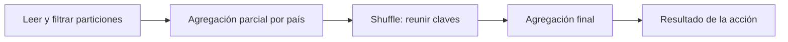

# Lazy evaluation, DAG, jobs, stages y shuffle

## Describir no es ejecutar todo

Al transformar un DataFrame normalmente construyes un plan. Una acción solicita un resultado y dispara trabajo. Esta evaluación diferida permite optimizar una cadena completa, por ejemplo leer solo las columnas necesarias. Algunas operaciones de lectura pueden hacer trabajo previo para descubrir archivos o inferir esquema; «lazy» no significa ausencia absoluta de actividad hasta el último comando.

```python
# Fragmento PySpark: df contiene pais e importe.
from pyspark.sql import functions as F
filtrado = df.filter(F.col("importe") > 0)
resumen = filtrado.groupBy("pais").agg(F.sum("importe").alias("total"))
resumen.explain("formatted")
resumen.show()  # Solicita un resultado.
```

`groupBy` solo devuelve un objeto de agrupación; `agg` o el `count` de esa agrupación construyen la agregación. `df.count()` es una acción que devuelve un entero; `df.groupBy('pais').count()` devuelve otro DataFrame y necesita una acción para materializar su resultado.

## De aplicación a tarea

Un DAG es un grafo dirigido sin ciclos que representa dependencias. Una aplicación puede ejecutar muchos jobs. Un job se organiza en stages; un stage ejecuta tareas sobre particiones. Una acción puede dar lugar a uno o varios jobs según el plan y mecanismos internos: no memorices la relación como una igualdad estricta.



En este dibujo, lectura/filtro/agregación parcial suelen poder encadenarse antes del intercambio; después se combinan los resultados redistribuidos. Las dependencias de shuffle suelen delimitar stages. No aparece un nuevo stage por cada línea de Python.

## Narrow frente a wide

Una dependencia narrow permite procesar una salida con una parte limitada de la entrada sin redistribuir globalmente las claves: filtros y proyecciones suelen ser ejemplos. Una dependencia wide requiere reunir datos de distintas particiones, como una agregación por clave que no está ya adecuadamente distribuida.

```text
Antes:                        Después de agrupar por país:
Partición 1: EC, PE, EC        Destino EC: contribuciones EC de 1 y 2
Partición 2: PE, EC, PE        Destino PE: contribuciones PE de 1 y 2
```

El **shuffle** redistribuye datos y puede gastar red, serialización, memoria, disco y ordenamiento. No es un error: muchas preguntas necesitan ese movimiento. Lo que conviene es evitar intercambios innecesarios, reducir columnas/filas transportadas y no repetir cálculos sin motivo.

## Excepciones que importan

No todos los joins hacen el mismo shuffle: un broadcast join puede repartir una tabla pequeña y evitar redistribuir la grande. Una agregación puede aprovechar distribución existente. `Exchange` en el plan merece inspección, pero hay distintos tipos, como broadcast. `Sort`, `HashAggregate`, `Window`, `Scan`, `Filter` y `Project` ayudan a ubicar el costo físico; no son siempre stages independientes.

## Ejercicio

Predice dónde se necesita reunión de claves en «filtrar ventas → seleccionar país/importe → sumar por país». Después compara `explain('formatted')`. Si el resultado se ve distinto de tu dibujo, explica la agregación parcial, el tipo de intercambio y las optimizaciones, en vez de forzar el plan a coincidir con el dibujo.

> [!tip] Regla para recordar
> Transformación describe; acción solicita; shuffle redistribuye y suele separar stages.

## Comprueba que lo entendiste

> [!question]- ¿Cada transformación crea un job y cada acción crea un stage?
> No. Las transformaciones describen el plan; las acciones solicitan resultados. Los shuffles suelen separar stages dentro del trabajo ejecutado.

## Conexiones

- [[Obsidian/freelance/Data Engineering/Spark/01 Arquitectura y procesamiento distribuido|01 Arquitectura y procesamiento distribuido]] — identifica quién ejecuta tareas y planifica.
- [[Obsidian/freelance/Data Engineering/Spark/03 Joins cache y optimización|03 Joins cache y optimización]] — muestra decisiones que cambian el movimiento de datos.

Volver a [[Obsidian/freelance/Data Engineering/00 Empieza aquí|la ruta de estudio]].
