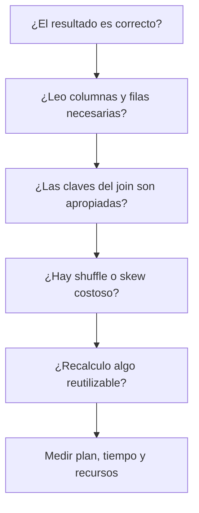

# Joins, cache y optimización en Spark

## Empieza por la semántica del join

Un LEFT JOIN de jugadores con países debe enriquecer cada jugador con su país. Si el catálogo tiene dos filas para el mismo código, duplica jugadores aunque el cluster funcione perfectamente. Antes de optimizar, comprueba claves, granularidad, nulos y cardinalidad.

Un CROSS JOIN genera todas las parejas: N × M filas. Diez productos y tres escenarios producen 30 combinaciones útiles. Un millón por un millón produce un billón, 10^12, de combinaciones potenciales: es una consulta completamente distinta de unir por una clave.

## Broadcast y skew

```python
# Fragmento: jugadores y paises son DataFrames existentes.
from pyspark.sql import functions as F
resultado = jugadores.join(F.broadcast(paises), "codigo_pais", "left")
resultado.explain("formatted")
```

Broadcast es razonable si el lado pequeño cabe con margen en la memoria de los procesos que lo reciben. No lo fuerces por intuición sobre el número de filas: también importa el ancho y tamaño serializado. El optimizador puede decidir una estrategia sin hint y la ejecución adaptativa puede modificar decisiones usando datos de ejecución. Revisa el plan observado.

**Skew** es distribución desigual: si 90 % de las filas comparte una clave, una tarea puede concentrar demasiado trabajo mientras otras ya terminaron. Más particiones no divide mágicamente una misma clave en una agregación final. Investiga la distribución y las soluciones apropiadas antes de ajustar números de configuración.

## Cache y persist

```python
# Fragmento: reutilización de un DataFrame ya limpiado.
from pyspark import StorageLevel
base = limpio.persist(StorageLevel.MEMORY_AND_DISK)
try:
    total = base.count()  # Materializa datos reutilizables.
    base.groupBy("pais").count().show()
finally:
    base.unpersist()
```

`cache()` usa un nivel predeterminado; `persist()` permite elegirlo. Los valores predeterminados pueden depender de API y versión, así que no confundas los de RDD con los de DataFrame. Pedir persistencia no ejecuta inmediatamente toda la transformación; una acción la materializa. Si solo necesitas el DataFrame una vez, almacenar puede añadir costo sin beneficio.

## Un orden de investigación útil



Filtrar temprano significa reducir entrada sin cambiar la población requerida; mover un filtro de una tabla derecha de `ON` a `WHERE` puede cambiar un LEFT JOIN. Preferir funciones nativas ayuda al motor a entender expresiones, pero no convierte automáticamente toda operación en predicate pushdown. Ese empuje depende de la fuente y del predicado.

## Ejercicio

Compara una dimensión de 20 países con una tabla de millones de descripciones largas. ¿Cuál broadcast sería viable? Mide tamaño, observa estrategia y prueba con una carga representativa. Luego ejecuta dos agregaciones de la misma base, con y sin persistencia, incluyendo el costo de materializar la cache en la comparación.

Para las opciones de cache, estrategias de join y ejecución adaptativa consulta la [guía de rendimiento de Spark SQL](https://spark.apache.org/docs/latest/sql-performance-tuning.html).

> [!tip] Regla para recordar
> Primero corrige la pregunta; luego reduce lectura, movimiento y recomputación.

## Comprueba que lo entendiste

> [!question]- ¿Cache acelera necesariamente una única lectura?
> No. Puede añadir almacenamiento y materialización sin reutilización suficiente para compensarlos.

## Conexiones

- [[Obsidian/freelance/Data Engineering/SQL/07 Conjuntos joins y ausencias|07 Conjuntos joins y ausencias]] — da el fundamento lógico de cardinalidad y LEFT JOIN.
- [[Obsidian/freelance/Data Engineering/Spark/02 Lazy DAG stages y shuffle|02 Lazy DAG stages y shuffle]] — explica el movimiento de datos que intentas reducir.
- [[Obsidian/freelance/Data Engineering/Spark/07 Centroides distancia y UDF|07 Centroides distancia y UDF]] — contrasta expresiones nativas y Python UDF.

Volver a [[Obsidian/freelance/Data Engineering/00 Empieza aquí|la ruta de estudio]].
