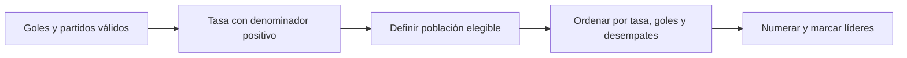

# Ventanas y métricas: elegir el mejor jugador

## Define «mejor» antes de ordenar

Un ranking original más bajo puede significar mejor posición. Una tasa de goles más alta puede significar mayor producción por partido. No son la misma pregunta. Un jugador con 100 goles en 200 partidos tiene tasa 0,5; otro con 80 en 80 tiene tasa 1. El segundo gana en tasa, aunque el primero tenga más goles acumulados.

La tasa normaliza por exposición, pero con pocos partidos puede ser muy inestable. Si el negocio exige un mínimo de partidos, aplícalo y explícalo. No inventes ese mínimo para cambiar la respuesta de una prueba que no lo pide.

```python
from pyspark.sql import functions as F, Window
# Ejemplo completo después de crear SparkSession como en la nota anterior.
jugadores = spark.createDataFrame([
 ("EC", 1, "Ana", 1, 100, 200),
 ("EC", 2, "Luis", 2, 80, 80),
 ("PE", 3, "Carla", 3, 0, 0),
], "codigo_pais string, jugador_id int, nombre string, ranking int, goles int, partidos int")
con_tasa = jugadores.withColumn(
 "tasa", F.when(F.col("partidos") > 0,
                F.col("goles").cast("double") / F.col("partidos"))
)
w_original = Window.partitionBy("codigo_pais").orderBy("ranking", "jugador_id")
w_nuevo = Window.partitionBy("codigo_pais").orderBy(
 F.col("tasa").desc_nulls_last(), F.col("goles").desc(),
 F.col("ranking").asc(), F.col("jugador_id").asc()
)
resultado = (con_tasa
 .withColumn("rn_original", F.row_number().over(w_original))
 .withColumn("rn_nuevo", F.row_number().over(w_nuevo))
 .withColumn("mejor_original", F.col("rn_original") == 1))
resultado.orderBy("codigo_pais", "rn_nuevo").show()
```

Ana es primera por ranking original en EC; Luis es primero por tasa. Carla queda con tasa NULL porque no tiene exposición. Si filtras simplemente `rn_nuevo = 1`, aparecerá como primera de PE aunque no tenga tasa válida: **ranking 1 no implica elegibilidad**. Si solo quieres jugadores evaluables por tasa, filtra tasas nulas antes de crear esa ventana.

## Dónde reiniciar la competencia

`Window.partitionBy('codigo_pais')` reinicia la numeración en cada país. Si el nuevo ranking debe ser mundial, no uses esa partición lógica: compara toda la población. Una ventana global puede concentrar trabajo y resultar costosa; distingue el requisito de negocio del costo para ejecutarlo.



## Regla de empates

Para exactamente una fila por país usa ROW_NUMBER y un identificador único final. Para todos los empatados en tasa, usa RANK sobre la tasa sola y define qué significa empate numérico. Ordenar también por ID rompe el empate. Redondea para presentar después de rankear, salvo que la regla de negocio defina expresamente la comparación sobre valores redondeados.

## Ejercicio

Añade dos jugadores con la misma tasa pero distinto total de goles. Predice el resultado usando la prioridad del ejemplo. Luego elimina `partitionBy` para un ranking global y explica qué filas compiten ahora entre sí.

> [!tip] Regla para recordar
> Una métrica define la comparación; una partición define quién compite.

## Comprueba que lo entendiste

> [!question]- ¿Una división entre cero debería producir tasa cero para ordenar fácilmente?
> No. Cero goles por partido es diferente de una tasa no definida por falta de partidos. Define una política explícita de elegibilidad.

## Conexiones

- [[Obsidian/freelance/Data Engineering/SQL/06 Ranking Top N y quintiles|06 Ranking Top N y quintiles]] — explica la semántica común a SQL y PySpark.
- [[Obsidian/freelance/Data Engineering/Spark/06 Datos anidados y JSON|06 Datos anidados y JSON]] — exporta resultados por país sin perder estructura.

Volver a [[Obsidian/freelance/Data Engineering/00 Empieza aquí|la ruta de estudio]].
