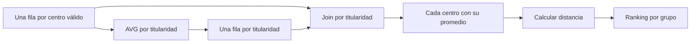

# Centroides, distancia euclidiana y funciones UDF

## Qué pregunta responde el cálculo

Quieres el centro educativo más cercano al promedio de coordenadas de su grupo de titularidad. Primero calculas el **centroide**, después mides la distancia de cada centro a ese punto y finalmente eliges el menor. El centroide puede no coincidir con ningún centro real. «Más cercano al centroide» tampoco significa «mejor por tiempo de viaje» o «mínima suma de distancias»: son criterios diferentes.

Para n puntos válidos del grupo:

$$\bar{x}=\frac{1}{n}\sum_{i=1}^{n}x_i,\qquad
\bar{y}=\frac{1}{n}\sum_{i=1}^{n}y_i$$

La distancia del punto i es:

$$d_i=\sqrt{(x_i-\bar{x})^2+(y_i-\bar{y})^2}$$

Con A=(0,0), B=(2,0) y C=(1,3), el centroide es (1,1). Las distancias son √2, √2 y 2. A y B empatan. El segmento horizontal/vertical forma un triángulo rectángulo: la fórmula aplica Pitágoras.

![[Obsidian/freelance/Data Engineering/assets/centroide.png]]

## Flujo de datos y granularidad



El patrón **aggregate → join back** añade un resumen del grupo a cada fila de detalle. También sirve para incorporar a cada transacción el promedio de compra de su cliente. El resumen debe tener una fila por clave de join para no multiplicar el detalle.

## Ejemplo PySpark con funciones nativas

```python
from pyspark.sql import functions as F, Window
centros = spark.createDataFrame([
 ("PUBLICO", "A", 0.0, 0.0), ("PUBLICO", "B", 2.0, 0.0),
 ("PUBLICO", "C", 1.0, 3.0)
], "titularidad string, id string, x double, y double")
medias = centros.groupBy("titularidad").agg(
 F.avg("x").alias("mx"), F.avg("y").alias("my"))
con_media = centros.join(medias, "titularidad", "inner")
con_distancia = con_media.withColumn("distancia", F.sqrt(
 F.pow(F.col("x") - F.col("mx"), 2) +
 F.pow(F.col("y") - F.col("my"), 2)))
w = Window.partitionBy("titularidad").orderBy("distancia", "id")
ganador = con_distancia.withColumn("rn", F.row_number().over(w)).filter("rn = 1")
ganador.show()
```

Elige A por el desempate del ID. Para conservar A y B usa `rank()` sobre distancia solamente. Redondea al presentar: redondear antes puede crear empates artificiales.

## La misma expresión con una UDF

```python
import math
from pyspark.sql.types import DoubleType

def distancia_python(x, y, mx, my):
    if any(v is None for v in (x, y, mx, my)):
        return None
    return float(math.sqrt((x-mx)**2 + (y-my)**2))

distancia_udf = F.udf(distancia_python, DoubleType())
con_udf = con_media.withColumn("distancia_udf", distancia_udf("x", "y", "mx", "my"))
con_udf.explain("formatted")
```

Una UDF permite lógica propia y declara su tipo de retorno. La UDF Python convencional introduce ejecución Python y transferencia/serialización entre entornos; su interior es menos visible al optimizador. Las funciones nativas expresan el cálculo directamente al motor y suelen ser preferibles cuando existen. Una variante vectorizada/Arrow tiene otras características: no todas las UDF tienen el mismo costo.

Según el spec, la prueba pide una UDF: aprende a escribirla y también a justificar la alternativa nativa. Este ejemplo es una recreación, no una ejecución del notebook original.

## Validaciones antes de promediar

Usa únicamente puntos con ambas coordenadas válidas y finitas. Si promedias X e Y sobre poblaciones distintas por nulos, el centro pierde su interpretación. Comprueba unidades y sistema de referencia: la distancia euclidiana en un plano proyectado no equivale automáticamente a metros si usas latitud/longitud en grados. No puedes deducir el sistema solo por llamarse X/Y.

> [!tip] Regla para recordar
> Promedia por grupo, devuelve el promedio al detalle, calcula y recién entonces selecciona.

## Comprueba que lo entendiste

> [!question]- ¿El centroide siempre es una fila existente?
> No. Es un punto calculado. Después seleccionas el centro real más cercano según el criterio acordado.

## Conexiones

- [[Obsidian/freelance/Data Engineering/Spark/03 Joins cache y optimización|03 Joins cache y optimización]] — permite inspeccionar el join y la ejecución Python.
- [[Obsidian/freelance/Data Engineering/Testing/02 Regresión y pruebas de datos|02 Regresión y pruebas de datos]] — verifica distancias no negativas e invariancia a traslación.

Volver a [[Obsidian/freelance/Data Engineering/00 Empieza aquí|la ruta de estudio]].
