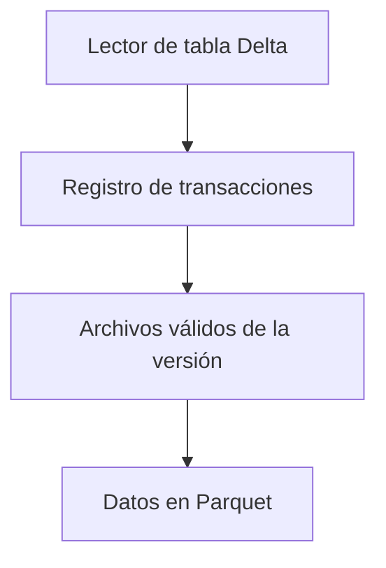

# Parquet y Delta Lake: archivo frente a tabla

## Una corrección muestra para qué sirve el registro

Imagina una versión 0 con archivos A y B. Una corrección crea C para sustituir lógicamente los datos de B. La versión 1 debe leerse como A + C; B puede seguir físicamente presente durante un tiempo para conservar versiones anteriores.

| Lectura | Archivos conceptualmente vigentes |
|---|---|
| Versión 0 | A y B |
| Versión 1 | A y C |
| Todos los Parquet sin consultar el registro | Puede incluir A, B y C y mezclar versiones |

Este es un modelo didáctico de sustitución de archivos. El registro permite identificar una versión consistente; las operaciones concretas dependen de la implementación y las funciones habilitadas.

Conservar el registro sin los archivos que necesita una versión antigua no basta para recuperar sus datos. Por eso historial y retención deben pensarse juntos. [La guía de Delta Lake muestra actualizaciones y lectura de versiones](https://docs.delta.io/quick-start/).

## Dos niveles distintos

Parquet es un formato de archivos. Delta Lake es una capa de tabla que combina archivos de datos Parquet con un registro de transacciones y reglas para gestionar cambios. La distinción importa cuando varios procesos escriben, hay actualizaciones o necesitas saber qué conjunto de archivos forma una versión consistente de la tabla.

Si abres indiscriminadamente todos los archivos Parquet de una carpeta Delta, puedes incluir archivos que ya no pertenecen a la versión vigente. El lector de tabla usa el registro para resolver qué datos forman el estado solicitado.

| Necesidad | Parquet por sí solo | Tabla Delta |
|---|---|---|
| Datos columnares tipados | Sí | Usa Parquet como parte del almacenamiento |
| Historial transaccional de la tabla | No lo define por sí solo | Registro de cambios |
| Actualizaciones y borrados de tabla | Necesitan coordinación adicional | Operaciones gestionadas por la capa de tabla |
| Lectura de una versión anterior | Necesita diseño externo | Posible si se conserva historial y archivos necesarios |

La validación de esquema no prueba toda la calidad del negocio. Transacciones tampoco garantizan que la fórmula de puntos esté bien. Los beneficios requieren lectores/escritores compatibles y decisiones operativas sobre concurrencia y retención.

## Cuándo estudiar esta ampliación

Si la pregunta compara únicamente Parquet, JSON y CSV, responde dentro de esas opciones. Delta amplía el razonamiento cuando necesitas semántica de tabla, no reemplaza a Parquet como si fuera simplemente otra extensión de archivo equivalente.

Una exportación analítica inmutable puede funcionar bien con Parquet. Una tabla actualizada repetidamente, con lectores concurrentes y requisitos de consistencia, puede beneficiarse de una capa transaccional. También hay otros formatos abiertos de tabla; la decisión final requiere comparar capacidades y compatibilidad del entorno.

## Ejercicio

Imagina que una corrección reemplaza un archivo con ventas erróneas. Un lector empieza antes de terminar la sustitución: ¿cómo sabe qué archivos forman una versión completa? Describe qué información debe registrar una capa de tabla. Después explica por qué conservar versiones anteriores depende de no eliminar los archivos que esas versiones necesitan.

Referencia de ampliación: [documentación de Delta Lake](https://docs.delta.io/). Los ejemplos prácticos del conjunto usan Parquet/JSON/CSV y no presuponen que Delta esté instalado.

> [!tip] Regla para recordar
> Parquet organiza un archivo; Delta administra el estado de una tabla.

## Comprueba que lo entendiste

> [!question]- ¿Leer todos los .parquet de una tabla Delta equivale siempre a leer su estado actual?
> No. El registro de transacciones determina qué archivos pertenecen a la versión; leerlos sin esa información puede producir un conjunto incorrecto.

## Conexiones

- [[Obsidian/freelance/Data Engineering/Spark/08 Formatos particiones y salida|08 Formatos particiones y salida]] — describe los archivos que sirven de soporte.
- [[Obsidian/freelance/Data Engineering/DevOps/01 DevOps DataOps y CALMS|01 DevOps DataOps y CALMS]] — conecta versionado y operación de datos.

Volver a [[Obsidian/freelance/Data Engineering/00 Empieza aquí|la ruta de estudio]].

## Lectura relacionada: DDIA

- [[Obsidian/lecturas/Designing Data-Intensive Applications 2a edición/06 Práctica y repaso/03 Conexiones con mis otras notas#3. Delta: organizar bytes y decidir una versión son problemas distintos|DDIA: archivo, versión y significado]] — Relaciona la lectura columnar con el estado de una tabla y explica por qué un archivo válido puede pertenecer a otra versión.
