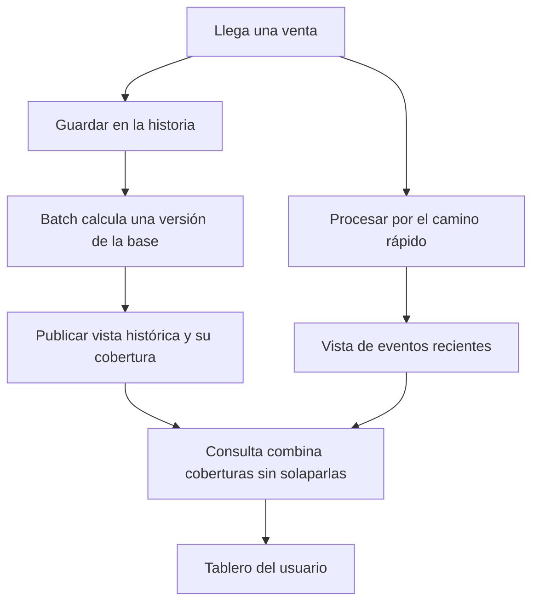

# Arquitectura Lambda: entender los dos caminos con una tienda

## 1. El problema antes de la arquitectura

Imagina una tienda que registra una venta cada vez que alguien compra. Quiere responder dos preguntas:

- «¿Cuánto hemos vendido según todo el historial disponible?»
- «¿Cuánto hemos vendido incluyendo lo que acaba de pasar?»

Podrías leer todas las ventas y volver a sumarlas cada vez que alguien abre el tablero. Con mucha historia, eso puede tardar demasiado. También podrías mantener un contador que se actualice con cada venta nueva. Ese contador responde rápido, pero necesitas poder reconstruirlo si hubo un error o cambia la regla del cálculo.

**La arquitectura Lambda organiza dos caminos de procesamiento: uno calcula resultados desde la historia conservada y otro incorpora rápidamente los eventos recientes que el resultado histórico todavía no incluye. Al consultar, se combinan sin contar nada dos veces.**

Es un diseño de sistema, no un programa que instalas. El nombre no se refiere a las funciones `lambda` de Python ni al servicio AWS Lambda.

## 2. Palabras que necesitas conocer

| Palabra | Significado en este ejemplo |
|---|---|
| Evento | Un hecho registrado: «la venta V101 ocurrió por 20» |
| Batch o lote | Procesar un conjunto delimitado de datos en una ejecución |
| Streaming o flujo | Procesar datos que siguen llegando mediante una consulta o proceso continuo |
| Latencia | Demora entre que llega una venta y aparece reflejada en el tablero |
| Vista calculada | Resultado preparado, como el total de ventas por tienda |
| Recalcular | Volver a obtener un resultado desde los datos conservados |

«Batch» no significa necesariamente «una vez al día»: puede ejecutarse con otra frecuencia. «Streaming» no implica que cada evento se procese instantáneamente ni que nunca se formen pequeños lotes.

## 3. Las tres capas, con responsabilidades claras

### Batch layer: conservar historia y calcular una base

Esta parte conserva los datos de referencia y calcula vistas a partir de ellos. En el diseño clásico, mantiene un historial de hechos al que se añaden nuevos eventos. Las vistas se pueden reconstruir desde esa historia.

Por ejemplo, termina una ejecución que incluye las ventas V1 a V100 y deja preparado el resultado: `total = 100`. Este 100 es un importe, no el número de ventas. El sistema también debe conocer **qué datos están incluidos** en esa versión.

El historial no se borra porque ya hayas calculado un total. Si cambias la regla de negocio, necesitas poder volver a calcular.

### Speed layer: cubrir lo que aún no está en la base publicada

Mientras el próximo cálculo histórico tarda, llegan V101 por 20 y V102 por 5. El camino rápido actualiza una vista reciente que suma 25.

Ese resultado permite que el tablero no espere a la próxima publicación batch. Cuando el batch incorpora esos eventos, dejan de ser necesarios en la parte reciente que se combina con él.

Speed no significa «datos falsos» ni batch significa «verdad perfecta». Ambos dependen de la calidad de la entrada y de reglas correctas. La diferencia central es su cobertura y la demora con que actualizan el resultado.

### Serving layer: hacer consultables los resultados

La serving layer prepara o expone las vistas batch para responder consultas sin recalcular todo el historial en cada petición. La vista rápida también debe poder consultarse. La respuesta final combina ambas; según el diseño, esa combinación vive en un servicio de consulta o en el componente que sirve el resultado.

Para aprender, imagina una API que pregunta por `base histórica` y `parte reciente pendiente` y responde el total. Las capas son responsabilidades lógicas; no tienen que ser exactamente tres servidores.

El planteamiento de conservar hechos, precalcular resultados y completar lo reciente se desarrolla en el texto original de [Nathan Marz](https://nathanmarz.com/blog/how-to-beat-the-cap-theorem.html).

## 4. Cómo recorre una venta el sistema

Una misma venta llega a los dos caminos porque cumple dos propósitos: dar visibilidad rápida y conservarse para el cálculo histórico. **Que se procese por ambos caminos no autoriza a sumarla dos veces en la respuesta.**

El dibujo expresa la intención; el mecanismo de entrada debe asegurar entrega y recuperación para que no se pierdan eventos entre caminos.

## 5. Ejemplo completo: qué ocurre mientras el batch trabaja

Usaremos una secuencia única de eventos para simplificar. En sistemas con varias particiones, la cobertura puede necesitar una posición por partición, no un único número.

| Momento | Base histórica publicada | Reciente no incluido en esa base | Lo que debe ver el tablero |
|---|---|---|---:|
| A | Hasta V100: importe 100 | Nada | 100 |
| B: llega V101 por 20 | Hasta V100: importe 100 | V101: 20 | 120 |
| C: arranca batch con corte en V101 | Sigue publicada la base anterior | V101: 20 | 120 |
| D: mientras calcula, llega V102 por 5 | Sigue publicada la base anterior | V101: 20 y V102: 5 | 125 |
| E: se publica la nueva base | Hasta V101: importe 120 | Solo V102: 5 | 125 |

El paso C es importante: arrancar un cálculo no significa que su resultado ya pueda usarse. El usuario sigue leyendo una versión coherente mientras se prepara la siguiente.

En E cambias de **100 + 25** a **120 + 5**. El valor sigue siendo 125. Si cambias solo la base y sigues sumando 25, muestras 145: V101 está duplicada. Si descartas todos los recientes, muestras 120 y pierdes V102 del resultado.

Por eso una vista batch necesita información de cobertura y una publicación coherente. «Limpiar la tabla de streaming cada medianoche» no describe una solución suficiente.

## 6. ¿Y si llega una venta del día anterior?

Distingue **hora del evento**, cuando ocurrió la venta, y **hora de llegada**, cuando el sistema la recibió. Una venta puede llegar hoy aunque ocurrió ayer.

En el ejemplo anterior, la cobertura se define por eventos incorporados. Una venta tardía que aún no está en el batch se incluye como pendiente y se asigna al día de negocio que corresponde. En el siguiente batch se incorpora a la base y se excluye de la parte pendiente.

Si definieras «reciente» únicamente como «ventas cuya fecha es hoy», podrías omitir esa venta. Una política real debe especificar eventos tardíos, duplicados y correcciones; las garantías no aparecen solo por dibujar dos caminos.

## 7. Combinar no siempre significa sumar dos números

La suma de importes funciona cuando ambos resultados cubren ventas distintas y usan la misma regla. Otras consultas necesitan otra combinación.

- Para **promedio**, conserva suma y cantidad. Si la historia suma 100 en 2 ventas y lo reciente suma 20 en 1, el promedio conjunto es `120 / 3 = 40`, no el promedio de 50 y 20.
- Para **clientes únicos**, una misma persona puede comprar en ambos períodos. Sumar dos conteos puede duplicarla.
- Para **stock actual**, no sumas dos fotografías de inventario. Necesitas reglas para estados, movimientos y versiones.

También hay que evitar contar dos veces un mismo evento reentregado. El identificador de la venta y el de sus eventos deben tener una semántica definida.

## 8. Dónde entra Spark

**Lambda organiza el sistema; Spark ejecuta cálculos sobre datos.**

Una implementación posible usa Spark para calcular las vistas históricas y Structured Streaming para el camino reciente. Los resultados se almacenan o sirven mediante componentes apropiados para las consultas. Spark no exige usar Lambda y Lambda no exige usar Spark.

| Concepto | Pregunta que responde |
|---|---|
| Arquitectura Lambda | ¿Cómo combinamos historia recalculable y novedades con baja demora? |
| Spark | ¿Cómo distribuimos y ejecutamos una transformación de datos? |
| Almacenamiento | ¿Dónde conservamos entrada y resultados? |
| Servicio de consulta | ¿Cómo obtiene el tablero una respuesta coherente? |

## 9. Qué ganas y qué cuesta

Obtienes visibilidad de eventos nuevos mientras mantienes una base reconstruible. A cambio, debes mantener dos recorridos, reglas compatibles y una combinación correcta. Una corrección del cálculo puede requerir revisar ambos caminos.

No hace falta adoptar ese costo si un lote periódico satisface la necesidad. Tampoco necesitas dos implementaciones si un diseño de flujo con reprocesamiento cubre tus requisitos. La decisión parte de cuánto retraso toleras y cómo recuperarás o corregirás resultados.

## 10. Comprueba que lo entendiste

> [!question]- ¿Por qué se envía una venta a los dos caminos?
> Para reflejarla rápidamente y conservarla para el cálculo histórico. La consulta coordina las coberturas para contarla una sola vez.

> [!question]- La base suma 200 e incluye hasta V50. V51 vale 10 y V52 vale 30. El siguiente batch incluye V51. ¿Qué cambió?
> Antes: base 200 + recientes 40 = 240. Después: base 210 + pendiente V52 de 30 = 240. Cambia la distribución del resultado, no su total.

> [!question]- ¿El camino rápido deja de hacer falta cuando termina un batch?
> Los eventos ya incorporados dejan de aportar a esa parte reciente, pero siguen llegando nuevos eventos. El trabajo rápido continúa.

> [!question]- ¿Instalar Spark crea una arquitectura Lambda?
> No. Necesitas diseñar los dos recorridos, sus datos, sus vistas y la combinación de resultados.

## Conexiones

- [[Obsidian/freelance/Data Engineering/Spark/01 Arquitectura y procesamiento distribuido|Cómo funciona Spark desde cero]].
- [[Obsidian/freelance/Data Engineering/Spark/02 Lazy DAG stages y shuffle|Cómo se ejecuta un cálculo dentro de Spark]].
- [[Obsidian/freelance/Data Engineering/Calidad/01 Dimensiones de calidad|Calidad de los datos que alimentan el cálculo]].
- [[Obsidian/freelance/Data Engineering/DevOps/01 DevOps DataOps y CALMS|Operar y observar los dos recorridos]].
- [[Obsidian/pregrado/big data/extract transform load|Extracción, transformación y carga]].

Volver a [[Obsidian/freelance/Data Engineering/00 Empieza aquí|la ruta de estudio]].
