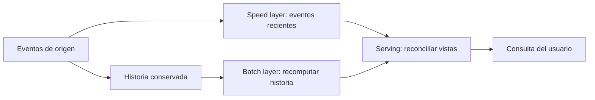

# Arquitectura Lambda: historia completa y datos recientes

## Qué problema intenta resolver

Un negocio quiere reportes históricos completos y respuestas casi inmediatas sobre eventos recién llegados. Una arquitectura Lambda combina un camino batch para procesar historia, un camino rápido para datos recientes y una capa de servicio que expone resultados coherentes.

No se refiere a funciones lambda de Python ni necesariamente al producto AWS Lambda. Aquí «Lambda» es un patrón de arquitectura de datos.

## Un ejemplo con ventas

A medianoche el batch calcula ventas definitivas hasta un corte conocido. Durante el día, el camino rápido publica ventas posteriores a ese corte. La consulta combina la base histórica con lo reciente. Cuando se actualiza la base, debes retirar o excluir de la parte rápida los eventos ya incorporados para no sumarlos dos veces.

| Capa | Ventaja | Responsabilidad difícil |
|---|---|---|
| Batch / cold path | Recalcular con historia completa | Costo y demora del reprocesamiento |
| Speed / hot path | Reducir latencia | Eventos tardíos, correcciones y estado |
| Serving | Responder consultas | Reconciliar resultados y evitar doble conteo |

«Frío» no significa dato incorrecto y «caliente» no significa que nunca se persista. Son caminos con distintas prioridades de latencia y recomputación.

## Cuándo sirve y qué cuesta

Puede servir si necesitas baja latencia y también recomputación histórica. Mantener dos rutas puede duplicar lógica y operación: si una usa una regla distinta de impuestos, las vistas no concuerdan. Define identificadores de eventos, política de duplicados, tiempos de evento/procesamiento y corte de reconciliación.

Si solo necesitas un reporte nocturno, un batch más sencillo puede bastar. Si el procesamiento unificado de streaming con reprocesamiento cubre tus necesidades, evalúa si realmente necesitas dos implementaciones. Spark puede participar en procesamiento batch o streaming, pero usar Spark no convierte automáticamente tu sistema en Lambda.

## Ejercicio

Una venta del día anterior llega hoy después del batch. Decide dónde se incorpora, cómo se corrige el histórico y cómo evitas doble conteo. No basta responder «va por streaming»: debes especificar qué versión ve la consulta durante la corrección.

> [!tip] Regla para recordar
> Historia más actualidad requiere reconciliación, no solo dos pipelines.

## Comprueba que lo entendiste

> [!question]- ¿Lambda consiste simplemente en sumar batch y streaming?
> No. Hace falta coordinar cobertura, cortes y reconciliación para que un evento no falte ni se cuente dos veces.

## Conexiones

- [[Obsidian/freelance/Data Engineering/DevOps/01 DevOps DataOps y CALMS|01 DevOps DataOps y CALMS]] — requiere operar y observar ambos caminos.
- [[Obsidian/freelance/Data Engineering/Calidad/01 Dimensiones de calidad|01 Dimensiones de calidad]] — relaciona oportunidad con consistencia y exactitud.
- [[Obsidian/pregrado/big data/extract transform load|extract transform load]] — extiende el proceso de carga a historia y eventos recientes.

Volver a [[Obsidian/freelance/Data Engineering/00 Empieza aquí|la ruta de estudio]].
