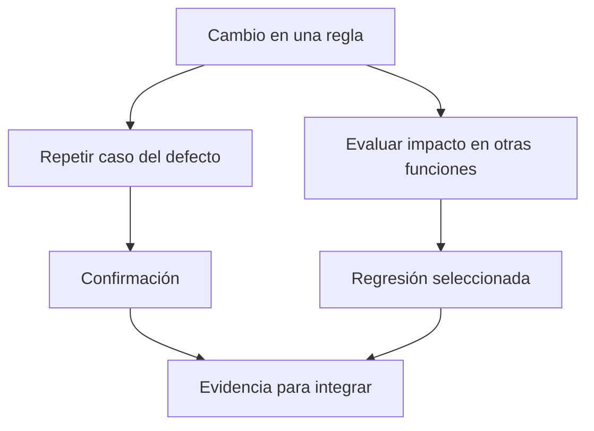

# Regresión, retesting e invariantes de datos

## Un arreglo tiene dos preguntas

Supón que el sistema otorgaba 0 puntos a los empates y lo corriges a 1.

- **Confirmation testing o retesting:** repetir el caso que demostraba el defecto y comprobar que ahora da 1.
- **Regresión:** comprobar que victorias, derrotas, sumas, desempates y clasificación siguen funcionando después del cambio.

La diferencia es la intención. Un test escrito para confirmar una corrección puede quedarse en la suite y convertirse en protección de regresión para cambios posteriores.

## Oráculos y propiedades

Un oráculo es la referencia que permite decidir si el resultado es correcto. Para dos partidos pequeños puedes calcular los puntos a mano. Para millones de filas, complementa las salidas conocidas con propiedades generales o **invariantes**.

| Transformación | Propiedad que debería cumplirse | Qué detecta |
|---|---|---|
| Partido a dos perspectivas | 2 filas por partido válido | Participaciones perdidas o duplicadas |
| Goles a favor/contra | Suma global de diferencias = 0 | Perspectiva visitante mal invertida |
| Join con catálogo único | Conserva número de filas izquierdas en LEFT JOIN | Catálogo duplicado |
| Top 2 con ROW_NUMBER | A lo sumo 2 filas por grupo | Filtro o partición incorrectos |
| Distancia al centro | Siempre no negativa para coordenadas válidas | Fórmula incorrecta |

Estas propiedades tienen supuestos: la diferencia global es cero si incluyes ambas perspectivas del mismo conjunto de partidos. Un filtro que elimina equipos puede romperla legítimamente. Escribe el supuesto junto al test.

## Pruebas metamórficas

Sirven cuando no conoces fácilmente una salida exacta pero sí cómo debería cambiar. Si permutas las filas de entrada, un ranking con desempate completo debe elegir los mismos ganadores. Si trasladas todos los puntos y su centro por el mismo vector, las distancias no cambian. Si duplicas cada observación, el promedio permanece igual, aunque las sumas se dupliquen.

Para flotantes usa tolerancias justificadas por escala y algoritmo; no esperes igualdad exacta tras cualquier orden de sumas distribuidas. Tampoco uses una tolerancia enorme que esconda un error de fórmula.

## Caso práctico

Cambia deliberadamente la perspectiva visitante para usar `favor - contra` sin intercambiar goles. Un ejemplo de empate no descubrirá el bug, pero uno 3–0 y el invariante de suma cero sí. Eso muestra por qué un test útil intenta distinguir implementaciones correctas de errores plausibles.

## Qué no demuestra un test

Una suite que pasa sobre datos sintéticos no valida que la fuente de mañana tenga el mismo esquema, ni que soporte un volumen mucho mayor. Añade controles en ejecución y observa métricas. Pruebas de software y calidad de datos se complementan.

> [!tip] Regla para recordar
> Confirmación pregunta si arreglaste el defecto; regresión pregunta qué más cambió.

## Comprueba que lo entendiste

> [!question]- Si el empate corregido funciona, ¿terminó la regresión?
> No. Eso confirma el arreglo específico. Falta verificar funciones relacionadas que el cambio podría haber afectado.

## Conexiones

- [[Obsidian/freelance/Data Engineering/Calidad/02 Validación Unicode y contratos|02 Validación Unicode y contratos]] — lleva controles a cada carga real.
- [[Obsidian/freelance/Data Engineering/SQL/04 CTE y transformaciones de partidos|04 CTE y transformaciones de partidos]] — provee la transformación a la que aplicar los invariantes.
- [[Obsidian/posgrado/master/MATEMÁTICAS Y PROGRAMACIÓN IA/ingenieria de software para machine learning/04 Pruebas unitarias, integración y pruebas semánticas|04 Pruebas unitarias, integración y pruebas semánticas]] — amplía tus pruebas metamórficas con ejemplos SQL y espaciales.

Volver a [[Obsidian/freelance/Data Engineering/00 Empieza aquí|la ruta de estudio]].
