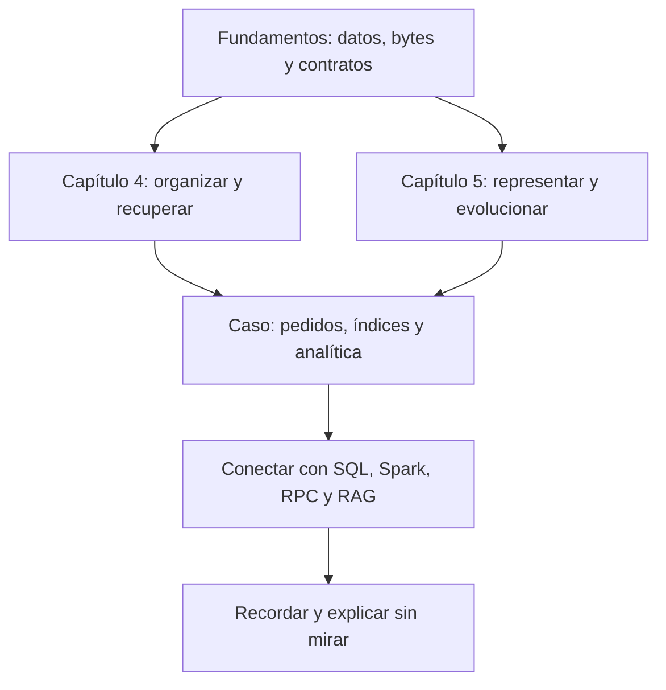

# DDIA — Entender cómo se guardan y evolucionan los datos

[[Obsidian/lecturas/00 Índice de lecturas|← Biblioteca de lecturas]]

**Aquí puedes estudiar directamente, sin volver a leer los PDF.** Las notas explican conceptos, pasos intermedios, ejemplos y límites. Los escaneos se conservan únicamente como referencias opcionales.

Esta lectura trabaja los **capítulos 4 y 5** de *Designing Data-Intensive Applications*, segunda edición, de Martin Kleppmann y Chris Riccomini. Los títulos y la numeración se contrastaron con la [ficha oficial de O’Reilly](https://www.oreilly.com/library/view/designing-data-intensive-applications/9781098119058/). No es un resumen del libro completo: es un desarrollo detallado de los dos capítulos que compartiste, acompañado de fundamentos y conexiones.

**Revisión ampliada:** las 14 notas se contrastaron con las 66 páginas de los dos escaneos. Se desarrollaron los mecanismos que habían quedado breves y se añadió una guía para interpretar cada diagrama. Puedes comenzar por [[Obsidian/lecturas/Designing Data-Intensive Applications 2a edición/02 Atlas visual explicado|el atlas con cuatro imágenes nuevas explicadas paso a paso]] o seguir el orden de las notas. La [[Obsidian/lecturas/Designing Data-Intensive Applications 2a edición/92 Revisión de cobertura y mejoras|matriz de cobertura]] documenta los temas revisados y las mejoras concretas.

> [!abstract] Dos preguntas para orientarte
> **Almacenamiento y recuperación:** ¿cómo organizo los datos para escribirlos, encontrarlos y recuperarlos tras un fallo?
>
> **Codificación y evolución:** ¿cómo los represento para que programas distintos, de hoy y de mañana, puedan interpretarlos correctamente?

## Empieza por una situación conocida

Una tienda guarda un pedido, lo consulta por cliente y suma ventas por mes. El pedido no cambia de significado por aparecer en una pantalla, una tabla o un mensaje, pero **la organización conveniente cambia con el trabajo**. Un índice ayuda a encontrar pocas filas; las columnas ayudan a analizar atributos de muchas filas. Si mañana añades una moneda o cambias un tipo, tienes que coordinar versiones sin corromper el significado.

El hilo conductor es preguntar **qué trabajo estás ahorrando, qué costo añades y qué información debe sobrevivir**. No se trata de aprender que una tecnología siempre gana.

## Una ruta que construye las ideas

1. **Ubica las piezas.** [[Obsidian/lecturas/Designing Data-Intensive Applications 2a edición/01 Antes de empezar datos bytes y páginas|Datos, bytes, páginas, caché y contratos]] explica los términos que aparecen después. Si algo resulta nuevo, empieza aquí.
2. **Sigue un dato dentro del motor.** Lee las primeras cuatro notas del capítulo 4: del archivo sencillo a índices, LSM y B-trees. Dibuja dónde está la última versión y cómo se encuentra.
3. **Cambia la pregunta.** Continúa con columnas, ejecución analítica y buscadores. Explica por qué buscar un ID y buscar significado necesitan organizaciones distintas.
4. **Cambia el programa.** Recorre el capítulo 5. Dibuja siempre escritor → lector y anota las versiones antes de decidir si un cambio es compatible.
5. **Combina lo aprendido.** Resuelve [[Obsidian/lecturas/Designing Data-Intensive Applications 2a edición/70 Caso práctico de pedidos a analítica|el caso de pedidos a analítica]], incluidos cambios de moneda y reintentos.
6. **Recuerda con tus propias palabras.** Usa [[Obsidian/lecturas/Designing Data-Intensive Applications 2a edición/81 Glosario y tarjetas de memoria|el glosario y las 18 tarjetas]] y explica una conexión con una nota anterior.

No necesitas avanzar todo de una vez. Una buena unidad de estudio es una nota: entender el problema, seguir el ejemplo y responder sus preguntas sin mirar.

## Capítulo 4 · Almacenamiento y recuperación

| Nota | Lo que podrás explicar |
|---|---|
| [[Obsidian/lecturas/Designing Data-Intensive Applications 2a edición/04 Almacenamiento y recuperación/01 Del log al índice\|01 · Del log al índice]] | Por qué guardar al final es fácil y encontrar la última versión puede ser caro |
| [[Obsidian/lecturas/Designing Data-Intensive Applications 2a edición/04 Almacenamiento y recuperación/02 LSM SSTables compactación y Bloom\|02 · LSM, SSTables y Bloom]] | Cómo memoria, archivos ordenados y compactación colaboran; por qué Bloom dice “quizá” |
| [[Obsidian/lecturas/Designing Data-Intensive Applications 2a edición/04 Almacenamiento y recuperación/03 B-trees WAL y costos de almacenamiento\|03 · B-trees, WAL y costos]] | Cómo buscar por páginas, dividir hojas y comparar amplificaciones |
| [[Obsidian/lecturas/Designing Data-Intensive Applications 2a edición/04 Almacenamiento y recuperación/04 Índices secundarios cobertura y memoria\|04 · Índices secundarios y cobertura]] | Por qué localizar una fila no siempre equivale a recuperar toda la respuesta |
| [[Obsidian/lecturas/Designing Data-Intensive Applications 2a edición/04 Almacenamiento y recuperación/05 Almacenamiento columnar y compresión\|05 · Columnas, bitmaps y compresión]] | Cómo leer menos columnas, combinar condiciones y mantener las filas correctamente alineadas |
| [[Obsidian/lecturas/Designing Data-Intensive Applications 2a edición/04 Almacenamiento y recuperación/06 Lagos de datos ejecución y vistas materializadas\|06 · Lagos, ejecución y vistas]] | Qué hacen formatos, catálogos, motores, vectorización y resultados precalculados |
| [[Obsidian/lecturas/Designing Data-Intensive Applications 2a edición/04 Almacenamiento y recuperación/07 Índices espaciales texto completo y vectores\|07 · Espacio, palabras y vectores]] | Cómo funcionan regiones, postings, IVF y HNSW; qué errores introduce la aproximación |

![[Obsidian/lecturas/Designing Data-Intensive Applications 2a edición/Recursos visuales/01-btree-y-lsm.png|900]]

*Imagen para recordar: navegar por páginas frente a acumular y fusionar segmentos. Es una analogía; las notas desarrollan los mecanismos y sus excepciones.*

## Capítulo 5 · Codificación y evolución

| Nota | Lo que podrás explicar |
|---|---|
| [[Obsidian/lecturas/Designing Data-Intensive Applications 2a edición/05 Codificación y evolución/01 Evolución y compatibilidad\|01 · Evolución y compatibilidad]] | Las dos direcciones de compatibilidad y la pérdida de campos al reescribir |
| [[Obsidian/lecturas/Designing Data-Intensive Applications 2a edición/05 Codificación y evolución/02 JSON XML CSV y esquemas\|02 · JSON, XML, CSV y esquemas]] | Qué se pierde entre bytes, tipos y significado; qué valida un esquema |
| [[Obsidian/lecturas/Designing Data-Intensive Applications 2a edición/05 Codificación y evolución/03 Protocol Buffers y números de campo\|03 · Protobuf]] | Por qué la identidad de un campo vive en su número y por qué no debes reciclarlo |
| [[Obsidian/lecturas/Designing Data-Intensive Applications 2a edición/05 Codificación y evolución/04 Avro y resolución de esquemas\|04 · Avro]] | Cómo resolver el esquema escritor contra el lector y qué hacen los defaults |
| [[Obsidian/lecturas/Designing Data-Intensive Applications 2a edición/05 Codificación y evolución/05 Bases de datos APIs y RPC\|05 · Bases, APIs y RPC]] | Cómo cambian los papeles de lector y escritor y por qué un timeout deja incertidumbre |
| [[Obsidian/lecturas/Designing Data-Intensive Applications 2a edición/05 Codificación y evolución/06 Workflows durables e idempotencia\|06 · Workflows e idempotencia]] | Qué recuerda un historial y qué efectos externos todavía pueden repetirse |
| [[Obsidian/lecturas/Designing Data-Intensive Applications 2a edición/05 Codificación y evolución/07 Mensajería actores y repaso\|07 · Mensajes y actores]] | Qué desacopla un broker y qué contratos siguen siendo necesarios |

![[Obsidian/lecturas/Designing Data-Intensive Applications 2a edición/Recursos visuales/02-compatibilidad-lectores.png|900]]

*Nuevo lee viejo: hacia atrás. Viejo lee nuevo: hacia delante. La imagen muestra el objetivo de compatibilidad, no una garantía de cualquier cambio.*

## Explora, conecta y comprueba

- [[Obsidian/lecturas/Designing Data-Intensive Applications 2a edición/Mapa de lectura.canvas|Mapa visual navegable]]: abre notas y sigue sus conexiones en Obsidian Canvas.
- [[Obsidian/lecturas/Designing Data-Intensive Applications 2a edición/02 Atlas visual explicado|Atlas visual explicado]]: versiones LSM, dos esquemas Avro, incertidumbre del timeout y formas de búsqueda.
- [[Obsidian/lecturas/Designing Data-Intensive Applications 2a edición/70 Caso práctico de pedidos a analítica|Caso práctico]]: un sistema, varias decisiones y sus consecuencias.
- [[Obsidian/lecturas/Designing Data-Intensive Applications 2a edición/80 Conexiones con mis otras notas|Conexiones con tus otras notas]]: puentes explicados con freelance, posgrado y pregrado.
- [[Obsidian/lecturas/Designing Data-Intensive Applications 2a edición/81 Glosario y tarjetas de memoria|Glosario y memoria]]: definiciones, confusiones habituales y respuestas plegables.
- [[Obsidian/lecturas/Designing Data-Intensive Applications 2a edición/90 Fuentes y cobertura|Referencias opcionales y cobertura]]: de dónde vienen los conceptos y qué amplían estas notas.
- [[Obsidian/lecturas/Designing Data-Intensive Applications 2a edición/Recursos visuales/04 Procedencia de imágenes y prompts|Imágenes y prompts]]: procedencia de las ilustraciones y del gráfico.

> [!success] Una señal de que ya lo entendiste
> Puedes cambiar los nombres del ejemplo y seguir explicando **por qué funciona, cuánto trabajo evita y en qué caso dejaría de ser una buena elección**.
