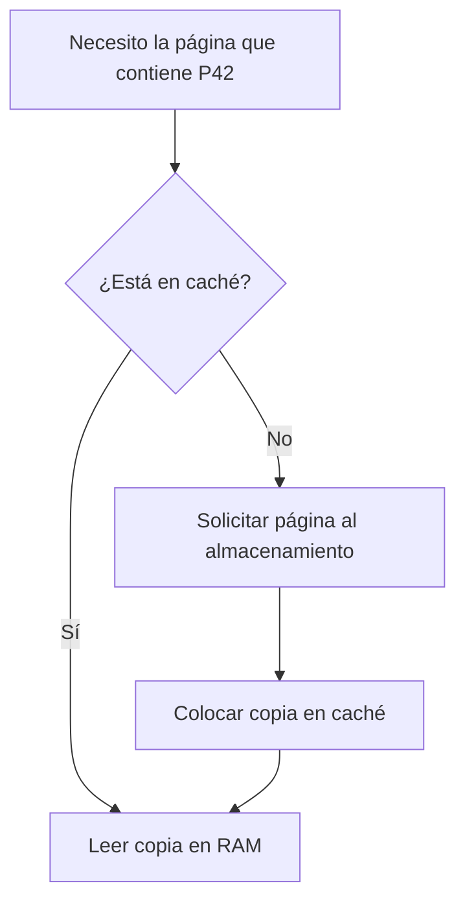
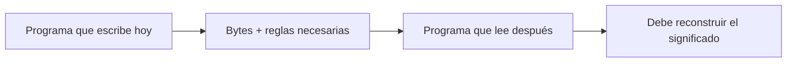

# DDIA — Antes de empezar: datos, bytes, páginas y contratos

[[Obsidian/lecturas/Designing Data-Intensive Applications 2a edición/00 Empieza aquí|Inicio del libro]] → [[Obsidian/lecturas/Designing Data-Intensive Applications 2a edición/01 Guía y fundamentos/00 Índice|Guía y fundamentos]]

Esta introducción aporta el contexto para estudiar los capítulos 4 y 5 **sin abrir los PDF ni dominar antes todos los términos**. Es una explicación didáctica propia. Mantendremos un mismo ejemplo: una tienda guarda pedidos.

## 1. Un dato tiene significado y representación

El pedido P42 cuesta 12 dólares. Podemos representarlo así:

```json
{"id":"P42","total_centavos":1200}
```

El **significado** es el hecho que queremos conservar. La **representación** es la forma concreta que elegimos para guardarlo o comunicarlo. Podríamos escribir `12.00`, el entero `1200` o una secuencia binaria. Para recuperar el significado hay que conocer las reglas: por ejemplo, que el entero expresa centavos y que la moneda es USD.

Un **bit** tiene dos posibles valores, 0 y 1. Un **byte** agrupa ocho bits y puede representar 256 combinaciones. Que un byte contenga el número 65 no demuestra que signifique la letra A: esa interpretación depende de la codificación. El byte `41` en hexadecimal es el mismo valor que 65 en decimal. Hexadecimal es simplemente una forma compacta de escribir números usando dieciséis símbolos, del 0 al 9 y de A a F.

No necesitas memorizar secuencias binarias. Necesitas recordar que **los bytes requieren reglas para interpretarse**.

## 2. Fila, clave y valor

Una fila reúne atributos de una entidad o acontecimiento. En el ejemplo, una fila representa un pedido. La **clave** identifica o permite buscar; el **valor** es lo que recuperas.

```text
Clave: P42
Valor: {cliente: C7, total_centavos: 1200, estado: pendiente}
```

En una estructura clave-valor, el valor puede ser un objeto completo. En una tabla relacional, aparecen columnas y restricciones. El motor finalmente debe convertir esas representaciones en bytes. Una clave secundaria como `cliente=C7` puede corresponder a muchos pedidos, por lo que no sustituye necesariamente la identidad única del pedido.

**Granularidad** significa qué representa una unidad de tus datos. «Una fila por pedido» y «una fila por producto dentro de un pedido» producen sumas y duplicaciones diferentes. Antes de optimizar una consulta, comprueba que responde la pregunta correcta.

## 3. Memoria, almacenamiento persistente y caché

La RAM permite acceso rápido y se usa para trabajar. En las condiciones habituales, su contenido se pierde cuando deja de tener alimentación. Un SSD conserva datos sin alimentación, pero acceder a él y escribir tiene otros costos y garantías.

Una **caché** guarda una copia de información que resulta conveniente tener cerca. Si la página buscada está en RAM, el motor puede evitar una lectura física del SSD. Por eso ejecutar dos veces la misma consulta puede dar tiempos muy diferentes: la primera pudo llenar la caché.



Persistir no significa solamente invocar una función `write`: puede haber buffers de aplicación, sistema operativo o dispositivo. Un motor debe definir qué sincroniza antes de confirmar una operación. **Durabilidad** expresa qué cambios confirmados sobreviven a los fallos contemplados por su configuración y modelo.

## 4. Páginas y bloques: se transportan grupos de bytes

El motor no siempre pide al dispositivo únicamente los 12 bytes que te interesan. Organiza trabajo en unidades mayores, como páginas y bloques. Supón una página didáctica de 4 KiB, es decir, 4096 bytes: aunque quieras un valor pequeño, quizá haya que traer y procesar una página completa.

Una **página de base de datos** y un **bloque físico del dispositivo** son conceptos de capas distintas; no tienen por qué medir lo mismo. En estas notas, “página” normalmente se refiere a la unidad que organiza el motor, mientras “bloque” depende del formato descrito.

Si una página interna del árbol contiene muchas referencias a otras páginas, una decisión permite descartar grandes cantidades de claves. De ahí que un B-tree busque por niveles y no necesite inspeccionar todas las filas.

## 5. Leer seguido y saltar entre posiciones

Una lectura **secuencial** recorre regiones contiguas; una lectura **aleatoria** accede a posiciones dispersas. En discos mecánicos los saltos implican movimiento físico. En SSD la situación cambia, pero siguen importando tamaños de solicitudes, concurrencia y organización del dispositivo.

El término **I/O** o **E/S** significa entrada/salida: trabajo de mover datos entre componentes, como memoria y almacenamiento. Reducir E/S puede mejorar una consulta, pero no siempre es el único objetivo: descomprimir y filtrar consumen CPU.

Una consulta puede ser lenta porque lee demasiado, porque calcula demasiado o porque espera a otros componentes. «Usa disco» no basta como diagnóstico.

## 6. Rendimiento y latencia son preguntas distintas

**Latencia o tiempo de respuesta** pregunta cuánto espera una petición, con la definición concreta que estés midiendo. **Throughput** o rendimiento de procesamiento pregunta cuántas operaciones completas por unidad de tiempo.

Ejemplo ficticio: un sistema puede procesar 10 000 peticiones por segundo y, durante una compactación, hacer que algunas esperen mucho. Un promedio no muestra toda esa experiencia. Un percentil p99 indica el umbral bajo el cual cae aproximadamente el 99 % de las observaciones de la muestra; no significa «el peor caso» ni describe el 1 % restante.

Cuando compares diseños, pregunta por carga sostenida, distribución de tamaños, concurrencia y percentiles. Una cifra sin condiciones es difícil de interpretar.

## 7. Modelo, formato, esquema y motor

| Concepto | Pregunta que responde | Ejemplo |
|---|---|---|
| Modelo de datos | ¿Cómo organizo entidades y relaciones? | Pedidos y clientes en tablas |
| Esquema | ¿Qué campos y tipos espero? | `id` string; `total_centavos` entero |
| Formato | ¿Cómo se representan al almacenar o transmitir? | JSON, Protobuf, Avro, Parquet según el uso |
| Motor | ¿Cómo realizo las operaciones sobre los datos? | Buscar claves, recuperar páginas y ejecutar consultas |
| Contrato semántico | ¿Qué significan y cómo deben usarse? | Total en centavos; moneda USD; identidad estable |

Un formato puede incorporar un esquema o depender de uno externo. Un esquema puede imponer muchas reglas y seguir sin expresar todos los compromisos del negocio. Un motor puede admitir varios formatos y estructuras internas.

## 8. Escritor y lector son papeles, no personas

El **escritor** produce una representación; el **lector** la interpreta. Un servidor puede ser lector de una petición y escritor de la respuesta. Una aplicación puede escribir hoy en una base y su versión futura leer ese registro dentro de un año.



Si cambias las reglas de forma incompatible, no arreglas automáticamente los bytes antiguos. Esta es la razón por la que evolución y almacenamiento aparecen juntos en el estudio de sistemas de datos.

> [!question]- Puedo abrir un archivo y ver números. ¿Ya sé qué significa?
> No. Falta saber qué representa cada fila, qué unidades usan sus valores y qué reglas relacionan sus campos. Legibilidad y significado son cosas distintas.

> [!question]- Si la segunda ejecución es rápida, ¿demostré que mi diseño siempre es rápido?
> No. Puede haber aprovechado caché u otro trabajo de la primera ejecución. Debes describir las condiciones de la prueba y compararlas con la carga real.

> [!tip] La frase para llevarte
> **Una pregunta busca un hecho; un programa interpreta una estructura; un motor mueve bytes.** Un buen diseño mantiene coherentes las tres capas.

Continúa con [[Obsidian/lecturas/Designing Data-Intensive Applications 2a edición/04 Almacenamiento y recuperación/01 Del log al índice|cómo un log se convierte en un sistema consultable]]. Para recordar vocabulario durante el recorrido tienes [[Obsidian/lecturas/Designing Data-Intensive Applications 2a edición/06 Práctica y repaso/02 Glosario y tarjetas de memoria|el glosario]].

---

**Anterior:** [[Obsidian/lecturas/Designing Data-Intensive Applications 2a edición/01 Guía y fundamentos/00 Índice|Guía y fundamentos]] · **Índice:** [[Obsidian/lecturas/Designing Data-Intensive Applications 2a edición/01 Guía y fundamentos/00 Índice|Ver este bloque]] · **Siguiente:** [[Obsidian/lecturas/Designing Data-Intensive Applications 2a edición/04 Almacenamiento y recuperación/01 Del log al índice|Del log al índice]]
