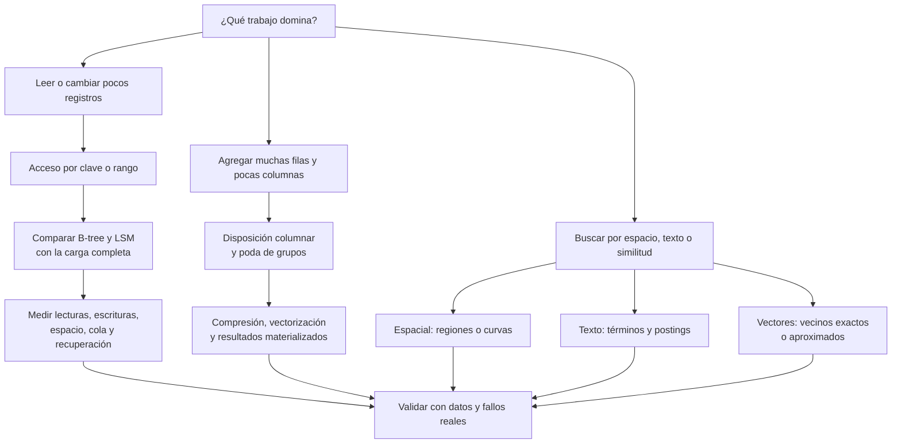
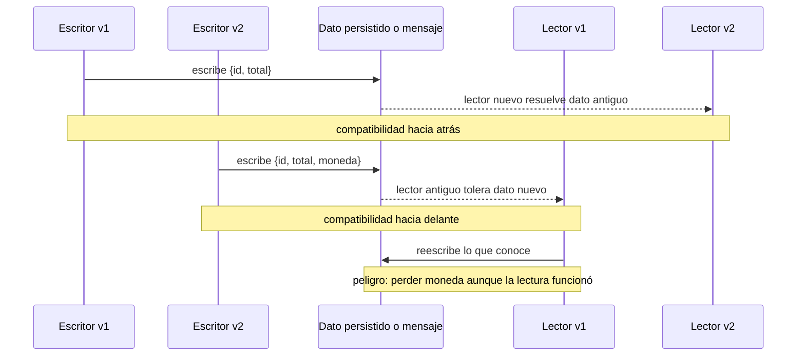

# DDIA — Mapa de decisiones: del requisito al mecanismo

[[Obsidian/lecturas/Designing Data-Intensive Applications 2a edición/00 Empieza aquí|Inicio del libro]] → [[Obsidian/lecturas/Designing Data-Intensive Applications 2a edición/01 Guía y fundamentos/00 Índice|Guía y fundamentos]]

Esta nota convierte los capítulos 4 y 5 en una forma de razonar. No elige un producto por ti: ayuda a formular la pregunta correcta, seguir el dato y descubrir qué costo o incompatibilidad estabas pasando por alto.

> [!info] Recuerda antes
> - **Representación** responde cómo viven los datos en bytes; **significado** responde qué hechos expresan. Una decisión correcta necesita ambos niveles.
> - Un **índice** y un resultado materializado son estructuras derivadas: ahorran trabajo de lectura y trasladan costo a escritura, espacio o frescura.
> - Escritor y lector pueden ejecutar versiones distintas; nombra siempre las dos antes de afirmar compatibilidad.

> [!tip] La frase que debes completar antes de escoger tecnología
> “Necesito **hacer esta operación**, sobre **esta selección y volumen de datos**, con **este límite de latencia y frescura**, y debo sobrevivir a **estos fallos y cambios de versión**”.

Si faltan esas cinco partes, una elección como “LSM”, “columnar”, “Protobuf” o “broker” todavía es una preferencia, no una decisión justificada.

## Mapa 1: de la pregunta a la organización de datos

### Las ramas comparan formas de trabajo, no productos

**Acceso operacional.** Un B-tree ofrece una jerarquía mutable de páginas; una LSM acumula cambios recientes y publica archivos ordenados que luego compacta. La comparación útil no es “lecturas contra escrituras” en abstracto. Incluye tamaño de claves y valores, rangos, caché, compactación, presión de disco, recuperación y percentiles de latencia.

**Análisis.** Leer pocas columnas de muchas filas favorece una organización columnar porque evita transportar columnas que la consulta no necesita. Esto no garantiza una respuesta rápida: todavía importan grupos de filas, filtros, estadísticas, joins, ancho del resultado, CPU y red.

**Búsquedas especiales.** Un índice compuesto conserva un orden principal, pero una región 2D, una frase o un vecino semántico plantean otras relaciones. El índice debe aproximarse a la noción de “cercanía” que usa la pregunta. Un resultado cercano sigue necesitando verificación.

> [!warning] El diagrama no decide “qué base comprar”
> Un producto puede combinar B-trees, LSM, columnas y varios índices. El nombre comercial tampoco demuestra una garantía. Comprueba el camino concreto de lectura, escritura y recuperación de la configuración que vas a usar.

## Cinco ejes para comparar candidatos

| Eje | Pregunta que debes responder | Evidencia útil |
|---|---|---|
| Selección | ¿Una clave, un rango, millones de filas o vecinos? | Distribución de consultas y cardinalidad real |
| Mantenimiento | ¿Qué estructuras cambian con cada escritura? | Bytes escritos, compactación, splits, índices y cola |
| Recuperación | ¿Qué se conserva tras una caída y desde qué punto? | Protocolo de confirmación, WAL/log, snapshots y prueba de reinicio |
| Espacio | ¿Qué copias, versiones y resultados se retienen? | Amplificación estable y pico temporal, no solo tamaño lógico |
| Frescura | ¿Cuánto atraso admite la lectura derivada? | Lag medido, política de reconstrucción y estado visible durante el cambio |

### Un pedido seguido de extremo a extremo

Supón cinco necesidades para `P42`:

| Necesidad | Organización candidata | Trabajo que evita | Precio o límite |
|---|---|---|---|
| Guardar cambios de estado con alta tasa | Ruta append-only o LSM | Evita reordenar todo por cada cambio | Flush, compactación y varias versiones físicas |
| Leer el estado actual por ID | Índice primario | Evita recorrer el historial | Mantener el índice y recuperar el valor correcto |
| Listar pedidos de un cliente por fecha | Índice secundario compuesto | Evita filtrar todos los pedidos | Orden de columnas, espacio y costo de cada actualización |
| Sumar ventas del año por categoría | Copia columnar analítica | Evita leer columnas y filas irrelevantes | Ingesta, frescura y reconciliación con el origen |
| Buscar “envío tardío” aunque use otras palabras | Índice vectorial, quizá combinado con texto | Evita comparar exhaustivamente todo el corpus | Calidad del embedding, falsos descartes ANN y validación del resultado |

No hay contradicción en conservar varias representaciones. La pregunta es quién las produce, cómo se sabe cuál está vigente y qué ocurre cuando una actualización queda a mitad.

## Mapa 2: el dato también debe sobrevivir a las versiones

La compatibilidad no es una propiedad mágica del formato. Siempre nombra:

1. qué versión escribió;
2. qué versión lee;
3. qué esquema usa cada una;
4. si el lector solo consume o también vuelve a escribir;
5. qué significado tiene un campo ausente, nuevo o renombrado.

### El canal cambia los papeles, no elimina el contrato

| Canal | Escritor | Lector | Pregunta adicional |
|---|---|---|---|
| Base de datos | Proceso que guarda hoy | Código actual o futuro | ¿El dato viejo será reescrito o migrado? |
| RPC/REST | Cliente en solicitud; servidor en respuesta | Servidor en solicitud; cliente en respuesta | ¿Qué versiones conviven y qué significa un timeout? |
| Broker | Productor | Uno o varios consumidores, quizá mucho después | ¿Cuánto se retiene y cómo se conservan campos desconocidos al republicar? |
| Workflow durable | Código que registra decisiones y resultados | Replay del mismo workflow o de una versión compatible | ¿Qué efectos externos pueden repetirse? |

## Seis pruebas antes de declarar que el diseño funciona

1. **Dato viejo, código nuevo.** Lee un registro real de la versión anterior, no uno fabricado por la biblioteca nueva.
2. **Dato nuevo, código viejo.** Comprueba tanto la lectura como la reescritura. Ignorar un campo no demuestra conservarlo.
3. **Caída en cada frontera.** Interrumpe antes y después del log, del efecto externo y de la confirmación; anota qué puede observar cada actor.
4. **Estado estable.** Mide después de que compactación, cachés y mantenimiento hayan empezado. Una base vacía puede ocultar el costo sostenido.
5. **Consulta adversa.** Prueba clave ausente, rango grande, `SELECT *`, término raro y vecino cerca de una frontera ANN.
6. **Reconstrucción.** Demuestra cómo regenerar un índice, una vista o un estado en memoria sin inventar ni duplicar cambios confirmados.

## Errores frecuentes y la pregunta que los corrige

| Error | Pregunta correctiva |
|---|---|
| “LSM gana en escrituras; B-tree gana en lecturas.” | ¿Con qué distribución, tamaños, caché, compactación y percentil? |
| “Columnar hace rápida cualquier analítica.” | ¿Qué columnas, grupos, filtros, joins y bytes de salida intervienen? |
| “El esquema acepta el mensaje, así que el cambio es compatible.” | ¿Preserva significado y campos en el recorrido completo? |
| “Hubo timeout, por lo tanto no ocurrió.” | ¿Qué sabe realmente el cliente y cómo se deduplica o reconcilia? |
| “El broker evita perder mensajes.” | ¿Qué garantizan configuración, retención, ack y reentrega? |
| “El vecino más cercano responde la pregunta.” | ¿Cercano según qué representación, y quién verifica relevancia y verdad? |

## Comprueba que puedes razonar sin memorizar nombres

> [!question]- Una consulta por cliente es lenta. ¿Crear un índice es ya una respuesta completa?
> No. Debes especificar la consulta, selectividad y orden, qué guardará el índice, cuánto costará mantenerlo y si todavía habrá que recuperar filas o valores fuera de él.

> [!question]- Un despliegue v2 añade `moneda` con default `USD`. ¿Ese default demuestra que todos los pedidos viejos fueron cobrados en USD?
> No. Es una regla de lectura, no un hecho histórico. Solo es correcto si el contrato anterior permite inferir USD; en caso contrario, el default fabricaría significado.

> [!question]- ¿Por qué una prueba de reintento debe incluir “efecto realizado, confirmación perdida”?
> Porque es la historia en la que un cliente observa timeout y repetir ingenuamente puede duplicar el efecto. Probar solo fallos antes de ejecutar deja fuera la incertidumbre más peligrosa.

> [!question]- ¿Cuándo dos representaciones del mismo pedido dejan de ser una optimización segura?
> Cuando no existe una regla fiable para publicar, versionar, reconciliar o reconstruir la derivada. El ahorro de lectura no compensa respuestas cuyo estado vigente no puede determinarse.

## Dónde profundizar

- Para almacenamiento operacional: [[Obsidian/lecturas/Designing Data-Intensive Applications 2a edición/04 Almacenamiento y recuperación/02 LSM SSTables compactación y Bloom|LSM, SSTables, compactación y Bloom]] y [[Obsidian/lecturas/Designing Data-Intensive Applications 2a edición/04 Almacenamiento y recuperación/03 B-trees WAL y costos de almacenamiento|B-trees, WAL y costos]].
- Para análisis e índices especiales: [[Obsidian/lecturas/Designing Data-Intensive Applications 2a edición/04 Almacenamiento y recuperación/05 Almacenamiento columnar y compresión|almacenamiento columnar]] y [[Obsidian/lecturas/Designing Data-Intensive Applications 2a edición/04 Almacenamiento y recuperación/07 Índices espaciales texto completo y vectores|espacio, texto y vectores]].
- Para evolución: [[Obsidian/lecturas/Designing Data-Intensive Applications 2a edición/05 Codificación y evolución/01 Evolución y compatibilidad|evolución y compatibilidad]], [[Obsidian/lecturas/Designing Data-Intensive Applications 2a edición/05 Codificación y evolución/03 Protocol Buffers y números de campo|Protobuf]] y [[Obsidian/lecturas/Designing Data-Intensive Applications 2a edición/05 Codificación y evolución/04 Avro y resolución de esquemas|Avro]].
- Para fallos parciales: [[Obsidian/lecturas/Designing Data-Intensive Applications 2a edición/05 Codificación y evolución/05 Bases de datos APIs y RPC|APIs y RPC]] y [[Obsidian/lecturas/Designing Data-Intensive Applications 2a edición/05 Codificación y evolución/06 Workflows durables e idempotencia|workflows durables]].

**Fuentes principales:** síntesis de [[Obsidian/lecturas/Designing Data-Intensive Applications 2a edición/Materiales/DDIA 2e - Capítulo 4 - escaneo.pdf|capítulo 4, almacenamiento y recuperación]] y [[Obsidian/lecturas/Designing Data-Intensive Applications 2a edición/Materiales/DDIA 2e - Capítulo 5 - escaneo.pdf|capítulo 5, codificación y evolución]]. Los pedidos, tablas, diagramas y pruebas son elaboraciones didácticas originales.

---

**Anterior:** [[Obsidian/lecturas/Designing Data-Intensive Applications 2a edición/01 Guía y fundamentos/02 Atlas visual explicado|Atlas visual explicado]] · **Índice:** [[Obsidian/lecturas/Designing Data-Intensive Applications 2a edición/01 Guía y fundamentos/00 Índice|Ver este bloque]] · **Siguiente:** [[Obsidian/lecturas/Designing Data-Intensive Applications 2a edición/04 Almacenamiento y recuperación/01 Del log al índice|Empezar el capítulo 4]]
