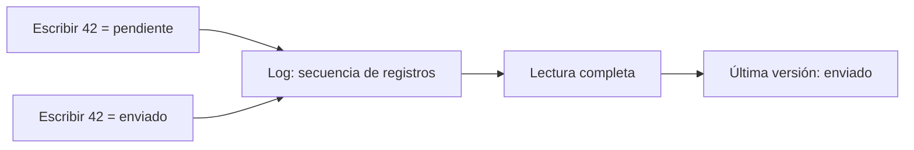
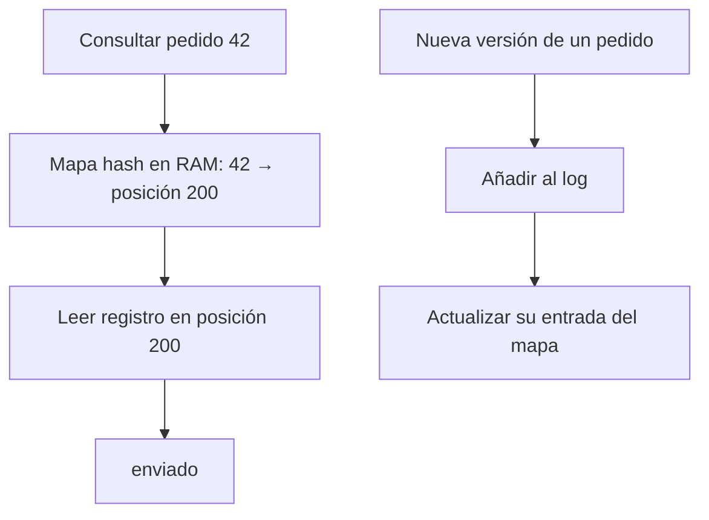

# DDIA — Del log al índice: guardar es fácil, encontrar cuesta

[[Obsidian/lecturas/Designing Data-Intensive Applications 2a edición/00 Empieza aquí|Inicio del libro]] → [[Obsidian/lecturas/Designing Data-Intensive Applications 2a edición/04 Almacenamiento y recuperación/00 Índice|Almacenamiento y recuperación]]

> [!abstract] La idea que organiza el capítulo
> El motor de almacenamiento decide **cómo disponer bytes para escribirlos, encontrarlos y recuperarlos tras un fallo**. El modelo de datos dice qué representan esos bytes. Puedes usar SQL sobre motores con organizaciones físicas muy diferentes.

> [!info] Recuerda antes
> - Un **dato lógico** como “pedido 42 enviado” necesita una representación en bytes; el motor organiza esa representación, no decide por sí solo qué significa “enviado”.
> - El almacenamiento mueve y conserva **bloques de bytes**. Aunque una aplicación cambie un campo, el trabajo físico puede abarcar páginas, segmentos o archivos completos.
> - Un **índice** es información derivada que ahorra búsqueda. No sustituye los datos: ocupa espacio y debe mantenerse cuando estos cambian.

## Una tienda, dos preguntas

La tienda necesita consultar «¿cuál es el estado del pedido 42?» y también «¿cuánto vendimos por categoría durante el año?». La primera petición toca pocos registros y espera una respuesta breve: patrón OLTP. La segunda combina muchas filas y unas pocas columnas: patrón analítico, OLAP. La frecuencia, selectividad y proporción entre lecturas y escrituras condicionan el almacenamiento conveniente.

No memorices OLTP como «escribir» y OLAP como «leer»: OLTP también lee y un almacén analítico también recibe cambios. La diferencia es la **forma del trabajo habitual**.

## Construyamos una base mínima

Imagina un archivo al que solo añadimos registros al final. Usamos los siguientes desplazamientos ficticios para ilustrar posiciones, no longitudes reales de bytes:

| Posición | Registro escrito |
|---:|---|
| 0 | pedido 42 → pendiente |
| 100 | pedido 87 → pagado |
| 200 | pedido 42 → enviado |

Una actualización añade una nueva versión: no necesita buscar la anterior para sobrescribirla. Para consultar el pedido 42, una lectura completa debe reconocer sus apariciones y quedarse con la última. Devuelve `enviado`; la versión antigua sigue ocupando espacio.

Si hay $N$ entradas en el archivo, recorrerlas cuesta $O(N)$. Aquí $N$ cuenta **registros del historial**, no solo claves distintas: actualizar un único pedido muchas veces también hace crecer el archivo. La sencillez de escribir creó una deuda para leer.

**El historial conserva ambas escrituras:** la lectura recorre sus registros y conserva el último valor de 42; escribir una versión nueva no elimina la anterior.

Un **log** es una secuencia a la que se agregan registros; puede ser binaria y destinada al motor. No significa necesariamente un archivo de mensajes de depuración.

## El índice guarda un atajo

Añade un mapa en RAM: `42 → 200`, `87 → 100`. Al escribir una nueva versión de 42, cambias su posición en el mapa. Para leer, encuentras la posición y saltas directamente a ella.

**El mapa cumple dos funciones coordinadas:** una consulta usa el desplazamiento para saltar al registro y cada escritura actualiza ese atajo. Si el mapa publicara una posición antes de que el registro fuese válido, podría dirigir al lector a datos incompletos.

El mapa hash ofrece búsqueda esperada constante bajo sus supuestos habituales, pero el costo real incluye caché, lectura del almacenamiento y tamaño del valor. `O(1)` no significa tiempo idéntico en cualquier máquina.

Este diseño resuelve una cosa y deja otras pendientes:

- Las versiones antiguas siguen creciendo: necesitamos **compactación**.
- El mapa debe caber en memoria: necesitamos un índice que no conserve cada clave en RAM.
- Después de reiniciar hay que reconstruir el mapa o cargar una representación persistida.
- Un hash no conserva orden. Para «pedidos entre 100 y 200» no proporciona directamente un intervalo contiguo.

Esas preguntas conducen a SSTables y LSM, desarrollados en [[Obsidian/lecturas/Designing Data-Intensive Applications 2a edición/04 Almacenamiento y recuperación/02 LSM SSTables compactación y Bloom|la siguiente nota]].

## Del experimento a un motor fiable

El archivo mínimo enseña una decisión física; todavía no es una base de datos lista para uso real. Sigue estas tres situaciones para ver qué falta:

1. **Dos escritores llegan juntos.** A quiere añadir `42 → pagado` y B `42 → enviado`. El motor debe asignar un orden y evitar que los bytes de ambos registros queden entremezclados. Después debe publicar en el mapa el desplazamiento de la versión que corresponde a ese orden. Proteger solo el mapa, dejando el archivo sin coordinación, no basta. Un escritor único o un protocolo de sincronización son opciones; la elección exacta depende del motor.
2. **El proceso cae tras escribir el registro pero antes de actualizar el mapa.** Al reiniciar, el mapa en RAM desapareció de todos modos. Recorres los registros válidos desde el principio: por cada clave sustituyes su desplazamiento anterior. Al terminar, 42 vuelve a señalar su última versión. Si el archivo crece mucho, ese recorrido hace lento el arranque; persistir información auxiliar puede abreviarlo.
3. **La caída ocurre a mitad del registro.** No puedes interpretar unos bytes incompletos como una actualización válida. Un formato real delimita registros —por ejemplo, mediante su longitud— y puede añadir un checksum, número calculado a partir de sus bytes para detectar cambios accidentales. El procedimiento de recuperación decide cómo tratar una cola incompleta. Detectar daño no reconstruye por sí solo lo que faltó ni convierte un checksum en protección criptográfica.

La idea central es distinguir **estar escrito en una variable**, **haber llegado al sistema operativo** y **cumplir la garantía de persistencia prometida**. Una respuesta al cliente antes de hacer duradero el cambio puede ser una opción de rendimiento, pero tiene una garantía distinta de una confirmación duradera.

### Por qué no trasladar el hash a disco y terminar

En RAM, seguir una dirección suele ser barato respecto a una lectura de almacenamiento. En disco, una colisión —dos claves que caen en la misma posición hash— puede exigir visitar otras ubicaciones; muchas claves implican muchos saltos. Cuando se llena la tabla, crecerla puede exigir redistribuir gran parte de las entradas. Además, el hash separa claves numéricamente cercanas: 100 y 101 no tienen por qué quedar juntas. No significa que un hash persistente sea imposible, sino que el diseño deja de ser el atajo sencillo de RAM y sigue sin organizar naturalmente rangos.

**Comprueba que lo entendiste:** con `42 → 0` y luego `42 → 200`, el índice contiene una sola entrada para 42, pero recuperar el motor y liberar los bytes del registro antiguo son trabajos diferentes. Reconstruir el índice no compacta el archivo.

## Todo atajo tiene mantenimiento

Un índice es información derivada que organiza el acceso a datos. Crear un índice por cliente puede acelerar búsquedas por cliente, pero cada cambio relevante debe mantenerlo, ocupará espacio y habrá que recuperarlo de forma consistente tras un fallo.

**Ejemplo propio:** una fila cambia su `cliente_id` de 7 a 9. El índice secundario debe dejar de asociarla con 7 y asociarla con 9. No basta con cambiar la tabla e ignorar el índice. El mecanismo que mantiene consistencia pertenece al motor y a sus transacciones.

Esto no significa que todos los índices dupliquen toda la tabla. Algunos guardan clave y localizador, otros incorporan columnas o incluso las filas como hojas. La organización concreta importa; ver [[Obsidian/lecturas/Designing Data-Intensive Applications 2a edición/04 Almacenamiento y recuperación/04 Índices secundarios cobertura y memoria|secundarios y cobertura]].

> [!tip] Para recordar
> **Log: anota. Índice: localiza. Compactación: limpia.** Son funciones distintas aunque un motor las combine.

## Recupera la idea sin mirar

> [!question]- Si hay 10 claves pero un millón de actualizaciones, ¿el archivo mínimo tiene 10 entradas?
> No: tiene aproximadamente un millón de registros históricos. El mapa puede tener 10 entradas que señalan las últimas versiones; el log conserva las anteriores hasta compactar.

> [!question]- ¿Por qué no crear índices sobre todas las columnas?
> Porque consumen almacenamiento y trabajo de escritura. Hay que comparar el ahorro de las consultas reales con ese costo, no solo contar cuántos filtros podrían acelerarse.

> [!question]- ¿Una interfaz SQL determina cómo se guardan los bytes?
> No. Es una interfaz lógica. Dos motores SQL pueden usar diferentes índices, disposición por filas o columnas y mecanismos de ejecución.

## Conexión con tus notas

[[Obsidian/freelance/Data Engineering/SQL/02 Índices y filtros eficientes|Índices y filtros eficientes]] explica cuándo un filtro permite localizar un rango y qué significa que un índice cubra una consulta. Esta nota añade el origen físico del costo de mantener ese atajo.

**Fuente:** [[Obsidian/lecturas/Designing Data-Intensive Applications 2a edición/Materiales/DDIA 2e - Capítulo 4 - escaneo.pdf#page=1|PDF, p. 1; impresa 115]], [[Obsidian/lecturas/Designing Data-Intensive Applications 2a edición/Materiales/DDIA 2e - Capítulo 4 - escaneo.pdf#page=2|PDF, p. 2; impresa 116]], [[Obsidian/lecturas/Designing Data-Intensive Applications 2a edición/Materiales/DDIA 2e - Capítulo 4 - escaneo.pdf#page=3|PDF, p. 3; impresa 117]], [[Obsidian/lecturas/Designing Data-Intensive Applications 2a edición/Materiales/DDIA 2e - Capítulo 4 - escaneo.pdf#page=4|PDF, p. 4; impresa 118]]. Ejemplo de pedidos y posiciones creado para estas notas.

---

---

**Anterior:** [[Obsidian/lecturas/Designing Data-Intensive Applications 2a edición/01 Guía y fundamentos/01 Antes de empezar datos bytes y páginas|Antes de empezar datos bytes y páginas]] · **Índice:** [[Obsidian/lecturas/Designing Data-Intensive Applications 2a edición/04 Almacenamiento y recuperación/00 Índice|Ver este bloque]] · **Siguiente:** [[Obsidian/lecturas/Designing Data-Intensive Applications 2a edición/04 Almacenamiento y recuperación/02 LSM SSTables compactación y Bloom|LSM SSTables compactación y Bloom]]
