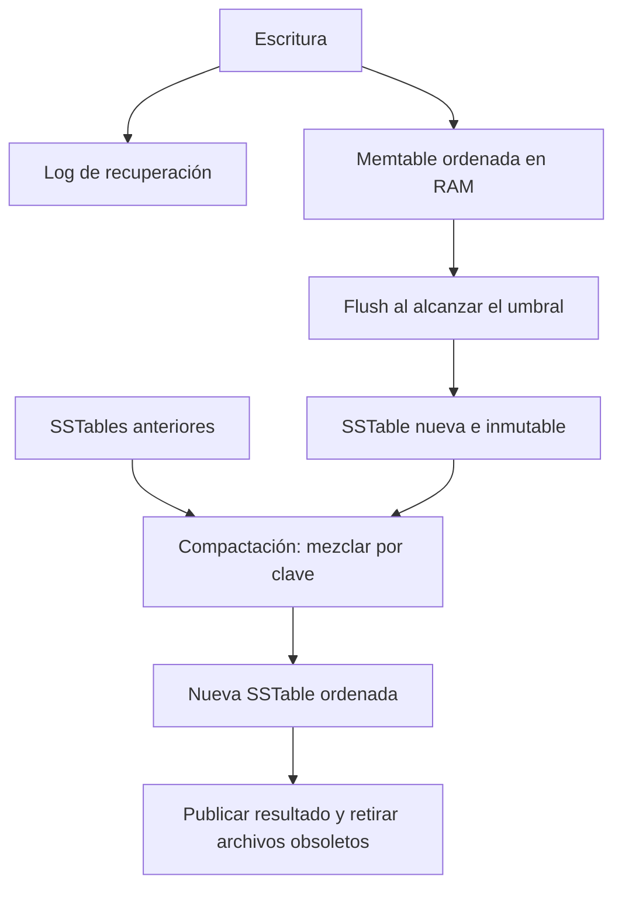
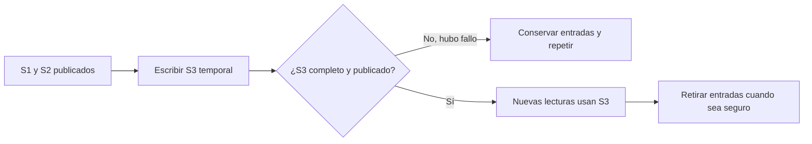
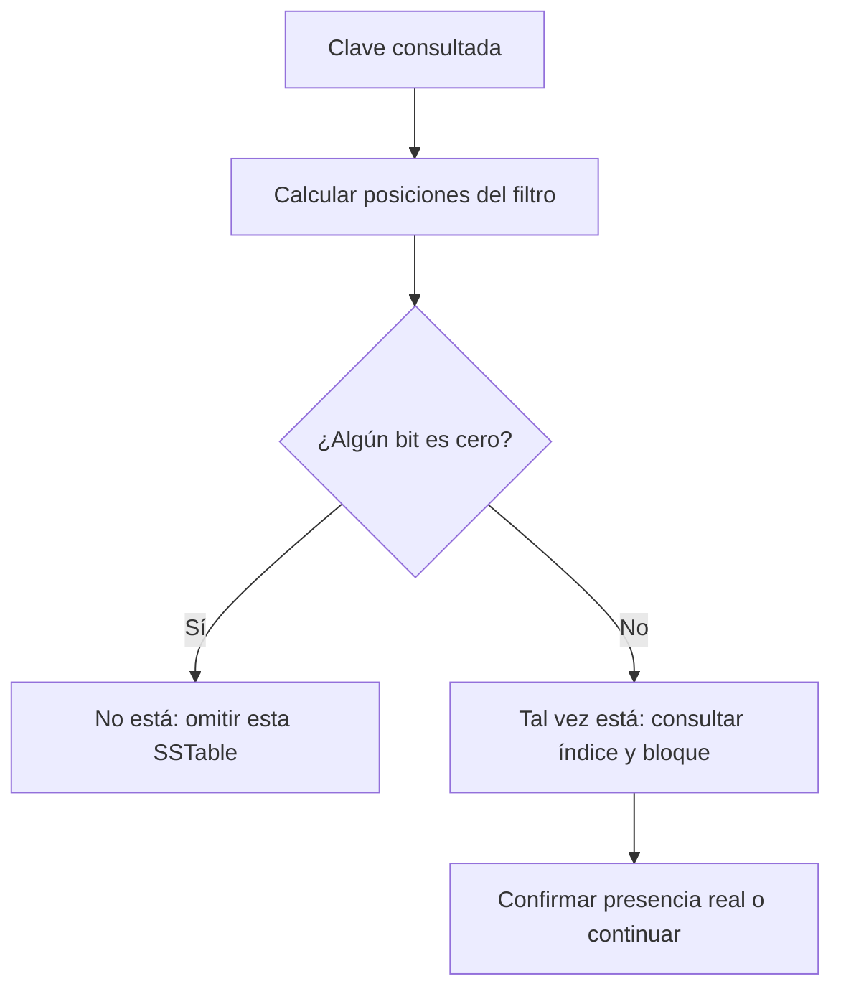

# DDIA — LSM, SSTables, compactación y filtros de Bloom

[[Obsidian/lecturas/Designing Data-Intensive Applications 2a edición/00 Empieza aquí|Inicio del libro]] → [[Obsidian/lecturas/Designing Data-Intensive Applications 2a edición/04 Almacenamiento y recuperación/00 Índice|Almacenamiento y recuperación]]

El log con mapa hash de la nota anterior acelera una clave exacta, pero el mapa puede crecer hasta agotar la RAM, el archivo acumula versiones y los rangos siguen siendo incómodos. Ordenar por clave permite índices dispersos y recorridos de rango; el problema nuevo es conservar ese orden sin reescribir todo en cada cambio.

> [!info] Recuerda antes
> - Un **log append-only** abarata la escritura porque añade al final, pero no impide que las versiones obsoletas consuman espacio.
> - Un **índice disperso** solo guarda puntos de referencia; funciona porque las claves del archivo están ordenadas.
> - La **RAM es volátil**. Una memtable necesita un registro durable que permita reconstruir los cambios confirmados después de una caída.

## La dificultad: mantener orden sin reescribir por cada cambio

Una **SSTable** es un archivo de pares clave-valor ordenados por clave. En el modelo simplificado del capítulo contiene una entrada por clave. Ordenar permite saltar al bloque correcto mediante un **índice disperso**: se conserva, por ejemplo, la primera clave de cada bloque y su posición. No hace falta que todas las claves del archivo residan en RAM.

Si un bloque empieza en `cliente 100` y el siguiente en `cliente 200`, la clave 153, de existir, está en el primero. Se lee ese pequeño bloque y se busca dentro. Los bloques también se pueden comprimir. El ahorro de bytes reduce I/O, a cambio de trabajo de CPU.

El problema aparece al insertar 153: añadirlo al final rompería el orden. Reescribir un archivo grande por cada inserción sería caro. Un motor **LSM** acumula cambios y los transforma en archivos ordenados por lotes.

## Sigue una escritura completa

1. El motor registra el cambio en un log de recuperación para poder reconstruir la parte reciente tras un fallo. La garantía de persistencia depende de cuándo sincroniza ese log y cuándo confirma la escritura.
2. Incorpora el cambio a una estructura ordenada en RAM, la **memtable**.
3. Cuando alcanza un umbral, congela esa memtable y la vuelca como una nueva SSTable. Otra memtable recibe las escrituras siguientes.
4. Un proceso de fondo fusiona SSTables y elimina versiones que ya no necesita conservar: **compactación**.

**La escritura crea dos representaciones con responsabilidades distintas:** el log permite recuperar y la memtable permite consultar en orden. La confirmación durable depende del protocolo del log; el flush crea una SSTable y la compactación combina SSTables ya publicadas.

![[Obsidian/lecturas/Designing Data-Intensive Applications 2a edición/Recursos visuales/09-lsm-taller-ciclo-actualizacion.png|1200]]

**El taller representa el ciclo completo de una actualización.** El diario rojo es el **WAL o log de recuperación**, donde la escritura queda registrada según la garantía de persistencia. La mesa ámbar es la **memtable**, que mantiene cambios recientes ordenados en RAM. Las losas grises son **SSTables inmutables**: un flush produce otra losa y la compactación combina losas existentes sin modificarlas en el sitio. La losa verde es la **salida ya publicada**, disponible para nuevas lecturas antes de retirar entradas antiguas cuando resulte seguro.

**Conclusión memorable:** registrar permite recuperar, ordenar en memoria permite acumular y publicar una losa nueva permite cambiar el estado visible sin reescribir archivos antiguos.

La escena es una analogía causal, no una reproducción de hardware: un motor no emplea trabajadores, diarios ni losas reales. Tampoco fija el orden exacto de sincronización, publicación y retirada; ese protocolo depende de la implementación y de la garantía de durabilidad configurada.

El log se ordena por llegada; la SSTable, por clave. **No son el mismo archivo ni cumplen el mismo propósito.** El log ayuda a recuperarse; la SSTable organiza búsquedas y recorridos.

## Tres estados físicos de la misma clave

![[Obsidian/lecturas/Designing Data-Intensive Applications 2a edición/Recursos visuales/05-lsm-versiones-y-compactacion.png|1000]]

**El valor cambia de representación sin reescribir el archivo antiguo:**

1. El archivo antiguo contiene `P42 → pendiente`. Es una versión persistida e inmutable.
2. La memtable recibe `P42 → enviado`; el archivo antiguo conserva `pendiente`. Una lectura actual debe elegir la versión reciente que resulte visible, aunque el valor viejo todavía ocupe espacio.
3. Después del procesamiento se publica un **archivo nuevo** con `enviado`. El viejo se retira cuando resulta seguro. La ilustración no muestra un archivo antiguo que se reescribe en el mismo sitio.

**Lo que la imagen resume y el motor sí debe hacer:** antes de prometer durabilidad registra y sincroniza el log según la garantía configurada. Congela una memtable, la vuelca mediante flush a una SSTable y luego puede compactar esa SSTable con otras. Publica el conjunto válido y respeta lectores y snapshots antes de retirar archivos. El salto entre los paneles 2 y 3 condensa esas etapas; no significa que compactar consista simplemente en mover la RAM al archivo viejo ni que la memtable sea duradera.

**Para recordarlo:** el valor nuevo puede ganar la lectura mucho antes de que desaparezcan físicamente los bytes del viejo.

## Una lectura y una compactación con números

Supón el siguiente estado, de más reciente a más antiguo:

| Ubicación | Contenido |
|---|---|
| Memtable | B → 9 |
| SSTable nueva | A → 7; C → borrado |
| SSTable antigua | A → 2; B → 4; C → 6 |

Buscar B devuelve 9 desde RAM. Buscar A devuelve 7 desde el segmento nuevo. Buscar C encuentra una **tombstone**, marca de borrado: debe responder «no existe», sin resucitar el 6 antiguo.

Al compactar las dos SSTables, gana A → 7. C desaparece lógicamente; su tombstone solo puede retirarse cuando sea seguro que no quedan versiones antiguas que deban quedar ocultas. El esquema básico del libro lo describe al alcanzar el segmento más antiguo. Sistemas con snapshots, múltiples versiones o réplicas necesitan condiciones adicionales: no asumas que cualquier fusión permite eliminar todas las marcas.

La fusión compara las primeras claves de archivos ya ordenados, copia la menor y avanza. Por eso puede trabajar secuencialmente sin cargar archivos completos en RAM. Los segmentos de entrada siguen sirviendo lecturas hasta publicar el resultado válido. Si hay snapshots que los necesitan, aún no se pueden borrar físicamente.

## Qué ocurre si se corta la luz durante un flush o una fusión

Supón que los archivos publicados son S1 y S2, y el motor está construyendo S3 a partir de ellos. S3 todavía no constituye un reemplazo válido:

1. Mientras S3 se escribe, las consultas siguen usando S1 y S2. La memtable activa recibe nuevos cambios.
2. Al terminar, el motor hace duraderos el resultado y los metadatos necesarios para identificarlo, conforme a su protocolo de publicación.
3. Entonces las nuevas lecturas usan S3. S1 y S2 se retiran solo cuando ninguna lectura o snapshot los necesita.
4. Si el proceso cae antes de publicar S3, no hace falta reparar S1 y S2: eran inmutables. Se puede descartar la salida incompleta y volver a ejecutar la fusión. Tras un flush incompleto, el log conservado permite reconstruir la memtable.

Un **checksum** es un valor de verificación calculado sobre bytes. Al releer un registro del log, el motor comprueba su longitud y checksum para detectar escrituras parciales o daño accidental. No significa que cualquier corrupción pueda ignorarse: una cola sin confirmar e incompleta y un bloque histórico ya confirmado requieren tratamientos distintos según las garantías del sistema. La propiedad útil es poder **reconocer una salida incompleta sin haber destruido la entrada válida**.

**La publicación separa una salida en construcción del estado utilizable:** si S3 queda incompleto, las lecturas conservan S1 y S2; si se publica correctamente, las referencias cambian a S3. Un archivo temporal puede ocupar disco sin formar todavía parte del estado visible.

Los archivos inmutables también encajan con almacenamiento de objetos: producir un objeto completo es más natural que sobrescribir continuamente pequeñas regiones. Aun así necesitas metadatos, coordinación y un lugar apropiado para persistir las escrituras recientes.

## Bloom: una respuesta negativa puede evitar una lectura

Si una clave no existe, revisar todos los segmentos sería muy caro. Un filtro de Bloom permite preguntar «¿podría estar en esta SSTable?» antes de abrir sus bloques.

**Ejemplo propio:** un arreglo tiene 8 bits, inicialmente a cero. Insertar A activa las posiciones 1 y 4. Insertar B activa 4 y 6. Quedan activadas `{1,4,6}`.

- Consultar C produce posiciones `{2,6}`. El bit 2 está a cero: **seguro que C no se insertó**.
- Consultar D produce `{1,6}`. Ambos están a uno, pero pudieron activarlos A y B: **D puede estar o no**. Hay que verificar el archivo.

**Un cero descarta; todos unos solo producen un candidato:** la primera condición permite omitir la SSTable, mientras la segunda obliga a consultar el índice y el bloque. El archivo, no el filtro, confirma la presencia real.

Un falso positivo añade trabajo; no inventa un registro porque se verifica. El Bloom clásico, construido correctamente y sin borrar bits arbitrariamente, no produce falsos negativos para las claves insertadas. Borrar el bit compartido 4 para «eliminar A» dañaría la información de B.

No confundas «1 % de falsos positivos» con «1 % de resultados incorrectos» ni con probabilidad universal de presencia después de un positivo. Son conceptos distintos. El filtro no responde consultas por rango de manera directa: sus hashes descartan el orden.

### Cuánto cuesta el filtro y qué compra ese espacio

El capítulo da una aproximación útil: alrededor de **10 bits por clave** puede conseguir una tasa de falsos positivos cercana al 1 %, con un número de hashes apropiado. Un millón de claves necesita entonces unos 10 millones de bits, aproximadamente 1,25 MB decimales, para ese filtro; no para guardar los valores. Más bits por clave reducen colisiones, pero consumen memoria o espacio de metadatos. El resultado real depende de parámetros e implementación.

Imagina 100 SSTables que no contienen la clave solicitada. Sin filtro podrías consultar 100 índices y sus bloques candidatos. Con un 1 % de falsos positivos, esperarías aproximadamente una comprobación innecesaria de archivo entre esas 100 pruebas, además del costo de consultar los filtros. Es un valor esperado, no una garantía por consulta. Si la clave existe en el primer archivo, el ahorro potencial es mucho menor.

### Los rangos no se resuelven con un Bloom clásico

Para pedir `B ≤ clave ≤ F`, abres iteradores de los segmentos que se solapan con ese rango y avanzas por sus claves ordenadas. Al encontrar la misma clave en varios segmentos eliges la versión visible más reciente; una tombstone puede ocultar versiones viejas. Es una fusión de resultados durante la lectura, parecida a la fusión de archivos durante compactación. No puedes preguntar al Bloom por todas las claves posibles entre B y F: el espacio de posibilidades puede ser enorme. Por eso una LSM puede ser excelente en consultas puntuales y necesitar más trabajo para rangos amplios.

## Dos políticas de compactación

| Política | Intuición | Intercambio principal |
|---|---|---|
| Por tamaños, *size-tiered* | Fusionar grupos de segmentos de tamaño parecido | Favorece grandes escrituras secuenciales; puede mantener más versiones y necesitar mucho espacio temporal |
| Por niveles, *leveled* | Organizar niveles crecientes y rangos no solapados dentro de los niveles estables | Acota mejor los candidatos de lectura y el espacio, pagando trabajo de reorganización |

En leveled, el nivel inicial puede contener archivos con rangos solapados. «No solapados» no significa que un rango no pueda aparecer en distintos niveles.

**Recorrido de una compactación por tamaños:** se acumulan cuatro archivos de unos 100 MB; al fusionarlos se eliminan versiones antiguas y sale uno de 350 MB. Mientras se construye, los 400 MB originales y los 350 MB de salida pueden coexistir. El tamaño final bajo no elimina el pico temporal de espacio.

**Recorrido por niveles:** L1 contiene `[A–M]` y `[N–Z]`. Un archivo nuevo con `[H–P]` se cruza con ambos: el motor mezcla las porciones necesarias y produce archivos de salida cuyos rangos vuelven a organizarse sin solapamiento dentro del nivel estable. Una consulta por J solo necesita el candidato `[A–M]` de ese nivel, aunque todavía pueda existir una versión de J en otro nivel. El ahorro de candidatos de lectura se paga reescribiendo datos durante esas fusiones.

Si llegan cambios más rápido de lo que flush y compactación procesan, se acumula trabajo. El motor puede frenar escrituras para recuperarse. **Matiz verificado:** la documentación de RocksDB describe *write stalls*, desaceleración o detención de escrituras; no conviene generalizar que todas las lecturas se suspenden. [RocksDB: Write Stalls](https://github.com/facebook/rocksdb/wiki/Write-Stalls).

> [!tip] Para recordar
> **M-L-S-C:** memoria para acumular, log para recuperar, SSTable para buscar, compactación para reconciliar. **Bloom dice “no” con certeza; “sí” requiere comprobar.**

> [!question]- ¿Compactación significa comprimir bytes?
> No. Compactación fusiona segmentos y elimina versiones obsoletas. Compresión representa información con menos bytes. Una compactación puede además comprimir su salida.

> [!question]- ¿Por qué una prueba sobre una LSM vacía puede engañarte?
> Al principio casi no existe trabajo de compactación. El rendimiento sostenible requiere medir con volumen y tiempo suficientes para que ese trabajo compita por recursos.

**Conexión:** [[Obsidian/lecturas/Designing Data-Intensive Applications 2a edición/04 Almacenamiento y recuperación/03 B-trees WAL y costos de almacenamiento|B-trees y amplificación]] permite comparar qué costo se paga al escribir y al leer.

**Fuente:** [[Obsidian/lecturas/Designing Data-Intensive Applications 2a edición/Materiales/DDIA 2e - Capítulo 4 - escaneo.pdf#page=5|PDF, p. 5; impresa 119]], [[Obsidian/lecturas/Designing Data-Intensive Applications 2a edición/Materiales/DDIA 2e - Capítulo 4 - escaneo.pdf#page=6|PDF, p. 6; impresa 120]], [[Obsidian/lecturas/Designing Data-Intensive Applications 2a edición/Materiales/DDIA 2e - Capítulo 4 - escaneo.pdf#page=7|PDF, p. 7; impresa 121]], [[Obsidian/lecturas/Designing Data-Intensive Applications 2a edición/Materiales/DDIA 2e - Capítulo 4 - escaneo.pdf#page=8|PDF, p. 8; impresa 122]], [[Obsidian/lecturas/Designing Data-Intensive Applications 2a edición/Materiales/DDIA 2e - Capítulo 4 - escaneo.pdf#page=9|PDF, p. 9; impresa 123]], [[Obsidian/lecturas/Designing Data-Intensive Applications 2a edición/Materiales/DDIA 2e - Capítulo 4 - escaneo.pdf#page=10|PDF, p. 10; impresa 124]]. Ejemplos numéricos propios; semántica multiversión mencionada como matiz, no desarrollada en este escaneo.

---

---

**Anterior:** [[Obsidian/lecturas/Designing Data-Intensive Applications 2a edición/04 Almacenamiento y recuperación/01 Del log al índice|Del log al índice]] · **Índice:** [[Obsidian/lecturas/Designing Data-Intensive Applications 2a edición/04 Almacenamiento y recuperación/00 Índice|Ver este bloque]] · **Siguiente:** [[Obsidian/lecturas/Designing Data-Intensive Applications 2a edición/04 Almacenamiento y recuperación/03 B-trees WAL y costos de almacenamiento|B-trees WAL y costos de almacenamiento]]
