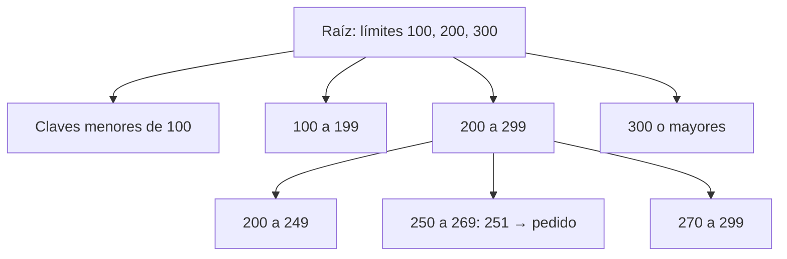
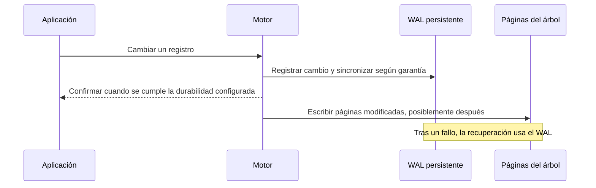

# DDIA — B-trees, WAL y el costo real de almacenar

[[Obsidian/lecturas/Designing Data-Intensive Applications 2a edición/00 Empieza aquí|Inicio del libro]] → [[Obsidian/lecturas/Designing Data-Intensive Applications 2a edición/04 Almacenamiento y recuperación/00 Índice|Almacenamiento y recuperación]]

Una LSM conserva el orden creando archivos nuevos y fusionándolos después. Un B-tree toma la alternativa de mantener una jerarquía de páginas y actualizarla de forma incremental. Esa mutabilidad evita buscar en varios segmentos, pero introduce divisiones de páginas y el riesgo de que una caída deje referencias a medio actualizar.

> [!info] Recuerda antes
> - Una **página** es una unidad de almacenamiento con muchas claves o referencias; no equivale a una fila ni necesariamente a una página flash del SSD.
> - El **orden por clave** permite localizar un punto y después recorrer un rango sin escanear toda la base.
> - Un **log de recuperación** y la estructura consultable cumplen propósitos distintos: el primero reconstruye cambios; la segunda responde lecturas.

## Un árbol diseñado para leer pocas páginas

Un B-tree organiza claves ordenadas en páginas de tamaño fijo. Una página interna contiene límites de rangos y referencias a otras páginas. Una hoja contiene valores o referencias a los registros. El capítulo usa “B-tree” de forma amplia e incluye el comportamiento habitual de B+ trees.

No imagines un árbol binario con solo dos hijos. Una página puede apuntar a cientos de hijos: gran **factor de ramificación** significa poca profundidad incluso con muchos registros. La complejidad conceptual de búsqueda es logarítmica; las lecturas físicas efectivas dependen de qué páginas estén ya en caché.



**Cada nivel reduce el intervalo posible:** 251 conduce primero a 200–299 y después a 250–269; las demás ramas se descartan. Los números son fronteras didácticas, no un inventario completo de páginas reales.

Para 251: eliges el intervalo 200–299 y después 250–269. No examinas todas las claves anteriores. Para un rango, localizas el inicio y recorres hojas en orden; algunas implementaciones enlazan hojas vecinas para facilitarlo.

## Insertar puede hacer crecer el árbol

Supón una hoja con capacidad didáctica de cuatro claves: `[10,20,30,40]`. Insertar 25 no cabe. Se divide en dos hojas, por ejemplo `[10,20]` y `[25,30,40]`, y el padre incorpora una nueva frontera. Si el padre también está lleno, la división puede propagarse. Si se divide la raíz, aparece una nueva raíz y crece la altura.

Este ejemplo muestra la mecánica; los mínimos de ocupación, distribución y casos especiales dependen de la variante. La propiedad importante es que las hojas permanezcan al mismo nivel, evitando caminos arbitrariamente largos.

## WAL: escribir primero la posibilidad de recuperarse

Dividir una página modifica varias piezas. Un fallo después de escribir una hoja pero antes de actualizar el padre puede dejar una estructura inconsistente. El **write-ahead log** registra los cambios necesarios antes de persistir las páginas afectadas.



**La confirmación puede preceder a la escritura final de las páginas:** si el WAL ya satisface la durabilidad prometida, el motor puede agrupar esa escritura posterior. Tras una caída, recupera desde el WAL en lugar de depender de que la RAM haya sobrevivido.

El diagrama resume la lógica de durabilidad, no todos los pasos de un protocolo transaccional. El orden exacto de memoria, commit, checkpoints y escritura varía por motor. El principio es que **el registro de recuperación debe ser duradero antes de depender de páginas que todavía pueden no estarlo**.

Otra variante es *copy-on-write*: escribir una página modificada en una ubicación nueva y crear el camino de padres que la referencia. No todos los B-trees sobrescriben páginas de la misma manera ni usan idéntico WAL.

## Cuatro optimizaciones y la razón de cada una

**Separadores abreviados.** Una página interna necesita distinguir rangos, no almacenar otra copia completa de todos los registros. Si los hijos contienen claves textuales y basta un prefijo para separar dos grupos, un separador más corto deja sitio para más referencias. Más hijos por página significa menos niveles. La abreviación debe conservar comparaciones correctas: cortar letras al azar rompería la navegación.

**Hojas cercanas y enlaces laterales.** Para leer las claves 200–400, primero localizas 200 y después recorres hojas. Un enlace al vecino evita volver continuamente al padre; disponer hojas próximas físicamente puede reducir saltos de almacenamiento. Son dos optimizaciones diferentes: un enlace lógico no garantiza cercanía física, y mantener esa cercanía se complica cuando el árbol se divide y crece.

**Copy-on-write.** Imagina raíz R → hoja H. Para modificar H se escribe H2 y después una nueva raíz R2 que la referencia. Antes de publicar R2, R sigue describiendo la versión anterior. Así se pueden conservar versiones sin sobrescribir H, pero se escriben páginas adicionales del camino y se necesita un protocolo correcto para publicar y retirar versiones.

**Buffer de páginas.** Si actualizas diez veces un registro cuya página permanece en RAM, el motor puede agrupar la escritura posterior de la página. El WAL mantiene la información necesaria para recuperar cambios confirmados. Por eso “una actualización implica una escritura inmediata de página” es una simplificación: hay que medir el comportamiento amortizado.

### Página partida y borrado

Una **torn page** es una página persistida solo en parte: una mitad podría contener el estado nuevo y otra el viejo tras un fallo. Una página es la unidad lógica del motor; no debes suponer que el dispositivo la actualiza atómicamente solo porque el motor la llama página. Los protocolos de recuperación pueden conservar información adicional, como imágenes de páginas, según el motor.

Eliminar claves también requiere mantener la estructura: una hoja puede quedar poco ocupada y algunas variantes redistribuyen claves con una hermana o fusionan páginas y ajustan separadores del padre. El objetivo es preservar los invariantes de búsqueda y ocupación; el detalle exacto depende de la variante. No basta con borrar cualquier puntero y dejar hijos inaccesibles.

## B-tree frente a LSM: compara la carga completa

![[Obsidian/lecturas/Designing Data-Intensive Applications 2a edición/Recursos visuales/01-btree-y-lsm.png|900]]

*Metáfora visual original: la biblioteca de páginas ayuda a imaginar navegación por rangos; la de archivos ordenados ayuda a imaginar acumulación y compactación. No es un plano literal del disco: un B-tree real puede cachear páginas y una LSM no reordena un archivo ya publicado. Los detalles exactos son los diagramas y pasos de estas notas.*

| Aspecto | B-tree típico | LSM típica |
|---|---|---|
| Búsqueda puntual | Camino corto hasta la hoja | Puede revisar varios segmentos; Bloom ayuda |
| Rango | Recorrer hojas ordenadas | Combinar recorridos ordenados de varios segmentos |
| Escritura | Cambios de páginas y log | Log, memtable, flush y compactación |
| Espacio libre | Puede haber páginas parcialmente ocupadas | Versiones antiguas y espacio temporal de compactación |
| Snapshots | Requieren mecanismo específico | Inmutabilidad ayuda a conservar archivos de una versión |

“LSM para muchas escrituras, B-tree para lecturas” sirve de orientación, **no de resultado de un benchmark**. Importan tamaños de claves y valores, caché, actualizaciones repetidas, almacenamiento, concurrencia y política de compactación.

## Tres amplificaciones que no debes mezclar

**Amplificación de escritura:** bytes físicos escritos divididos por bytes de referencia de la carga. Si la aplicación genera 100 MB y el motor termina escribiendo 400 MB entre log, archivos y reorganizaciones, el factor es 4 bajo esa definición. Hay mediciones que usan operaciones o incluyen otras capas: declara siempre qué se contó.

**Amplificación de lectura:** trabajo extra para obtener el dato lógico. Una lectura de 100 bytes puede implicar cargar y descomprimir un bloque de varios KiB o revisar varios archivos.

**Amplificación de espacio:** almacenamiento ocupado en relación con los datos lógicos vivos. Versiones obsoletas, índices, reservas y archivos temporales influyen. Mejorar un eje puede empeorar otro.

Aunque los SSD no muevan un cabezal, siguen existiendo unidades de borrado y recolección interna. Escrituras pequeñas dispersas pueden causar trabajo adicional. La amplificación del dispositivo y la del motor pertenecen a capas diferentes; no compares números sin saber dónde se midieron.

## Dentro del SSD también se mueve información

La memoria flash se programa por páginas, pero se borra en bloques mayores. Usa este ejemplo de juguete, con cuatro páginas por bloque:

```text
Bloque original: [A vigente] [B obsoleta] [C vigente] [D obsoleta]
Para reutilizarlo:
1. Copiar A y C a otro bloque.
2. Borrar el bloque original completo.
3. Utilizar el espacio borrado para nuevas páginas.
```

**Liberar B y D obliga a conservar A y C antes de borrar el bloque completo:** esas copias son escrituras que la aplicación no solicitó directamente. Esta recolección interna explica por qué “SSD no tiene partes móviles” no equivale a “todas las escrituras cuestan lo mismo”. Agrupar escrituras y eliminaciones puede facilitar que queden bloques enteros liberables. Los tamaños reales, el mapeo del controlador y el comportamiento exacto varían; una página flash tampoco es necesariamente una página del B-tree.

Hay otra reducción posible de trabajo en algunas LSM: **separar claves y valores**. Si una clave de 20 bytes apunta a un valor de 1 MB, mover la referencia durante compactación cuesta menos que copiar repetidamente ese megabyte. A cambio, recuperar el valor requiere seguir la referencia y eventualmente hay que recolectar los valores que dejaron de estar vivos. No desaparece el mantenimiento: cambia de lugar.

## Borrar, liberar y tomar un snapshot son operaciones diferentes

En un archivo de B-tree, una página vacía en medio del archivo puede reutilizarse para nuevas filas sin reducir el tamaño que ve el sistema operativo. **Espacio reutilizable dentro de la base** y **espacio devuelto al sistema** son métricas distintas. En PostgreSQL, el `VACUUM` ordinario facilita principalmente reutilización; `VACUUM FULL` reescribe la tabla y puede devolver más espacio, con costos y bloqueos adicionales. No interpretes que el mantenimiento rutinario mueve todas las páginas para encoger el archivo. [PostgreSQL: recuperación de espacio](https://www.postgresql.org/docs/18/routine-vacuuming.html#VACUUM-FOR-SPACE-RECOVERY).

En una LSM, borrar C escribe una tombstone. Las lecturas dejan de mostrar C cuando corresponde, aunque sus bytes anteriores sigan en segmentos viejos hasta compactar. Un snapshot puede retener esos archivos aún más tiempo. La eliminación lógica, la reclamación física y la eliminación de todas las copias históricas son condiciones diferentes.

Para visualizar un **snapshot**, supón que hoy la versión V1 referencia S1+S2. Guardas esa lista y mantienes vivos esos archivos. Mañana la compactación publica S3 para el estado corriente, pero V1 sigue leyendo S1+S2. No se requiere duplicar inmediatamente sus bytes para conservar esa vista local, aunque sí retenerlos. Una copia de seguridad frente a la pérdida del dispositivo exige además copiar datos y metadatos a un destino que sobreviva a ese fallo.

## Un experimento que enseña más que un eslogan

Usa una carga de prueba representativa: mezcla de lecturas/escrituras, claves calientes, rangos y tamaños de valores. Llena la base hasta un volumen relevante; mide suficiente tiempo para que compactaciones o mantenimiento entren en régimen. Observa rendimiento sostenido, percentiles de latencia, bytes escritos y espacio máximo. Un promedio bajo puede esconder pausas largas.

> [!tip] Para recordar
> **B-tree: bajo por páginas. LSM: busco entre segmentos. WAL: recuerdo antes de persistir el cambio final.**

> [!question]- Si modifico 10 bytes, ¿el disco escribe solo 10 bytes?
> No necesariamente. Puede registrar el cambio en el WAL y escribir páginas, bloques o archivos mayores. De ahí la amplificación.

> [!question]- ¿Tener WAL significa tener una copia de seguridad?
> No. El WAL ayuda a recuperar según el diseño y la retención del sistema. Un backup necesita una estrategia que sobreviva a los fallos que quieres cubrir; un único dispositivo puede perder tanto datos como log.

## Conexiones

- [[Obsidian/pregrado/Documentos/Bases de datos/fundamentos/Transaccion|Transacción]] introduce ACID; aquí ves mecanismos que contribuyen a durabilidad y recuperación. Tener una estructura de índice no demuestra por sí solo aislamiento ni atomicidad completos.
- [[Obsidian/freelance/Data Engineering/SQL/03 Planes estadísticas y particiones|Planes, estadísticas y particiones]] enseña a juzgar trabajo observado en vez de una etiqueta de acceso.

**Fuente:** [[Obsidian/lecturas/Designing Data-Intensive Applications 2a edición/Materiales/DDIA 2e - Capítulo 4 - escaneo.pdf#page=11|PDF, p. 11; impresa 125]], [[Obsidian/lecturas/Designing Data-Intensive Applications 2a edición/Materiales/DDIA 2e - Capítulo 4 - escaneo.pdf#page=12|PDF, p. 12; impresa 126]], [[Obsidian/lecturas/Designing Data-Intensive Applications 2a edición/Materiales/DDIA 2e - Capítulo 4 - escaneo.pdf#page=13|PDF, p. 13; impresa 127]], [[Obsidian/lecturas/Designing Data-Intensive Applications 2a edición/Materiales/DDIA 2e - Capítulo 4 - escaneo.pdf#page=14|PDF, p. 14; impresa 128]], [[Obsidian/lecturas/Designing Data-Intensive Applications 2a edición/Materiales/DDIA 2e - Capítulo 4 - escaneo.pdf#page=15|PDF, p. 15; impresa 129]], [[Obsidian/lecturas/Designing Data-Intensive Applications 2a edición/Materiales/DDIA 2e - Capítulo 4 - escaneo.pdf#page=16|PDF, p. 16; impresa 130]], [[Obsidian/lecturas/Designing Data-Intensive Applications 2a edición/Materiales/DDIA 2e - Capítulo 4 - escaneo.pdf#page=17|PDF, p. 17; impresa 131]], [[Obsidian/lecturas/Designing Data-Intensive Applications 2a edición/Materiales/DDIA 2e - Capítulo 4 - escaneo.pdf#page=18|PDF, p. 18; impresa 132]]. Ejemplos de claves y amplificación propios.

---

---

**Anterior:** [[Obsidian/lecturas/Designing Data-Intensive Applications 2a edición/04 Almacenamiento y recuperación/02 LSM SSTables compactación y Bloom|LSM SSTables compactación y Bloom]] · **Índice:** [[Obsidian/lecturas/Designing Data-Intensive Applications 2a edición/04 Almacenamiento y recuperación/00 Índice|Ver este bloque]] · **Siguiente:** [[Obsidian/lecturas/Designing Data-Intensive Applications 2a edición/04 Almacenamiento y recuperación/04 Índices secundarios cobertura y memoria|Índices secundarios cobertura y memoria]]
