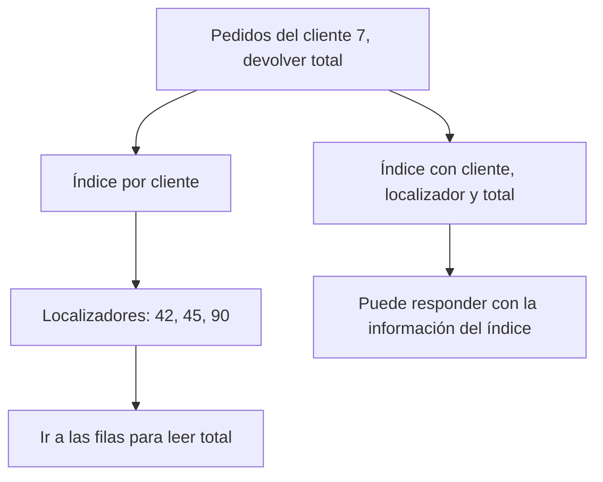

# DDIA — Índices secundarios, cobertura y bases en memoria

[[Obsidian/lecturas/Designing Data-Intensive Applications 2a edición/00 Empieza aquí|Inicio del libro]] → [[Obsidian/lecturas/Designing Data-Intensive Applications 2a edición/04 Almacenamiento y recuperación/00 Índice|Almacenamiento y recuperación]]

## La clave primaria no es la única pregunta

La fila `pedido_id=42, cliente_id=7, total=30` tiene identidad 42, pero muchas consultas preguntan por cliente 7. Un **índice secundario** organiza otra ruta de acceso. Los valores indexados pueden repetirse: un cliente tiene muchos pedidos.

Podemos representarlo conceptualmente como `cliente 7 → [42,45,90]`, o como entradas ordenadas únicas `(7,42)`, `(7,45)`, `(7,90)`. Ambas formas distinguen pedidos que comparten cliente. B-trees y LSM pueden implementar índices secundarios: “secundario” describe su función, no una estructura física única.

## Encontrar y recuperar son trabajos diferentes



**Cómo leer el diagrama:** compara los dos caminos que salen de la misma consulta. El primero localiza IDs y luego busca importes en las filas; el segundo ya tiene el importe en el índice. Cubrir esta consulta puede ahorrar el paso intermedio, pagando espacio y mantenimiento.

En el primer camino encontraste los pedidos, pero todavía necesitas sus importes. En el segundo, el índice conserva los campos necesarios para esta consulta: **la cubre**.

| Organización | Dónde están los datos |
|---|---|
| Índice clustered | La estructura del índice incorpora las filas, normalmente en sus hojas |
| Índice que apunta a heap | La entrada localiza una fila en una zona sin ese orden de índice |
| Índice que apunta a clave primaria | Primero obtiene la clave y luego busca la fila por ella |
| Índice con columnas incluidas | Guarda datos adicionales para evitar algunos accesos a la fila |

Un heap de base de datos no es el heap de memoria de un programa ni la estructura de cola de prioridad. El nombre aquí describe una organización de filas sin el orden del índice.

Una clave primaria es una restricción lógica de identidad. No es universalmente sinónimo de clustered. La elección concreta depende del motor; evita trasladar reglas de uno a otro.

## Cobertura con un caso concreto

```sql
-- Ejemplo en SQL Server, no sintaxis universal.
CREATE INDEX ix_pedidos_cliente
ON pedidos(cliente_id) INCLUDE (total);

SELECT total
FROM pedidos
WHERE cliente_id = 7;
```

`cliente_id` organiza la búsqueda; `total` aporta información adicional. Incluir total **no lo convierte en la primera clave de orden**. Si ahora pides además `direccion_entrega`, la consulta puede dejar de estar cubierta por este índice.

Cobertura es una relación entre un índice y una consulta, no un sello de calidad absoluto. Además, algunos motores deben verificar visibilidad transaccional en otras estructuras aunque las columnas estén en el índice. El plan real determina qué acceso ocurrió.

Actualizar total ahora implica mantener su copia adicional. Si pides casi todos los pedidos, miles de búsquedas individuales pueden costar más que un recorrido amplio. Una estructura útil no obliga al optimizador a escogerla.

## Cuando una fila crece y ya no cabe

Supón que el índice por cliente apunta a la dirección física H10. Allí una fila de 80 bytes recibe una dirección de entrega más larga y necesita 200 bytes. En un modelo de heap simple, si el espacio reservado no basta, el motor puede trasladarla a H90.

Ahora `cliente 7 → H10` quedó desactualizado. Hay dos soluciones conceptuales: cambiar los localizadores que apuntaban a H10 o dejar allí un **puntero de reenvío** hacia H90. La segunda ahorra algunas actualizaciones inmediatas, pero puede añadir un salto a futuras lecturas. Los motores reales también tienen visibilidad transaccional, identificadores intermedios y reglas propias: este ejemplo explica el problema físico, no prescribe cómo actualiza cada producto.

Si el índice guarda una clave primaria estable, por ejemplo 42, el desplazamiento físico puede resolverse al buscar 42 en otra estructura. Ese nivel de indirección evita que cada índice secundario tenga que representar directamente la nueva dirección; a cambio, la lectura puede necesitar otra búsqueda. Es el intercambio entre mantener referencias físicas y seguir referencias lógicas.

## Memoria, persistencia y despliegue son ejes distintos

**Base en memoria** significa que las estructuras principales de acceso viven en RAM. Puede conservar durabilidad mediante un log persistente, snapshots o mecanismos de réplica con garantías definidas. “En memoria” no equivale automáticamente a “se pierde todo”, pero tampoco garantiza supervivencia a cualquier fallo.

**Motor embebido** significa que se usa como una biblioteca dentro del proceso de la aplicación, mediante llamadas de funciones, en vez de un servicio de base de datos al que accedes por red. Puede guardar datos en disco. Estas dos clasificaciones son independientes.

| Pregunta | Eje que estás evaluando |
|---|---|
| ¿Se llama una biblioteca o un servidor por red? | Embebido frente a cliente-servidor |
| ¿Dónde viven las estructuras principales de consulta? | Memoria frente a almacenamiento persistente con caché |
| ¿Qué sobrevive y bajo qué fallos? | Durabilidad y configuración |
| ¿Cómo se localiza una clave? | Estructura de almacenamiento e índice |

Un motor basado en disco con suficiente caché también puede responder sin I/O físico. La ventaja de un diseño en memoria puede incluir evitar representaciones y mantenimiento pensados para páginas de disco, no solo «RAM es rápida».

**Ejemplo propio:** una app mantiene sus preferencias en una base embebida persistente. Un servidor mantiene una caché de sesiones en RAM y acepta reconstruirla. Son decisiones distintas sobre despliegue, dato recuperable y patrón de acceso.

### Reconstruir una base en memoria sin perder el último cambio confirmado

Imagina un snapshot duradero de las 10:00 que registra el estado hasta la operación 500. El log posterior contiene 501, 502 y 503. Al reiniciar:

1. Cargas el snapshot en las estructuras de RAM.
2. Identificas su posición 500 para no volver a aplicar cambios anteriores.
3. Reproduces las operaciones posteriores válidas, respetando las reglas de recuperación.
4. Retomas consultas cuando el estado necesario está disponible.

El snapshot acorta la reproducción; el log cubre el intervalo posterior. Si 503 se confirmó al cliente antes de persistirse y luego se perdió toda RAM que la contenía, el snapshot de las 10:00 no puede inventarla. Por eso la palabra “persistencia” necesita una política de confirmación y un escenario de fallo.

Una base en memoria puede exponer conjuntos o colas de prioridad directamente porque sus estructuras no tienen que adaptarse en cada lectura a páginas persistentes. Si usa un log para durabilidad, sigue escribiendo en almacenamiento: evita parte de la organización de acceso basada en disco, no toda operación de I/O.

### Qué implica elegir un motor embebido

Una app móvil puede llamar a una biblioteca y guardar un archivo local: no tiene que desplegar un servidor de base de datos separado. Pero la aplicación sigue siendo responsable de integrar backups, permisos de archivos y límites de concurrencia según el motor. Un modelo con una base separada por cliente puede funcionar cuando cada cliente cabe en una máquina y no necesita consultas cruzadas; unir información entre clientes deja de ser una operación local sencilla. “Embebido” no determina si internamente hay B-trees, LSM o columnas, ni significa automáticamente “solo sirve para datos pequeños”.

> [!tip] Para recordar
> **Identidad, orden y cobertura:** la clave identifica; el índice organiza; la cobertura evita recuperar columnas en otro lugar. **Embebida dice dónde corre; en memoria dice cómo accede.**

> [!question]- ¿Un índice por cliente con total incluido sirve igual para buscar `total > 1000`?
> No necesariamente. El orden sigue siendo por cliente. Puede ser útil recorrer ese índice por ser estrecho, pero incluir total no crea una búsqueda ordenada por total.

> [!question]- ¿Replicar memoria garantiza que un apagón simultáneo no pierda datos?
> No. Depende de qué réplicas sobrevivieron y qué se persistió antes de confirmar. La garantía debe describir el fallo que cubre.

## Conexión

[[Obsidian/freelance/Data Engineering/SQL/02 Índices y filtros eficientes|Índices y filtros eficientes]] contiene ejemplos de clustered, nonclustered, heap y lookups en SQL Server. Esta lectura explica por qué existen esos pasos y por qué no hay que confundirlos con restricciones lógicas.

**Fuente:** [[Obsidian/lecturas/Designing Data-Intensive Applications 2a edición/Materiales/DDIA 2e - Capítulo 4 - escaneo.pdf#page=11|PDF, p. 11; impresa 125]], [[Obsidian/lecturas/Designing Data-Intensive Applications 2a edición/Materiales/DDIA 2e - Capítulo 4 - escaneo.pdf#page=18|PDF, p. 18; impresa 132]], [[Obsidian/lecturas/Designing Data-Intensive Applications 2a edición/Materiales/DDIA 2e - Capítulo 4 - escaneo.pdf#page=19|PDF, p. 19; impresa 133]], [[Obsidian/lecturas/Designing Data-Intensive Applications 2a edición/Materiales/DDIA 2e - Capítulo 4 - escaneo.pdf#page=20|PDF, p. 20; impresa 134]]. SQL y tabla de ejes elaborados para estas notas.

---

---

**Anterior:** [[Obsidian/lecturas/Designing Data-Intensive Applications 2a edición/04 Almacenamiento y recuperación/03 B-trees WAL y costos de almacenamiento|B-trees WAL y costos de almacenamiento]] · **Índice:** [[Obsidian/lecturas/Designing Data-Intensive Applications 2a edición/04 Almacenamiento y recuperación/00 Índice|Ver este bloque]] · **Siguiente:** [[Obsidian/lecturas/Designing Data-Intensive Applications 2a edición/04 Almacenamiento y recuperación/05 Almacenamiento columnar y compresión|Almacenamiento columnar y compresión]]
