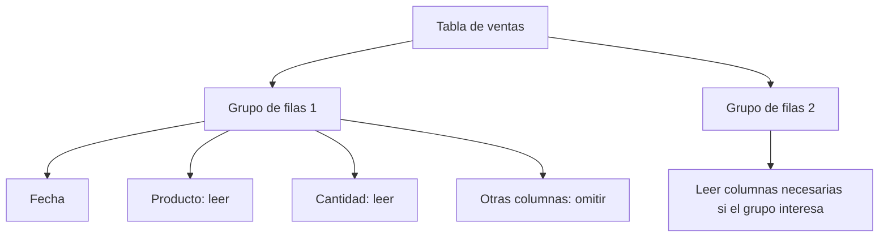

# DDIA — Columnas, bitmaps y compresión: leer menos para analizar más

[[Obsidian/lecturas/Designing Data-Intensive Applications 2a edición/00 Empieza aquí|Inicio del libro]] → [[Obsidian/lecturas/Designing Data-Intensive Applications 2a edición/04 Almacenamiento y recuperación/00 Índice|Almacenamiento y recuperación]]

Los índices anteriores favorecen consultas que recuperan pocos registros. Una consulta analítica puede tocar millones de filas para sumar solo dos o tres atributos; aun con un índice, arrastrar cada fila completa desperdicia ancho de banda. El siguiente cambio no altera la tabla lógica: reorganiza físicamente sus valores por columna.

> [!info] Recuerda antes
> - **OLTP y OLAP** describen formas de trabajo: operaciones pequeñas y frecuentes frente a agregaciones amplias; no son sinónimos de “escribir” y “leer”.
> - El almacenamiento transporta **bloques de bytes**. Ahorrar columnas puede reducir bytes aunque la cantidad de filas siga siendo enorme.
> - Una **tabla lógica** puede conservar las mismas filas y columnas bajo disposiciones físicas diferentes.

## La misma tabla puede tener otra disposición física

Una tabla de ventas tiene `fecha`, `producto`, `tienda`, `cantidad` y muchas columnas adicionales. Para `SUM(cantidad) WHERE producto='café'` interesan producto y cantidad de muchas filas, pero no las direcciones, notas y demás atributos.

Guardar por **filas** acerca los atributos de una misma venta. Guardar por **columnas** acerca valores del mismo atributo para muchas ventas. El segundo patrón permite cargar solo las columnas necesarias y suele comprimirlas bien porque comparten tipo y repeticiones.

```text
Tabla lógica:
Fila 1: lunes, café, 2
Fila 2: lunes, té,   1
Fila 3: martes,café, 4

Por filas:    [lunes,café,2] [lunes,té,1] [martes,café,4]
Por columnas: fecha    [lunes,lunes,martes]
              producto [café,té,café]
              cantidad [2,1,4]
```

No necesitas materializar una columna de billones de filas de una sola vez. Los formatos columnares suelen dividir la tabla en grupos o bloques de filas y almacenar columnas separadas dentro de cada grupo.



**La consulta ahorra en dos dimensiones distintas:** primero descarta grupos de filas que no pueden contener coincidencias; dentro de los grupos restantes lee únicamente las columnas necesarias. `fecha` sirve al filtro temporal cuando corresponda, `producto` al filtro de café y `cantidad` a la suma. Omitir las otras columnas conserva la tabla lógica y reduce los bytes necesarios.

Un filtro temporal también puede permitir descartar grupos incompatibles con el intervalo buscado. **Elegir columnas y descartar grupos son dos ahorros diferentes**, y dependen del formato, las estadísticas y el motor.

![[Obsidian/lecturas/Designing Data-Intensive Applications 2a edición/Recursos visuales/03-proyeccion-columnas.png|1000]]

En este modelo sintético, leer 2 de 20 columnas del mismo ancho selecciona una décima parte de los bytes de valores. No es una predicción del tiempo de consulta. El cálculo completo está en [[Obsidian/lecturas/Designing Data-Intensive Applications 2a edición/04 Almacenamiento y recuperación/08 Complemento - Coste de proyectar columnas|el coste de proyectar columnas]].

## De una pregunta de negocio a los bytes que hay que leer

Una **tabla de hechos** registra observaciones o eventos, como una línea de venta: fecha, producto, tienda, cantidad e importe. Una **dimensión** describe el contexto: la tabla de productos asocia un identificador con nombre y categoría; la de fechas asocia un día con año y día de la semana. Una clave foránea enlaza el hecho con ese contexto.

Imagina la pregunta: «¿Cuánto café vendimos en 2026 por día de la semana?». El recorrido lógico puede ser:

1. De la dimensión de producto obtienes los identificadores cuya categoría es café.
2. De la dimensión de fecha obtienes los días de 2026 y su día de la semana.
3. De la tabla grande de ventas necesitas `producto_id`, `fecha_id` y `cantidad`.
4. Seleccionas las filas cuyos identificadores cumplen las condiciones y agrupas las cantidades por día de la semana.
5. Produces siete sumas, aunque la tabla de hechos tenga millones de filas y cien columnas.

El optimizador puede ejecutar esos pasos con otro orden físico. Lo importante es que la pregunta usa muchas filas pero pocas columnas. Una disposición por filas puede leer junto a ellas direcciones, comentarios y otros datos innecesarios. Una disposición columnar puede omitirlos. Un índice de cobertura sobre un motor por filas también puede reducir ese trabajo: el patrón de consulta explica la ventaja potencial, no demuestra que todos los planes columnares ganen siempre.

### También hay documentos anidados dentro de columnas

“Columnar” no obliga a que cada dato original sea una tabla plana. Imagina `pedido={id:42, cliente:{ciudad:"Quito"}, items:[{precio:3},{precio:5}]}`. Un formato puede separar los valores de `cliente.ciudad` y `items.precio`, conservando información que permita saber qué precios pertenecen a cada pedido y si un campo faltaba o era nulo. A esta separación de hojas de una estructura anidada se la suele llamar *shredding* o *striping*.

Parquet conserva esa estructura con niveles de definición y repetición: unos describen qué partes opcionales están presentes y otros dónde se repiten estructuras. No basta juntar todos los precios sin metadatos, porque perderías los límites entre listas y registros. [Parquet: codificación anidada](https://parquet.apache.org/docs/file-format/nestedencoding/).

## El número de posición mantiene unida cada fila

La entrada 3 de fecha, producto y cantidad corresponde a la misma venta. Si ordenas cada columna por separado, podrías asociar la fecha de una compra con el producto de otra y fabricar filas falsas.

Si quieres ordenar por `(fecha, producto)`, determinas una permutación de **filas completas** y la aplicas a todas las columnas. La primera clave de orden domina; la segunda ordena empates de la primera. Esto facilita rangos y puede crear largas repeticiones que comprimen bien.

## Un bitmap es una lista de respuestas sí/no

Considera cuatro ventas:

| Posición | Producto | Tienda | Cantidad |
|---:|---|---|---:|
| 1 | café | norte | 2 |
| 2 | té | norte | 1 |
| 3 | café | sur | 4 |
| 4 | café | norte | 3 |

Para `producto=café`, el bitmap es `1011`. Para `tienda=norte`, es `1101`. La consulta que exige ambas condiciones calcula:

```text
café     1 0 1 1
norte    1 1 0 1
AND      1 0 0 1  → filas 1 y 4 → SUM(cantidad) = 2 + 3 = 5
```

Para «café **o** té» se combina mediante OR. AND y OR resultan eficientes porque manipulan grupos de bits y porque cada posición significa la misma fila en todos los bitmaps.

No todos los almacenes columnares usan exactamente este esquema para cada columna. Es una técnica ilustrativa; distintas distribuciones admiten diferentes codificaciones.

## Repetición, rachas y espacio

La secuencia `000000111100000` puede representarse por rachas: seis ceros, cuatro unos, cinco ceros. Eso es **run-length encoding**, RLE. Para datos con rachas largas puede ocupar menos que guardar cada valor por separado; para datos alternantes puede perder ventaja.

Un bitmap por valor resulta atractivo si las representaciones finales son compactas. Con muchísimos valores únicos, crear bitmaps densos para todos puede costar demasiado. Estructuras como Roaring eligen representaciones según la distribución; no deduzcas que todo conjunto de datos debería codificarse de una sola manera.

**Diferencia esencial con Bloom:** un bitmap de igualdad representa exactamente las posiciones que cumplen una condición; un Bloom combina hashes para descartar pertenencia con posibles falsos positivos. Ambos usan bits, pero responden preguntas diferentes.

### Ordenar mejora unas rachas más que otras

Supón filas `(día, producto)` con este orden: `(lunes,café)`, `(lunes,café)`, `(lunes,té)`, `(martes,café)`, `(martes,té)`. La columna día tiene una racha de tres lunes y otra de dos martes. Producto se agrupa dentro de cada día, pero café vuelve a empezar al cambiar de día. Por eso la primera clave suele producir rachas más largas que las posteriores. Una columna ajena al orden, como un importe variable, puede no ganar mucho.

**Tres técnicas distintas que pueden colaborar:** un diccionario asigna códigos cortos a valores repetidos (`café → 0`, `té → 1`); RLE guarda valor y longitud de racha (`lunes × 3`); un bitmap guarda en qué posiciones aparece un valor. Ninguna es “la compresión columnar” universal. El motor escoge según tipos y distribución. El ancho del código, las longitudes de racha y el costo de decodificar determinan si se ahorran bytes y CPU.

El mismo razonamiento de conjuntos sirve fuera de ventas. Si A marca personas seguidas por Ana y B marca personas que siguen a Luis, `A AND B` da quienes cumplen ambas relaciones, siempre que la posición del bit represente la misma persona en ambos mapas. No has creado un motor de grafos entero: has reutilizado una operación de intersección.

## Leer bien no hace gratis actualizar una fila

Insertar una fila en medio de una organización ordenada y comprimida puede obligar a reescribir partes importantes. Por eso se agrupan escrituras: una estructura reciente recibe cambios y luego se crean nuevos archivos columnares por lotes. La consulta combina los datos publicados con los cambios visibles según la semántica del motor.

No conviertas esta descripción en la promesa de que cualquier archivo Parquet aislado permite actualizaciones transaccionales. Un archivo es solo una pieza: [[Obsidian/lecturas/Designing Data-Intensive Applications 2a edición/04 Almacenamiento y recuperación/06 Lagos de datos ejecución y vistas materializadas|la capa de tabla y su catálogo]] coordinan qué conjunto de archivos constituye un estado.

> [!warning] “Columnar” y “wide-column” no son sinónimos
> Aquí columnar describe una disposición física orientada a leer columnas. Wide-column o familias de columnas describe otro modelo de organización de datos. Compartir la palabra “columna” no garantiza el mismo patrón de lectura analítica.

> [!tip] Para recordar
> **Columnas para elegir, bloques para omitir, compresión para transportar menos.** Para reconstruir una fila, conserva la misma posición en cada columna.

> [!question]- Si una consulta necesita todas las columnas de una sola fila, ¿lo columnar siempre gana?
> No. El ahorro de columnas desaparece y puede ser necesario consultar varias estructuras. Debes mirar el patrón completo de acceso.

> [!question]- ¿Qué ocurre si ordenas producto y cantidad independientemente?
> Se pierde la correspondencia por posición y se alteran las ventas reconstruidas. Debes aplicar la misma permutación de filas a todas las columnas.

## Conexiones

- [[Obsidian/freelance/Data Engineering/Spark/09 Parquet y Delta Lake|Parquet y Delta Lake]] distingue el formato columnar del estado transaccional de una tabla.
- [[Obsidian/freelance/Data Engineering/SQL/03 Planes estadísticas y particiones|Planes, estadísticas y particiones]] conecta la eliminación de segmentos con el objetivo de leer menos datos.

**Fuente:** [[Obsidian/lecturas/Designing Data-Intensive Applications 2a edición/Materiales/DDIA 2e - Capítulo 4 - escaneo.pdf#page=22|PDF, p. 22; impresa 136]], [[Obsidian/lecturas/Designing Data-Intensive Applications 2a edición/Materiales/DDIA 2e - Capítulo 4 - escaneo.pdf#page=23|PDF, p. 23; impresa 137]], [[Obsidian/lecturas/Designing Data-Intensive Applications 2a edición/Materiales/DDIA 2e - Capítulo 4 - escaneo.pdf#page=24|PDF, p. 24; impresa 138]], [[Obsidian/lecturas/Designing Data-Intensive Applications 2a edición/Materiales/DDIA 2e - Capítulo 4 - escaneo.pdf#page=25|PDF, p. 25; impresa 139]], [[Obsidian/lecturas/Designing Data-Intensive Applications 2a edición/Materiales/DDIA 2e - Capítulo 4 - escaneo.pdf#page=26|PDF, p. 26; impresa 140–141]]. Datos de café y cálculos propios.

---

---

**Anterior:** [[Obsidian/lecturas/Designing Data-Intensive Applications 2a edición/04 Almacenamiento y recuperación/04 Índices secundarios cobertura y memoria|Índices secundarios cobertura y memoria]] · **Índice:** [[Obsidian/lecturas/Designing Data-Intensive Applications 2a edición/04 Almacenamiento y recuperación/00 Índice|Ver este bloque]] · **Siguiente:** [[Obsidian/lecturas/Designing Data-Intensive Applications 2a edición/04 Almacenamiento y recuperación/06 Lagos de datos ejecución y vistas materializadas|Lagos de datos ejecución y vistas materializadas]]
