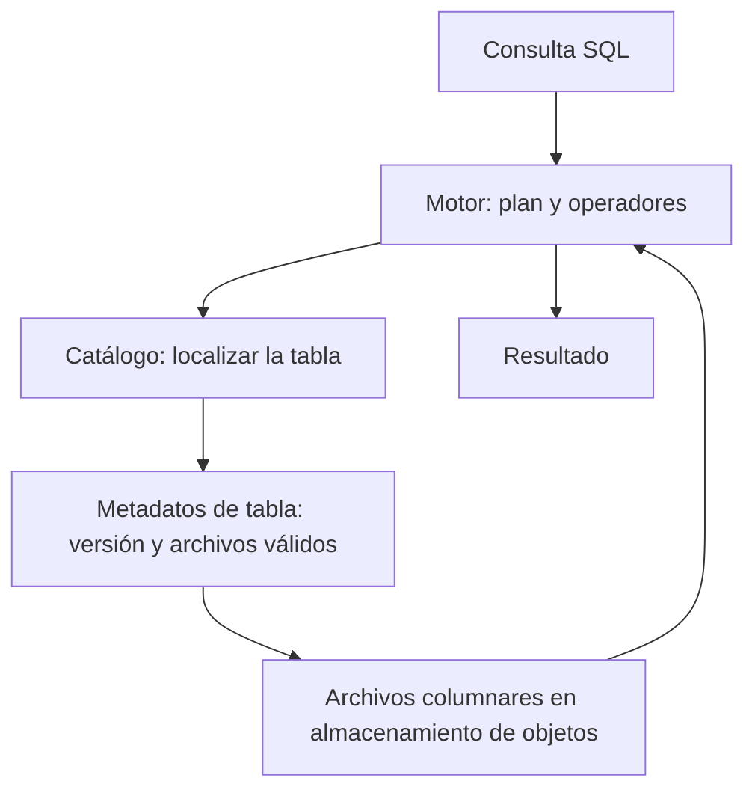
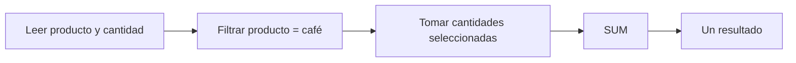

# DDIA — Lagos de datos, ejecución y vistas materializadas

[[Obsidian/lecturas/Designing Data-Intensive Applications 2a edición/00 Empieza aquí|Inicio del libro]] → [[Obsidian/lecturas/Designing Data-Intensive Applications 2a edición/04 Almacenamiento y recuperación/00 Índice|Almacenamiento y recuperación]]

## Cuatro capas que suelen confundirse

En una arquitectura analítica desacoplada, diferentes componentes resuelven preguntas distintas. **SQL es la solicitud; no es un diagrama de la infraestructura.**

| Capa | Pregunta | Ejemplo tratado por el capítulo |
|---|---|---|
| Motor de consulta | ¿Cómo interpretar, planificar y ejecutar SQL? | Trino, DataFusion |
| Formato de almacenamiento | ¿Cómo representan los bytes las columnas y valores de un archivo? | Parquet, ORC |
| Formato de tabla | ¿Qué archivos y metadatos forman el estado de una tabla? | Iceberg, Delta |
| Catálogo | ¿Qué tablas existen y cómo encontrarlas? | Servicio de catálogo |

Los ejemplos ilustran responsabilidades del texto; no constituyen una comparación de versiones o una recomendación de compra.

**Cómo leer el diagrama:** sigue SQL → motor → catálogo → metadatos → archivos. Es un recorrido de responsabilidades: el motor puede consultar varias capas y reutilizar cachés. El regreso de archivos a motor representa leer bytes para ejecutar, no mover todo el lago al catálogo.

El catálogo no contiene necesariamente todas las filas. Parquet no decide por sí solo cuál es la versión vigente de una tabla. El motor no necesita ser dueño de todos los archivos para leerlos mediante formatos compatibles.

**Ejemplo propio:** la versión 1 usa archivos A y B. Una corrección publica una versión 2 con A y C. B puede conservarse para una lectura histórica. Leer indiscriminadamente A+B+C mezclaría estados. El formato de tabla y sus metadatos indican qué archivos usar; conservar historia también exige retener los archivos necesarios.

Separar almacenamiento de cómputo permite ajustar recursos con mayor independencia. No significa latencia, movimiento de datos ni coordinación gratuitos.

## Almacén analítico, lago y HTAP: qué problema resuelve cada uno

Un **data warehouse** organiza datos y ejecución para análisis: grandes lecturas, agregaciones y cruces. Un **data lake** puede conservar archivos accesibles a distintas herramientas sobre almacenamiento compartido, a menudo de objetos. Un archivo por sí solo no aporta el catálogo, la coherencia de versiones ni un plan de consulta. Las capas de arriba explican cómo pasar de una colección de archivos a tablas consultables.

El almacenamiento de objetos identifica objetos completos por nombre o clave. Su encaje con archivos inmutables permite que un grupo de máquinas ejecute consultas mientras el volumen almacenado crece por separado. Así puedes añadir capacidad de cómputo para una mañana de informes sin mover todo el historial a discos de cada máquina. Esa separación no elimina el costo de traer bytes por red, las cachés ni la coordinación de tareas.

**HTAP** significa procesamiento transaccional y analítico híbrido. Puede presentarse como un producto con SQL común, pero mantener internamente una organización favorable a transacciones y otra favorable a análisis. Si una venta actualiza la primera y luego llega a la segunda, hay que preguntar cuándo resulta visible al analista. Una interfaz única no demuestra que ambas consultas lean idéntica copia física ni tengan idéntica frescura.

### Seguir una corrección en un lago con tablas

Supón una tabla de ventas con archivos A y B y versión V1. Una corrección afecta a filas de B:

1. Un escritor lee el estado necesario y produce C con la información corregida; en otros diseños puede producir archivos de cambios o borrados.
2. Publica nuevos metadatos V2 que describen el conjunto válido A+C mediante el protocolo del formato de tabla.
3. Una consulta que fijó V1 sigue interpretando A+B si esa versión se conserva; una nueva consulta puede fijar V2.
4. La recolección posterior retira archivos que ya no necesita ninguna versión retenida, respetando las reglas de concurrencia y retención.

**Time travel** consulta una versión anterior; **GC** significa recolección de archivos ya prescindibles. Mantener metadatos históricos sin conservar B no basta para reconstruir V1. El catálogo aporta identidad y descubrimiento de la tabla, además de operaciones como crearla o renombrarla; separar ese servicio permite que otros sistemas consulten sus metadatos sin ejecutar todas las consultas analíticas.

## Un plan es una receta de operaciones

Para sumar ventas de café, el plan puede leer dos columnas, filtrar producto, seleccionar cantidades y sumar. Cada paso es un **operador**. El optimizador escoge una combinación y orden de operadores; la ejecución realiza el trabajo.

**Cómo leer el diagrama:** cada caja transforma la salida de la anterior. Filtrar reduce las filas consideradas; tomar cantidades elige los valores que se suman. El resultado final puede ser una sola cifra aunque la lectura inicial abarque millones de ventas.

Con millones de filas, no basta con minimizar I/O. Interpretar la misma instrucción miles de millones de veces también consume CPU. El capítulo describe dos enfoques:

**Compilación de consultas:** generar código especializado para la consulta y ejecutarlo, a menudo mediante compilación JIT. Se reduce parte del trabajo de interpretar repetidamente qué comparación hacer. La generación y compilación también tienen costo.

**Ejecución vectorizada:** operadores preparados reciben lotes de valores y devuelven lotes o máscaras. En vez de solicitar un valor, entrar a otra función y repetir, se hace trabajo compacto sobre muchos elementos.

Con productos `[café,té,café,café]`, comparar con café devuelve la máscara `[1,0,1,1]`. Esta máscara selecciona las cantidades pertinentes. El lote puede ser de enteros, cadenas codificadas o valores de otro tipo: **“vectorizado” no significa exclusivamente bitmap**.

Ambos enfoques pueden aprovechar memoria contigua, caché, ciclos internos sencillos y paralelismo. SIMD aplica una instrucción a varios datos, pero procesamiento por lotes y SIMD tampoco son sinónimos exactos: un motor vectorizado puede aprovechar SIMD cuando corresponda.

### Recorrido de un lote: el resultado se construye por etapas

Usa productos `[café,té,café,café]`, tiendas `[norte,norte,sur,norte]` y cantidades `[2,1,4,3]`:

| Operador | Entrada | Salida |
|---|---|---|
| Igualdad de producto | producto, café | `1011` |
| Igualdad de tienda | tienda, norte | `1101` |
| AND | las dos máscaras | `1001` |
| Selección | cantidad y `1001` | `[2,3]` |
| SUM | `[2,3]` | `5` |

Cada posición representa la misma fila. El resultado intermedio es una máscara que sirve al operador siguiente; no hace falta fabricar un objeto completo por cada venta. Un plan distribuido podría dividir las filas entre trabajadores, obtener sumas parciales 2 y 3 y combinarlas en 5. El paralelismo añade coordinación y movimiento de resultados; no es una propiedad gratuita del archivo.

**Por qué le gusta esto a la CPU:** leer valores cercanos aprovecha líneas de caché; repetir un bucle sencillo reduce llamadas e interpretación; evitar decisiones impredecibles ayuda al flujo de instrucciones. En ciertos casos un operador actúa sobre datos comprimidos: sumar un valor repetido `3 × 1000 filas` permite calcular 3000 sin expandir mil copias, si no hay filtros u otras condiciones que obliguen a distinguirlas. Es un ejemplo de posibilidad, no la garantía de que toda codificación soporte cualquier cálculo sin decodificación.

Compilar genera instrucciones especializadas para la consulta; vectorizar agrupa el trabajo de operadores preparados. Son estrategias que incluso pueden combinarse. En ambas el objetivo es gastar menos CPU en administrar la ejecución y más en las comparaciones o sumas necesarias.

## Vista virtual y vista materializada

Una **vista virtual** guarda una definición de consulta. Al utilizarla, el motor procesa la consulta correspondiente. Una **vista materializada** conserva el resultado para reutilizarlo.

Si el panel pide el total diario de ventas cada minuto, volver a sumar todo el historial puede repetir trabajo. Una vista materializada guarda esos totales. La ventaja en lectura se paga al actualizarla o refrescarla. Si se refresca de forma diferida, puede mostrar datos anteriores al estado más reciente; hay que definir la frescura necesaria.

### Mantener una vista: recalcular o actualizar el delta

Supón que una vista guarda `lunes → 30`. Llega una venta nueva del lunes por 7. Un refresco completo vuelve a recorrer el detalle y calcula 37; un mantenimiento incremental puede aplicar el delta `+7` al grupo del lunes. Si corriges una venta anterior de 5 a 8, el delta de esa suma es `+3`, no `+8`.

Esto es fácil para una suma, pero no toda consulta permite una actualización tan simple. Si la vista guarda el mínimo y borras precisamente el registro mínimo, quizá necesites buscar el siguiente candidato o conservar más estado. Mantener resultados derivados requiere definir también cómo se manejan correcciones, eliminaciones y fallos: materializar cambia el momento del trabajo, no suprime la necesidad de hacerlo correctamente.

## Un cubo es una familia de resúmenes por dimensiones

Ejemplo propio de ventas ya agregadas:

| Día | Café | Té | Total del día |
|---|---:|---:|---:|
| Lunes | 20 | 10 | 30 |
| Martes | 15 | 5 | 20 |
| Total producto | 35 | 15 | 50 |

Las dimensiones son día y producto. Las celdas guardan una medida, aquí suma de ventas. Para obtener el total por día, agregas sobre producto. Añadir tienda crea otra dimensión aunque no podamos dibujarla tan cómodamente.

El resumen pierde detalle. Si solo guardaste ventas por día y producto, no puedes responder después «¿cuánto vino de tickets superiores a 100?» si no conservaste información que permita discriminar ese umbral.

> [!example] Un detalle matemático que evita errores
> Las sumas se combinan sumando. Los promedios necesitan peso: grupo A con 2 ventas y media 10; grupo B con 8 ventas y media 20. La media global es `(2×10 + 8×20) / 10 = 18`, no `(10+20)/2 = 15`. Para reagrupar promedios, conserva suma y cantidad. Este ejemplo es una ampliación didáctica propia.

> [!tip] Para recordar
> **Archivo guarda bytes; tabla define versiones; catálogo ubica tablas; motor ejecuta.** Materializar es pagar antes para consultar después.

> [!question]- ¿Un cubo siempre puede responder cualquier pregunta sobre las ventas originales?
> No. Solo las que se pueden derivar del detalle y de las medidas conservadas. Agregar información puede destruir distinciones necesarias para otra consulta.

> [!question]- ¿Vectorizar una consulta significa usar embeddings?
> No. Vectorizar aquí es procesar lotes de datos. Un embedding es una representación aprendida utilizada para comparar objetos; ver la siguiente nota.

## Conexiones

- [[Obsidian/freelance/Data Engineering/Spark/09 Parquet y Delta Lake|Parquet y Delta Lake]] desarrolla el ejemplo de archivos vigentes por versión.
- [[Obsidian/freelance/Data Engineering/Spark/07 Centroides distancia y UDF|Centroides, distancia y UDF]] muestra una agregación y posterior unión al detalle: no confundas una fila por grupo con una fila por observación.
- [[Obsidian/freelance/Data Engineering/SQL/03 Planes estadísticas y particiones|Planes, estadísticas y particiones]] ayuda a distinguir receta estimada y trabajo ejecutado.

**Fuente:** [[Obsidian/lecturas/Designing Data-Intensive Applications 2a edición/Materiales/DDIA 2e - Capítulo 4 - escaneo.pdf#page=20|PDF, p. 20; impresa 134]], [[Obsidian/lecturas/Designing Data-Intensive Applications 2a edición/Materiales/DDIA 2e - Capítulo 4 - escaneo.pdf#page=21|PDF, p. 21; impresa 135]], [[Obsidian/lecturas/Designing Data-Intensive Applications 2a edición/Materiales/DDIA 2e - Capítulo 4 - escaneo.pdf#page=22|PDF, p. 22; impresa 136]], [[Obsidian/lecturas/Designing Data-Intensive Applications 2a edición/Materiales/DDIA 2e - Capítulo 4 - escaneo.pdf#page=27|PDF, p. 27; impresa 142–143]], [[Obsidian/lecturas/Designing Data-Intensive Applications 2a edición/Materiales/DDIA 2e - Capítulo 4 - escaneo.pdf#page=28|PDF, p. 28; impresa 144]], [[Obsidian/lecturas/Designing Data-Intensive Applications 2a edición/Materiales/DDIA 2e - Capítulo 4 - escaneo.pdf#page=29|PDF, p. 29; impresa 145]]. El PDF 27 contiene dos páginas; un adhesivo tapa una franja superior de la 143. No se transcribe ni reconstruye esa zona oculta.

---

---

**Anterior:** [[Obsidian/lecturas/Designing Data-Intensive Applications 2a edición/04 Almacenamiento y recuperación/05 Almacenamiento columnar y compresión|Almacenamiento columnar y compresión]] · **Índice:** [[Obsidian/lecturas/Designing Data-Intensive Applications 2a edición/04 Almacenamiento y recuperación/00 Índice|Ver este bloque]] · **Siguiente:** [[Obsidian/lecturas/Designing Data-Intensive Applications 2a edición/04 Almacenamiento y recuperación/07 Índices espaciales texto completo y vectores|Índices espaciales texto completo y vectores]]
