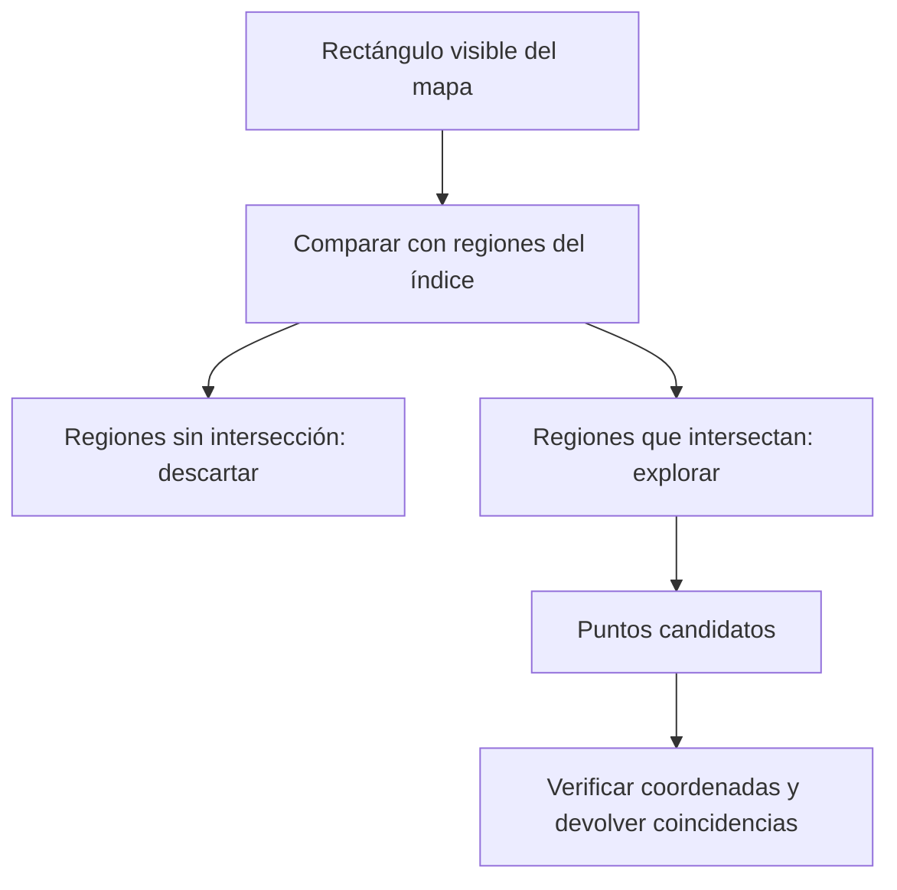
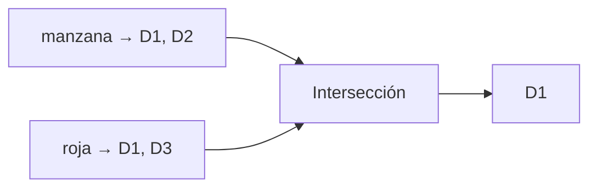
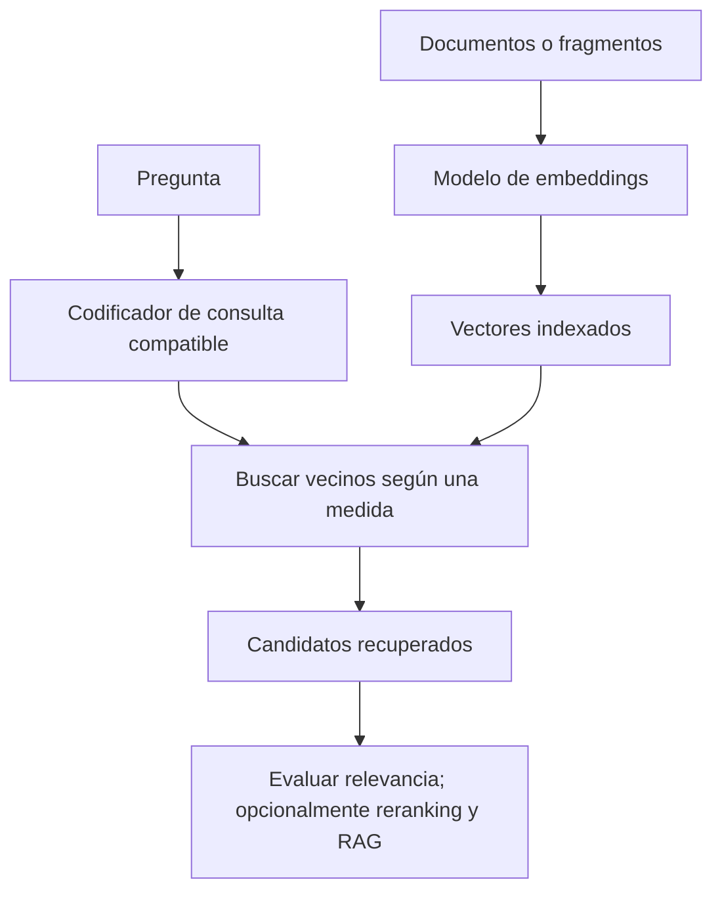
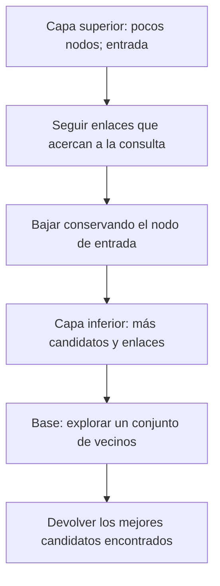

# DDIA — Buscar por espacio, por palabras y por significado

[[Obsidian/lecturas/Designing Data-Intensive Applications 2a edición/00 Empieza aquí|Volver a la ruta de lectura]]

## La estructura depende de qué significa “encontrar”

Buscar un pedido por ID, restaurantes dentro de un mapa, documentos con dos palabras y textos de significado cercano son problemas distintos. Un índice necesita organizar los datos según la relación que la consulta aprovecha: igualdad, orden, proximidad geométrica, pertenencia a términos o similitud de representaciones.

## Un índice compuesto sigue teniendo un orden principal

Ordenar por `(apellido, nombre)` agrupa primero apellidos y después nombres dentro de cada apellido. Encontrar “García” o “García, Ana” corresponde a zonas localizadas. Encontrar todas las personas llamadas Ana puede requerir mirar muchos grupos de apellidos.

Este orden no equivale a un índice que resuelva igual de bien cualquier combinación de dimensiones. **Matiz de implementación:** PostgreSQL documenta casos donde un B-tree multicolumna puede aprovechar columnas posteriores mediante *skip scan*. Por eso “menos adecuado sin filtrar el prefijo” es una regla mejor que “siempre inútil”. [PostgreSQL: índices multicolumna](https://www.postgresql.org/docs/18/indexes-multicolumn.html).

## Un rectángulo necesita dos límites al mismo tiempo

Para buscar restaurantes dentro de la pantalla, exiges latitud y longitud en sus respectivos intervalos. Ordenar por latitud y luego longitud no convierte automáticamente ese rectángulo en un único tramo estrecho: puedes visitar muchas ubicaciones que cumplen latitud pero quedan lejos en longitud.

Los índices espaciales, como R-trees, organizan regiones que permiten descartar grupos que no intersectan la zona consultada. Las regiones candidatas todavía pueden necesitar comprobación exacta. Un índice espacial tampoco calcula por sí solo una distancia de viaje ni convierte grados en metros.

**Cómo leer el diagrama:** una región descartada elimina de golpe muchos puntos; una región intersectada solo genera candidatos. La última comprobación impide confundir una envolvente que toca la consulta con un punto que realmente está dentro.

Las dimensiones pueden ser otras: fecha y temperatura, o tres componentes de color. La utilidad depende de la geometría y de la consulta, no de que los datos sean literalmente geográficos.

### Tres formas de organizar una búsqueda espacial

**R-tree:** cada nodo agrupa objetos bajo un rectángulo envolvente. Si el rectángulo de consulta no toca ese envolvente, descartas todos sus descendientes. Si lo toca, bajas y compruebas. Los envolventes pueden solaparse, así que a veces visitas varias ramas. El agrupamiento reduce candidatos; la comprobación final decide cuáles cumplen exactamente.

**Bkd-tree:** divide recursivamente el espacio en celdas cada vez más pequeñas y reúne puntos en bloques hoja. Una consulta compara su región con las celdas para evitar las alejadas. Es útil pensar en cortes sucesivos, mientras que el R-tree agrupa mediante envolventes que pueden solaparse. [Lucene: principio del block KD-tree](https://lucene.apache.org/core/7_6_0/core/org/apache/lucene/util/bkd/BKDWriter.html).

**Cuadrícula:** asigna a cada punto una celda de cuadrados, triángulos o hexágonos. Primero buscas las celdas que toca la región y después verificas sus puntos. Celdas pequeñas reducen candidatos por celda, pero aumentan cuántas celdas debes manejar; celdas grandes hacen lo contrario. Una región que cruza bordes no pertenece necesariamente a una sola celda.

### Una curva espacial convierte coordenadas en claves ordenables

Otra familia asigna a una ubicación multidimensional una posición en un recorrido del espacio. El índice puede ordenar por esa posición con un B-tree. **Z-order** es un ejemplo: con coordenadas enteras pequeñas, se intercalan bits. Si `x=2=10₂` e `y=1=01₂`, y elegimos el orden `x1,y1,x0,y0`, obtenemos `1001₂=9`.

La intercalación mantiene juntas muchas ubicaciones cercanas, pero no todas. Un rectángulo del plano puede corresponder a varios intervalos del recorrido y requerir filtrar candidatos. La conversión reduce dimensiones de la clave sin hacer desaparecer la geometría de la consulta. Es una ampliación didáctica del recurso a curvas espaciales mencionado por el capítulo. [AWS: Z-order para búsquedas multidimensionales](https://aws.amazon.com/blogs/database/z-order-indexing-for-multifaceted-queries-in-amazon-dynamodb-part-1/).

**Para recordar:** `(latitud,longitud)` ordenado lexicográficamente prioriza una coordenada; un índice espacial busca aprovechar ambas para descartar regiones. Ninguno evita los límites de la distribución de los datos ni el costo de devolver muchísimos resultados.

## Índice invertido: de palabras a documentos

Considera este corpus didáctico:

| Documento | Texto |
|---|---|
| D1 | manzana roja |
| D2 | manzana verde |
| D3 | casa roja |

El índice invertido guarda `manzana → {D1,D2}`, `roja → {D1,D3}` y así sucesivamente. Estas listas se llaman **postings lists**. Para exigir ambas palabras calculas la intersección y obtienes D1.

**Cómo leer el diagrama:** las listas de documentos llegan por separado a la intersección. D2 falla la condición roja y D3 falla manzana; solo D1 aparece en ambas. No se ha comprobado todavía una frase ni su orden.

Un índice básico de presencia no demuestra que las palabras estén contiguas ni en ese orden. Buscar la frase exacta puede requerir posiciones y lógica adicional. Tampoco determina por sí solo la puntuación de relevancia: funciones como BM25 usan información de frecuencia y longitud.

Los términos se extraen con reglas lingüísticas: tokenización, normalización y, según el sistema, otras transformaciones. Indexar n-gramas organiza fragmentos de longitud fija; por ejemplo, los trigramas de `casa` son `cas` y `asa`. Es una vía diferente para buscar subcadenas y tolerar ciertas variaciones, con su propio costo de espacio.

### Del texto al índice: también importa cómo se guarda

En el corpus anterior, si las posiciones D1, D2 y D3 usan el mismo orden, `manzana=110` y `roja=101`; AND produce `100`. Los postings pueden guardarse como listas de IDs o representaciones compactas de conjuntos. El diccionario de términos permite encontrar esas listas. Algunos motores mantienen segmentos ordenados y los fusionan en segundo plano: la lógica de LSM reaparece, aunque ahora los valores sean listas de documentos.

Normalizar palabras y separar texto en términos son decisiones del **analizador**. Tratar `Casa` y `casa` como equivalentes puede ayudar; eliminar diferencias sin cuidado puede alterar significados. No todos los idiomas separan palabras mediante espacios. Recuperar términos primero y evaluar su relevancia después son responsabilidades relacionadas, pero distintas.

### Subcadenas, errores de escritura y significado no son lo mismo

Para localizar `casa` mediante trigramas, consultas `cas` y `asa` y cruzas sus postings. Un documento podría contener ambos fragmentos en lugares diferentes: si necesitas la subcadena exacta, compruebas posiciones o verificas el texto candidato. Un índice de trigramas genera muchos fragmentos y consume espacio; algunas búsquedas de expresiones regulares pueden aprovechar fragmentos obligatorios, pero un patrón sin fragmentos útiles puede ofrecer poco ahorro.

La **distancia de edición de Levenshtein** cuenta el mínimo de inserciones, eliminaciones o sustituciones necesarias para transformar una cadena en otra. `casa → cosa` cuesta una sustitución; `casa → casas` cuesta una inserción. Eso tolera ciertas erratas, pero no convierte `hogar` en sinónimo cercano por significado.

Un **trie** comparte prefijos: las palabras `casa` y `caso` comparten el camino `c→a→s` y se separan al final. Un autómata de búsqueda aproximada lleva cuenta de cuánto del patrón ha coincidido y cuántas ediciones quedan permitidas. Al recorrer el diccionario puede descartar prefijos que ya no conducirían a una palabra admisible, evitando comparar exhaustivamente cada término. Lucene usa autómatas en esta familia de búsquedas; su variante puede incluir transposiciones según configuración. [Lucene: búsqueda fuzzy](https://lucene.apache.org/core/8_8_2/core/org/apache/lucene/search/FuzzyQuery.html).

## Comparación visual: apariciones de palabras y vecinos de una representación

![[Obsidian/lecturas/Designing Data-Intensive Applications 2a edición/Recursos visuales/08-indice-invertido-y-vectorial.png|1100]]

**Cómo leer la izquierda:** empieza por la ficha `coche` y sigue sus flechas a los documentos A y B. El índice invertido ya conserva esa asociación; no necesita abrir todo el corpus para descubrir dónde aparece el término. El análisis lingüístico puede normalizar formas, y un buscador puede añadir sinónimos: la imagen muestra el mecanismo básico, no todas las capacidades posibles de búsqueda léxica.

**Cómo leer la derecha:** empieza por el marcador de consulta. Los documentos se colocan cerca o lejos según una representación numérica. `Reparar coche` y `arreglar automóvil` ilustran una posible proximidad de significado sin igualdad de términos. El mapa de dos dimensiones es una analogía: no es una medición de embeddings reales ni garantiza que cualquier modelo produzca esa geometría.

La izquierda permite recuperar por apariciones de términos; la derecha busca vecinos según una medida sobre vectores. Ambas rutas producen candidatos que todavía deben evaluarse. Un documento parecido puede ser falso, irrelevante o insuficiente. Puedes seguir un ejemplo más pausado en [[Obsidian/lecturas/Designing Data-Intensive Applications 2a edición/02 Atlas visual explicado#4. ¿Buscar una palabra es lo mismo que buscar una idea parecida?|el atlas visual explicado]].

## Embeddings: encontrar una paráfrasis

“Dar de baja la suscripción” y “cancelar mi cuenta” pueden compartir intención sin compartir las palabras importantes. Un modelo de embeddings convierte cada texto en un vector. La consulta se representa en un espacio compatible y se buscan documentos cercanos según una medida.

**Cómo leer el diagrama:** documentos y pregunta deben llegar a representaciones comparables. El índice devuelve candidatos por distancia; evaluar relevancia es un paso posterior. La última caja es opcional y no convierte automáticamente cada candidato en evidencia correcta.

Misma cantidad de componentes no garantiza compatibilidad entre modelos. Las coordenadas tampoco son necesariamente etiquetas humanas como “agricultura” o “economía”. La geometría refleja lo que aprendió el modelo, con sus limitaciones.

Para vectores no nulos, la similitud coseno es:

$$s(q,d)=\frac{q\cdot d}{\|q\|\,\|d\|}.$$

La distancia euclidiana es $\sqrt{\sum_i(q_i-d_i)^2}$. Coseno compara orientación; euclidiana mide separación. Si normalizas ambos a longitud uno, $\|q-d\|^2=2-2s(q,d)$, así que inducen el mismo orden. Sin esa condición no debes tratarlas como intercambiables.

**Ejemplo propio:** consulta $q=(1,0)$, documento $a=(0.9,0.1)$ y documento $b=(0,1)$. Sus distancias euclidianas son aproximadamente 0.141 y 1.414. A es el vecino más cercano en este ejemplo geométrico. No hemos demostrado con ello que A sea una fuente verdadera o suficiente para responder.

## Tres maneras de encontrar vecinos

| Método | Qué trabajo hace | Límite que recordar |
|---|---|---|
| Exhaustivo o flat | Calcula la distancia a todos los vectores candidatos | Exacto respecto a esa representación y medida; el costo crece con cantidad y dimensión |
| IVF | Agrupa vectores alrededor de centroides y explora grupos seleccionados | Puede omitir vecinos de grupos no explorados; más *probes* amplía la búsqueda |
| HNSW | Recorre un grafo de proximidad en capas, desde una navegación gruesa a otra fina | Búsqueda aproximada; construcción, memoria y exploración afectan costos y calidad |

Un centroide representa un grupo; no es necesariamente uno de sus documentos. En HNSW las capas superiores contienen menos nodos y facilitan desplazamientos generales; la base permite explorar vecindades con más detalle. El algoritmo no “comprende” el texto durante cada salto: utiliza la geometría de los vectores.

La documentación oficial de pgvector distingue búsqueda exacta y aproximada, y documenta HNSW e IVFFlat. También indica que aumentar probes en IVFFlat mejora la recuperación a cambio de más trabajo. Estos parámetros se verifican contra la implementación usada, no se transfieren automáticamente entre productos. [pgvector: índices](https://github.com/pgvector/pgvector#indexing).

### IVF: un vecino puede estar al otro lado de una frontera

Considera una dimensión para hacer visible el problema, con centroides C1=0 y C2=10. Cada documento se asigna al centroide más cercano. El documento A=4 queda en C1 y B=5,1 queda en C2. Consulta `q=4,9`:

1. Las distancias de q a los centroides son 4,9 y 5,1; el centroide más cercano es C1.
2. Con un solo *probe* inspeccionas C1 y encuentras A, a distancia 0,9.
3. Pero B, en C2, está a distancia 0,2: es mejor y no lo viste.
4. Con dos *probes* en este ejemplo examinas ambos grupos y recuperas B, pagando más comparaciones.

La partición es una ruta de acceso, no una demostración de que todos los vecinos de una consulta pertenezcan al mismo grupo. En dimensiones altas el dibujo deja de caber en una hoja, pero la posibilidad de perder vecinos por no explorar particiones permanece.

### HNSW: navegación gruesa y exploración fina

Un grafo tiene **nodos** y **aristas**: aquí un nodo representa un vector y una arista permite visitar otro candidato. HNSW mantiene capas; muchos nodos están solo en la base y algunos también aparecen arriba.

**Cómo leerlo:** bajar no cambia el vector de consulta; cambia la resolución del grafo disponible. Arriba haces desplazamientos amplios entre pocos puntos; en la base exploras más alternativas. La última caja dice “encontrados” porque no has medido todas las distancias y el método es aproximado.

Imagina entrar por A, encontrar un enlace a B más cercano, bajar desde B y explorar C, D y E en la base. Mantener varios candidatos puede encontrar rutas útiles que una decisión puramente codiciosa perdería. Explorar más suele mejorar la recuperación a costa de tiempo; mantener más enlaces también cambia construcción y memoria. No se garantiza hallar el vecino global siguiendo una sola cadena siempre hacia el punto inmediatamente más cercano.

### Qué significa “muchas dimensiones” y qué representa el vector

En dos dimensiones puedes dibujar regiones espaciales y descartar zonas alejadas fácilmente. Con cientos o miles, esos métodos de partición pueden perder capacidad para descartar candidatos: demasiadas regiones terminan siendo relevantes. Es una razón para usar índices especializados de vecinos aproximados en vez de trasladar sin cambios un R-tree para mapas.

Un embedding puede representar texto, imagen o audio. Un modelo multimodal compatible puede ubicar una descripción y una imagen relacionadas en un espacio comparable. Eso no significa que cualquier vector de imagen sea comparable con cualquier vector de texto: la compatibilidad debe ser parte del diseño del modelo y su entrenamiento. El índice solo procesa números y distancias; la relación entre esos números y el significado viene de la representación.

## Hay dos errores diferentes

1. **Error de representación:** los vecinos exactos según el embedding no son los documentos útiles para la persona.
2. **Error de aproximación:** el índice no devuelve algún vecino que una búsqueda exhaustiva sí habría encontrado.

Puedes medir `recall@k` del índice comparándolo con los vecinos exactos del mismo conjunto y medida. Por separado, evalúas relevancia con preguntas y documentos esperados. Mejorar ANN no arregla una representación inadecuada.

> [!tip] Para recordar
> **Espacial: regiones. Invertido: términos. Vectorial: vecinos.** Vecino cercano no significa respuesta correcta. “Vectorizado” en ejecución SQL significa procesar lotes; no significa embeddings.

> [!question]- ¿Un buscador exacto de vectores garantiza encontrar una fuente que responda?
> No. Exacto significa encontrar los vecinos según los vectores y la medida. Si la geometría no captura el criterio humano, puede devolver resultados poco útiles.

> [!question]- ¿La intersección de “manzana” y “roja” demuestra la frase “manzana roja”?
> No. Solo presencia de ambos términos si esas son las únicas señales almacenadas. La frase necesita verificar posiciones y orden.

## Conexiones que completan tus notas

- [[Obsidian/posgrado/master/IA GENERATIVA Y AGENTES/08 RAG fragmentación y recuperación/38 S08 - Búsqueda léxica densa y fusión RRF|Búsqueda léxica, densa y RRF]] explica BM25 y fusión. Esta nota abre la caja negra de los índices: postings, IVF y HNSW.
- [[Obsidian/freelance/Data Engineering/Spark/07 Centroides distancia y UDF|Centroides y distancia]] contiene el cálculo de centroides y las precauciones sobre coordenadas y unidades.
- [[Obsidian/lecturas/Designing Data-Intensive Applications 2a edición/04 Almacenamiento y recuperación/05 Almacenamiento columnar y compresión|Bitmaps columnares]] muestra cómo intersecar condiciones con AND, la misma idea de conjuntos usada en postings.

**Fuente:** [[Obsidian/lecturas/Designing Data-Intensive Applications 2a edición/Materiales/DDIA 2e - Capítulo 4 - escaneo.pdf#page=29|PDF, p. 29; impresa 145]], [[Obsidian/lecturas/Designing Data-Intensive Applications 2a edición/Materiales/DDIA 2e - Capítulo 4 - escaneo.pdf#page=30|PDF, p. 30; impresa 146]], [[Obsidian/lecturas/Designing Data-Intensive Applications 2a edición/Materiales/DDIA 2e - Capítulo 4 - escaneo.pdf#page=31|PDF, p. 31; impresa 147]], [[Obsidian/lecturas/Designing Data-Intensive Applications 2a edición/Materiales/DDIA 2e - Capítulo 4 - escaneo.pdf#page=32|PDF, p. 32; impresa 148]], [[Obsidian/lecturas/Designing Data-Intensive Applications 2a edición/Materiales/DDIA 2e - Capítulo 4 - escaneo.pdf#page=33|PDF, p. 33; impresa 149]]. Ejemplos de documentos, coordenadas, ecuación de normalización y separación de errores desarrollados para estas notas. Las precisiones de implementación se contrastaron con la documentación oficial enlazada el 25-09-2026.

---
Anterior: [[Obsidian/lecturas/Designing Data-Intensive Applications 2a edición/04 Almacenamiento y recuperación/06 Lagos de datos ejecución y vistas materializadas|Lagos de datos ejecución y vistas materializadas]]. 
