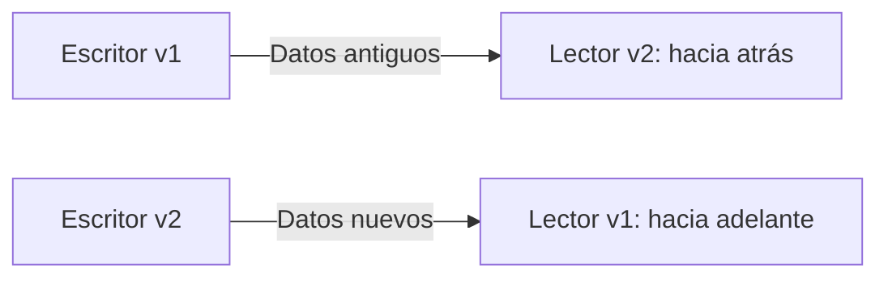
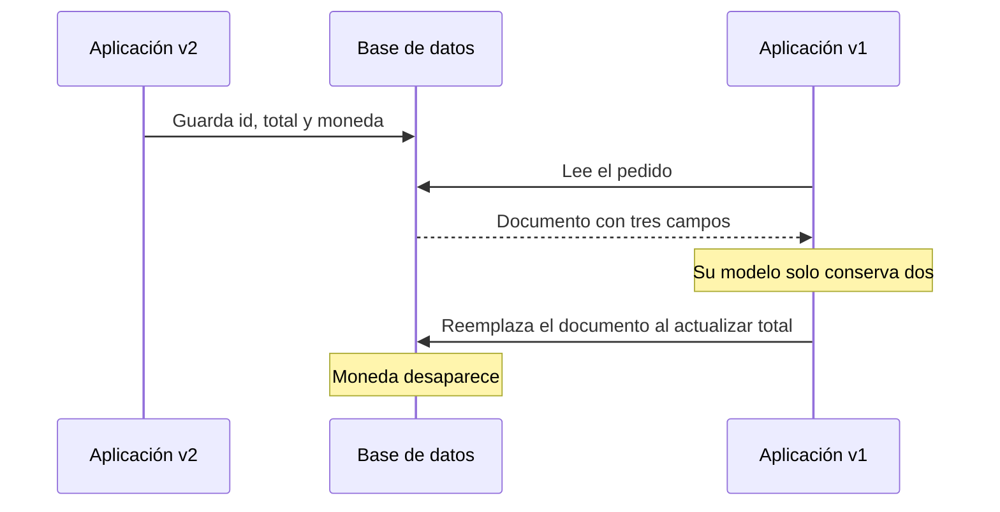

# DDIA — Evolucionar sin romper lectores antiguos

[[Obsidian/lecturas/Designing Data-Intensive Applications 2a edición/00 Empieza aquí|Inicio del libro]] → [[Obsidian/lecturas/Designing Data-Intensive Applications 2a edición/05 Codificación y evolución/00 Índice|Codificación y evolución]]

Una aplicación cambia mucho más rápido que todos los datos y programas que la rodean. Puedes publicar una versión hoy y seguir recibiendo peticiones de una aplicación móvil de hace meses o leyendo registros escritos hace años. **Evolucionar bien significa hacer que esas versiones puedan convivir.** No basta con que la versión nueva funcione cuando está sola.

> [!info] Recuerda antes
> - Los bytes no traen su significado incorporado: un **esquema o contrato** indica campos, tipos y unidades.
> - El **escritor** produce una representación y el **lector** la interpreta; sus versiones pueden ser distintas.
> - Los datos persistidos pueden vivir mucho más que el proceso que los creó, por lo que actualizar código no actualiza automáticamente el historial.

Los ejemplos de pedidos son elaboraciones didácticas. La explicación de esta nota es autosuficiente; no necesitas abrir el PDF para seguirla.

![[Obsidian/lecturas/Designing Data-Intensive Applications 2a edición/Recursos visuales/02-compatibilidad-lectores.png|900]]

## Primero identifica quién escribe y quién lee

Imagina un pedido v1 que contiene `id` y `total_centavos`. La versión v2 incorpora `moneda`. Antes de preguntar si el cambio es compatible, dibuja una flecha desde quien produce los bytes hacia quien los interpreta.

| Dirección de los datos | Compatibilidad necesaria | Pregunta concreta |
|---|---|---|
| Escritor antiguo → lector nuevo | Hacia atrás, *backward* | ¿La aplicación nueva entiende los pedidos históricos? |
| Escritor nuevo → lector antiguo | Hacia adelante, *forward* | ¿La aplicación antigua tolera pedidos que incorporan `moneda`? |



**Las dos direcciones dependen de quién lee a quién:** arriba, código nuevo recupera datos antiguos y necesita compatibilidad hacia atrás; abajo, código antiguo recibe datos nuevos y necesita compatibilidad hacia adelante.

La referencia es la **versión del lector frente a la del escritor**, no el sentido de una migración ni la fecha de despliegue del servidor. En una API hay dos flechas: petición y respuesta. Un cliente antiguo que llama a un servidor nuevo necesita lectura hacia atrás en el servidor para la petición y lectura hacia adelante en el cliente para la respuesta.

## Por qué no se actualiza todo a la vez

Un **despliegue gradual** (*rolling upgrade*) actualiza algunas instancias, observa errores y continúa con las demás. Durante ese intervalo hay v1 y v2 atendiendo tráfico. Si v2 falla, volver a v1 es útil solo si v1 aún puede leer los datos que v2 ya escribió. La reversión del código no revierte automáticamente los datos.

En aplicaciones móviles, la convivencia puede durar meses: publicar una actualización no obliga al usuario a instalarla. En datos históricos puede durar años. Por eso “todos nuestros servidores ya están en v2” no demuestra que todos los lectores estén en v2.

| Combinación | Petición: cliente escribe, servidor lee | Respuesta: servidor escribe, cliente lee |
|---|---|---|
| Cliente v1 → servidor v2 | Lector nuevo sobre datos viejos: atrás | Lector viejo sobre datos nuevos: adelante |
| Cliente v2 → servidor v1 | Lector viejo sobre datos nuevos: adelante | Lector nuevo sobre datos viejos: atrás |

Para usar la tabla, escribe primero las versiones al lado de cada extremo. Después cambia los papeles de escritor y lector para la respuesta. Este pequeño ejercicio evita memorizar “servidor = backward”, que solo es cierto bajo un orden particular de despliegue.

La compatibilidad hacia atrás es más fácil de anticipar porque conoces los formatos anteriores. Para que un programa viejo tolere cambios futuros debes diseñar desde hoy extensibilidad: campos desconocidos que pueda saltar, valores ausentes con significado acordado y límites de lo que puede hacer sin comprender la nueva información.

## Poder leer no equivale a conservar la información

Supón que v2 guarda este documento:

```json
{"id":"P-42","total_centavos":1200,"moneda":"USD"}
```

La instancia v1 lo lee en una clase que solo tiene `id` y `total_centavos`. Aumenta el total a `1500` y reemplaza el documento completo con esos dos campos. La operación termina sin error, pero ha borrado `moneda`.



**La segunda escritura puede destruir información que la primera conservaba:** `moneda` existe tras guardar con v2 y desaparece cuando v1 reconstruye y reemplaza el documento sin campos desconocidos. Ninguna lectura tuvo que fallar para que ocurriera la pérdida.

El escaneo dibuja este problema en [[Obsidian/lecturas/Designing Data-Intensive Applications 2a edición/Materiales/DDIA 2e - Capítulo 5 - escaneo.pdf#page=3|PDF, p. 3; impresa 163]]. Una solución puede ser conservar campos desconocidos; otra, actualizar solo el campo que cambió, si la base de datos y las reglas de concurrencia lo permiten. **Tolerar un campo, preservarlo y comprender su significado son capacidades diferentes.** Incluso conservar `moneda` no hace correcto que v1 cobre suponiendo siempre dólares.

## Compatibilidad estructural y semántica

Cambiar el nombre de una variable local no necesariamente cambia los bytes. En cambio, conservar el tipo `integer` pero pasar de centavos a dólares puede destruir el significado sin que falle ningún parser. Por eso un contrato incluye unidades, obligatoriedad, identificadores y comportamiento, además del esquema.

Una regla útil para revisar un cambio es recorrer cuatro preguntas: ¿se puede decodificar?, ¿se conserva lo desconocido?, ¿se interpreta igual?, ¿la acción resultante sigue siendo válida? Un esquema automático suele comprobar solo parte de ese recorrido.

## Los datos sobreviven al despliegue

La aplicación puede actualizarse en minutos. Las filas viejas no se reescriben por ese hecho. En una base de datos también pueden convivir procesos v1 y v2 durante un despliegue gradual. Necesitas considerar ambas direcciones y el posible regreso a una versión anterior. El libro desarrolla esta diferencia en [[Obsidian/lecturas/Designing Data-Intensive Applications 2a edición/Materiales/DDIA 2e - Capítulo 5 - escaneo.pdf#page=18|PDF, p. 18; impresa 178]] y [[Obsidian/lecturas/Designing Data-Intensive Applications 2a edición/Materiales/DDIA 2e - Capítulo 5 - escaneo.pdf#page=19|PDF, p. 19; impresa 179]].

Como estrategia didáctica de migración, piensa en **ampliar, migrar y retirar**: agrega una representación compatible, actualiza lectores y escritores, transforma datos cuando haga falta y elimina la representación antigua cuando ya no tenga consumidores. La comprobación debe incluir archivos históricos, mensajes pendientes, aplicaciones externas y posibilidades de reversión. Este patrón es una aplicación de la idea del capítulo, no un procedimiento textual del escaneo.

## Un despliegue explicado con una línea de tiempo

Quieres sustituir `nombre_completo` por `nombre` y `apellido`. Separar siempre por el primer espacio no es una migración correcta: nombres compuestos y distintos usos culturales rompen esa regla. Necesitas definir cómo obtener la nueva información, no solo cambiar columnas.

1. **Ampliar:** los lectores nuevos pueden aceptar ambas representaciones; los antiguos siguen recibiendo `nombre_completo`.
2. **Escribir de forma compatible:** mientras haya consumidores viejos, la aplicación mantiene la representación que necesitan y controla qué versión es autoritativa para no divergir.
3. **Migrar con una regla del dominio:** transforma lo que pueda transformarse correctamente; registra casos ambiguos en vez de inventar apellidos.
4. **Verificar consumidores reales:** incluye tareas nocturnas, exportaciones, mensajes retenidos y lectores que se activarían en un rollback.
5. **Retirar:** deja de producir la representación antigua solo cuando ya no la requiere el alcance de compatibilidad acordado.

No siempre necesitas duplicar campos: este ejemplo sirve para cambios de estructura, mientras añadir un dato opcional puede ser mucho más sencillo. La complejidad debe responder al cambio concreto.

## Para recordar y practicar

> [!tip] El lector lleva la brújula
> **Nuevo lee viejo: atrás. Viejo lee nuevo: adelante.** Y leer sin fallar no prueba que una reescritura conserve todo.

> [!question]- Una app v1 recibe un campo nuevo y lo ignora. ¿Está resuelto el problema?
> Solo parte. Hay que comprobar si lo preserva cuando reescribe y si puede seguir tomando decisiones correctas sin conocerlo. Un campo nuevo que modifica la moneda de un pago no es un adorno.

> [!question]- ¿Por qué una base de datos se parece a enviar un mensaje al futuro?
> Un programa codifica hoy un registro y otra versión lo decodifica después. El almacenamiento separa a escritor y lector en el tiempo, igual que una red los separa en el espacio.

## Conexiones

- [[Obsidian/freelance/Data Engineering/Calidad/02 Validación Unicode y contratos|Contratos y validación]] distingue esquema de significado; aquí añadimos la dimensión del tiempo.
- [[Obsidian/freelance/Data Engineering/Testing/02 Regresión y pruebas de datos|Pruebas de regresión y de datos]] permite pensar en una matriz de lectores y escritores, en vez de probar únicamente v2 con v2.
- [[Obsidian/lecturas/Designing Data-Intensive Applications 2a edición/05 Codificación y evolución/02 JSON XML CSV y esquemas|Sigue con formatos y esquemas]]: entenderás qué información viaja en cada representación.

## Referencias opcionales

Estas referencias documentan la procedencia; no son pasos previos para entender la nota.

Referencia opcional del planteamiento: [[Obsidian/lecturas/Designing Data-Intensive Applications 2a edición/Materiales/DDIA 2e - Capítulo 5 - escaneo.pdf#page=1|PDF, p. 1; impresa 161]] y [[Obsidian/lecturas/Designing Data-Intensive Applications 2a edición/Materiales/DDIA 2e - Capítulo 5 - escaneo.pdf#page=2|PDF, p. 2; impresa 162]]; el resumen está en [[Obsidian/lecturas/Designing Data-Intensive Applications 2a edición/Materiales/DDIA 2e - Capítulo 5 - escaneo.pdf#page=31|PDF, p. 31; impresa 191]] y [[Obsidian/lecturas/Designing Data-Intensive Applications 2a edición/Materiales/DDIA 2e - Capítulo 5 - escaneo.pdf#page=32|PDF, p. 32; impresa 192]]. Los ejemplos de pedidos de estas notas son elaboraciones didácticas, no transcripciones del libro.

---

**Anterior:** [[Obsidian/lecturas/Designing Data-Intensive Applications 2a edición/04 Almacenamiento y recuperación/07 Índices espaciales texto completo y vectores|Índices espaciales texto completo y vectores]] · **Índice:** [[Obsidian/lecturas/Designing Data-Intensive Applications 2a edición/05 Codificación y evolución/00 Índice|Ver este bloque]] · **Siguiente:** [[Obsidian/lecturas/Designing Data-Intensive Applications 2a edición/05 Codificación y evolución/02 JSON XML CSV y esquemas|JSON XML CSV y esquemas]]
