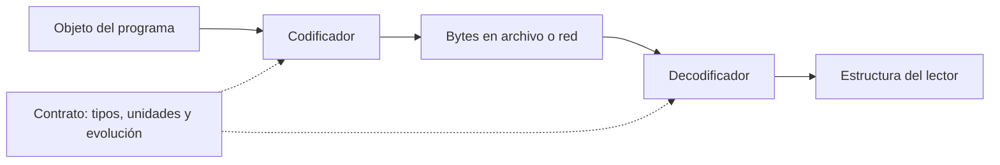

# DDIA — De objetos a bytes: JSON, XML, CSV y sus contratos

[[Obsidian/lecturas/Designing Data-Intensive Applications 2a edición/00 Empieza aquí|Inicio del libro]] → [[Obsidian/lecturas/Designing Data-Intensive Applications 2a edición/05 Codificación y evolución/00 Índice|Codificación y evolución]]

En memoria tienes objetos, referencias, listas y tipos propios del lenguaje. Un archivo o una conexión transporta bytes. **Codificar es acordar cómo se convierte una estructura en bytes y cómo se recupera su significado.** Aquí “serialización” se refiere a esa conversión; no a la serializabilidad de transacciones.

La compatibilidad de la nota anterior exige algo concreto: dos programas deben convertir entre sus estructuras internas y una representación común. Copiar la memoria de un proceso no sirve porque contiene punteros, tipos y detalles del lenguaje que el otro proceso no comparte.

> [!info] Recuerda antes
> - El **escritor** codifica y el **lector** decodifica; un despliegue gradual obliga a considerar combinaciones de versiones.
> - Un **esquema** valida estructura y tipos, pero no demuestra reglas de negocio como la moneda o la unidad correcta.
> - Ser legible por humanos y ser inequívoco para máquinas son propiedades diferentes.



**El contrato interviene en ambos extremos:** el codificador transforma el objeto en bytes y el decodificador construye otra estructura. Las reglas deben ser compatibles aunque los programas usen lenguajes distintos y no compartan memoria.

## Conveniencia inmediata frente a duración del dato

Herramientas como `pickle` pueden guardar estructuras de Python con poco trabajo. Esa comodidad puede acoplar los datos al lenguaje, a sus clases y a versiones concretas. Además, deserializar formatos capaces de reconstruir objetos ejecutables desde datos no confiables puede ejecutar código. Son asuntos del mecanismo de reconstrucción, no una razón para afirmar que todo formato binario es inseguro.

Para un intercambio entre equipos o un archivo de larga vida, pregunta quién deberá leerlo después y con qué herramientas. Un formato de intercambio explícito puede costar más inicialmente y reducir dependencias futuras. El capítulo también menciona formatos diseñados para acceso sin una conversión completa, como FlatBuffers y Cap’n Proto: “codificar” no implica obligatoriamente copiar cada campo en todos los sistemas.

## Un texto legible puede contener ambigüedades

| Formato | Qué organiza bien | Qué debes acordar |
|---|---|---|
| JSON | Objetos, listas, strings, números, booleanos y null | Precisión numérica, campos obligatorios, tipos de negocio |
| XML | Documentos y estructuras con elementos y atributos | Tipos mediante contrato/esquema y convenciones de representación |
| CSV | Filas y columnas | Delimitador, comillas, saltos de línea, tipos, encabezados y nulos |

Que un valor se vea como `0012` no te dice si es un número o un código postal. Convertirlo a entero puede destruir los ceros que forman parte del identificador. Que un valor sea numérico tampoco especifica si representa segundos, milisegundos o dinero.

### Ejemplo: un ID grande que cambia silenciosamente

El número `9007199254740993` no puede representarse exactamente como un `Number` de JavaScript. Si un lector lo redondea, deja de apuntar a la misma entidad. Para un ID que no requiere aritmética puedes acordar una cadena como `"9007199254740993"`. No se trata de que JSON prohíba números grandes: depende de la capacidad del lector. El rango de enteros interoperable con precisión exacta en implementaciones basadas en binary64 llega de `-(2^53)+1` a `(2^53)-1`. [RFC 8259, sección 6](https://www.rfc-editor.org/rfc/rfc8259#section-6).

Para bytes arbitrarios se suele acordar Base64 dentro de un string. En el modelo básico, tres bytes se representan mediante cuatro caracteres: el tamaño aumenta aproximadamente un tercio, más relleno cuando corresponda. Base64 es una codificación, no cifrado ni compresión.

### Qué significa que el formato sea “autocontenido”

En memoria, `pedido.cliente` puede ser una dirección a otro objeto. En otra máquina esa dirección carece de significado. La codificación debe representar el cliente, o un identificador cuya resolución esté acordada. Un formato *zero-copy* permite acceder a parte de los datos directamente en su representación codificada; no significa que desaparezcan la transferencia por red, las comprobaciones de límites ni todo costo de acceso.

Los formatos propios de un lenguaje también pueden registrar nombres de clases y detalles de implementación. Renombrar una clase puede convertirse en un problema para archivos viejos; integrar un lector de otro lenguaje requiere reproducir convenciones que antes eran internas. Además del riesgo al reconstruir objetos, evalúa tiempo de CPU y tamaño: comodidad de uso y eficiencia son propiedades distintas.

### CSV: por qué dividir por comas no es un parser

```csv
id,descripcion,cantidad
P-42,"Cable, adaptador",2
P-43,"Texto con ""comillas""",1
```

La coma de `Cable, adaptador` pertenece al contenido, y las comillas duplicadas representan una comilla literal. Un salto de línea también puede pertenecer a un campo entre comillas. Un parser que haga `linea.split(',')` confundirá contenido con estructura. Incluso con un parser correcto debes acordar si una celda vacía significa cadena vacía, dato ausente o cero, y si una nueva columna se identifica por encabezado o posición. El formato no resuelve esa semántica por ti.

## JSON Schema: admitir un campo no significa exigirlo

Un esquema puede describir estructura y restricciones. Este ejemplo didáctico acepta un pedido con `id` y un puerto opcional:

```json
{
  "$schema": "https://json-schema.org/draft/2020-12/schema",
  "type": "object",
  "properties": {
    "id": {"type": "string"},
    "puerto": {"type": "integer", "minimum": 1, "maximum": 65535}
  },
  "required": ["id"],
  "additionalProperties": false
}
```

Recórrelo: `properties` describe los campos; `required` exige `id`; `minimum` y `maximum` limitan el puerto cuando aparece; `additionalProperties: false` cierra el objeto a campos adicionales. Si mañana el productor añade `moneda`, este lector estricto lo rechazará. Permitir campos adicionales facilita algunas evoluciones, pero no prueba que el programa preserve ni comprenda esos campos. [Referencia oficial de objetos en JSON Schema](https://json-schema.org/understanding-json-schema/reference/object).

Las claves de objetos JSON son siempre strings. Una clave `"12"` puede restringirse mediante una expresión regular para admitir únicamente dígitos, pero no se transforma por eso en un entero. Es la idea del ejemplo del libro en la impresa 167.

### Un mapa con claves restringidas, paso a paso

Este esquema acepta objetos como `{"12":"Ana","87":"Luis"}`:

```json
{
  "type": "object",
  "patternProperties": {"^[0-9]+$": {"type": "string"}},
  "additionalProperties": false
}
```

`^` y `$` exigen que el patrón abarque toda la clave; `[0-9]+` admite uno o más dígitos. Por ello `"12"` sirve y `"usuario12"` no. El valor debe ser string: `{"12":99}` falla. `additionalProperties: false` rechaza las claves que no cumplan el patrón. **Sigue siendo un mapa con claves string**, no un mapa de enteros: `"01"` y `"1"` son claves distintas.

JSON Schema también permite condiciones (`if`/`then`/`else`) y referencias (`$ref`) para reutilizar definiciones. Eso ayuda a expresar “si el envío es internacional, exige país”, pero la compatibilidad ya no se deduce simplemente de contar campos. Un cambio en un esquema referenciado puede modificar varios contratos; los esquemas remotos deben poder resolverse cuando se necesitan. El contrato completo incluye esas dependencias, no solo el archivo principal.

## Binario no significa automáticamente pequeño ni compatible

MessagePack puede representar algunos números y tipos de forma compacta y conservar nombres como `total_centavos`. Protobuf reduce repetición usando números de campo; Avro usa el esquema del escritor para interpretar posiciones. **La pregunta es qué información está en cada registro y cuál está fuera de él.**

En el ejemplo específico del libro, el JSON sin espacios ocupa 81 bytes y MessagePack 66. No es un benchmark universal: el tamaño cambia con datos, nombres, compresión y metadatos incluidos. La legibilidad directa puede valer más que unos bytes en una integración pequeña.

## MessagePack con una lupa: leer cada grupo de bytes

Usemos un ejemplo pequeño y propio, sin tildes para que cada carácter ocupe un byte UTF-8:

```json
{"id":"A","n":150}
```

Su JSON compacto ocupa 18 bytes. Una codificación MessagePack compacta ocupa 10:

```text
82 | A2 69 64 | A1 41 | A1 6E | CC 96
 2 |   "id"  |  "A"  |  "n"  |  150
pares  clave    valor   clave    valor
```

Empieza a la izquierda. `82` declara un mapa de dos pares; `A2` introduce un string de dos bytes (`69 64`, “id”); `A1` introduce uno de un byte (`41`, “A”). El siguiente `A1 6E` representa “n”. `CC` anuncia un entero sin signo de un byte y `96` hexadecimal vale 150. Cada prefijo permite saber cuánto avanzar: no hacen falta comas, comillas ni una marca de cierre para esos strings. Los nombres siguen viajando: MessagePack no sabe que “n” significa cantidad. [Especificación oficial de MessagePack](https://github.com/msgpack/msgpack/blob/master/spec.md).

El ahorro aquí procede de representar estructura y número mediante bytes compactos. No concluyas que todo documento se reducirá igual: un texto largo cambia poco y nombres extensos siguen costando espacio. Otros formatos binarios, como CBOR o BSON, tienen reglas y tipos propios; no son intercambiables byte por byte aunque representen datos parecidos.

### Esquemas: por qué compensan y dónde no bastan

Un esquema compartido puede evitar repetir nombres, documentar estructura, generar código y detectar incompatibilidades antes del despliegue. La idea es anterior a Protobuf: ASN.1 utiliza descripciones y reglas de codificación, y aparece, por ejemplo, en certificados X.509. Tampoco toda codificación binaria es un estándar entre aplicaciones: los controladores de bases de datos traducen sus protocolos específicos a objetos del lenguaje; JDBC y ODBC proporcionan interfaces de acceso, no convierten todos esos protocolos en uno solo.

Protobuf y Avro se concentran en estructura y tipos; JSON Schema y XML Schema pueden expresar más restricciones de validación. Un campo `long` no dice “debe ser mayor que cero” ni “son centavos”. El código generado reduce ciertos errores de tipos, pero la validación del negocio sigue siendo necesaria. Mantener muchas versiones compatibles tiene un costo operativo: conserva las que necesitas y documenta hasta cuándo serán leídas.

> [!tip] Tres capas para recordar
> **Bytes → tipos → significado.** Un parser puede resolver los bytes y los tipos y aun así interpretar mal las unidades.

> [!question]- ¿Definir `puerto` dentro de `properties` lo hace obligatorio?
> No. La obligatoriedad se declara mediante `required`. Si aparece, sí debe satisfacer las restricciones de su esquema.

> [!question]- ¿JSON “sin esquema” elimina el contrato?
> No. El contrato puede quedar implícito en el código del lector. Eso dificulta descubrirlo y evolucionarlo; no hace que deje de existir.

## Conexiones

- [[Obsidian/freelance/Data Engineering/Spark/06 Datos anidados y JSON|Arrays, structs y JSON]] distingue estructura en memoria, representación textual y escritura distribuida.
- [[Obsidian/freelance/Data Engineering/Spark/04 Schemas y DataFrames|Schemas y DataFrames]] muestra que nulabilidad y tipos no validan todas las reglas del negocio.
- [[Obsidian/lecturas/Designing Data-Intensive Applications 2a edición/05 Codificación y evolución/03 Protocol Buffers y números de campo|Protocol Buffers]] y [[Obsidian/lecturas/Designing Data-Intensive Applications 2a edición/05 Codificación y evolución/04 Avro y resolución de esquemas|Avro]] muestran dos maneras de mover información del registro al esquema.

## Referencias opcionales

Estas referencias documentan la procedencia; no son pasos previos para entender la nota.

Fuentes del escaneo: [[Obsidian/lecturas/Designing Data-Intensive Applications 2a edición/Materiales/DDIA 2e - Capítulo 5 - escaneo.pdf#page=3|PDF, p. 3; impresa 163]], [[Obsidian/lecturas/Designing Data-Intensive Applications 2a edición/Materiales/DDIA 2e - Capítulo 5 - escaneo.pdf#page=4|PDF, p. 4; impresa 164]], [[Obsidian/lecturas/Designing Data-Intensive Applications 2a edición/Materiales/DDIA 2e - Capítulo 5 - escaneo.pdf#page=5|PDF, p. 5; impresa 165]], [[Obsidian/lecturas/Designing Data-Intensive Applications 2a edición/Materiales/DDIA 2e - Capítulo 5 - escaneo.pdf#page=6|PDF, p. 6; impresa 166]], [[Obsidian/lecturas/Designing Data-Intensive Applications 2a edición/Materiales/DDIA 2e - Capítulo 5 - escaneo.pdf#page=7|PDF, p. 7; impresa 167]], [[Obsidian/lecturas/Designing Data-Intensive Applications 2a edición/Materiales/DDIA 2e - Capítulo 5 - escaneo.pdf#page=8|PDF, p. 8; impresa 168]] y [[Obsidian/lecturas/Designing Data-Intensive Applications 2a edición/Materiales/DDIA 2e - Capítulo 5 - escaneo.pdf#page=9|PDF, p. 9; impresa 169]].

---

**Anterior:** [[Obsidian/lecturas/Designing Data-Intensive Applications 2a edición/05 Codificación y evolución/01 Evolución y compatibilidad|Evolución y compatibilidad]] · **Índice:** [[Obsidian/lecturas/Designing Data-Intensive Applications 2a edición/05 Codificación y evolución/00 Índice|Ver este bloque]] · **Siguiente:** [[Obsidian/lecturas/Designing Data-Intensive Applications 2a edición/05 Codificación y evolución/03 Protocol Buffers y números de campo|Protocol Buffers y números de campo]]
