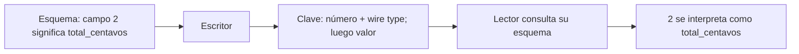

# DDIA — Protocol Buffers: la identidad vive en el número de campo

[[Obsidian/lecturas/Designing Data-Intensive Applications 2a edición/00 Empieza aquí|Volver a la ruta de lectura]]

Protocol Buffers, o Protobuf, define mensajes mediante un esquema y suele generar código para leerlos y escribirlos. En su representación binaria, un campo se identifica por un **número estable**, no por el texto de su nombre. Esa decisión permite ahorrar nombres repetidos y reconocer campos al evolucionar el mensaje.

## Un mensaje y sus identidades

```protobuf
syntax = "proto3";

message Pedido {
  string id = 1;
  int64 total_centavos = 2;
  repeated string productos = 3;
}
```

`1`, `2` y `3` no son valores por defecto ni el orden de las columnas: son identidades dentro del mensaje. Un registro con `id="P-42"` y `total_centavos=1200` contiene claves de campo y valores; no necesita repetir los nombres `id` y `total_centavos`.



**Cómo leerlo.** El número 2 viaja en los bytes; el nombre total_centavos se obtiene del esquema. El lector une ambas cosas para interpretar el valor. Conservar el número y cambiar su significado produce un fallo semántico aunque los bytes puedan leerse.

El *wire type* indica la forma básica de codificación, no todo el tipo semántico. Por ejemplo, strings y mensajes anidados pueden compartir una representación delimitada por longitud. El esquema aporta la interpretación precisa. Para números pequeños, un entero de longitud variable puede ocupar menos bytes que una representación fija de 64 bits.

### Un vistazo concreto a los bytes

En un mensaje que contiene únicamente `id="A"`, el campo 1 de tipo delimitado por longitud empieza con `0A`, luego `01` por la longitud de un byte y finalmente `41`, el byte UTF-8 de `A`. La clave combina número y wire type: `(1 << 3) | 2 = 10`, o `0A` hexadecimal. El lector entiende el límite del campo aunque no conozca su nombre. Este ejemplo mínimo muestra cómo se delimitan los campos; no necesitas implementar manualmente el formato para entenderlo.

### Varint: un número repartido en grupos de siete bits

Para `total_centavos=150`, la clave del campo 2 es `10` hexadecimal; el valor se codifica `96 01`. En decimal, los siete bits útiles del primer byte son 22 y los del segundo son 1: `22 + 1 × 128 = 150`. El bit alto de `96` indica “continúa”; el de `01`, “termina”. Así un número pequeño usa pocos bytes, sin reservar siempre ocho.

> [!info] Precisión del ejemplo del libro
> El rango −64 a 63 en un byte corresponde a **ZigZag**, usado por `sint32`/`sint64`. No se aplica a `int64` del esquema del ejemplo: un entero negativo `int64` usa diez bytes para su valor. ZigZag coloca valores negativos pequeños cerca de cero: `0 → 0`, `−1 → 1`, `1 → 2`, `−2 → 3`. Es una transformación previa al varint. [Codificación oficial de Protobuf](https://protobuf.dev/programming-guides/encoding/).

### Cómo representa una lista

Con `repeated string productos = 3`, la lista `["A","B"]` puede codificarse:

```text
1A 01 41 | 1A 01 42
campo 3 A | campo 3 B
```

Cada aparición de la etiqueta 3 aporta otro elemento. El esquema dice “acumula estos valores en una lista”. Este ejemplo es de strings; las listas de ciertos tipos numéricos pueden usar una representación compactada (*packed*) y no conviene generalizar estos bytes a todos los `repeated`.

### Del archivo .proto al programa que lo usa

La definición `.proto` es una IDL: describe qué mensajes existen y sus campos. Un generador produce clases o estructuras y métodos de lectura/escritura para cada lenguaje. Tu aplicación construye `Pedido`, asigna valores y llama al codificador; el receptor invoca el decodificador correspondiente. No escribes manualmente cada byte, pero sí mantienes estable su significado. Apache Thrift pertenece a la misma familia de sistemas con IDL y etiquetas, con su propio ecosistema y formatos; no puede decodificarse con un lector Protobuf por esa semejanza.

## Añadir y retirar sin reciclar identidades

V2 puede incorporar:

```protobuf
string moneda = 4;
```

Un lector v1 no conoce el campo 4. Puede saltarlo sin perder los límites del mensaje. Un lector v2 que recibe un mensaje v1 no encontrará `moneda`: para un string proto3 de presencia implícita, el acceso devuelve `""`. La aplicación debe decidir qué significa ese caso; asumir una moneda por defecto solo es válido si el contrato lo permite.

Si retiras `productos`, reserva su identidad:

```protobuf
message Pedido {
  string id = 1;
  int64 total_centavos = 2;
  reserved 3;
  reserved "productos";
  string moneda = 4;
}
```

¿Por qué no asignar el 3 a `direccion`? Porque todavía puede existir un archivo o una cola con mensajes donde 3 significa productos. Reciclarlo podría producir una interpretación equivocada sin un error evidente.

## Cuatro límites que conviene recordar

1. **Compatibilidad binaria no es compatibilidad de toda la API.** Renombrar un campo conserva su número en binario, pero puede cambiar el nombre en JSON y las APIs generadas.
2. **Ignorar no debe convertirse en borrar.** Proto3 conserva campos desconocidos al recorrer su representación binaria; convertir a JSON o copiar campo por campo a otro objeto puede perderlos.
3. **Un entero más amplio no amplía a los lectores antiguos.** Pasar de `int32` a `int64` exige controlar cuándo empiezas a emitir valores que no caben en 32 bits.
4. **Ausente y cero pueden ser distintos en el negocio.** Para una cantidad opcional, necesitas una representación que permita distinguir falta de dato de un cero explícito, por ejemplo presencia explícita con `optional` cuando corresponda.

Estas precisiones se contrastaron con la [guía oficial proto3](https://protobuf.dev/programming-guides/proto3/). La recomendación práctica es mantener estables los números y comprobar los cambios de tipo, presencia y representación usados realmente por tus consumidores; véanse también las [buenas prácticas oficiales](https://protobuf.dev/best-practices/dos-donts/).

## Un fallo semántico que el compilador no detecta

V1 define `total_centavos = 2`. V2 conserva `int64` y el número 2, pero empieza a guardar dólares. El mensaje sigue siendo decodificable, mientras que `1200` pasa de significar 12 dólares a significar 1200 dólares. Para cambiar unidades, define un campo distinto y una migración del contrato. El número estable protege identidad técnica, no reemplaza la definición del negocio.

> [!tip] Mnemotecnia
> **La etiqueta es la matrícula.** Puedes cambiar la descripción del vehículo; no entregues la misma matrícula a un vehículo distinto mientras sigan circulando registros antiguos.

> [!question]- ¿Por qué quitar un campo obliga a reservar su número?
> Los datos antiguos pueden seguir conteniéndolo. La reserva impide que una persona lo reutilice para otro significado y que un lector confunda valores históricos con el campo nuevo.

> [!question]- ¿Por qué `int32 → int64` necesita coordinar el despliegue?
> El lector nuevo admite el rango viejo, pero el antiguo no puede representar todos los nuevos valores. Mantén valores dentro del rango antiguo mientras existan lectores que lo requieren.

## Conexiones

- [[Obsidian/lecturas/Designing Data-Intensive Applications 2a edición/05 Codificación y evolución/01 Evolución y compatibilidad|Compatibilidad]] explica las dos direcciones que acabamos de recorrer.
- [[Obsidian/lecturas/Designing Data-Intensive Applications 2a edición/05 Codificación y evolución/04 Avro y resolución de esquemas|Avro]] resuelve la misma necesidad sin números de campo estables.
- [[Obsidian/pregrado/Documentos/Computacion ditribuida/Remote Procedure Call (rpc)|RPC]] introduce stubs y marshaling; el esquema Protobuf define el mensaje, mientras un framework RPC organiza las llamadas.

## Referencias opcionales

Estas referencias documentan la procedencia; no son pasos previos para entender la nota.

Fuentes principales: [[Obsidian/lecturas/Designing Data-Intensive Applications 2a edición/Materiales/DDIA 2e - Capítulo 5 - escaneo.pdf#page=9|PDF, p. 9; impresa 169]], [[Obsidian/lecturas/Designing Data-Intensive Applications 2a edición/Materiales/DDIA 2e - Capítulo 5 - escaneo.pdf#page=10|PDF, p. 10; impresa 170]] y [[Obsidian/lecturas/Designing Data-Intensive Applications 2a edición/Materiales/DDIA 2e - Capítulo 5 - escaneo.pdf#page=11|PDF, p. 11; impresa 171]]. Los esquemas presentados son ejemplos propios en sintaxis proto3.
