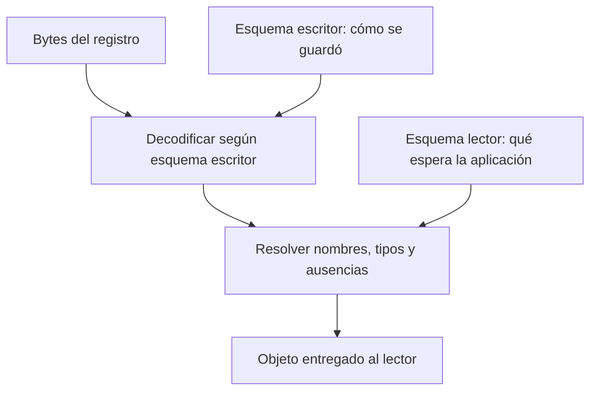

# DDIA — Avro: dos esquemas para leer datos de distintas épocas

[[Obsidian/lecturas/Designing Data-Intensive Applications 2a edición/00 Empieza aquí|Inicio del libro]] → [[Obsidian/lecturas/Designing Data-Intensive Applications 2a edición/05 Codificación y evolución/00 Índice|Codificación y evolución]]

Avro ofrece una respuesta distinta a la de Protobuf. En la codificación binaria de un registro no repite los nombres ni números de campo: el **esquema del escritor** explica cómo interpretar los bytes. Después, Avro compara ese esquema con el **esquema del lector** para entregar la estructura que la aplicación espera.

![[Obsidian/lecturas/Designing Data-Intensive Applications 2a edición/Recursos visuales/06-avro-dos-esquemas.png|1100]]

**Lee la imagen en tres pasos.** A la izquierda, el escritor produce `id=P42` y `total=1200` con su esquema. En el centro, la resolución recibe tanto ese esquema original como el esquema que desea el lector. A la derecha, el lector obtiene los dos valores y `moneda=null`, porque su esquema define ese default para un campo ausente en el esquema escritor. `total` abrevia aquí `total_centavos`: 1200 significa 12 unidades monetarias si cada unidad tiene cien centavos; sin la moneda, todavía falta parte del significado económico.

**Qué demuestra y qué no.** La imagen representa las responsabilidades conceptuales; sus cajas no son sintaxis Avro literal ni tres servicios que debas desplegar. `null` significa falta de información de moneda en este ejemplo; no convierte automáticamente el precio en USD. Tampoco significa que Avro necesite guardar ambos esquemas junto a cada registro: más abajo veremos cómo se obtiene y comparte el esquema escritor.

## Dos tareas que no debes confundir

Imagina un escritor cuyo registro tiene, en este orden, `id` y `total_centavos`. Los bytes siguen esa organización. No puedes leerlos usando ciegamente un esquema que coloque los campos al revés. Primero necesitas reconocer la estructura con la que fueron escritos.

Una vez conocido el esquema original, la resolución puede acomodar diferencias: campos que el lector no necesita, otros que ahora espera y tipos para los que existen promociones permitidas. **Los esquemas pueden diferir; lo que no puedes perder es la identificación correcta del esquema escritor.**



**Cómo leerlo.** Sigue la columna central desde bytes hasta objeto. La entrada del esquema escritor explica cómo recorrer los bytes; la del lector define qué resultado entregar. Son dos responsabilidades lógicas: una biblioteca puede resolverlas sin crear todos los pasos intermedios como objetos separados.

### Dos formas de escribir un esquema, una estructura que describir

Avro ofrece una IDL pensada para edición humana y una representación de esquemas en JSON, útil para herramientas que los generan desde otras fuentes. Un esquema en JSON **no significa que los registros se codifiquen como JSON**: la descripción puede ser JSON y los datos, binarios. Por ejemplo, la estructura `Pedido` de los siguientes ejemplos tiene un campo `id` string y un campo `total_centavos` long; ambas notaciones pueden describir esa misma estructura. Los nombres, tipos y orden pertenecen al esquema, no son nombres repetidos delante de cada registro binario.

## Por qué Avro necesita el esquema escritor: cuatro bytes concretos

Considera un registro con campos `id: string` y `total_centavos: long`, en ese orden, con valores `"A"` y `150`. La codificación binaria del registro es:

```text
02 41 | AC 02
 "A"  |  150
```

Son **cuatro bytes**, sin contar el esquema ni el contenedor. `02` es la longitud 1 codificada como long ZigZag; `41` es “A” en UTF-8. Para el long 150, ZigZag produce 300, cuyo varint es `AC 02`: `44 + 2 × 128 = 300`; al deshacer ZigZag resulta 150. El primer byte no dice “soy string”: lo sabes porque el esquema escritor establece que primero viene un string. Si intentaras leer todo como dos enteros, podrías consumir bytes sin producir los campos correctos.

Una unión agrega el índice de la rama elegida antes de su valor. En `["null","string"]`, `null` elige la rama 0; un string elige la 1. Esos índices también se codifican como long, por lo que empiezan con `00` y `02`, respectivamente. Los arrays incluyen bloques con cantidad de elementos y un terminador de cantidad cero: no basta concatenar sus valores sin límites. Son detalles que explican cómo recorrer estructuras sin etiquetas de campo. [Codificación binaria de Avro](https://avro.apache.org/docs/1.12.0/specification/#binary-encoding).

La resolución no obliga a materializar primero un objeto intermedio completo: el diagrama separa responsabilidades conceptuales. Una implementación puede decodificar y resolver en una misma pasada.

## Añadir moneda paso a paso

Este esquema v1 describe nuestro ejemplo:

```json
{
  "type": "record", "name": "Pedido",
  "fields": [
    {"name": "id", "type": "string"},
    {"name": "total_centavos", "type": "long"}
  ]
}
```

En v2 añadimos al arreglo `fields`:

```json
{"name": "moneda", "type": ["null", "string"], "default": null}
```

Para **lector v2 con datos v1**, el esquema escritor dice que `moneda` no existe. El lector usa su valor por defecto `null`: sabe que falta información, sin inventar USD. Para **lector v1 con datos v2**, la resolución sabe cómo recorrer el campo extra mediante el esquema escritor y lo ignora al construir la estructura v1.

Observa la diferencia entre `null`, `default` y opcionalidad: `null` es un valor permitido porque aparece en la unión; `default` sirve al resolver datos cuyo esquema escritor no tenía el campo. No significa que los bytes de un registro nuevo omitan arbitrariamente ese campo. La especificación explica que el valor por defecto no vuelve opcional la codificación del campo. [Especificación Avro 1.12](https://avro.apache.org/docs/1.12.0/specification/#records).

> [!info] Precisión respecto al escaneo
> La impresa 175 exige que `null` sea la primera rama para usarlo como valor por defecto. La especificación 1.12 permite un default que coincida con una rama de la unión y habla de la primera rama que coincida. Aquí usamos `['null', 'string']` con default `null`, un orden conservador y compatible con la regla del texto. Comprueba las bibliotecas concretas de tu sistema antes de depender de diferencias entre versiones.

## La dirección importa al cambiar el esquema

| Cambio aislado | Lector nuevo sobre datos viejos | Lector viejo sobre datos nuevos |
|---|---|---|
| Añadir campo con default en esquema nuevo | Usa el default | Ignora el campo extra |
| Añadir campo sin default | Falla si el campo falta | Puede ignorar el campo extra |
| Retirar campo que tenía default en esquema viejo | Ignora el campo de datos viejos | Usa su antiguo default |
| Retirar campo sin default en esquema viejo | Puede ignorarlo | Falla porque ahora le falta |

La tabla asume que no cambian otras restricciones y que el lector dispone del esquema escritor correcto. Retirar un campo puede ser técnicamente compatible y aun así quitar información que el negocio necesita.

Un alias en el **esquema lector nuevo** puede ayudar a reconocer el nombre viejo; un lector antiguo no recibe mágicamente ese alias. Asimismo, añadir una alternativa a una unión permite al lector nuevo aceptar datos viejos, pero el antiguo puede fallar si recibe la nueva alternativa. Son ejemplos de cambios compatibles en una dirección y problemáticos en la otra.

### Renombrar y ampliar tipos sin perder la dirección

V1 tiene `cliente`; v2 lo renombra `comprador` y en el campo nuevo declara `aliases: ["cliente"]`. El lector v2 conoce ese alias y puede asociar el antiguo `cliente` con `comprador`. El lector v1 no sabe que `comprador` sea el mismo dato: un alias añadido al esquema nuevo no instala conocimiento en el programa viejo. Evalúa por separado esa dirección.

Algo parecido sucede al ampliar `int` a `long`: el nuevo lector puede representar valores antiguos, pero el antiguo no adquiere un rango mayor. Avro define promociones de tipos para la resolución; que dos campos parezcan numéricos no autoriza cualquier conversión. Al añadir `string` a una unión `["null","long"]`, los datos viejos siguen usando ramas conocidas por v2; el problema aparece cuando un escritor nuevo emite un string a un lector v1 que no lo admite.

No confundas **posición en bytes** con **identidad lógica**. El esquema escritor determina el orden físico; al comparar esquemas, Avro asocia campos por nombre. Reordenar campos en el esquema lector no obliga a reordenar los bytes históricos. Cambiar el nombre, en cambio, sí afecta la asociación y requiere una regla explícita.

## ¿Dónde se consigue el esquema escritor?

- **Archivo de muchos registros:** el contenedor Avro puede guardar el esquema una vez en su encabezado. El costo se comparte entre registros.
- **Registros de distintas versiones:** cada registro puede transportar un identificador que remite a un registro de esquemas. El identificador no reemplaza la necesidad de conservar y resolver el esquema.
- **Conexión de red:** el protocolo puede negociar o intercambiar información de esquemas al establecer comunicación.

El registro de esquemas permite catalogar versiones y comprobar compatibilidad antes de publicar. No transforma automáticamente todos los consumidores, ni evita un error semántico como cambiar centavos a dólares.

Avro encaja conceptualmente con exportaciones cuyos esquemas se generan desde tablas: los nombres de columnas pueden convertirse en nombres de campos sin gestionar manualmente números de Protobuf. **Generar el esquema automáticamente no garantiza que la nueva versión sea compatible.**

## Exportar una tabla: un caso donde generar esquemas ayuda

Imagina una tabla `pedidos(id, total_centavos)` exportada el lunes. El exportador obtiene la estructura de la tabla, genera un esquema Avro y lo guarda una vez en el encabezado del archivo. El martes agregas `moneda`; el nuevo archivo contiene su propio esquema actualizado. El lector de ambos archivos puede resolver cada esquema escritor contra el que necesita la aplicación.

Si se eliminara la segunda columna y se generaran números Protobuf por posición, el número 2 podría terminar asignado a `moneda`: los datos antiguos se interpretarían con otra identidad. Es posible automatizar Protobuf, pero esa automatización necesita conservar un registro estable de números y reservas. Avro evita esa tarea específica usando nombres, aunque sigue necesitando reglas compatibles para campos nuevos, retirados o renombrados.

Un identificador de esquema puede ser una versión o una huella del esquema. Su valor aislado no explica los bytes: el sistema debe poder recuperar la definición exacta. Si borras del catálogo un esquema que todavía usan respaldos o mensajes retenidos, puedes dejar datos compactos pero ilegibles. Guardar metadatos forma parte de conservar los datos.

## Protobuf y Avro, sin convertirlos en una competición

Protobuf lleva números de campo en los datos y los lectores los interpretan con su definición. Avro necesita recuperar el esquema escritor y resolverlo contra el lector. Ambos hacen explícita la estructura y permiten evolución bajo reglas; el diseño operativo decide cuál encaja mejor. Ninguno elimina la necesidad de un contrato semántico.

> [!tip] Mnemotecnia
> **Escritor: cómo salió. Lector: cómo lo quiero. Resolución: cómo paso de uno al otro.**

> [!question]- ¿Para añadir un campo basta con permitir null?
> No. Para leer datos cuyo esquema escritor no lo tenía, el esquema lector necesita un default apropiado. Permitir null y declarar un default son decisiones distintas.

> [!question]- ¿Ignorar un campo Avro garantiza preservarlo al volver a escribir?
> No. Si el objeto del lector ya no contiene ese campo y se escribe con un esquema reducido, puede perderse. Revisa los intermediarios y la ruta completa de ida y vuelta.

## Conexiones

- [[Obsidian/freelance/Data Engineering/Spark/04 Schemas y DataFrames|Schemas de Spark]] ayuda a separar descripción de estructura y validación del dominio.
- [[Obsidian/freelance/Data Engineering/Spark/09 Parquet y Delta Lake|Parquet y Delta Lake]] distingue formato físico de una capa que administra tablas. Un registro de esquemas tampoco es por sí solo una capa transaccional.
- [[Obsidian/lecturas/Designing Data-Intensive Applications 2a edición/05 Codificación y evolución/05 Bases de datos APIs y RPC|Bases de datos y APIs]] sitúa lectores y escritores en sistemas reales.

## Referencias opcionales

Estas referencias documentan la procedencia; no son pasos previos para entender la nota.

Fuentes del escaneo: [[Obsidian/lecturas/Designing Data-Intensive Applications 2a edición/Materiales/DDIA 2e - Capítulo 5 - escaneo.pdf#page=12|PDF, p. 12; impresa 172]], [[Obsidian/lecturas/Designing Data-Intensive Applications 2a edición/Materiales/DDIA 2e - Capítulo 5 - escaneo.pdf#page=13|PDF, p. 13; impresa 173]], [[Obsidian/lecturas/Designing Data-Intensive Applications 2a edición/Materiales/DDIA 2e - Capítulo 5 - escaneo.pdf#page=14|PDF, p. 14; impresa 174]], [[Obsidian/lecturas/Designing Data-Intensive Applications 2a edición/Materiales/DDIA 2e - Capítulo 5 - escaneo.pdf#page=15|PDF, p. 15; impresa 175]], [[Obsidian/lecturas/Designing Data-Intensive Applications 2a edición/Materiales/DDIA 2e - Capítulo 5 - escaneo.pdf#page=16|PDF, p. 16; impresa 176]], [[Obsidian/lecturas/Designing Data-Intensive Applications 2a edición/Materiales/DDIA 2e - Capítulo 5 - escaneo.pdf#page=17|PDF, p. 17; impresa 177]] y [[Obsidian/lecturas/Designing Data-Intensive Applications 2a edición/Materiales/DDIA 2e - Capítulo 5 - escaneo.pdf#page=18|PDF, p. 18; impresa 178]].

---

**Anterior:** [[Obsidian/lecturas/Designing Data-Intensive Applications 2a edición/05 Codificación y evolución/03 Protocol Buffers y números de campo|Protocol Buffers y números de campo]] · **Índice:** [[Obsidian/lecturas/Designing Data-Intensive Applications 2a edición/05 Codificación y evolución/00 Índice|Ver este bloque]] · **Siguiente:** [[Obsidian/lecturas/Designing Data-Intensive Applications 2a edición/05 Codificación y evolución/05 Bases de datos APIs y RPC|Bases de datos APIs y RPC]]
