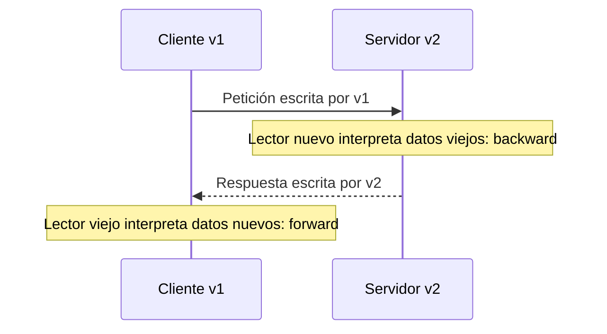
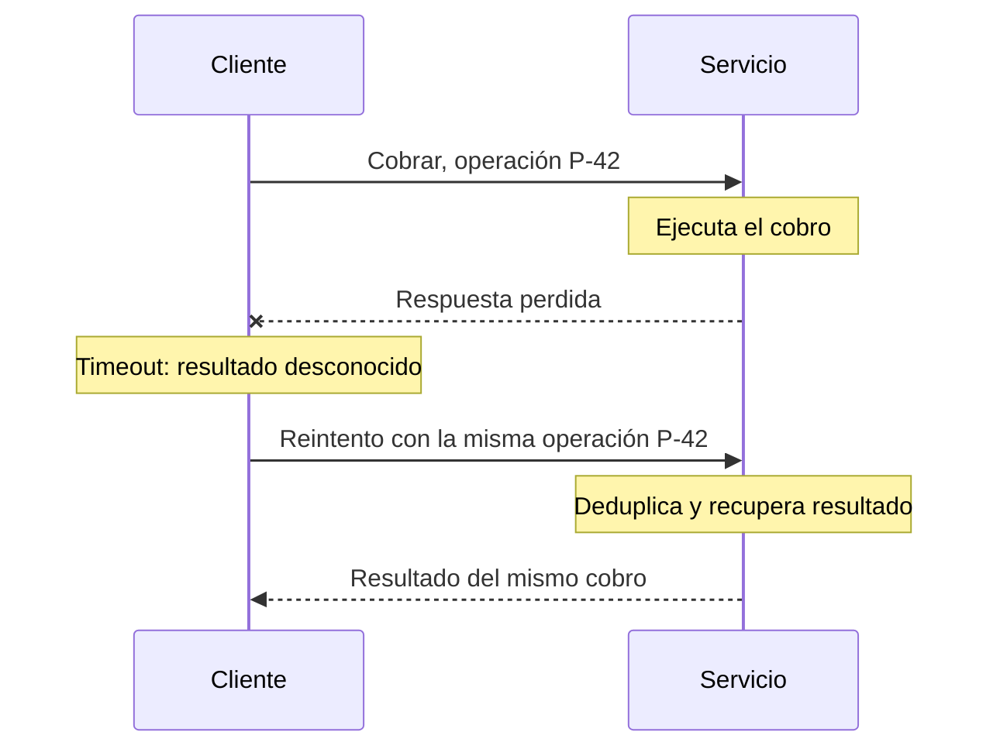
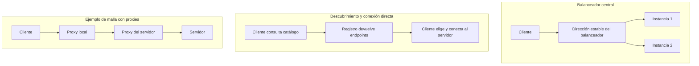

# DDIA — Por dónde viajan los datos: bases de datos, APIs y RPC

[[Obsidian/lecturas/Designing Data-Intensive Applications 2a edición/00 Empieza aquí|Inicio del libro]] → [[Obsidian/lecturas/Designing Data-Intensive Applications 2a edición/05 Codificación y evolución/00 Índice|Codificación y evolución]]

La compatibilidad se vuelve concreta cuando identificas la ruta del dato. Una base de datos lo lleva a otro momento; una API lo lleva a otro proceso; una llamada RPC puede parecer una función pero atraviesa una red con fallos y tiempos impredecibles.

Los formatos anteriores explican si unos bytes pueden interpretarse. Falta ubicar quién escribe y quién lee en cada canal: una base conserva datos para el futuro, una API intercambia solicitud y respuesta, y la red añade incertidumbre sobre si el efecto ocurrió.

> [!info] Recuerda antes
> - **Hacia atrás** significa lector nuevo sobre datos antiguos; **hacia adelante**, lector antiguo sobre datos nuevos.
> - Un contrato describe campos y tipos, pero no elimina latencia, caídas ni respuestas perdidas.
> - Un dato persistido puede sobrevivir a varias versiones de código; una respuesta de red puede no llegar aunque el servidor haya actuado.

## Base de datos: no todos los registros tienen la misma edad

Una fila puede haberse escrito hace cinco años y otra hace cinco milisegundos. Actualizar el servidor no convierte ambas en la misma representación física. La base de datos puede presentar un esquema lógico actual y completar campos ausentes al leer datos antiguos; si necesitas transformar estructuras complejas, puede hacer falta reescritura o una migración de aplicación.

Exportar una instantánea permite producir una representación uniforme para esa copia. Avro puede acompañarla con esquema; Parquet puede organizarla para consultas analíticas. Eso no implica que el origen se haya reescrito ni que el archivo por sí solo resuelva coordinación transaccional.

### Esquema lógico actual y bytes históricos

Supón que agregas la columna `moneda` con un valor por defecto apropiado. Una base de datos puede resolver ciertas adiciones con metadatos y completar ese campo al leer filas antiguas, en lugar de reescribir toda la tabla de inmediato. El comportamiento exacto depende del motor y del cambio. Que una consulta muestre la misma estructura para todas las filas no demuestra que todas tengan la misma disposición en disco.

Reescribir millones de registros consume E/S, CPU y tiempo; algunos motores aprovechan trabajos posteriores, como la compactación de estructuras LSM, para renovar representaciones internas. Esto **no significa que la compactación deduzca una migración del negocio**: convertir un domicilio en varios domicilios o repartir una entidad entre tablas requiere reglas explícitas y posiblemente trabajo en la aplicación.

Una exportación lógica permite leer filas mediante el esquema actual y codificarlas uniformemente en el archivo nuevo. Una copia física de páginas de disco tiene otro objetivo y puede conservar representaciones internas; por eso “cualquier backup normaliza esquemas” sería falso. Para un archivo inmutable de registros, Avro agrupa datos y esquema; para analítica por columnas, Parquet puede resultar apropiado. Ambos necesitan conservar el significado de los campos.

## API: dibuja las dos flechas



**Petición y respuesta invierten los papeles:** el cliente escribe la solicitud que lee el servidor; después el servidor escribe la respuesta que lee el cliente. Una sola interacción puede necesitar dos direcciones de compatibilidad.

Si decides desplegar primero todos los servidores y luego los clientes, ese orden reduce las combinaciones simultáneas que necesitas soportar. Es una **suposición operativa**, no una propiedad universal de HTTP. Un rollback, una app móvil o un cliente externo pueden modificarla.

OpenAPI describe operaciones y contratos de una API HTTP. Una definición de servicio Protobuf describe métodos y mensajes para herramientas como gRPC. Una IDL (*Interface Definition Language*) permite generar clientes, documentación y otras herramientas. Sigue siendo necesario comprobar comportamiento: una firma idéntica no demuestra que una respuesta conserve su significado.

REST es un estilo arquitectónico, HTTP un protocolo y JSON un formato. Pueden usarse juntos, pero no son sinónimos. RPC organiza la interfaz alrededor de operaciones invocadas; un formato como Protobuf especifica los datos, no garantiza por sí mismo la ejecución de la operación.

### Una API oculta decisiones internas, pero publica un contrato

Un cliente podría ejecutar SQL contra una tabla si la base de datos le concede ese acceso. Un servicio, en cambio, expone acciones concretas como `confirmarPedido`: puede comprobar stock, permisos y reglas de transición antes de modificar el estado. Esa **encapsulación** permite cambiar tablas internas sin obligar a todos los clientes a aprender el nuevo almacenamiento, siempre que la API conserve su comportamiento.

Un servicio HTTP puede atender una app móvil, otro servicio de la misma empresa o una integración externa. Usar HTTP no implica que el destinatario sea un navegador ni que la respuesta sea HTML. REST propone organizar recursos e interacciones utilizando propiedades de la web; HTTP aporta métodos, estados y encabezados; el cuerpo puede usar JSON u otro formato acordado.

### Una definición OpenAPI mínima, leída línea por línea

```yaml
openapi: 3.0.3
info:
  title: Estado de pedidos
  version: 1.0.0
paths:
  /pedidos/{id}:
    get:
      parameters:
        - name: id
          in: path
          required: true
          schema:
            type: string
      responses:
        '200':
          description: Pedido encontrado
          content:
            application/json:
              schema:
                type: object
                required: [id, estado]
                properties:
                  id:
                    type: string
                  estado:
                    type: string
```

`paths` nombra la ruta y `get` la operación. El parámetro `id` viene de la URL y es obligatorio. `200` documenta una respuesta; `application/json` declara su formato. El esquema exige `id` y `estado` como strings. Es un fragmento didáctico: una API real también definiría sus errores y reglas aplicables. La versión `openapi` identifica la versión de la especificación; `info.version` identifica la definición de esta API. [Especificación oficial OpenAPI 3.0.3](https://spec.openapis.org/oas/v3.0.3.html).

El documento no implementa la consulta, ni impide por sí solo que el servidor incumpla lo declarado. En un enfoque **contrato primero**, escribes la IDL y generas estructuras de servidor y clientes. En **código primero**, un framework extrae la descripción desde rutas y tipos del servidor. FastAPI ilustra el segundo enfoque en el capítulo; gRPC, el primero. Ambos pueden producir SDKs y documentación, pero la lógica de negocio debe implementarse y verificarse.

### Lo que enseña la historia de RPC

RPC significa llamada a procedimiento remoto. EJB y RMI se vincularon al ecosistema Java; DCOM al de Microsoft; CORBA y SOAP/WS-* buscaron integrar sistemas heterogéneos mediante infraestructuras más amplias. El capítulo los usa para advertir que ocultar la red detrás de una apariencia de objeto local no elimina sus límites. SOAP define mensajes estructurados y convenciones de servicios; REST es un estilo arquitectónico: no son dos formatos JSON que se eligen intercambiablemente. La lección útil no es memorizar esos nombres, sino reconocer dónde el contrato y las herramientas dejan de protegerte frente a fallos reales.

## Por qué remoto no se comporta como local

![[Obsidian/lecturas/Designing Data-Intensive Applications 2a edición/Recursos visuales/07-timeout-tres-historias.png|1100]]

**El mismo timeout oculta tres historias distintas:** la petición pudo no llegar, seguir en curso o completar el efecto y perder solo la respuesta. El cliente observa “sin respuesta” en los tres casos; por eso un timeout no demuestra que la operación no ocurrió.

**La decisión práctica.** No asumas que venció la espera y por eso se canceló el cobro. Consulta su estado si el protocolo lo permite o reintenta con la misma identidad de operación bajo una garantía idempotente duradera. En la historia C eso permite recuperar el resultado en vez de cobrar otra vez; en B, el receptor debe coordinar intentos simultáneos de la misma operación. Escribir una clave en la petición solo ayuda si el receptor la conserva y coordina correctamente con el efecto.

Imagina `cobrar(pedido)` como llamada a otro servicio:

1. Envías la petición.
2. El servicio cobra correctamente.
3. La respuesta se pierde.
4. Tu cliente recibe un timeout.

El timeout describe la falta de una respuesta a tiempo, no demuestra que el cobro no ocurrió. Si repites sin control, puedes duplicarlo. Una clave estable de idempotencia permite al receptor reconocer que el segundo intento pertenece a la misma operación lógica, siempre que la deduplicación y el efecto se coordinen correctamente.



**La respuesta perdida no deshace el cobro:** el reintento conserva `P-42` para referirse al mismo efecto lógico. El receptor debe almacenar y hacer cumplir esa identidad; una etiqueta enviada únicamente por el cliente no deduplica nada.

También cambian latencia, disponibilidad, costo de transferir objetos y tipos entre lenguajes. Un puntero válido en un proceso no es una referencia útil en el otro. Un stub simplifica la sintaxis, pero la aplicación sigue teniendo que manejar la realidad de la red.

### Seis diferencias que deben aparecer en tu diseño

| Diferencia respecto a una llamada local | Consecuencia que debes razonar |
|---|---|
| Petición o respuesta puede perderse | Distinguir error confirmado de resultado desconocido |
| Timeout no cancela necesariamente la ejecución remota | Consultar estado o reintentar con identidad estable |
| Reintento puede repetir el efecto | Coordinar deduplicación y efecto en el receptor |
| Latencia varía y cuesta transferir datos | Evitar miles de viajes pequeños cuando puedas agrupar trabajo |
| No puedes pasar un puntero de tu memoria | Enviar datos o identificadores con semántica acordada |
| Cliente y servidor pueden usar lenguajes distintos | Comprobar tipos, precisión y representación en ambos extremos |

Una promesa, un `await` o un stub resuelve cómo escribir el código que espera la respuesta; no resuelve qué pasó cuando la respuesta nunca llegó. Si cobras con una clave nueva después de cada timeout, el sistema remoto puede ejecutar pagos distintos aunque tu interfaz solo muestre un intento.

## Encontrar el destino no es comprender su mensaje

| Mecanismo | Problema que resuelve | Límite importante |
|---|---|---|
| Dirección configurada | Saber host y puerto | Se vuelve obsoleta cuando cambia la instancia |
| DNS | Resolver nombre a direcciones | La caché puede mantener direcciones antiguas |
| Balanceador | Repartir tráfico entre instancias | No valida automáticamente el significado de cada API |
| Registro de servicios | Descubrir instancias y metadatos | Su información de disponibilidad puede cambiar |
| Service mesh | Centralizar funciones de tráfico y observabilidad | Añade componentes y complejidad operativa |

El escaneo muestra topologías con proxies o sidecars. Es una explicación conceptual de esa arquitectura; no una afirmación de que toda malla de servicios deba implementarse exactamente así. En cualquier topología, enrutar bien bytes incompatibles sigue produciendo una integración rota.

### Seguir una petición por tres topologías



**Las tres topologías son alternativas:** un balanceador puede elegir la instancia detrás de una dirección estable; un catálogo puede devolver destinos para una conexión posterior; una malla puede mediar mediante proxies y asumir cifrado u observabilidad. Las cajas representan responsabilidades, no un número obligatorio de máquinas.

Un balanceador puede ser hardware especializado o software como NGINX/HAProxy. DNS puede devolver varias direcciones, pero su caché dificulta reaccionar inmediatamente a instancias que cambian. Un registro dinámico permite que las instancias anuncien host, puerto y metadatos; los **heartbeats** son señales periódicas de presencia. Si dejan de llegar, el catálogo puede considerar una instancia no disponible: sigue siendo una observación con retraso, no una prueba infalible del estado de la máquina.

Una malla combina funciones de encaminamiento, descubrimiento y políticas. En una topología con proxies puede gestionar certificados/cifrado y medir llamadas, errores y latencias. Eso facilita operaciones a cambio de mantener más componentes. Ningún catálogo ni proxy corrige una respuesta cuya estructura sea incompatible con el lector.

## Versionar una API es sostener un contrato

Agregar un parámetro opcional o un campo en una respuesta suele ser compatible si los consumidores toleran campos extra y el significado anterior se conserva. Un cliente con validación cerrada puede rechazarlo. Si no puedes mantener compatibilidad, quizá debas sostener versiones paralelas durante una transición. Poner `/v2` en la URL identifica una interfaz; no migra a sus usuarios automáticamente.

La versión puede señalarse en la URL, negociarse mediante encabezados como `Accept` o asociarse a la configuración del cliente autenticado. Elegir una convención sirve para dirigir cada consumidor a un contrato, pero también necesitas decidir cuánto tiempo mantendrás cada versión y qué ocurrirá con los clientes que no migren. Las integraciones externas hacen que esa ventana pueda ser mucho más larga que tu propio despliegue.

> [!tip] Mnemotecnia
> **Destino, bytes, significado y efecto** son cuatro problemas. DNS ayuda con el destino; el formato con los bytes; el contrato con el significado; la idempotencia con efectos repetidos.

> [!question]- ¿Qué sabes cuando una petición termina en timeout?
> Que no obtuviste una respuesta a tiempo. Puede no haber llegado, estar ejecutándose o haberse completado con la respuesta perdida. La política de reintento debe considerar esas posibilidades.

> [!question]- ¿Un balanceador hace compatibles dos versiones de la API?
> No. Decide dónde enviar tráfico; la compatibilidad depende de los esquemas y del comportamiento de servidores y clientes.

## Conexiones y matices útiles

- [[Obsidian/pregrado/Documentos/Computacion ditribuida/Remote Procedure Call (rpc)|Tu nota de RPC]] explica stubs y empaquetado. Lee “como una función local” como semejanza de interfaz, no como equivalencia en fallos, latencia o efectos.
- [[Obsidian/pregrado/Documentos/Web/WEB RESTful|Tu nota de REST]] sirve para revisar métodos HTTP. La idempotencia se refiere al efecto esperado de repetir la operación, no a recibir siempre el mismo código de respuesta; un POST también puede diseñarse con deduplicación.
- [[Obsidian/pregrado/Documentos/Computacion ditribuida/Microservicios|Microservicios]] conecta con despliegues separados. Esa independencia depende de mantener contratos y no es automática por dividir la aplicación.
- [[Obsidian/lecturas/Designing Data-Intensive Applications 2a edición/05 Codificación y evolución/06 Workflows durables e idempotencia|Workflows durables]] extiende el problema a varias operaciones coordinadas.

## Referencias opcionales

Estas referencias documentan la procedencia; no son pasos previos para entender la nota.

Fuentes: [[Obsidian/lecturas/Designing Data-Intensive Applications 2a edición/Materiales/DDIA 2e - Capítulo 5 - escaneo.pdf#page=18|PDF, p. 18; impresa 178]], [[Obsidian/lecturas/Designing Data-Intensive Applications 2a edición/Materiales/DDIA 2e - Capítulo 5 - escaneo.pdf#page=19|PDF, p. 19; impresa 179]], [[Obsidian/lecturas/Designing Data-Intensive Applications 2a edición/Materiales/DDIA 2e - Capítulo 5 - escaneo.pdf#page=20|PDF, p. 20; impresa 180]], [[Obsidian/lecturas/Designing Data-Intensive Applications 2a edición/Materiales/DDIA 2e - Capítulo 5 - escaneo.pdf#page=21|PDF, p. 21; impresa 181]], [[Obsidian/lecturas/Designing Data-Intensive Applications 2a edición/Materiales/DDIA 2e - Capítulo 5 - escaneo.pdf#page=22|PDF, p. 22; impresa 182]], [[Obsidian/lecturas/Designing Data-Intensive Applications 2a edición/Materiales/DDIA 2e - Capítulo 5 - escaneo.pdf#page=23|PDF, p. 23; impresa 183]], [[Obsidian/lecturas/Designing Data-Intensive Applications 2a edición/Materiales/DDIA 2e - Capítulo 5 - escaneo.pdf#page=24|PDF, p. 24; impresa 184]], [[Obsidian/lecturas/Designing Data-Intensive Applications 2a edición/Materiales/DDIA 2e - Capítulo 5 - escaneo.pdf#page=25|PDF, p. 25; impresa 185]] y [[Obsidian/lecturas/Designing Data-Intensive Applications 2a edición/Materiales/DDIA 2e - Capítulo 5 - escaneo.pdf#page=26|PDF, p. 26; impresa 186]].

---

**Anterior:** [[Obsidian/lecturas/Designing Data-Intensive Applications 2a edición/05 Codificación y evolución/04 Avro y resolución de esquemas|Avro y resolución de esquemas]] · **Índice:** [[Obsidian/lecturas/Designing Data-Intensive Applications 2a edición/05 Codificación y evolución/00 Índice|Ver este bloque]] · **Siguiente:** [[Obsidian/lecturas/Designing Data-Intensive Applications 2a edición/05 Codificación y evolución/06 Workflows durables e idempotencia|Workflows durables e idempotencia]]
