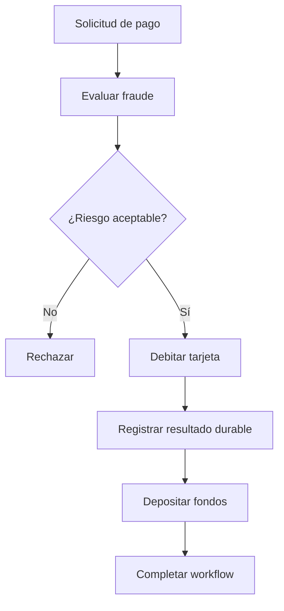

# DDIA — Workflows durables: recordar el progreso sin duplicar efectos

[[Obsidian/lecturas/Designing Data-Intensive Applications 2a edición/00 Empieza aquí|Inicio del libro]] → [[Obsidian/lecturas/Designing Data-Intensive Applications 2a edición/05 Codificación y evolución/00 Índice|Codificación y evolución]]

Un workflow describe pasos y dependencias de un proceso. La ejecución durable permite recuperar el progreso después de un fallo. La idea decisiva es **registrar lo que ocurrió para continuar sin empezar a ciegas**. Eso no significa que cualquier efecto externo se ejecute mágicamente una sola vez.

RPC resuelve una interacción, pero un pago completo encadena varias llamadas. Si el proceso cae entre ellas, reintentar todo puede repetir un débito y no reintentar puede dejar el depósito pendiente. El workflow necesita recordar qué decisiones y resultados ya son conocidos.

> [!info] Recuerda antes
> - Un **timeout** deja al cliente sin saber si el efecto no empezó, sigue en curso o terminó sin respuesta.
> - Una operación **idempotente** reconoce el mismo intento lógico y evita multiplicar su efecto previsto.
> - Un historial durable se parece a un log de recuperación: registra lo necesario para reconstruir progreso, no convierte servicios externos en una sola transacción.

## De una tarea aislada a un proceso completo

Imagina un pago con tres tareas: revisar fraude, debitar la tarjeta y depositar los fondos. La segunda depende de que la primera permita continuar; la tercera depende de que exista un débito confirmado. Un motor organiza cuándo ejecutar cada tarea, dónde ejecutarla y qué hacer con fallos.



**El riesgo aceptable abre una cadena de efectos dependientes:** rechazar termina el proceso; aceptar exige debitar, registrar un resultado recuperable y después depositar. Ese registro permite continuar tras fallos, pero no convierte débito y depósito en una sola transacción bancaria.

El **orquestador** coordina tareas; los **ejecutores o workers** realizan trabajo. Un workflow puede activarse por una petición, un horario o una persona. Los nombres varían entre herramientas: una tarea que interactúa con el exterior se denomina *Activity* en Temporal.

### No todos los motores resuelven exactamente lo mismo

| Enfoque descrito en el capítulo | Qué prioriza | Ejemplo de uso |
|---|---|---|
| Orquestación de datos | Dependencias de trabajos, horarios y ejecución de pipelines | Extraer ventas, transformar y publicar una tabla |
| Procesos de negocio con notación gráfica | Representar decisiones y tareas de forma visible | Aprobar una solicitud con revisión humana |
| Ejecución durable | Recuperar un proceso conservando su progreso registrado | Continuar un pago después de una caída |

El capítulo cita Airflow, Dagster y Prefect en la primera familia; Camunda y Orkes al hablar de notaciones gráficas; Temporal y Restate al explicar ejecución durable. Son ejemplos para distinguir objetivos, no una clasificación exclusiva ni una comparación de sus versiones actuales. **BPMN** es una notación para representar procesos; **BPEL** es un lenguaje de ejecución de procesos. Un dibujo BPMN y un historial durable no son el mismo artefacto.

El orquestador decide qué tareas están listas según sus dependencias y política de reintentos; los workers ejecutan esas tareas. Si dos tareas son independientes, un motor puede ejecutarlas en paralelo. Si “depositar” depende de “debitar confirmado”, ese orden pertenece al proceso y no debe romperse para acelerar la ejecución.

## Replay no significa volver a cobrar

Supón que el historial durable contiene “fraude aprobado” y “débito completado, referencia D-88”. El worker cae antes del depósito. Al reconstruir el workflow, el motor puede entregar esos resultados ya registrados al código, en lugar de repetir las actividades completadas. Después programa lo pendiente.


**El historial reconstruye decisiones y resultados conocidos; solo lo pendiente genera actividad nueva.** Si la caída ocurrió antes de registrar un resultado externo, el historial no prueba si el efecto sucedió y el reintento todavía necesita idempotencia o reconciliación.

En Temporal, el código del workflow debe ser determinista respecto al historial y las actividades alojan operaciones externas. Las actividades pueden reintentarse: que un resultado completado no se vuelva a ejecutar durante replay no significa que todos los intentos físicos de una actividad hayan ocurrido una sola vez.

## La ventana peligrosa entre efecto y registro

Esta secuencia es distinta de la anterior:

1. La actividad pide a la pasarela que debite.
2. La pasarela aplica el débito.
3. El worker cae antes de confirmar el resultado al motor.
4. El historial aún no demuestra que la actividad terminó.
5. El motor puede reintentar la actividad.

La pasarela debe reconocer el reintento mediante una clave de idempotencia estable, por ejemplo `pago:P-42:debito`. Generar una clave nueva en cada intento hace que parezcan operaciones diferentes. También importa que la retención de claves y las garantías del proveedor cubran la ventana de reintento requerida.

> [!warning] “Exactamente una vez” no elimina los intentos repetidos
> El capítulo presenta ejecución durable como una manera de conseguir semántica de workflow resistente a fallos, pero también exige idempotencia externa en la impresa 189. **No equivale a una transacción ACID automática entre bancos y servicios**, ni garantiza por sí sola un único intento de cada llamada.

Si después del débito el depósito es rechazado permanentemente, recordar los pasos no decide qué hacer: necesitas una regla de negocio, como revisión o compensación. Una compensación es una nueva acción correctiva; no borra necesariamente todo efecto histórico como un rollback local.

## Determinismo: la misma historia debe reconstruir decisiones compatibles

Si un workflow toma la hora del sistema o un número aleatorio sin el mecanismo previsto por el framework, durante replay puede seguir otro camino. Usa las APIs deterministas o actividades apropiadas para esas dependencias. “Determinista” no exige que un servicio externo nunca cambie; exige que el replay se apoye en resultados y eventos registrados de forma coherente.

Cambiar el orden de llamadas de un workflow ya iniciado puede producir una secuencia incompatible con su historial. Por eso desplegar código nuevo requiere una estrategia de versiones, migración o mecanismos de compatibilidad del motor. Mantener ejecuciones existentes con su versión y usar la nueva para ejecuciones nuevas es una estrategia explicada en el escaneo.

Los argumentos y resultados también se codifican. Aunque el flujo de control sea compatible, cambiar el formato de un resultado almacenado puede impedir que el código nuevo reconstruya una ejecución antigua. La compatibilidad de datos y la compatibilidad del replay son capas distintas que se necesitan mutuamente.

## Un historial durable contado como una tabla

| Paso | Lo que ocurre fuera del motor | Lo que el historial confirma | Qué hacer tras una caída |
|---|---|---|---|
| Antes del débito | No se ha solicitado cobrar | Fraude aprobado | Programar el débito |
| Tras cobrar, antes de registrar el resultado | La pasarela puede haber cobrado | El débito aún no consta como completado | Consultar o reintentar con la misma clave idempotente |
| Después de registrar `D-88` | El cobro está confirmado | Débito completado con resultado `D-88` | Reutilizar el resultado en replay y continuar |

La diferencia entre las últimas dos filas es conocimiento durable. El motor no puede inferir un efecto externo solo por haber enviado una petición. La idempotencia cierra esa incertidumbre cuando el servicio externo reconoce la operación; si no ofrece esa capacidad, necesitas otra estrategia de conciliación y tratamiento de estados ambiguos.

Un esquema conceptual de la lógica sería:

```text
fraude = esperar actividad evaluar_fraude(pedido)
si fraude: terminar como rechazado
debito = esperar actividad debitar(pedido, clave_estable)
esperar actividad depositar(debito.referencia, otra_clave_estable)
terminar como completado
```

Es pseudocódigo explicativo, no código de un SDK. “Esperar actividad” permite al motor asociar el paso con su historial. La clave del depósito debe identificar ese depósito; no se reutiliza indiscriminadamente una única clave para operaciones de negocio distintas.

## Un ejercicio mental de recuperación

Dibuja los puntos de caída antes de debitar, después de debitar pero antes de registrar, y después de registrar. En cada punto anota qué conoce el motor y qué conoce la pasarela. La segunda caída es la que demuestra por qué no basta con decir “el workflow recuerda todo”.

> [!tip] Mnemotecnia
> **Replay recuerda; reintento repite; idempotencia protege.** Son mecanismos complementarios.

> [!question]- ¿Una actividad confirmada en el historial se vuelve a ejecutar solo porque se hace replay?
> El motor puede devolver su resultado registrado durante replay. Sin embargo, una actividad cuyo resultado no llegó a registrarse puede requerir un nuevo intento; por eso los efectos externos deben tolerarlo.

> [!question]- ¿Cambiar la secuencia de tareas es igual que añadir una función local cualquiera?
> No necesariamente. Las ejecuciones activas tienen un historial que el nuevo código debe poder reconstruir. El cambio necesita la estrategia de evolución soportada por el motor.

## Conexiones

- [[Obsidian/lecturas/Designing Data-Intensive Applications 2a edición/05 Codificación y evolución/05 Bases de datos APIs y RPC|RPC y timeouts]] explica por qué falta de respuesta no demuestra falta de efecto.
- [[Obsidian/lecturas/Designing Data-Intensive Applications 2a edición/05 Codificación y evolución/01 Evolución y compatibilidad|Evolución]] se extiende aquí a historiales de ejecuciones que pueden durar más que una versión del código.
- [[Obsidian/freelance/Data Engineering/Spark/02 Lazy DAG stages y shuffle|DAG de Spark]] también representa dependencias, pero un DAG de ejecución de datos no equivale por sí solo a un workflow durable con efectos externos y reglas de reintento.

## Referencias opcionales

Estas referencias documentan la procedencia; no son pasos previos para entender la nota.

Fuentes del escaneo: [[Obsidian/lecturas/Designing Data-Intensive Applications 2a edición/Materiales/DDIA 2e - Capítulo 5 - escaneo.pdf#page=27|PDF, p. 27; impresa 187]], [[Obsidian/lecturas/Designing Data-Intensive Applications 2a edición/Materiales/DDIA 2e - Capítulo 5 - escaneo.pdf#page=28|PDF, p. 28; impresa 188]] y [[Obsidian/lecturas/Designing Data-Intensive Applications 2a edición/Materiales/DDIA 2e - Capítulo 5 - escaneo.pdf#page=29|PDF, p. 29; impresa 189]]. La precisión sobre actividades y replay se contrastó con la [arquitectura oficial de Temporal](https://github.com/temporalio/temporal/blob/main/docs/architecture/README.md).

---

**Anterior:** [[Obsidian/lecturas/Designing Data-Intensive Applications 2a edición/05 Codificación y evolución/05 Bases de datos APIs y RPC|Bases de datos APIs y RPC]] · **Índice:** [[Obsidian/lecturas/Designing Data-Intensive Applications 2a edición/05 Codificación y evolución/00 Índice|Ver este bloque]] · **Siguiente:** [[Obsidian/lecturas/Designing Data-Intensive Applications 2a edición/05 Codificación y evolución/07 Mensajería actores y repaso|Mensajería actores y repaso]]
