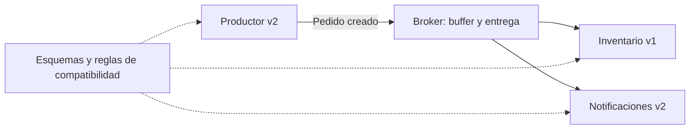
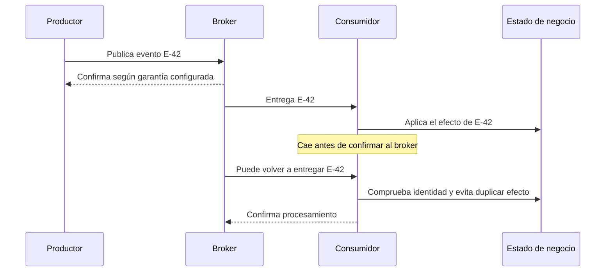
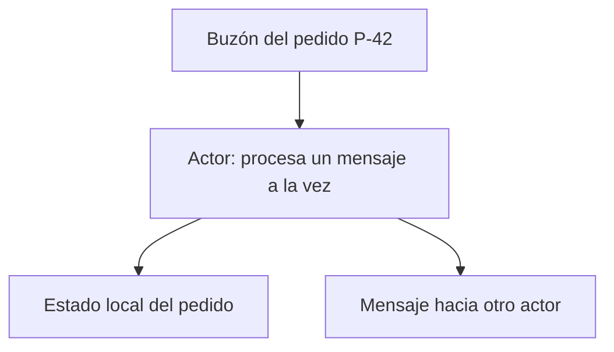

# DDIA — Mensajes, actores y una guía para repasar el capítulo

[[Obsidian/lecturas/Designing Data-Intensive Applications 2a edición/00 Empieza aquí|Volver a la ruta de lectura]]

En una arquitectura orientada a eventos, el productor suele publicar un mensaje sin esperar que el consumidor termine de procesarlo. Un intermediario puede almacenarlo y entregarlo después. Esto separa los ritmos de los procesos, pero el mensaje sigue necesitando un contrato que sobreviva a distintas versiones.

## El broker desacopla ritmos, no significados

**Cómo leerlo.** El evento entra una vez en el broker y se muestra distribuido a dos intereses distintos. Cada consumidor puede tener otra versión y avanzar a otro ritmo. Las flechas punteadas representan el contrato compartido; no garantizan validación automática del contenido.

Si notificaciones está temporalmente caído, el broker puede conservar mensajes para después, dependiendo de su durabilidad, configuración y retención. El productor no necesita localizar directamente esa instancia: sigue necesitando conectarse al broker. La capacidad de acumular mensajes no es infinita; una interrupción prolongada puede agotar almacenamiento o superar retención.

No esperes sincronía global: publicar con éxito, persistir, entregar y aplicar el efecto son momentos distintos. Un acuse confirma lo que el protocolo específico define, no necesariamente que todos los consumidores hayan terminado.

## Cola y publicación/suscripción

| Patrón conceptual | Distribución | Ejemplo didáctico |
|---|---|---|
| Consumidores que compiten en una cola | Un trabajador atiende cada entrega; puede haber reentregas | Repartir trabajos de generar reportes |
| Publicación/suscripción | Cada suscripción recibe el flujo que le corresponde | Inventario y analítica reaccionan al mismo pedido |

Son modelos conceptuales, no una regla universal basada en el nombre del producto. En plataformas con grupos de consumidores, varios workers pueden repartirse mensajes dentro de un grupo mientras grupos distintos leen el mismo flujo. Persistencia, orden, reintentos y retención dependen de la herramienta y de cómo la configures.

Un broker puede transportar bytes opacos. Que acepte un mensaje no demuestra que este sea un pedido válido. Un registro de esquemas permite gestionar versiones; Protobuf, Avro o JSON determinan cómo se interpreta el contenido. AsyncAPI puede documentar interfaces basadas en mensajes.

## Seguir un mensaje desde publicar hasta confirmar

**Cómo leerlo.** Baja siguiendo el tiempo. El primer acuse vuelve al productor y el último sale del consumidor: prueban cosas diferentes. La caída entre efecto y acuse explica la reentrega. La deduplicación dibujada es responsabilidad de la aplicación o de un mecanismo con garantías explícitas; no aparece por usar un broker.

Si confirmaras antes de aplicar el efecto y cayeras después, el broker podría considerar terminado un trabajo que nunca ejecutaste. Si confirmas después, una caída puede duplicar la entrega. Una estrategia es guardar la identidad procesada y el cambio de negocio de manera coordinada; para efectos externos necesitas una garantía idempotente o conciliación. Esto conecta directamente con los timeouts y workflows anteriores.

Durabilidad y retención responden preguntas diferentes: **durabilidad**, qué sobrevive a una caída; **retención**, durante cuánto tiempo o bajo qué condición se conserva. Una cola puede retirar mensajes confirmados; un log puede permitir releerlos durante un plazo. Para *event sourcing*, donde los eventos constituyen la historia desde la que reconstruyes estado, la conservación de eventos y esquemas forma parte del diseño, no es un efecto automático de pub/sub.

También puedes imitar petición/respuesta sobre mensajería: publicas una petición con identificador de correlación y esperas su respuesta en otro canal. Así recuperas una espera lógica aunque el transporte use un broker. Necesitarás tratar respuestas tardías, correlación y timeouts; cambiar el transporte no elimina esas preguntas.

## El intermediario que borra el futuro

Supón que un servicio recibe el evento v2 `PedidoCreado`, cambia el nombre de un campo conocido y lo republica. Si construye un objeto usando solo los campos v1, puede eliminar una propiedad nueva que otro consumidor necesitaba. Es exactamente el problema de leer y reescribir estudiado para bases de datos. **Reenviar también es escribir.**

La antigüedad del mensaje también importa: si el broker conserva un historial largo, un consumidor recién desplegado puede releer versiones antiguas. La retención y la posibilidad de replay amplían el tiempo durante el cual debes conservar compatibilidad y esquemas.

## Actores: una entidad que atiende mensajes

Un actor encapsula estado y procesa mensajes sin compartir directamente ese estado con otros actores. En el modelo básico explicado por el capítulo, atiende un mensaje a la vez y envía mensajes a otros actores. Así puedes pensar en “el actor de un pedido” que recibe acciones sobre ese pedido.

**Cómo leerlo.** El buzón entrega trabajo al actor; este actualiza su estado privado y puede enviar otro mensaje. El estado no se comparte directamente con otros actores. Una flecha saliente no demuestra que el destinatario ya haya aplicado el efecto.

Distribuir actores entre máquinas exige codificar los mensajes, gestionar fallos y mantener compatibilidad durante despliegues graduales. Un modelo basado desde el principio en mensajes tolera mejor la diferencia entre local y remoto que fingir una llamada síncrona normal. Eso no convierte la entrega en infalible ni elimina todos los errores de concurrencia entre entidades.

### Actores locales y distribuidos: qué se conserva y qué cambia

Piensa en dos actores, `Pedido-P42` e `Inventario-A`. El primero envía “reserva dos unidades”; el segundo lo recibe en su buzón, examina su estado y responde. Ninguno obtiene un puntero al estado privado del otro. Procesar un mensaje cada vez simplifica las actualizaciones **dentro** de un actor, pero la reserva y el pedido siguen siendo dos estados separados: un fallo entre sus mensajes puede dejar la coordinación pendiente.

En frameworks como Akka, Orleans o Erlang/OTP, el mismo estilo de mensajes puede distribuir entidades entre nodos. Entre nodos hay codificación y red; dentro de un proceso puede no ser necesario el mismo transporte. La transparencia de ubicación encaja mejor que en una llamada síncrona local porque la interfaz ya obliga a pensar en mensajes y respuestas separados.

El modelo por sí solo no promete entrega garantizada, persistencia de cada buzón ni orden global. El capítulo contempla pérdida de mensajes incluso en escenarios de actores locales con fallos. Las garantías concretas y la posible reentrada dependen del framework y su configuración: “un mensaje a la vez” es el modelo básico que estamos usando para razonar, no una promesa sobre cualquier implementación.

Durante un despliegue, `Pedido-P42` v2 puede enviar a `Inventario-A` v1. Cada dirección vuelve a plantear compatibilidad de escritor y lector, y el estado persistido puede sobrevivir a ambos procesos. Distribuir actores no elimina las reglas de evolución que aprendiste con JSON, Protobuf y Avro.

## Repaso: elige la pregunta antes de elegir la tecnología

| Si te preocupa… | Pregunta que debes poder responder | Nota |
|---|---|---|
| Actualizar sin romper | ¿Quién escribe y quién lee cada versión? | [[Obsidian/lecturas/Designing Data-Intensive Applications 2a edición/05 Codificación y evolución/01 Evolución y compatibilidad\|Compatibilidad]] |
| Interpretar archivos | ¿Qué tipos y unidades están acordados? | [[Obsidian/lecturas/Designing Data-Intensive Applications 2a edición/05 Codificación y evolución/02 JSON XML CSV y esquemas\|Formatos]] |
| Identidad estable de campos | ¿Se mantienen los números y sus significados? | [[Obsidian/lecturas/Designing Data-Intensive Applications 2a edición/05 Codificación y evolución/03 Protocol Buffers y números de campo\|Protobuf]] |
| Leer datos de otro esquema | ¿Dónde consigo el esquema escritor? | [[Obsidian/lecturas/Designing Data-Intensive Applications 2a edición/05 Codificación y evolución/04 Avro y resolución de esquemas\|Avro]] |
| Reintentar una llamada | ¿El resultado es desconocido o sé que no ocurrió? | [[Obsidian/lecturas/Designing Data-Intensive Applications 2a edición/05 Codificación y evolución/05 Bases de datos APIs y RPC\|RPC]] |
| Recuperar varios pasos | ¿Qué quedó registrado y qué puede repetirse? | [[Obsidian/lecturas/Designing Data-Intensive Applications 2a edición/05 Codificación y evolución/06 Workflows durables e idempotencia\|Workflows]] |
| Reprocesar eventos | ¿Qué versiones históricas y duplicados puede recibir el consumidor? | Esta nota |

## Un caso integrador para practicar

Tu productor v2 añade `descuento_centavos` a pedidos y publica eventos. Inventario sigue en v1. Analítica se actualiza a v2 y relee seis meses de datos. Un intermediario v1 republica los eventos. Antes de aprobar el cambio, responde las tres preguntas plegables:

> [!question]- ¿Qué necesita inventario v1 para recibir eventos nuevos?
> Compatibilidad hacia adelante: tolerar el campo desconocido y seguir interpretando correctamente lo que sí necesita. Si ese descuento modifica alguna decisión suya, ignorarlo puede ser semánticamente incorrecto aunque el parser funcione.

> [!question]- ¿Qué necesita analítica v2 al releer eventos viejos?
> Compatibilidad hacia atrás y una regla explícita para la ausencia de descuento. Usar cero es correcto solo si ausencia históricamente significa “sin descuento”; si significa “desconocido”, debe conservarse esa diferencia.

> [!question]- ¿Qué debes revisar en el intermediario v1?
> Que no elimine `descuento_centavos` al transformar o republicar. Debes probar la ruta completa, no solo que cada parser acepte el mensaje individualmente.

> [!tip] Mnemotecnia final
> **El broker guarda y entrega; el esquema interpreta; el contrato da significado.** Ninguno sustituye a los otros.

## Conexiones y alcance del escaneo

- [[Obsidian/pregrado/Documentos/Computacion ditribuida/Sistemas de mensajeria|Tu nota de mensajería]] introduce colas y pub/sub. Matiza “todos reciben simultáneamente” y “se borra tras consumir”: entrega y eliminación dependen de suscripciones, acuses, retención y configuración; no son propiedades universales.
- [[Obsidian/pregrado/Documentos/Computacion ditribuida/Microservicios|Microservicios]] conecta con equipos y despliegues separados, cuya independencia exige contratos estables.
- [[Obsidian/freelance/Data Engineering/Spark/10 Arquitectura Lambda|Arquitectura Lambda]] permite conectar rutas de procesamiento con conservación y reprocesamiento de datos, sin confundir esa arquitectura con un simple broker.

El PDF contiene **32 páginas: impresas 161–192**, con correspondencia `impresa = página PDF + 160`. Incluye desde el inicio del capítulo 5 hasta su resumen. No se observan saltos de páginas entre ellas; la bibliografía correspondiente a las referencias numeradas del capítulo no está adjunta. Algunos pies y palabras tienen recortes o distorsiones de escaneo: las notas reconstruyen conceptos y usan referencias oficiales para precisiones, sin fingir que los números bibliográficos revelan fuentes ausentes.

## Referencias opcionales

Estas referencias documentan la procedencia; no son pasos previos para entender la nota.

Fuentes del escaneo: [[Obsidian/lecturas/Designing Data-Intensive Applications 2a edición/Materiales/DDIA 2e - Capítulo 5 - escaneo.pdf#page=29|PDF, p. 29; impresa 189]], [[Obsidian/lecturas/Designing Data-Intensive Applications 2a edición/Materiales/DDIA 2e - Capítulo 5 - escaneo.pdf#page=30|PDF, p. 30; impresa 190]], [[Obsidian/lecturas/Designing Data-Intensive Applications 2a edición/Materiales/DDIA 2e - Capítulo 5 - escaneo.pdf#page=31|PDF, p. 31; impresa 191]] y [[Obsidian/lecturas/Designing Data-Intensive Applications 2a edición/Materiales/DDIA 2e - Capítulo 5 - escaneo.pdf#page=32|PDF, p. 32; impresa 192]].
