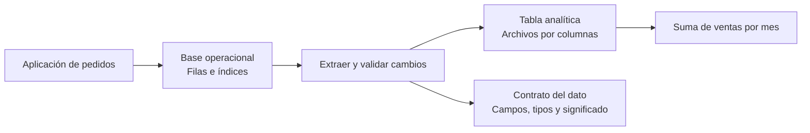
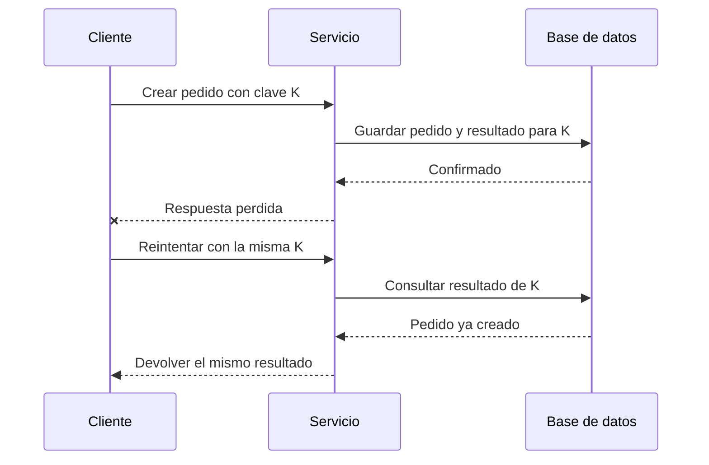

# DDIA — Caso práctico: de pedidos a analítica

[[Obsidian/lecturas/Designing Data-Intensive Applications 2a edición/00 Empieza aquí|Inicio del libro]] → [[Obsidian/lecturas/Designing Data-Intensive Applications 2a edición/06 Práctica y repaso/00 Índice|Práctica y repaso]]

> [!abstract] El problema completo
> Una aplicación debe guardar pedidos, mostrar los de un cliente, calcular ventas por mes y añadir un campo sin romper versiones anteriores. **El capítulo 4 pregunta cómo guardar y encontrar; el capítulo 5 pregunta cómo representar y cambiar.** Las dos decisiones se encuentran en el mismo sistema.

Este caso es una **elaboración didáctica propia**, con datos ficticios. No describe la arquitectura real de tus proyectos ni un ejercicio reproducido del libro. Puedes resolverlo con papel: antes de añadir tecnología, justifica qué problema resuelve.

## 1. Empieza por las preguntas, no por el motor

Imagina estos datos; cada fila es **un pedido**, todos los importes de esta primera versión están expresados en centavos de USD.

| pedido_id | cliente_id | fecha | total_centavos |
|---|---|---|---:|
| P101 | C7 | 2026-09-01 | 2500 |
| P102 | C8 | 2026-09-02 | 4000 |
| P103 | C7 | 2026-09-04 | 1500 |
| P104 | C9 | 2026-09-05 | 2000 |

La pantalla pide «los pedidos recientes de C7». El informe pide «suma de ventas de septiembre». Ambos usan pedidos, pero hacen trabajos diferentes:

- **Pantalla operacional:** localizar pocas filas, devolver sus atributos y responder con poca latencia mientras llegan cambios.
- **Informe analítico:** recorrer muchos pedidos y agregar principalmente la fecha y el importe.

Con cuatro filas, recorrer todo es trivial. La diferencia importa al crecer el volumen y la concurrencia. No necesitas una arquitectura distribuida para practicarla.

## 2. Un índice es otra organización de los mismos hechos

Para la pantalla podrías evaluar un índice B-tree sobre `(cliente_id, fecha)`. Su orden conceptual es primero por cliente y después por fecha dentro del cliente:

```text
(C7, 2026-09-01) → P101
(C7, 2026-09-04) → P103
(C8, 2026-09-02) → P102
(C9, 2026-09-05) → P104
```

```sql
-- Ejemplo orientativo para una tabla pedidos de PostgreSQL.
CREATE INDEX pedidos_cliente_fecha ON pedidos (cliente_id, fecha);

SELECT pedido_id, fecha, total_centavos
FROM pedidos
WHERE cliente_id = 'C7'
  AND fecha >= DATE '2026-09-01'
ORDER BY fecha DESC;
```

El motor puede localizar el rango de C7 y recorrer sus fechas. El plan concreto depende de las estadísticas, el tamaño y el costo estimado; crear el índice no obliga al optimizador a usarlo. Cada inserción añade también trabajo para mantenerlo. Las columnas iniciales de un índice compuesto son especialmente importantes; hay optimizaciones como *skip scan* que impiden convertir esa regla en un «nunca». [Documentación de índices multicolumna de PostgreSQL](https://www.postgresql.org/docs/current/indexes-multicolumn.html).

**Pregunta clave:** si buscas todos los pedidos del mes sin restringir cliente, ¿el mismo orden sigue siendo el más adecuado? No necesariamente: las fechas de un mismo mes están repartidas entre clientes. Diseña el índice para la consulta y comprueba el plan.

## 3. Para sumar, piensa qué bytes necesitas leer

El total del ejemplo es `2500 + 4000 + 1500 + 2000 = 10000` centavos, es decir, **100 USD**. No hace falta cargar nombres, direcciones ni comentarios del pedido para calcularlo.

En una representación por columnas, las fechas se almacenan juntas y los importes juntos, dentro de las unidades de almacenamiento del formato. Eso facilita leer solo las columnas necesarias y comprimir valores semejantes. Parquet organiza datos en grupos de filas y bloques de columnas; **no significa que cada columna de toda la tabla viva necesariamente en un archivo separado**. [Formato oficial de Apache Parquet](https://parquet.apache.org/docs/file-format/).

Si una tabla sintética tuviera 20 columnas del mismo ancho y una consulta usara 2, la proyección tocaría un 10 % de los bytes de valores antes de considerar compresión, metadatos y lectura física. **No permite prometer que tardará una décima parte**: CPU, filtros, red, caché y archivos pequeños pueden dominar el tiempo.

![[Obsidian/lecturas/Designing Data-Intensive Applications 2a edición/Recursos visuales/03-proyeccion-columnas.png|1000]]

El gráfico usa un millón de filas y ocho bytes por valor: 160 MB frente a 16 MB de contenido de valores. Puedes revisar [[Obsidian/lecturas/Designing Data-Intensive Applications 2a edición/04 Almacenamiento y recuperación/08 Complemento - Cómo leer el gráfico de proyección|el cálculo y los límites del modelo]].

## 4. Dos representaciones pueden convivir



La tabla operacional es la referencia para atender pedidos. La copia analítica está preparada para otras preguntas. Es una posibilidad de diseño, no una obligación: una sola base puede servir ambas cargas si sus requisitos lo permiten.

**El costo oculto es mantener la correspondencia.** Si un pedido se cancela después de copiarse, el informe tiene que enterarse. Define si la extracción usa lotes, cambios incrementales u otro mecanismo, cómo maneja eliminaciones y cuál es la demora aceptable. Esto conecta con [[Obsidian/pregrado/big data/extract transform load|tus notas de ETL]] y [[Obsidian/freelance/Data Engineering/Spark/10 Arquitectura Lambda|la distinción entre historia y datos recientes]]. El diagrama no promete sincronización instantánea ni transacciones entre ambos destinos.

## 5. Cambia el esquema sin cambiar silenciosamente el significado

Ahora quieres añadir `moneda`. Hasta hoy, **el contrato explícito** decía que todos los pedidos usaban USD:

```json
{"pedido_id":"P101","total_centavos":2500}
```

La nueva representación es:

```json
{"pedido_id":"P101","total_centavos":2500,"moneda":"USD"}
```

La aplicación nueva puede interpretar un campo ausente como USD **porque existe ese contrato histórico**. Si no conocieras la moneda anterior, asignar USD sería inventar información. Un valor por defecto puede resolver la lectura sintáctica y, aun así, mentir sobre el negocio.

| Prueba | ¿Qué verifica? | Condición en este ejemplo |
|---|---|---|
| Lector nuevo + pedido antiguo | Compatibilidad hacia atrás | Interpreta la ausencia de `moneda` según el contrato histórico |
| Lector antiguo + pedido nuevo | Compatibilidad hacia delante | Tolera el campo adicional y sigue recibiendo importes USD |
| Lector antiguo + pedido en EUR | Significado del resultado | Aunque ignore el campo, puede tratar EUR como USD: **no es seguro** |

JSON por sí solo no obliga a ignorar campos nuevos. Un validador estricto o el código pueden rechazarlos. Tampoco hay que confundir «pude parsearlo» con «lo entendí correctamente».

## 6. Haz la transición en pasos pequeños

1. **Expande:** añade el campo y prepara lectores que acepten tanto la representación antigua como la nueva. Define también el comportamiento de escritores antiguos.
2. **Migra:** actualiza consumidores, transforma datos históricos cuando tengas evidencia de su significado y comprueba resultados. Mantén compatibilidad durante la convivencia.
3. **Activa la función nueva:** permite monedas adicionales solo cuando los consumidores que calculan importes sepan tratarlas. El informe debe agrupar por moneda o aplicar una política explícita de conversión.
4. **Contrae:** retira el comportamiento antiguo cuando ya no lo necesiten clientes activos, mensajes retenidos, archivos históricos o una reversión prevista.

Este patrón es una guía de diseño añadida a las ideas del capítulo. No convierte cualquier migración en segura: comprueba restricciones de base de datos, bibliotecas y despliegue.

## 7. La red añade una segunda clase de incertidumbre

Un cliente envía `crear pedido`, el servidor guarda P105 y la respuesta se pierde. El cliente ve un timeout y reintenta.



El timeout no dice si el pedido se guardó. Una clave de idempotencia permite diseñar el reintento para que el mismo intento lógico no cree dos pedidos. Para que funcione, la deduplicación y la operación deben coordinarse de forma duradera y atómica dentro del alcance elegido, y hay que definir qué ocurre si se reutiliza K con otro contenido. Si interviene un proveedor externo de pagos, las garantías de tu base no se extienden automáticamente a él.

**Conexión de capítulos:** el índice acelera la consulta por K; un esquema estable permite reconocer K entre versiones; el protocolo de reintentos evita interpretar un fallo de red como un resultado de negocio.

## 8. Resuelve antes de abrir la respuesta

> [!question]- Añades diez índices «por si acaso». ¿Qué debes medir?
> Latencia y rendimiento de lectura, costo de escritura, espacio y uso real de cada índice. Un índice acelera ciertas búsquedas a cambio de mantenimiento y almacenamiento.

> [!question]- Tu lector ignora `moneda`, ¿ya puede convivir con cualquier escritor nuevo?
> No. Puede ser compatible con la estructura y seguir siendo incorrecto al sumar importes de monedas distintas. La compatibilidad también debe considerar la semántica de la aplicación.

> [!question]- Un proceso cae tras aplicar un pago, antes de confirmar el mensaje. ¿Basta con volver a leer la cola?
> No basta: el mensaje puede entregarse de nuevo. Necesitas identificar la operación y evitar o reconciliar el efecto duplicado, incluyendo las garantías del sistema de pagos.

> [!tip] Para recordarlo
> **Pregunta → acceso → representación → evolución → fallo.** Qué quiere saber el usuario; qué debe leer el motor; qué bytes viajan; qué pasa entre versiones; qué ocurre si algo falla a mitad.

## Procedencia y siguientes conexiones

Síntesis propia de los dos escaneos: [[Obsidian/lecturas/Designing Data-Intensive Applications 2a edición/Materiales/DDIA 2e - Capítulo 4 - escaneo.pdf#page=1|capítulo 4]] y [[Obsidian/lecturas/Designing Data-Intensive Applications 2a edición/Materiales/DDIA 2e - Capítulo 5 - escaneo.pdf#page=1|capítulo 5]]. Las referencias web anteriores verifican detalles de implementaciones; el caso y sus números son inventados para estudiar.

Continúa con [[Obsidian/lecturas/Designing Data-Intensive Applications 2a edición/06 Práctica y repaso/02 Glosario y tarjetas de memoria|el repaso activo]] y después con [[Obsidian/lecturas/Designing Data-Intensive Applications 2a edición/06 Práctica y repaso/03 Conexiones con mis otras notas|los puentes con tus otras notas]].

---

**Anterior:** [[Obsidian/lecturas/Designing Data-Intensive Applications 2a edición/05 Codificación y evolución/07 Mensajería actores y repaso|Mensajería actores y repaso]] · **Índice:** [[Obsidian/lecturas/Designing Data-Intensive Applications 2a edición/06 Práctica y repaso/00 Índice|Ver este bloque]] · **Siguiente:** [[Obsidian/lecturas/Designing Data-Intensive Applications 2a edición/06 Práctica y repaso/02 Glosario y tarjetas de memoria|Glosario y tarjetas de memoria]]
