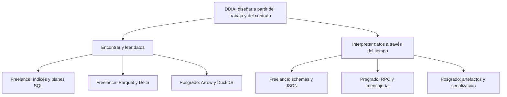
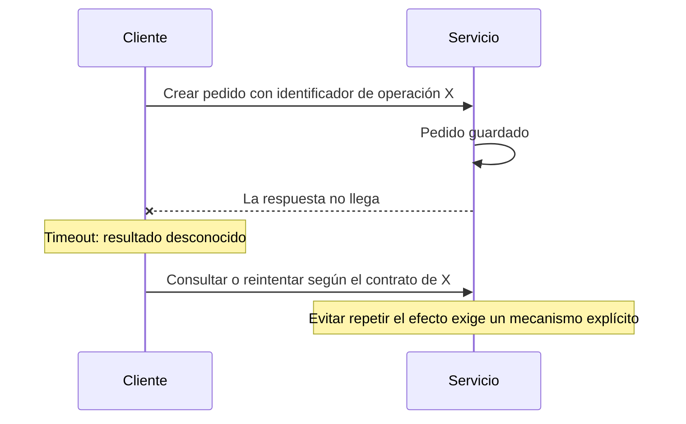

# Conexiones: de tus prácticas a las decisiones de diseño

[[Obsidian/lecturas/Designing Data-Intensive Applications 2a edición/00 Empieza aquí|Inicio del libro]] → [[Obsidian/lecturas/Designing Data-Intensive Applications 2a edición/06 Práctica y repaso/00 Índice|Práctica y repaso]]

Esta nota conecta los temas de **almacenamiento y recuperación** y **codificación y evolución** de *Designing Data-Intensive Applications*, segunda edición, con contenido que ya tienes en freelance, posgrado y pregrado. Las conexiones y los ejercicios son una elaboración didáctica: no son citas del libro ni ejemplos atribuidos a los escaneos.

> [!info] Recuerda antes
> - **Almacenamiento:** pregunta qué trabajo debe hacer el sistema para encontrar y devolver el dato; un plan SQL es la manifestación visible de estructuras y costos físicos.
> - **Evolución:** pregunta si otro programa, quizá de otra versión, entenderá el dato correctamente; validar sintaxis no basta para preservar significado.
> - Una conexión útil no dice solo “estos temas se parecen”: explica qué mecanismo del capítulo aclara una decisión de tus otras notas y dónde deja de aplicar.



## 1. Índices: ahora puedes explicar por qué ayudan y por qué cuestan

**Parte de estas notas:**

- [[Obsidian/freelance/Data Engineering/SQL/02 Índices y filtros eficientes|Índices y filtros eficientes]] explica búsqueda, recuperación de columnas, índices que cubren una consulta y costo de mantenimiento.
- [[Obsidian/freelance/Data Engineering/SQL/03 Planes estadísticas y particiones|Planes, estadísticas y particiones]] distingue filas estimadas de reales y separa indexar de particionar.
- [[Obsidian/pregrado/Documentos/Bases de datos/fundamentos/Indixacion y procesos almacenados|Introducción de pregrado a índices y procedimientos]] presenta la intuición del índice de un libro.

**Lo que aporta DDIA:** baja desde el comando `CREATE INDEX` hasta la organización física que sostiene las consultas. Un árbol mantiene una estructura ordenada que permite encontrar claves y recorrer rangos. Los diseños basados en segmentos ordenados y combinación de segmentos organizan las escrituras de otro modo. Ambos pagan costos, pero los distribuyen de manera distinta entre lectura, escritura, espacio y mantenimiento.

**Ejemplo puente.** `WHERE cliente_id = 123` devuelve diez compras. Encontrar diez entradas del índice no implica que la respuesta esté lista: si necesitas `total` y el índice no lo contiene, el motor debe recuperar ese dato en otro lugar. Tu nota de SQL llama *lookup* a ese trabajo adicional en SQL Server. DDIA permite entenderlo como una separación entre **estructura de acceso** y **datos que componen la respuesta**.

> [!warning] El dibujo de complejidad es una primera aproximación
> Un índice no garantiza que la consulta completa cueste solamente `O(log N)`. También cuentan las coincidencias devueltas, las páginas consultadas, los accesos a la tabla y el resto del plan. Tampoco todos los índices de todos los motores son árboles B.

**Pregunta puente:** si una consulta devuelve el 95 % de una tabla, ¿por qué un recorrido secuencial puede ganar a una gran cantidad de búsquedas y recuperaciones dispersas?

**Para recordar:** **el índice es un mapa; después aún puede tocar viajar**. Si contiene todo lo solicitado, ese viaje adicional puede desaparecer.

## 2. Parquet: la organización por columnas explica el ahorro

**Parte de estas notas:**

- [[Obsidian/freelance/Data Engineering/Spark/08 Formatos particiones y salida|Parquet, JSON, CSV y salida de Spark]] compara contratos físicos y distingue tres sentidos de partición.
- [[Obsidian/posgrado/master/MATEMÁTICAS Y PROGRAMACIÓN IA/numpy pandas parquet arrow|NumPy, Pandas, Arrow y Parquet]] ya usa el ejemplo de leer solo módulo y CO₂ de una tabla de sensores.

**Lo que aporta DDIA:** conecta la consulta analítica con los bytes que es necesario leer. Para sumar una columna de millones de registros, almacenar valores similares juntos permite evitar columnas innecesarias y abre oportunidades de compresión. No basta con decir «Parquet es rápido»: hay que indicar **qué consulta aprovecha su disposición física**.

Parquet divide un archivo en grupos de filas y, dentro de cada grupo, guarda fragmentos por columna; no consiste simplemente en una única tira global por columna. Sus metadatos permiten localizar esos fragmentos. Véase la [estructura oficial de Parquet](https://parquet.apache.org/docs/file-format/).

```text
Consulta: promedio de co2_ppm

Grupo de filas 1                 Grupo de filas 2
[module][hora][co2][oxígeno]      [module][hora][co2][oxígeno]
                ↑                               ↑
         columna solicitada              columna solicitada
```

**Pregunta puente:** si el reporte necesita 2 de 100 columnas, ¿qué lectura puede evitar? Si luego pide las 100, ¿qué parte de esa ventaja deja de existir?

**Para recordar:** **columnas para escoger; compresión para reducir**. Son beneficios relacionados, pero no son la misma operación.

## 3. Delta: organizar bytes y decidir una versión son problemas distintos

**Parte de:** [[Obsidian/freelance/Data Engineering/Spark/09 Parquet y Delta Lake|Parquet y Delta Lake: archivo frente a tabla]]. Allí ya tienes el ejemplo de versión 0 = A + B y versión 1 = A + C.

**Lo que aporta DDIA:** ayuda a separar dos capas. Una determina cómo se organizan los datos para recuperarlos; otra determina qué estado de la tabla debe observar un lector. El hecho de que un archivo esté bien codificado no demuestra que pertenezca a la versión que quieres consultar.

**Ejemplo puente:** B y C pueden ser archivos Parquet válidos. Si C corrige a B, leer ambos puede duplicar registros aunque ninguno tenga errores de formato. La corrección exige interpretar el estado de la tabla, además de decodificar los archivos.

**Pregunta puente:** ¿qué debes conservar para leer una versión antigua: solo la descripción de esa versión o también los archivos a los que apunta?

> [!tip] Tres preguntas, tres capas
> **Parquet:** ¿cómo leo los valores del archivo? **Capa de tabla:** ¿qué archivos forman este estado? **Validación de negocio:** ¿los valores representan bien lo ocurrido?

## 4. Schemas y JSON: leer hoy no demuestra compatibilidad mañana

**Parte de estas notas:**

- [[Obsidian/freelance/Data Engineering/Spark/04 Schemas y DataFrames|Schemas y DataFrames]] diferencia tipo, nulabilidad, conversión y reglas del dominio.
- [[Obsidian/freelance/Data Engineering/Spark/06 Datos anidados y JSON|Datos anidados y JSON]] distingue la estructura lógica del formato textual y del lugar donde viven los datos.

**Lo que aporta DDIA:** añade el tiempo al contrato. No solo existen datos válidos e inválidos: existen **escritores y lectores de versiones distintas**. Un despliegue gradual puede tener ambas versiones funcionando a la vez, y los archivos conservan datos escritos hace años.

```json
{"cliente_id":"123","importe_centavos":1250}
```

Si una versión nueva añade `moneda`, hay que definir cómo leer los registros antiguos que no la contienen y cómo reaccionan los lectores antiguos al campo nuevo. Si cambia `importe_centavos` por un número en dólares conservando el mismo nombre, un parser puede aceptar el registro mientras el consumidor interpreta mal su significado.

| Prueba | Qué comprueba | Qué no demuestra por sí sola |
|---|---|---|
| Parsear un JSON | Sintaxis válida | Unidades, campos requeridos o significado |
| Aplicar un schema | Estructura y tipos esperados | Todas las reglas del negocio |
| Leer con el consumidor actual | Funcionamiento de esa pareja | Compatibilidad con consumidores antiguos |
| Probar lector nuevo con datos antiguos | Compatibilidad hacia atrás de esa combinación | Compatibilidad del lector antiguo con datos nuevos |

En formatos como Protocol Buffers, los números de campo forman parte del contrato binario. Reservar los de campos eliminados evita reutilizarlos accidentalmente; las reglas del formato importan además de los nombres usados en el código. Consulta la [guía oficial de evolución de mensajes](https://protobuf.dev/programming-guides/proto3/#updating).

**Pregunta puente:** si `edad` acepta nulos, ¿eso explica por qué falta, permite inventar un cero o garantiza que un consumidor antiguo acepte ese cambio? Son decisiones distintas.

**Para recordar:** **tipo correcto no garantiza significado correcto; versión nueva no garantiza lector compatible**.

## 5. RPC: la llamada parece local, pero el resultado puede ser incierto

**Parte de:** [[Obsidian/pregrado/Documentos/Computacion ditribuida/Remote Procedure Call (rpc)|Remote Procedure Call]] y [[Obsidian/pregrado/Documentos/Web/WEB RESTful|WEB RESTful]]. La primera explica stubs, marshaling y respuesta; la segunda introduce idempotencia.

**Lo que aporta DDIA:** la semejanza de la interfaz no elimina las propiedades de una red. Una respuesta puede perderse después de que el servidor complete una operación. El cliente observa un timeout, pero eso no prueba que la operación no ocurrió. La documentación de gRPC confirma que cliente y servidor pueden llegar a conclusiones distintas sobre el éxito de una llamada: [ciclo de vida de un RPC](https://grpc.io/docs/what-is-grpc/core-concepts/).



**Pregunta puente:** ¿cómo diseñarías la solicitud para que un reintento del mismo pedido no cree una segunda compra? El identificador debe tener semántica y almacenamiento adecuados en el servidor; añadir una cadena a la petición no resuelve nada por sí solo.

> [!warning] Matiz para releer las notas anteriores
> «Como una función local» describe comodidad de programación, no equivalencia de fallos. Y POST no es idempotente por definición del método, pero una API puede diseñar una operación POST con deduplicación explícita. No concluyas que todo POST necesariamente duplica sus efectos.

**Para recordar:** **timeout significa “no sé”, no “no pasó”**.

## 6. Mensajería: desacoplar el horario no elimina el contrato

**Parte de:** [[Obsidian/pregrado/Documentos/Computacion ditribuida/Sistemas de mensajeria|Sistemas de mensajería y eventos]]. La nota ya distingue colas, tópicos y un registro con offsets.

**Lo que aporta DDIA:** el consumidor puede actualizarse después del productor y procesar mensajes antiguos mucho después de su emisión. Así, el formato y su evolución importan aunque emisor y receptor nunca estén activos a la vez.

**Ejemplo puente:** un evento `ClienteRegistrado` espera horas antes de enviarse por correo. Durante ese tiempo se despliega un consumidor nuevo. Debe poder entender el evento antiguo. Si además se reintenta la entrega, conviene poder reconocer el mismo evento para que el efecto de negocio no se repita indebidamente.

**Pregunta puente:** ¿el evento tiene un identificador estable, una versión interpretable y una definición de qué hacer si falta un campo nuevo?

> [!warning] No memorices garantías universales
> Pub/sub no implica entrega simultánea a todos los consumidores; una cola tampoco vuelve infalible el procesamiento. Retención, confirmación, reentrega y agrupación de consumidores dependen del sistema y la configuración. Para este puente, basta retener que **la compatibilidad sigue siendo necesaria aunque cambie cuándo se lee**.

## 7. Arrow, DuckDB y artefactos: separar representación, persistencia y semántica

**Parte de estas notas:**

- [[Obsidian/posgrado/master/MATEMÁTICAS Y PROGRAMACIÓN IA/pipeline de datos para un producto analitico/03 Arrow, DuckDB y ranking comparable - M11|Arrow, DuckDB y ranking comparable]] separa registrar un objeto, crear una tabla y quitar el registro temporal; también exige revalidar claves después del traslado.
- [[Obsidian/posgrado/master/MATEMÁTICAS Y PROGRAMACIÓN IA/ingenieria de software para machine learning/05 Logging, artefactos, serialización y laboratorio|Logging, artefactos y serialización]] trata hashes, versiones y riesgos de cargar objetos arbitrarios.

**Lo que aporta DDIA:** hace explícitos los límites entre un objeto en memoria, los bytes almacenados y el contrato que interpreta esos bytes. Registrar un objeto para consultarlo no implica persistirlo. Copiar sus columnas no transporta automáticamente todas las restricciones de la base original. Poder abrir un artefacto no prueba que sus unidades o significado coincidan con lo que espera el programa nuevo.

**Ejemplo puente:** el *round trip* Pandas → Arrow → Parquet → lectura demuestra conservación para ese recorrido y entorno. Para estudiar evolución, añade una segunda prueba: escribir con el contrato anterior y leer con el nuevo. Después, si debes mantener clientes anteriores, prueba también la dirección contraria. Ninguna reemplaza las validaciones de identidad y dominio de M11.

**Pregunta puente:** ¿qué falla si un archivo conserva exactamente los mismos bytes y un lector nuevo interpreta `duracion` como milisegundos cuando antes eran segundos? El hash pasa; el significado cambió.

**Para recordar:** **hash para integridad, schema para estructura, contrato para significado**.

## Repaso activo: usa los puentes sin mirar

1. Explica por qué un índice puede localizar rápido y aun así producir una consulta lenta.
2. Dibuja un archivo Parquet con dos grupos de filas y señala qué leerías para una sola columna.
3. Explica por qué archivos válidos pueden producir una tabla incorrecta si mezclas versiones.
4. Propón un cambio compatible de un mensaje y un cambio que conserve tipos pero rompa significado.
5. Cuenta la historia de un pedido guardado cuya respuesta se pierde. ¿Qué sabe realmente el cliente?
6. Diferencia tres comprobaciones: el archivo no cambió, tiene los tipos esperados y representa correctamente el negocio.

> [!success]- Respuestas mínimas para comprobarte
> 1. Faltan recuperar columnas, recorrer coincidencias y ejecutar otros operadores. 2. Un fragmento de la columna por cada grupo pertinente, además de metadatos necesarios. 3. Formato y pertenencia a una versión son capas distintas. 4. Un campo nuevo requiere reglas explícitas para ausencia y lectores anteriores; cambiar unidades sin cambiar tipo rompe significado. 5. Sabe que no recibió respuesta a tiempo; el efecto puede haber ocurrido. 6. Integridad, estructura y semántica son propiedades diferentes.


Para volver a aplicar las conexiones, regresa a [[Obsidian/lecturas/Designing Data-Intensive Applications 2a edición/06 Práctica y repaso/01 Caso práctico de pedidos a analítica|el caso práctico de pedidos a analítica]] o vuelve a [[Obsidian/lecturas/Designing Data-Intensive Applications 2a edición/00 Empieza aquí|la ruta de lectura]].

---

**Anterior:** [[Obsidian/lecturas/Designing Data-Intensive Applications 2a edición/06 Práctica y repaso/02 Glosario y tarjetas de memoria|Glosario y tarjetas de memoria]] · **Índice:** [[Obsidian/lecturas/Designing Data-Intensive Applications 2a edición/06 Práctica y repaso/00 Índice|Ver este bloque]] · **Siguiente:** [[Obsidian/lecturas/Designing Data-Intensive Applications 2a edición/00 Empieza aquí|Volver al inicio]]
