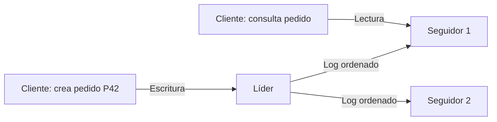

# Por qué replicar y cómo funciona un líder

[[Obsidian/lecturas/Designing Data-Intensive Applications 2a edición/06 Replicación/00 Índice|← Índice del capítulo 6]]

Una **réplica** es otra copia de un conjunto de datos mantenida en una máquina conectada por red. **Replicar** significa mantener esas copias al cambiar los datos. Copiar una carpeta una vez sería suficiente para datos inmutables; en una tienda, cada pedido nuevo, pago y cambio de dirección obliga a actualizar las copias. El problema del capítulo es decidir quién acepta esos cambios, cómo se comunican y qué sucede durante un fallo.

Los pedidos de estas notas son ejemplos propios. Los mecanismos y sus límites se desarrollan a partir del capítulo; las figuras son adaptaciones en español de sus esquemas.

## Qué beneficio buscas

Los objetivos de replicar exigen comprobaciones diferentes:

| Objetivo | Qué aporta una réplica | Qué podría impedirlo |
|---|---|---|
| Disponibilidad | Otra máquina puede responder cuando falla una | No poder elegir un líder seguro o alcanzar suficientes réplicas |
| Durabilidad | El dato puede sobrevivir a la pérdida de una máquina | Confirmar antes de copiarlo a una réplica que sobreviva |
| Latencia | Una copia cercana evita viajes largos por red | Tener que consultar al líder lejano para una lectura actualizada |
| Capacidad de lectura | Varias máquinas comparten las consultas | Que todas las lecturas deban pasar por el líder |
| Trabajo desconectado | Un dispositivo acepta cambios locales | No saber fusionarlos al reconectar |

**Disponibilidad** indica que puedes obtener servicio; **durabilidad**, que lo confirmado no se pierde dentro del modelo de fallos previsto. Una réplica atrasada puede dar servicio sin tener el último pedido. Una copia duradera en una región inaccesible puede conservarlo sin poder atenderte ahora. No deduzcas una propiedad de la otra.

## Réplica y backup resuelven problemas diferentes

Si borras accidentalmente todos los pedidos y ese borrado se replica correctamente, todas las réplicas terminan sin pedidos. Para volver a un estado anterior necesitas un **backup**, una copia histórica recuperable. La réplica reduce la interrupción frente a ciertos fallos; el backup conserva historia para recuperar errores, corrupción o datos eliminados.

Un snapshot inmutable dentro del mismo almacenamiento puede conservar historia, pero comparte algunos riesgos con los datos actuales. Guardar snapshots y logs archivados en otro medio permite una estrategia diferente. No basta con que exista un backup: debes conocer hasta qué momento permite recuperar y comprobar que puedes restaurarlo.

## El líder ordena las escrituras

En **replicación con un líder**, una réplica recibe el papel de líder o primario. Los clientes envían allí las escrituras. El líder modifica su almacenamiento y publica una secuencia de cambios en un **log de replicación**. Un log es un registro ordenado de eventos que las otras réplicas pueden reproducir.

Las demás réplicas son **seguidores**: consumen los cambios y los aplican en el orden del líder. Pueden servir lecturas si la configuración lo permite. Desde el cliente son de solo lectura; eso no significa que su disco nunca cambie, sino que los cambios llegan mediante replicación.

La escritura de P42 entra por el líder y alcanza a los seguidores a través del log. La consulta sale de un seguidor, por lo que su resultado depende de cuánto log haya aplicado. Dos flechas desde el líder significan dos destinos de replicación, no dos líderes que aceptan modificaciones independientes.

El orden importa. Si primero creas un pedido y después lo marcas como pagado, el seguidor debe interpretar la creación antes de la actualización. La arquitectura evita que cada réplica invente su propio orden de cambios aceptados, aunque no evita todos los errores de aplicación, concurrencia de transacciones o fallos de elección.

![[Obsidian/lecturas/Designing Data-Intensive Applications 2a edición/Recursos visuales/Capítulo 06/figura-6-01.png|1000]]

El usuario que modifica la foto envía la escritura al líder. El líder guarda el cambio y lo transmite a sus seguidores, dibujados como cilindros. Otra persona puede consultar un seguidor: recibe la copia que este haya alcanzado a aplicar. Las flechas de replicación transportan cambios de datos; la aplicación no escribe directamente en los seguidores.

Adaptación didáctica del esquema del libro: [[Obsidian/lecturas/Designing Data-Intensive Applications 2a edición/Materiales/06 Replicación.pdf#page=3|PDF 3 · impresa 199 · figura 6-1]].

## El alcance del liderazgo

Un líder es líder de un conjunto de datos. En este capítulo se parte de que cada réplica puede almacenar la base completa. En el capítulo 7, los datos se dividen en **shards** o particiones. Cada shard puede tener un líder distinto. Una máquina puede liderar el shard de pedidos de un grupo de clientes y seguir otro shard. Eso sigue siendo un líder por shard.

**Multilíder** significa que varios líderes aceptan cambios sobre el mismo conjunto de datos. **Sin líder** significa que se escribe y lee mediante varias réplicas sin un líder que establezca ese orden. No cuentes máquinas con el rótulo «líder» sin preguntar qué datos lidera cada una.

## Qué escala y qué no

Ejemplo propio: el líder admite 2 000 escrituras por segundo y hay cuatro seguidores capaces de servir 5 000 lecturas por segundo cada uno. Repartir consultas puede aumentar la capacidad de lectura hacia 20 000 por segundo si la carga, red y consultas lo permiten. No convierte automáticamente las 2 000 escrituras del líder en 8 000: el mismo líder recibe todas y cada seguidor debe reproducirlas.

Además, las réplicas añaden trabajo de red, almacenamiento y aplicación de cambios. El límite real depende de esas tareas. Si consultas muy costosas retrasan la aplicación del log, ganar capacidad nominal de lectura puede empeorar la frescura de la información.

> [!question]- Hay tres copias de un pedido. ¿Se puede afirmar que sobrevivirá a cualquier fallo?
> No. Debes saber qué escritura tienen las copias, cuándo fue confirmada, dónde están y qué fallos pueden afectarlas conjuntamente. Tres copias en una sola zona no protegen contra la pérdida de esa zona.

> [!question]- Una base tiene ocho líderes, uno por shard. ¿Es multilíder?
> No necesariamente. Si cada shard acepta cambios a través de un solo líder, utiliza replicación con un líder por shard. El liderazgo se evalúa sobre los mismos datos.

## Referencias

[[Obsidian/lecturas/Designing Data-Intensive Applications 2a edición/Materiales/06 Replicación.pdf#page=1|PDF 1 · impresa 197]] · [[Obsidian/lecturas/Designing Data-Intensive Applications 2a edición/Materiales/06 Replicación.pdf#page=2|PDF 2 · impresa 198]] · [[Obsidian/lecturas/Designing Data-Intensive Applications 2a edición/Materiales/06 Replicación.pdf#page=3|PDF 3 · impresa 199]] · [[Obsidian/lecturas/Designing Data-Intensive Applications 2a edición/Materiales/06 Replicación.pdf#page=47|PDF 47 · impresa 243]] · [[Obsidian/lecturas/Designing Data-Intensive Applications 2a edición/Materiales/06 Replicación.pdf#page=48|PDF 48 · impresa 244]]. Explicación basada en el escaneo; pedidos, cifras ilustrativas y ejercicios son elaboración propia.

---

[[Obsidian/lecturas/Designing Data-Intensive Applications 2a edición/05 Codificación y evolución/07 Mensajería actores y repaso|← Anterior]] · [[Obsidian/lecturas/Designing Data-Intensive Applications 2a edición/06 Replicación/02 Sincronía confirmaciones y durabilidad|Siguiente →]]
