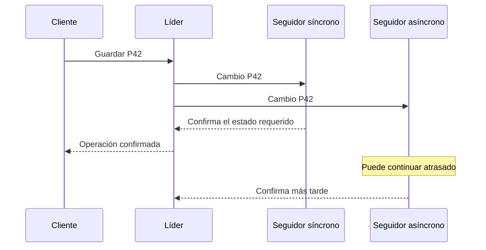

# Sincronía confirmaciones y durabilidad

[[Obsidian/lecturas/Designing Data-Intensive Applications 2a edición/06 Replicación/00 Índice|← Índice del capítulo 6]]

**Replicación síncrona** significa que la confirmación al cliente espera un paso de replicación acordado. **Asíncrona** significa que el líder puede confirmar sin esperar esa respuesta del seguidor. La diferencia decide qué puede perderse y qué operación queda bloqueada cuando un nodo deja de responder.

## La palabra «confirmado» necesita un contrato

Un cambio pasa por varios estados: el líder recibe la petición, registra el cambio, lo envía, el seguidor lo recibe, puede persistirlo y después aplicarlo a su estado consultable. Un **ACK** es un mensaje de confirmación; su significado exacto depende del protocolo. Recibir bytes en memoria, persistirlos y hacerlos visibles a consultas son hitos distintos.

El ejemplo del libro trata al seguidor síncrono como una copia actualizada antes de confirmar. Al evaluar un sistema real debes precisar qué estado exige su modalidad síncrona: recepción, persistencia del log o aplicación. Un `fsync` solicita que los datos pendientes lleguen al almacenamiento persistente según el contrato del sistema; «el proceso recibió el mensaje» no demuestra esa persistencia. Esta distinción es una ampliación didáctica para interpretar correctamente la garantía.

## Un líder con dos seguidores

Supón que L guarda P42, S1 es síncrono y S2 es asíncrono. L espera la confirmación requerida de S1 y entonces responde al cliente. S2 puede seguir atrasado. La confirmación no prueba que toda réplica elegida para leer tenga P42.

La respuesta al cliente depende de S y llega antes de la respuesta de A. El diagrama representa dependencias de mensajes, no tiempos medidos. Si una lectura consulta A en ese intervalo, podría devolver el estado anterior aunque la escritura ya haya sido confirmada.

![[Obsidian/lecturas/Designing Data-Intensive Applications 2a edición/Recursos visuales/Capítulo 06/figura-6-02.png|1000]]

El líder espera la confirmación del seguidor 1 antes de responder al usuario: ese seguidor participa de forma síncrona. La flecha hacia el seguidor 2 tarda más y su confirmación llega después del éxito comunicado al usuario. Esa segunda réplica es asíncrona. Una escritura confirmada, por tanto, no implica que todas las copias estén actualizadas.

Adaptación didáctica del esquema del libro: [[Obsidian/lecturas/Designing Data-Intensive Applications 2a edición/Materiales/06 Replicación.pdf#page=4|PDF 4 · impresa 200 · figura 6-2]].

## Durabilidad frente a disponibilidad

Si L desaparece definitivamente después de confirmar y S1 conserva el cambio de forma duradera, queda una copia con P42. Para preservar esa garantía en el failover debes elegir una réplica que contenga el historial confirmado. Promover arbitrariamente S2 podría abandonar P42.

Si S1 deja de responder, L no puede seguir confirmando bajo el mismo requisito. Puede esperar, fallar peticiones o cambiar qué seguidor participa mediante un procedimiento seguro. No puede ignorar la espera y seguir afirmando exactamente la misma garantía.

El capítulo describe una modalidad **semisíncrona** con al menos un seguidor síncrono y los otros asíncronos. Es una descripción conceptual; las opciones con ese nombre pueden tener contratos diferentes entre productos. Cambiar a otro seguidor síncrono exige que alcance el estado necesario, no solo cambiar una etiqueta.

| Modalidad conceptual | Qué espera la confirmación | Qué ocurre si falla el destino requerido |
|---|---|---|
| Totalmente asíncrona | Trabajo local requerido en el líder | Puede seguir escribiendo, aunque los seguidores se atrasen |
| Un seguidor síncrono | Líder y el seguidor designado | No confirma con la misma garantía hasta recuperarlo o sustituirlo de forma segura |
| Mayoría síncrona | Número acordado de réplicas | Puede avanzar mientras alcance ese número |
| Todos síncronos | Cada réplica requerida | Cualquier réplica no disponible puede detener las escrituras |

## Por qué esperar a todos suele ser problemático

Cuantas más réplicas esperas, más oportunidades hay de que una esté lenta, reiniciándose o aislada. Ejemplo propio simplificado: si cada uno de diez seguidores estuviera disponible con probabilidad 0,99 y sus disponibilidades fueran independientes, la probabilidad de que todos lo estuvieran sería `0,99¹⁰ ≈ 0,9044`. El cálculo ilustra el efecto de exigir todos; no es una estimación real, porque los fallos suelen estar correlacionados.

Una mayoría puede conservar intersecciones entre participantes y tolerar algunas ausencias. Eso no convierte por sí solo un protocolo en consenso: también debe definir orden, elección, épocas y manejo de operaciones incompletas. El capítulo 10 desarrolla esa coordinación; aquí basta con distinguir el requisito de respuestas del algoritmo completo.

## La confirmación asíncrona puede sobrevivir localmente y perderse globalmente

Ejemplo: L confirmó las escrituras 101–105; S1 solo recibió hasta 103. L pierde su almacenamiento y S1 se promueve. Las operaciones 104 y 105 no existen en el nuevo historial. No fue necesario que el cliente recibiera un error para perderlas.

Si L vuelve con su disco, pueden existir dos historiales: el antiguo con 104–105 y el nuevo con otras operaciones. El sistema debe definir qué rama conserva. La existencia posterior de bytes en el antiguo líder no significa que las operaciones sigan formando parte de la base autoritativa.

El retraso habitual de unos milisegundos no es un límite contractual. Una partición de red o sobrecarga puede prolongarlo. Para un pedido quizá sea aceptable demorar una recomendación; para un pago confirmado puede no ser aceptable perder su registro. La elección parte del efecto sobre el usuario y el negocio.

> [!question]- ¿Una escritura síncrona significa que cualquier seguidor puede leerla inmediatamente?
> No. Solo puedes afirmar lo que garantiza la modalidad sobre las réplicas participantes. Un seguidor asíncrono puede estar atrasado; incluso un ACK de persistencia no equivale necesariamente a aplicación visible.

> [!question]- Si el seguidor requerido falla, ¿basta con dejar de esperarlo?
> Eso cambia la garantía. Para conservarla necesitas una sustitución segura que tenga los datos exigidos, o dejar de confirmar operaciones bajo ese requisito hasta poder cumplirlo.

## Referencias

[[Obsidian/lecturas/Designing Data-Intensive Applications 2a edición/Materiales/06 Replicación.pdf#page=4|PDF 4 · impresa 200]] · [[Obsidian/lecturas/Designing Data-Intensive Applications 2a edición/Materiales/06 Replicación.pdf#page=5|PDF 5 · impresa 201]] · [[Obsidian/lecturas/Designing Data-Intensive Applications 2a edición/Materiales/06 Replicación.pdf#page=48|PDF 48 · impresa 244]]. Explicación basada en el escaneo; pedidos, cifras ilustrativas y ejercicios son elaboración propia.

---

[[Obsidian/lecturas/Designing Data-Intensive Applications 2a edición/06 Replicación/01 Por qué replicar y cómo funciona un líder|← Anterior]] · [[Obsidian/lecturas/Designing Data-Intensive Applications 2a edición/06 Replicación/03 Snapshots recuperación y failover|Siguiente →]]
