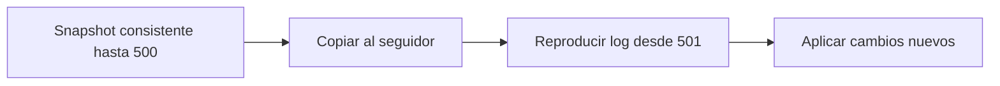

# Snapshots recuperación y failover

[[Obsidian/lecturas/Designing Data-Intensive Applications 2a edición/06 Replicación/00 Índice|← Índice del capítulo 6]]

Una réplica necesita una copia inicial coherente y una forma de ponerse al día. **Snapshot** significa una fotografía consistente del estado de la base en un punto lógico. **Catch-up** significa aplicar los cambios posteriores hasta alcanzar el estado necesario. **Failover** significa transferir el liderazgo cuando el líder falla o se retira.

## Crear un seguidor mientras siguen entrando pedidos

Copiar archivos comunes de una base que está escribiendo puede mezclar épocas. Podrías copiar el registro de un pago después de su actualización y el pedido antes de esa misma actualización. Aunque los dos archivos existan, su conjunto no representa un estado válido.

El procedimiento conceptual del libro tiene cuatro pasos:

1. Obtener un snapshot consistente del líder mediante un mecanismo de la base.
2. Copiarlo al seguidor nuevo.
3. Pedir el log desde la posición exacta asociada al snapshot.
4. Aplicar el atraso y continuar consumiendo los cambios nuevos.

Una **posición de log** identifica hasta dónde llega el historial. PostgreSQL utiliza LSN y MySQL emplea coordenadas del binlog o identificadores de transacción, según el mecanismo. Son ejemplos del capítulo; no son comandos de configuración actuales.

Ejemplo propio: el snapshot incluye los cambios hasta la posición 500. Mientras se copia, el líder llega a 560. El seguidor empieza con el snapshot y aplica 501–560. Omitir 501 pierde un cambio; aplicar incorrectamente un cambio ya incluido puede duplicar un efecto si el mecanismo no evita esa repetición. La frontera entre snapshot y log debe ser exacta.

El snapshot evita copiar todo el pasado como eventos y el log completa lo ocurrido después de la fotografía. Las dos fuentes juntas forman el estado; la flecha desde 501 expresa que la posición 500 ya estaba incluida.

## La recuperación debe ser más rápida que la llegada de trabajo

Si el seguidor estuvo desconectado, conserva una posición local de recuperación. Puede pedir los eventos faltantes si el líder todavía los guarda. Pero tener un procedimiento correcto no asegura que termine pronto.

Ejemplo propio: hay 1 000 000 de eventos pendientes. Entran 2 000 eventos por segundo y el seguidor puede aplicar 5 000 por segundo. La velocidad neta de reducción del atraso es `5 000 − 2 000 = 3 000` eventos/s. El tiempo mínimo idealizado para alcanzarlo es `1 000 000 / 3 000 ≈ 333,3 s`, unos 5,6 minutos. Red, discos y consultas pueden aumentar ese tiempo.

Si solo aplica 1 800 por segundo, el atraso crece a 200 por segundo. Esperar más no soluciona el problema. Necesitas reducir carga o aumentar capacidad efectiva. La recuperación también consume recursos del líder al leer y transmitir el historial.

## Retener el log tiene un costo

Guardar indefinidamente lo que un seguidor no confirmó puede llenar el disco del líder. Borrarlo libera espacio, pero un seguidor muy atrasado ya no puede recuperar desde su posición: necesita otro snapshot. El sistema tiene que equilibrar retención, espacio disponible, restauración y objetivos de recuperación.

Snapshots periódicos y logs archivados pueden servir tanto para crear seguidores como para recuperar backups. Para reconstruir un momento concreto necesitas que la cadena requerida siga disponible y que sus formatos sean compatibles.

## Cuando falla el líder

El failover exige detectar un problema, escoger sucesor y reconfigurar clientes y seguidores. Un **timeout** indica que no llegó respuesta a tiempo; no demuestra que la máquina haya muerto. Puede haber saturación, paquetes demorados o un corte de red con el líder todavía escribiendo para otros clientes.

El sucesor debe contener el historial que el protocolo exige preservar. En una configuración asíncrona, escoger el seguidor más actualizado reduce pérdida posible, pero no elimina la diferencia que nadie recibió. En protocolos con consenso, no basta la mayor posición numérica: importan las reglas de historial y elección del protocolo.

## Split brain y fencing

**Split brain** ocurre cuando dos nodos actúan como líderes del mismo conjunto de datos. Si ambos aceptan cambios sin un mecanismo para conciliarlos, pueden producir historiales incompatibles. Informar al antiguo líder de que ya no manda sirve solo si recibe la noticia y la respeta.

**Fencing** es impedir que el antiguo líder siga realizando acciones autoritativas. Una ampliación conceptual útil es una época o token creciente que el destino de la escritura valida: una operación de una época antigua se rechaza. No implementamos aquí ese protocolo; su función es mostrar que la protección debe hacerse efectiva en el recurso, no depender de la buena voluntad de un proceso aislado.

El libro describe una incidencia histórica en la que promover una réplica atrasada permitió reutilizar identificadores autoincrementales ya usados fuera de la base. La enseñanza es que perder historial afecta también a caches, otros almacenes y referencias externas. Un ID «nuevo» en la réplica puede no ser nuevo en el resto del sistema.

## Elegir tiempos de recuperación

Un timeout muy largo prolonga la interrupción real. Uno muy corto puede disparar failovers cuando solo había lentitud y aumentar la carga justo cuando el sistema está bajo presión. El failover automático puede ser útil, pero necesita reglas verificables de elección y protección del antiguo líder. Un failover manual también puede ser inseguro si promociona una copia incorrecta.

> [!question]- El snapshot tarda veinte minutos en copiarse. ¿Debes detener todas las escrituras durante esos veinte minutos?
> No necesariamente. Un mecanismo de snapshot consistente y una posición exacta permiten continuar escribiendo y reproducir después los cambios. Una copia ordinaria de archivos sin ese mecanismo no ofrece la misma garantía.

> [!question]- El nodo dejó de responder durante treinta segundos. ¿Ya puedes concluir que no aceptará ninguna escritura?
> No. Podría estar vivo al otro lado de un corte de red. Elegir otro líder debe ir acompañado de las reglas que impidan dos autoridades simultáneas.

## Referencias

[[Obsidian/lecturas/Designing Data-Intensive Applications 2a edición/Materiales/06 Replicación.pdf#page=5|PDF 5 · impresa 201]] · [[Obsidian/lecturas/Designing Data-Intensive Applications 2a edición/Materiales/06 Replicación.pdf#page=6|PDF 6 · impresa 202]] · [[Obsidian/lecturas/Designing Data-Intensive Applications 2a edición/Materiales/06 Replicación.pdf#page=8|PDF 8 · impresa 204]] · [[Obsidian/lecturas/Designing Data-Intensive Applications 2a edición/Materiales/06 Replicación.pdf#page=9|PDF 9 · impresa 205]] · [[Obsidian/lecturas/Designing Data-Intensive Applications 2a edición/Materiales/06 Replicación.pdf#page=10|PDF 10 · impresa 206]]. Explicación basada en el escaneo; pedidos, cifras ilustrativas y ejercicios son elaboración propia.

---

[[Obsidian/lecturas/Designing Data-Intensive Applications 2a edición/06 Replicación/02 Sincronía confirmaciones y durabilidad|← Anterior]] · [[Obsidian/lecturas/Designing Data-Intensive Applications 2a edición/06 Replicación/04 Logs físicos lógicos y almacenamiento de objetos|Siguiente →]]
