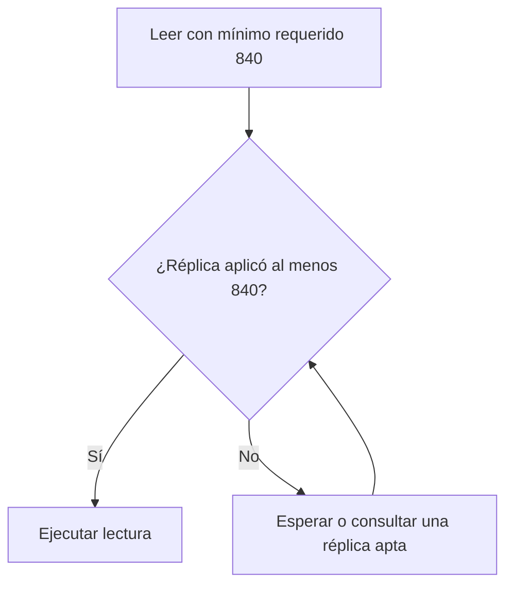

# Retraso y lectura de tus propias escrituras

[[Obsidian/lecturas/Designing Data-Intensive Applications 2a edición/06 Replicación/00 Índice|← Índice del capítulo 6]]

El **retraso de replicación**, o replication lag, es la distancia entre los cambios del líder y el estado aplicado por un seguidor. Puede medirse en posiciones, bytes, eventos o tiempo, según qué exponga el sistema. Mientras exista, una misma consulta puede devolver respuestas diferentes en dos réplicas.

## Eventual no significa «en menos de un segundo»

**Consistencia eventual** significa, en este modelo, que si dejan de producirse cambios y la comunicación y recuperación progresan, las réplicas terminarán coincidiendo. No establece por sí sola un tiempo máximo. La convergencia necesita que los mensajes pendientes y las reparaciones lleguen a completarse.

Un seguidor que normalmente se atrasa 30 ms puede atrasarse minutos si su CPU está ocupada, la red falla o está recuperando un backlog. Un promedio bajo oculta los casos que rompen el comportamiento de la aplicación. Para diseñar el producto necesitas pensar también en retrasos grandes.

## El pedido que parece desaparecer

Ana crea P42 y recibe «guardado». La página siguiente consulta un seguidor al que todavía no llegó la creación y devuelve una lista sin P42. El usuario puede intentar crear otro pedido porque interpreta que el primero se perdió.

En realidad, una ausencia observada no demuestra un borrado ni una escritura fallida. Es una lectura de un estado anterior. Pero distinguirlo internamente no evita el problema del usuario: una interfaz que promete haber guardado y luego muestra lo contrario es difícil de utilizar.

**Lectura de tus propias escrituras**, read-your-writes o read-after-write, exige que las lecturas posteriores de ese usuario reflejen sus cambios confirmados, o un estado posterior que los haya reemplazado legítimamente. No significa que todos vean inmediatamente los cambios de todos.

![[Obsidian/lecturas/Designing Data-Intensive Applications 2a edición/Recursos visuales/Capítulo 06/figura-6-03.png|1000]]

El comentario llega al líder y recibe un OK. La consulta posterior se dirige al seguidor 2 cuando la replicación todavía está en camino, por lo que devuelve una lista vacía. El dato no desapareció: el usuario leyó una copia atrasada. Leer las propias escrituras exige dirigir esa lectura a una réplica que ya haya aplicado el cambio.

Adaptación didáctica del esquema del libro: [[Obsidian/lecturas/Designing Data-Intensive Applications 2a edición/Materiales/06 Replicación.pdf#page=14|PDF 14 · impresa 210 · figura 6-3]].

## Solución 1: elegir la réplica por el dato

Si solo Ana puede cambiar su perfil, puedes leer su perfil del líder y los perfiles ajenos de seguidores. El identificador del propietario permite elegir antes de consultar. Para pedidos compartidos entre comprador, comercio y soporte, esa regla puede ser insuficiente: varias personas modifican la misma entidad.

Si casi todo lo que consulta el usuario puede haber sido modificado por él, enviar esas consultas al líder elimina gran parte del beneficio de repartir lecturas. No es un defecto lógico de la garantía; es el costo de la estrategia elegida.

## Solución 2: una ventana después de escribir

El libro presenta estrategias como consultar al líder durante un intervalo tras la última escritura y excluir seguidores con demasiado atraso. Son útiles si el intervalo y las mediciones cubren el caso real, pero una ventana fija no es una garantía absoluta ante retraso sin límite.

Ejemplo propio: consultas al líder durante 60 segundos. Una avería deja S2 atrasado cinco minutos. Al segundo 61 vuelves a S2 y P42 desaparece. La ventana protegió el caso típico y falló justo cuando el lag fue excepcional.

Puedes ampliar la ventana o usar condiciones reales de progreso. Lo esencial es que la política tenga una respuesta cuando la réplica todavía no alcanzó la escritura, en vez de suponer que ya lo hizo.

## Solución 3: llevar un mínimo de progreso

El cliente recuerda una posición lógica de su escritura, por ejemplo 840. Una lectura solo utiliza una réplica que haya aplicado al menos esa posición. Si S1 está en 845 y S2 en 830, S1 cumple y S2 no. El servicio puede esperar a S2, consultar S1 o consultar el líder.

El número es una frontera lógica de progreso. El ciclo significa que la lectura debe volver a comprobar la condición después de esperar o elegir otro destino; no representa que sea seguro reintentar para siempre. La aplicación necesita un límite de espera y una respuesta definida si no existe réplica apta.

Una posición lógica evita depender de relojes físicos sincronizados. Pero solo tiene sentido dentro del historial que la define. Si hay varios shards, cada uno puede tener su propia posición; el token puede necesitar varias fronteras. Un failover también debe conservar el significado del historial requerido.

## Dos dispositivos complican la sesión

Ana escribe desde el móvil y lee desde el portátil. Guardar el token solo en el móvil no protege la lectura del portátil. Para ofrecer la garantía entre dispositivos debes compartir el contexto necesario, por ejemplo mediante estado de sesión del lado del servicio.

Las redes de cada dispositivo pueden llevarlos a regiones distintas. Si el destino apto está en otra región, la lectura puede requerir un viaje lejano o una espera. **Frescura y cercanía** no siempre se pueden conseguir simultáneamente durante una interrupción.

## Qué medir

Con un log ordenado puedes comparar progreso del líder y seguidores. Una diferencia de 10 000 eventos no se convierte automáticamente en diez segundos: cada evento tiene distinto tamaño y costo. Una métrica temporal también necesita precisar si mide envío, recepción o aplicación consultable.

Como elaboración operativa, registra la antigüedad del dato visible, cuánto tiempo esperan las lecturas por un token y cuántas cambian de réplica. Eso conecta la infraestructura con el síntoma del producto. «El canal de replicación está conectado» no prueba que los usuarios estén leyendo estados suficientemente actuales.

> [!question]- ¿Read-your-writes garantiza que Ana vea ya el cambio de dirección que hizo soporte?
> No por sí sola. Protege los cambios de Ana. Para incluir cambios ajenos necesitas otro requisito o incorporar ese progreso al contexto que la lectura exige.

> [!question]- ¿Consultar siempre al líder evita perder una escritura confirmada durante un failover asíncrono?
> No. Leer del líder actual no recupera un cambio que el antiguo líder confirmó y ningún sucesor recibió. La frescura de lectura y la conservación del historial confirmado son problemas relacionados, pero diferentes.

## Referencias

[[Obsidian/lecturas/Designing Data-Intensive Applications 2a edición/Materiales/06 Replicación.pdf#page=13|PDF 13 · impresa 209]] · [[Obsidian/lecturas/Designing Data-Intensive Applications 2a edición/Materiales/06 Replicación.pdf#page=14|PDF 14 · impresa 210]] · [[Obsidian/lecturas/Designing Data-Intensive Applications 2a edición/Materiales/06 Replicación.pdf#page=15|PDF 15 · impresa 211]] · [[Obsidian/lecturas/Designing Data-Intensive Applications 2a edición/Materiales/06 Replicación.pdf#page=18|PDF 18 · impresa 214]] · [[Obsidian/lecturas/Designing Data-Intensive Applications 2a edición/Materiales/06 Replicación.pdf#page=19|PDF 19 · impresa 215]]. Explicación basada en el escaneo; pedidos, cifras ilustrativas y ejercicios son elaboración propia.

---

[[Obsidian/lecturas/Designing Data-Intensive Applications 2a edición/06 Replicación/04 Logs físicos lógicos y almacenamiento de objetos|← Anterior]] · [[Obsidian/lecturas/Designing Data-Intensive Applications 2a edición/06 Replicación/06 Lecturas monótonas causalidad y garantías|Siguiente →]]
