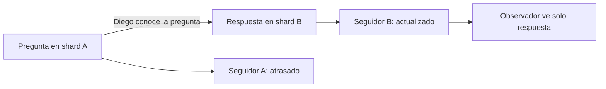

# Lecturas monótonas causalidad y garantías

[[Obsidian/lecturas/Designing Data-Intensive Applications 2a edición/06 Replicación/00 Índice|← Índice del capítulo 6]]

Leer tus propios cambios evita una anomalía específica. Otras dos garantías son **lecturas monótonas** y **lecturas de prefijo consistente**. Conviene definirlas con historias concretas: la primera protege el progreso observado por una sesión; la segunda protege el orden visible de cambios relacionados.

## Lecturas monótonas: el estado no retrocede entre consultas

Luis consulta un pedido en S1 y ve `pagado`. Refresca y un balanceador elige S2, que solo aplicó hasta `pendiente`. Luis ve retroceder la historia. El libro usa la aparición y desaparición de un comentario; el mecanismo es el mismo.

**Monotonía** no significa que el valor numérico siempre aumente ni que un estado comercial nunca pueda cambiar. Un reembolso legítimo puede producir un estado posterior con menor saldo. Significa que una secuencia de lecturas no vuelve a una versión anterior a otra que la sesión ya observó.

Un usuario puede tener lecturas monótonas de un estado atrasado y todavía no ver el último cambio global. Por tanto, monotonía no equivale a frescura absoluta ni a linearizabilidad.

![[Obsidian/lecturas/Designing Data-Intensive Applications 2a edición/Recursos visuales/Capítulo 06/figura-6-04.png|1000]]

La primera consulta del usuario 2345 llega al seguidor 1 y encuentra el comentario. La segunda consulta llega al seguidor 2, que sigue atrasado, y el comentario deja de verse. Las lecturas monótonas impiden este retroceso para una misma persona: una lectura posterior no debe devolver un estado más antiguo que el ya observado.

Adaptación didáctica del esquema del libro: [[Obsidian/lecturas/Designing Data-Intensive Applications 2a edición/Materiales/06 Replicación.pdf#page=17|PDF 17 · impresa 213 · figura 6-4]].

## Mantener afinidad con una réplica

Asignar un usuario siempre al mismo seguidor evita el salto arbitrario entre posiciones distintas, siempre que esa réplica avance y no retroceda por restauraciones u otros cambios. Un hash del ID de usuario puede establecer esa afinidad.

El problema reaparece si la réplica falla y cambias a otra más atrasada. Una mejora conceptual es recordar la posición mínima ya observada. Si Luis vio 930, su siguiente réplica debe haber aplicado por lo menos 930. Si solo hay una en 920, toca esperar o fallar de forma definida; devolverla sin comprobación rompería la garantía.

La afinidad no resuelve por sí sola lecturas que combinan shards con progresos independientes. Cada parte necesita un contexto coherente con lo que la sesión vio y con las dependencias que deba preservar.

## Prefijo consistente: la respuesta no aparece antes que la pregunta

Carla pregunta «¿P42 ya salió?» y Diego, tras leerla, responde «Sí, salió a las 15:00». La respuesta **depende causalmente** de la pregunta: Diego la conoció antes de responder.

Si pregunta y respuesta están en shards distintos, sus seguidores pueden tener retrasos diferentes. Un observador podría recibir la respuesta desde un seguidor rápido y no la pregunta desde otro lento. Aunque ambas escrituras sean válidas, la combinación visible no respeta su causa.

La flecha entre pregunta y respuesta representa conocimiento, no una transmisión directa entre sus tablas. Los seguidores explican por qué una lectura que mezcla ambos estados puede mostrar un efecto cuya causa aún no aparece.

Un **prefijo** de una secuencia es una parte inicial sin saltos: de A, B, C puedes ver nada, A, A–B o A–B–C. No puedes ver B sin A si B depende de A. Con múltiples secuencias independientes no es necesario inventar un orden total entre todo: el problema central es respetar las dependencias pertinentes.

![[Obsidian/lecturas/Designing Data-Intensive Applications 2a edición/Recursos visuales/Capítulo 06/figura-6-05.png|1000]]

Poons escribe la pregunta en el shard 1 y Cake la conoce antes de contestar en el shard 2. La copia del shard 1 tarda más en ponerse al día, mientras la del shard 2 entrega pronto la respuesta al observador. Así, el observador recibe el efecto antes que su causa. Un prefijo consistente o un mecanismo que preserve las dependencias causales evita esa historia incompleta.

Adaptación didáctica del esquema del libro: [[Obsidian/lecturas/Designing Data-Intensive Applications 2a edición/Materiales/06 Replicación.pdf#page=18|PDF 18 · impresa 214 · figura 6-5]].

## Dos estrategias y sus costos

Guardar datos causalmente relacionados en el mismo shard facilita usar el orden común de su log. Por ejemplo, una conversación y sus mensajes pueden compartir clave de partición. Sin embargo, una conversación masiva puede volverse un hotspot y hay dependencias entre entidades que no se pueden agrupar siempre.

Otra estrategia es registrar dependencias: una respuesta lleva el contexto de la pregunta. Antes de exponerla, el lector o sistema comprueba que las causas necesarias sean visibles. Esa información y las esperas añaden complejidad. Más adelante el capítulo explica versiones y vectores como herramientas para capturar conocimiento, sin convertir esta idea en una implementación completa de causalidad entre shards.

## Las tres garantías no son intercambiables

| Garantía | Anomalía que evita | Puede seguir ocurriendo |
|---|---|---|
| Read-your-writes | No ver tu escritura confirmada en una lectura posterior | No ver todavía escrituras de otras personas |
| Lecturas monótonas | Ver primero una versión y después otra más antigua | Estar siempre leyendo un estado atrasado |
| Prefijo consistente | Ver un efecto antes que su causa | No ver aún una secuencia causal completa |

Estas garantías pueden combinarse. No deben tratarse como tres nombres de la misma propiedad. Tampoco sustituyen una transacción: una consulta puede requerir un snapshot coherente de varias filas por razones adicionales al orden causal.

## Regiones y zonas

El recuadro del libro distingue **zona de disponibilidad**, un centro con infraestructura propia, y **región**, una ubicación geográfica que puede agrupar varias zonas. Separar nodos por zonas reduce algunos fallos conjuntos; separar regiones cubre otros escenarios a cambio de mayor distancia de red.

La independencia no es absoluta: un servicio compartido puede afectar varias zonas. Y colocar datos cerca del usuario no demuestra que las escrituras necesarias hayan llegado. El nombre geográfico describe dónde está la infraestructura; el protocolo establece qué estado puede devolver.

## Consistencia fuerte como decisión de producto

El libro señala que las bases distribuidas pueden ofrecer garantías fuertes y transacciones; no hay que asumir que escalar obliga siempre a adoptar consistencia eventual. La elección tiene costos en coordinación, latencia y comportamiento durante interrupciones.

**Linearizabilidad** exige, de forma introductoria, que operaciones parezcan ocurrir atómicamente en un orden que respete su relación temporal real. **Serializabilidad** trata el efecto conjunto de transacciones como si se hubieran ejecutado una a una. Son propiedades diferentes, desarrolladas en capítulos posteriores. Tener un único líder habilita ciertos diseños fuertes, pero el rótulo no prueba que una implementación, una cache o una lectura de seguidor los cumpla.

> [!question]- Luis siempre consulta un seguidor con cinco minutos de atraso, cuyo progreso nunca retrocede. ¿Sus lecturas pueden ser monótonas?
> Sí. La monotonía evita retroceder respecto a lo ya visto; no fija la distancia al presente.

> [!question]- Pregunta y respuesta están en shards distintos. ¿Basta con comparar la hora de ambos mensajes?
> No. Relojes desajustados y retrasos independientes pueden engañar. Necesitas preservar su dependencia o garantizar un estado de lectura que ya incluya la causa.

## Referencias

[[Obsidian/lecturas/Designing Data-Intensive Applications 2a edición/Materiales/06 Replicación.pdf#page=16|PDF 16 · impresa 212]] · [[Obsidian/lecturas/Designing Data-Intensive Applications 2a edición/Materiales/06 Replicación.pdf#page=17|PDF 17 · impresa 213]] · [[Obsidian/lecturas/Designing Data-Intensive Applications 2a edición/Materiales/06 Replicación.pdf#page=18|PDF 18 · impresa 214]] · [[Obsidian/lecturas/Designing Data-Intensive Applications 2a edición/Materiales/06 Replicación.pdf#page=19|PDF 19 · impresa 215]] · [[Obsidian/lecturas/Designing Data-Intensive Applications 2a edición/Materiales/06 Replicación.pdf#page=48|PDF 48 · impresa 244]]. Explicación basada en el escaneo; pedidos, cifras ilustrativas y ejercicios son elaboración propia.

---

[[Obsidian/lecturas/Designing Data-Intensive Applications 2a edición/06 Replicación/05 Retraso y lectura de tus propias escrituras|← Anterior]] · [[Obsidian/lecturas/Designing Data-Intensive Applications 2a edición/06 Replicación/07 Multilíder regiones topologías y orden causal|Siguiente →]]
