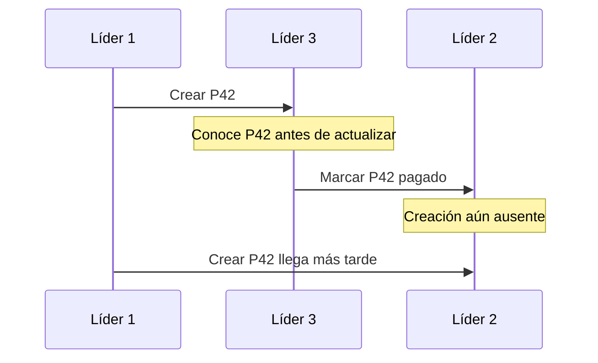

# Multilíder regiones topologías y orden causal

[[Obsidian/lecturas/Designing Data-Intensive Applications 2a edición/06 Replicación/00 Índice|← Índice del capítulo 6]]

En **replicación multilíder**, varios nodos pueden aceptar escrituras sobre el mismo conjunto de datos y comunicar sus cambios a los otros. Cada líder actúa también como receptor de los demás. La variante asíncrona permite seguir trabajando cuando la conexión entre líderes se interrumpe, pero introduce cambios concurrentes que deben resolverse.

## Dos regiones, dos puntos de entrada

Una tienda opera en Quito y Madrid. Con un solo líder en una región, una escritura desde la otra debe viajar hasta él. Con un líder local por región, cada región puede confirmar sus cambios locales y enviarlos después.

Eso reduce la dependencia inmediata de la red entre regiones. No hace que ambas regiones conozcan ya todos los cambios. Un cliente que cambia de región puede leer datos atrasados; dos clientes pueden modificar simultáneamente el mismo pedido.

Dentro de cada región puede existir replicación líder–seguidores y entre líderes replicación asíncrona. Es una composición de mecanismos: no todas las conexiones tienen la misma garantía ni latencia.

![[Obsidian/lecturas/Designing Data-Intensive Applications 2a edición/Recursos visuales/Capítulo 06/figura-6-06.png|1000]]

Cada región tiene un líder que atiende las escrituras de sus usuarios y transmite cambios a una copia local. Las flechas entre regiones conectan los líderes de forma asíncrona. Esa independencia permite seguir trabajando durante una desconexión entre regiones, pero también hace posible que dos líderes cambien el mismo dato antes de conocer el cambio ajeno; por eso aparecen los bloques de resolución de conflictos.

Adaptación didáctica del esquema del libro: [[Obsidian/lecturas/Designing Data-Intensive Applications 2a edición/Materiales/06 Replicación.pdf#page=20|PDF 20 · impresa 216 · figura 6-6]].

## Por qué el caso síncrono no da la misma independencia

Si A debe esperar a B antes de confirmar, un corte entre A y B impide confirmar en A bajo esa regla. Permitir que ambos reciban peticiones no elimina la coordinación necesaria. El libro centra esta sección en multilíder asíncrono porque es donde aparece el beneficio de seguir escribiendo localmente durante una desconexión.

Es una equivalencia práctica para la discusión, no la afirmación de que todos los protocolos síncronos con múltiples receptores sean idénticos internamente.

## Qué restricciones son difíciles

Supón saldo 100. A autoriza retirar 80 sin haber visto nada de B. B autoriza retirar otros 80. Cada decisión local parece válida; el conjunto exige 160. Fusionar registros después no vuelve verdaderas las dos promesas de conservar saldo no negativo.

Con nombres únicos, dos regiones pueden comprobar que `ana` está libre y registrarlo para personas diferentes. Evitar esos casos exige coordinación, asignación previa de autoridad o recursos, o aceptar que alguna promesa pueda rechazarse después. Esta ampliación didáctica explica por qué convergencia y validez del dominio son problemas distintos.

Un único líder por registro puede evitar conflictos entre regiones: los pedidos de cierto cliente siempre se modifican en su región asignada. Si cambias esa región durante un fallo, necesitas una transferencia de autoridad segura; de lo contrario, pueden aparecer dos aceptantes para el mismo registro.

## Las topologías describen caminos de propagación

Una **topología** es la forma de conectar los líderes para comunicar cambios. El capítulo dibuja tres:

| Topología | Propagación | Riesgo principal |
|---|---|---|
| Circular | Cada nodo envía al siguiente | Un nodo o enlace roto interrumpe el recorrido |
| Estrella | Un centro comunica con los demás | El centro puede convertirse en punto crítico |
| Todos con todos | Cada líder comunica con cada otro | Más enlaces y posibles órdenes de llegada diferentes |

En un círculo o estrella, un nodo recibe cambios ajenos y debe reenviarlos. Sin identificación de operaciones o de rutas ya recorridas, los cambios podrían volver una y otra vez. El capítulo explica marcar el recorrido para reconocer cambios ya procesados; otras implementaciones pueden usar distintos mecanismos de deduplicación.

Cuatro líderes conectados por pares tienen `4 × 3 / 2 = 6` enlaces bidireccionales posibles. Con diez son `10 × 9 / 2 = 45`. Ese cálculo propio cuenta pares, no el volumen exacto de mensajes: cada enlace puede transportar muchos eventos y las implementaciones pueden agruparlos.

![[Obsidian/lecturas/Designing Data-Intensive Applications 2a edición/Recursos visuales/Capítulo 06/figura-6-07.png|1000]]

Los cilindros representan líderes y las flechas indican qué nodos transmiten escrituras directamente a cuáles. En el anillo, un cambio pasa de nodo en nodo. En la estrella, un nodo central redistribuye los cambios. En todos con todos, cada líder envía cambios a los demás; hay rutas alternativas, aunque los distintos retrasos de red todavía pueden alterar el orden de llegada.

Adaptación didáctica del esquema del libro: [[Obsidian/lecturas/Designing Data-Intensive Applications 2a edición/Materiales/06 Replicación.pdf#page=22|PDF 22 · impresa 218 · figura 6-7]].

## Más caminos no garantizan el orden correcto

A inserta P42 en L1. L3 recibe la creación y, después de conocerla, acepta marcar P42 como pagado. L2 recibe rápidamente la actualización de L3, pero la creación enviada por L1 sigue demorada. L2 intenta actualizar una entidad que aún no conoce.

La secuencia de entrega a L2 contradice la dependencia de las operaciones. La actualización no es concurrente con la creación: depende de ella. El sistema necesita conservar esa información y aplicar primero la causa, aunque haya recibido antes el efecto.

Poner una hora en cada escritura no basta si los relojes no están perfectamente sincronizados ni si se aplica un evento antes de que llegue su antecedente. Los vectores de versión permiten representar partes del conocimiento causal; su interpretación se desarrolla en la nota 13.

![[Obsidian/lecturas/Designing Data-Intensive Applications 2a edición/Recursos visuales/Capítulo 06/figura-6-08.png|1000]]

La inserción de A llega pronto al líder 3, por lo que B puede incrementar la fila ya creada. Sin embargo, el mensaje original hacia el líder 2 viaja despacio y la actualización lo adelanta. El líder 2 intenta modificar una fila que aún no existe. No son escrituras concurrentes: el UPDATE depende del INSERT, y esa dependencia debe respetarse al aplicar la replicación.

Adaptación didáctica del esquema del libro: [[Obsidian/lecturas/Designing Data-Intensive Applications 2a edición/Materiales/06 Replicación.pdf#page=23|PDF 23 · impresa 219 · figura 6-8]].

## Fallos y costos que no desaparecen

Un centro caído puede separar una estrella; un enlace roto puede interrumpir un círculo. Una topología más conectada permite caminos alternativos, pero la recuperación necesita decidir qué cambios faltan, cómo reenviarlos y cómo evitar duplicados.

Si cada región confirma sin esperar a las otras y una región se pierde definitivamente antes de propagar su log, puede perderse su trabajo reciente. Independencia para seguir escribiendo no equivale a durabilidad geográfica de cada confirmación.

El capítulo menciona productos y extensiones que implementan distintas variantes. Sus nombres son ejemplos del escaneo, no una garantía de configuración actual. Claves autoincrementales, triggers, índices únicos y restricciones requieren revisión específica cuando se añaden varios puntos de escritura.

## La misma idea llega al dispositivo

Un móvil que edita una agenda sin conexión tiene una réplica que acepta cambios. Otro dispositivo puede editar su propia copia. La red entre ellos se comporta como una conexión entre regiones, pero con retrasos de horas o días. Ese es el puente hacia los sync engines y software local-first de la nota siguiente.

> [!question]- Si tienes todos los líderes conectados directamente, ¿puedes aplicar los mensajes según llegan?
> No siempre. Un efecto puede llegar antes que su causa por un camino más rápido. Debes preservar las dependencias o usar un protocolo que garantice el orden requerido.

> [!question]- ¿Resolver dos títulos concurrentes también resuelve dos retiros que consumen el mismo saldo?
> No. Elegir o fusionar títulos es una política de valores. Las dos autorizaciones financieras pueden haber violado una restricción global antes de fusionar los datos.

## Referencias

[[Obsidian/lecturas/Designing Data-Intensive Applications 2a edición/Materiales/06 Replicación.pdf#page=19|PDF 19 · impresa 215]] · [[Obsidian/lecturas/Designing Data-Intensive Applications 2a edición/Materiales/06 Replicación.pdf#page=20|PDF 20 · impresa 216]] · [[Obsidian/lecturas/Designing Data-Intensive Applications 2a edición/Materiales/06 Replicación.pdf#page=21|PDF 21 · impresa 217]] · [[Obsidian/lecturas/Designing Data-Intensive Applications 2a edición/Materiales/06 Replicación.pdf#page=22|PDF 22 · impresa 218]] · [[Obsidian/lecturas/Designing Data-Intensive Applications 2a edición/Materiales/06 Replicación.pdf#page=23|PDF 23 · impresa 219]] · [[Obsidian/lecturas/Designing Data-Intensive Applications 2a edición/Materiales/06 Replicación.pdf#page=24|PDF 24 · impresa 220]] · [[Obsidian/lecturas/Designing Data-Intensive Applications 2a edición/Materiales/06 Replicación.pdf#page=27|PDF 27 · impresa 223]] · [[Obsidian/lecturas/Designing Data-Intensive Applications 2a edición/Materiales/06 Replicación.pdf#page=28|PDF 28 · impresa 224]]. Explicación basada en el escaneo; pedidos, cifras ilustrativas y ejercicios son elaboración propia.

---

[[Obsidian/lecturas/Designing Data-Intensive Applications 2a edición/06 Replicación/06 Lecturas monótonas causalidad y garantías|← Anterior]] · [[Obsidian/lecturas/Designing Data-Intensive Applications 2a edición/06 Replicación/08 Sync engines y software local-first|Siguiente →]]
