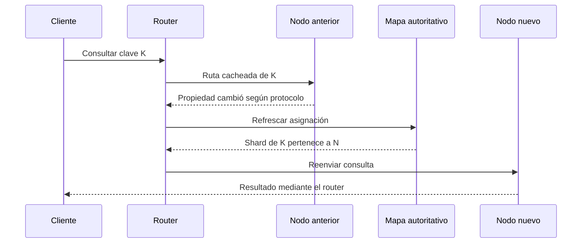

# DDIA — Enrutamiento de peticiones y ejecución de consultas

[[Obsidian/lecturas/Designing Data-Intensive Applications 2a edición/07 Sharding y particionado/00 Índice|↑ Índice del capítulo 7]]

Ya sabemos repartir datos en shards y mover shards entre nodos. Falta la pregunta práctica: si quiero leer o escribir la clave `pedido-83125`, **¿a qué dirección IP y puerto me conecto?** El libro llama a esto **enrutamiento de peticiones** (*request routing*).

## Un traspaso con información de ruta atrasada

El router mantiene una copia de la asignación y puede quedar atrasado durante un traspaso. En este esquema conceptual, el destino anterior comunica el cambio y el router consulta la fuente autoritativa antes de intentar el nodo nuevo. La ruta de retorno se simplifica en la última flecha: la respuesta llega al cliente a través del router. Para una escritura cuyo resultado fue incierto, reintentar exige el contrato de idempotencia y deduplicación correspondiente; el simple cambio de dirección no evita duplicarla. Es una elaboración propia sobre el problema de corte y solicitudes en vuelo del capítulo.

## Parecido al descubrimiento de servicios, pero con estado

El problema se parece al **descubrimiento de servicios** (capítulo 5): encontrar una instancia a la que enviar una petición. La diferencia decisiva es que las instancias de un servicio de aplicación suelen ser **sin estado**, así que un balanceador puede mandar cualquier petición a cualquiera. En una base fragmentada, la petición sobre una clave solo la puede atender **un nodo que tenga una réplica del shard** de esa clave. Por eso el enrutamiento necesita conocer dos asignaciones: **clave → shard** y **shard → nodo**.

## Tres formas de llegar al nodo correcto

La figura 7-7 compara tres enfoques para la misma petición `get "foo"`, donde `"foo"` vive en el nodo 2. En cada dibujo, una marca rayada señala qué componente conoce la asignación de shards a nodos.

1. **Cualquier nodo recibe y reenvía.** El cliente contacta un nodo cualquiera, por ejemplo mediante un balanceador *round-robin*. En la figura elige el nodo 0 al azar. Si ese nodo tiene el shard, responde; si no, reenvía la petición al nodo 2, recibe la respuesta y se la devuelve al cliente. Todos los nodos conocen la asignación.
2. **Capa de enrutamiento.** Todas las peticiones pasan primero por un componente que decide el nodo y reenvía. Esa capa no procesa datos: es un balanceador que conoce los shards. Ella mantiene la asignación para enrutar; el cliente no necesita conocerla. Los nodos de datos también necesitan saber qué shards están autorizados a servir.
3. **Cliente consciente del sharding.** El propio cliente conoce la asignación y se conecta directamente al nodo 2, sin intermediarios.

**Comparación de saltos (elaboración propia):** con el enfoque 1 hay un salto extra cuando el nodo elegido no es el dueño; con 3 nodos y elección aleatoria, eso ocurre 2 de cada 3 veces. El enfoque 2 añade siempre un salto hasta la capa de enrutamiento. El enfoque 3 no añade saltos, pero cada cliente debe mantenerse al día con los cambios de asignación.

![[Obsidian/lecturas/Designing Data-Intensive Applications 2a edición/Recursos visuales/Capítulo 07/07-07-rutas-de-peticiones.png|1000]]

Las tres alternativas buscan la misma clave foo, almacenada en el nodo 2. En la primera, un nodo elegido inicialmente reenvía la petición; en la segunda, una capa de routing elige el nodo; en la tercera, el cliente se conecta directamente. Las bandas rayadas muestran dónde debe estar el conocimiento de la asignación de shards a máquinas. Los cilindros representan el almacenamiento de datos.

Adaptación didáctica del esquema del libro: [[Obsidian/lecturas/Designing Data-Intensive Applications 2a edición/Materiales/07 Sharding.pdf#page=16|PDF 16 · impresa 266 · figura 7-7]].

## Los problemas comunes a los tres

El libro plantea tres preguntas que cualquier diseño tiene que responder:

- **¿Quién decide qué shard vive en qué nodo?** Lo más sencillo es un único coordinador. Pero si su nodo cae, ¿cómo se tolera el fallo? Y si el papel de coordinador puede pasar a otro nodo, ¿cómo se evita un **cerebro dividido** (*split brain*), con dos coordinadores dando asignaciones contradictorias?
- **¿Cómo se entera quien enruta** (un nodo, la capa de enrutamiento o el cliente) de que la asignación cambió?
- **¿Qué pasa durante el traspaso?** Mientras un shard se mueve, hay un periodo en que el nodo nuevo ya se ha hecho cargo pero todavía hay peticiones en vuelo hacia el antiguo. Hay que decidir qué hacer con ellas.

**Ejemplo propio del traspaso.** El shard 17 de pedidos pasa del nodo B al nodo E. Un cliente con información antigua envía «marcar pedido 83125 como pagado» a B justo después del cambio. Si B acepta y escribe, esa escritura puede perderse o chocar con la copia que ya sirve E. Opciones razonables: que B rechace con «este shard ya no es mío» para que el cliente refresque su tabla y reintente en E, o que B reenvíe a E. Lo que no debe pasar es que ambos acepten escrituras como dueños a la vez.

## Servicio de coordinación: ZooKeeper, etcd y Raft integrado

Muchos sistemas distribuidos delegan el registro de la asignación en un **servicio de coordinación** separado, como ZooKeeper o etcd. Estos servicios usan **algoritmos de consenso** (capítulo 10) para tolerar fallos y protegerse del cerebro dividido. El funcionamiento, según la figura 7-8:

1. Cada nodo se registra en ZooKeeper.
2. ZooKeeper mantiene la asignación **autorizada** de shards a nodos.
3. La capa de enrutamiento o el cliente consciente del sharding **se suscriben** a esa información.
4. Cuando un shard cambia de dueño o entra o sale un nodo, ZooKeeper **notifica** a los suscriptores para que actualicen su tabla.

Una ampliación esencial: consenso protege el registro autoritativo, pero no vuelve instantáneas las notificaciones ni borra las caches antiguas de todos los clientes. Durante el traspaso, los nodos deben comprobar su autoridad y rechazar o reenviar peticiones antiguas; las notificaciones por sí solas no son un mecanismo de fencing.

La figura 7-8 muestra una tabla con 12 rangos de claves (los mismos que los tomos de la enciclopedia de la figura 7-2), cada uno con su shard, nodo e IP. Por ejemplo, «Danube» cae en el rango Ceara–Deluc, que es el shard 2, en el nodo 2, con IP 10.20.30.102. Los shards se asignan en rotación a tres nodos: shards 0, 3, 6 y 9 en el nodo 0; 1, 4, 7 y 10 en el nodo 1; 2, 5, 8 y 11 en el nodo 2.

Ejemplos que da el libro, útiles para reconocer arquitecturas y no como descripción actual de cada producto:

| Mecanismo | Sistemas citados |
|---|---|
| ZooKeeper | HBase, SolrCloud |
| etcd | Kubernetes (para saber qué instancia de servicio corre dónde) |
| Servidores de configuración propios + demonios `mongos` como capa de enrutamiento | MongoDB |
| Implementación integrada de Raft | Kafka, YugabyteDB, TiDB, ScyllaDB |

![[Obsidian/lecturas/Designing Data-Intensive Applications 2a edición/Recursos visuales/Capítulo 07/07-08-zookeeper-mapa-shards.png|1000]]

ZooKeeper conserva la asignación autoritativa de los doce rangos a shards, nodos y direcciones IP. Danube está dentro de Ceara–Deluc, por lo que el router envía la petición al nodo 2. Las flechas discontinuas representan registro y actualización del mapa; la flecha sólida representa la petición de datos. ZooKeeper aporta metadatos de coordinación: la lectura del dato se ejecuta en el nodo propietario.

Adaptación didáctica del esquema del libro: [[Obsidian/lecturas/Designing Data-Intensive Applications 2a edición/Materiales/07 Sharding.pdf#page=17|PDF 17 · impresa 267 · figura 7-8]].

## Gossip: la alternativa de Riak

Riak no usa un servicio de consenso, sino un **protocolo de gossip** (chismorreo): los nodos se van contando unos a otros los cambios del estado del clúster hasta que todos los conocen. Es mucho más débil que el consenso: puede haber **cerebro dividido**, con partes del clúster que creen asignaciones distintas para el mismo shard. Las bases **sin líder** (capítulo 6) lo toleran porque de todos modos ofrecen garantías de consistencia débiles, como las de los quórums.

## Encontrar las IP y consultas que abarcan muchos shards

Con capa de enrutamiento o con nodo aleatorio, el cliente aún necesita las IP a las que conectarse. Esas direcciones cambian mucho menos que la asignación de shards, así que suele bastar con **DNS**.

Todo lo anterior trata de encontrar **el** shard de **una** clave, que es lo típico de bases OLTP fragmentadas. Las bases **analíticas** también fragmentan, pero sus consultas suelen tener que **agregar y unir datos de muchos shards en paralelo**, no ejecutarse en uno solo. El libro deja esa **ejecución paralela de consultas** para el capítulo 11.

## El límite: operaciones que tocan varios shards

El diseño buscado es que cada shard funcione **casi independiente**: eso es lo que permite escalar. Las operaciones que escriben en varios shards rompen esa independencia. El resumen del capítulo plantea la pregunta abierta: ¿qué pasa si la escritura en un shard tiene éxito y en otro falla? Las **transacciones distribuidas** existen en algunas bases, pero suelen ser mucho más lentas que las de un solo nodo y pueden limitar el rendimiento de todo el sistema (capítulo 8).

**Ejemplo propio.** Confirmar un pedido descuenta stock (shard del producto) y crea el pedido (shard del cliente). Si solo se completa el descuento de stock, has vendido una unidad que no aparece en ningún pedido. Resolverlo exige una transacción distribuida o un diseño que tolere y repare estados intermedios; el enrutamiento por sí solo no lo arregla.

> [!question]- ¿Por qué un balanceador normal no sirve para una base fragmentada?
> Porque asume que cualquier instancia puede atender cualquier petición. En una base fragmentada solo los nodos con réplica del shard de la clave pueden hacerlo, así que quien enruta necesita conocer las asignaciones clave → shard y shard → nodo.

> [!question]- ¿Qué aporta ZooKeeper que no aporte un gossip?
> Un registro autoritativo de la asignación protegido por consenso y notificaciones de sus cambios. Dos clientes aún pueden conservar caches de edades distintas: para impedir dos dueños efectivos hay que proteger el traspaso y rechazar escrituras de la autoridad antigua. Gossip difunde cambios con garantías más débiles y puede mantener asignaciones divergentes.

> [!question]- ¿Por qué puede bastar DNS para las IP pero no para la asignación de shards?
> Porque las IP de los nodos o de la capa de enrutamiento cambian poco, mientras que la asignación de shards cambia con cada rebalanceo y necesita propagarse con rapidez y de forma coherente.

## Referencias

PDF 15–18 · impresas 265–268 · figuras 7-7 y 7-8; límite entre shards en PDF 3 · impresa 253 y PDF 22 · impresa 272: [[Obsidian/lecturas/Designing Data-Intensive Applications 2a edición/Materiales/07 Sharding.pdf#page=15|PDF 15 · impresa 265]], [[Obsidian/lecturas/Designing Data-Intensive Applications 2a edición/Materiales/07 Sharding.pdf#page=16|PDF 16 · impresa 266 (figura 7-7)]], [[Obsidian/lecturas/Designing Data-Intensive Applications 2a edición/Materiales/07 Sharding.pdf#page=17|PDF 17 · impresa 267 (figura 7-8, gossip)]], [[Obsidian/lecturas/Designing Data-Intensive Applications 2a edición/Materiales/07 Sharding.pdf#page=18|PDF 18 · impresa 268 (DNS y consultas analíticas)]], [[Obsidian/lecturas/Designing Data-Intensive Applications 2a edición/Materiales/07 Sharding.pdf#page=3|PDF 3 · impresa 253]], [[Obsidian/lecturas/Designing Data-Intensive Applications 2a edición/Materiales/07 Sharding.pdf#page=22|PDF 22 · impresa 272]].

---

**Anterior:** [[Obsidian/lecturas/Designing Data-Intensive Applications 2a edición/07 Sharding y particionado/05 Rebalanceo fijo dinámico y proporcional|← Rebalanceo fijo, dinámico y proporcional]] · **Siguiente:** [[Obsidian/lecturas/Designing Data-Intensive Applications 2a edición/07 Sharding y particionado/07 Diseño integrado y decisiones|Diseño integrado y decisiones →]]
