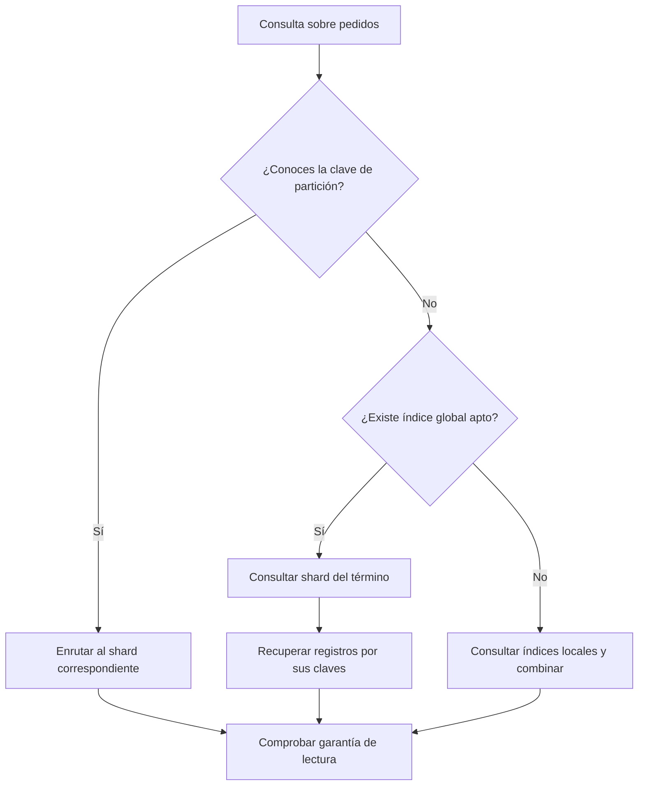

# DDIA — Diseño integrado y decisiones de sharding

[[Obsidian/lecturas/Designing Data-Intensive Applications 2a edición/07 Sharding y particionado/00 Índice|↑ Índice del capítulo 7]]

Las notas anteriores estudian cada pieza por separado. En un sistema real las decisiones se encadenan: la clave de partición condiciona qué consultas son baratas, eso decide qué índices secundarios necesitas, el esquema de reparto limita cómo rebalanceas, y todo junto define qué operaciones cruzan shards. Esta nota recorre esas decisiones en orden con la plataforma de pedidos. El caso es **elaboración propia**; los criterios salen del capítulo.

## Relacionar la consulta con la clave

La clave permite localizar el shard de datos; un término de índice global permite localizar su lista de identificadores, pero recuperar las filas puede requerir varios shards. Sin una ruta específica, la consulta combina respuestas de índices locales. En los tres casos debes comprobar la frescura que necesita el resultado: elegir correctamente el nodo no garantiza que su réplica o índice ya contenga la última escritura. Este diagrama sintetiza las decisiones con el ejemplo propio de pedidos.

## Lo que el capítulo deja establecido

El resumen del libro reduce el tema a pocas ideas:

- Fragmentar es necesario cuando los datos o su procesamiento ya no caben en una máquina. El objetivo es repartir datos **y** consultas de forma pareja, evitando puntos calientes.
- Hay dos enfoques principales. **Por rango de claves**: claves ordenadas, consultas por rango eficientes, riesgo de puntos calientes si se accede a claves cercanas; se rebalancea dividiendo rangos. **Por hash**: se pierde el orden y los rangos sobre la clave son ineficientes, pero la carga se reparte mejor; es habitual crear de antemano un número fijo de shards y mover shards enteros, aunque también se puede dividir.
- Es común usar la **primera parte de la clave** como clave de partición y ordenar por el resto, para seguir teniendo rangos eficientes dentro de la partición.
- El enrutamiento suele apoyarse en un **servicio de coordinación** que conoce la asignación de shards a nodos.
- Los **índices secundarios también se fragmentan**: locales (escritura en un shard, lectura en todos) o globales (escritura en varios, lectura de la lista de IDs en uno).
- Cada shard debe operar casi solo; las escrituras que tocan varios shards son el problema pendiente.

## Paso 1: ¿hace falta fragmentar?

Datos de partida (propios): 6 TB de pedidos que crecen 2 TB al año, picos de 30.000 escrituras por segundo y un nodo que aguanta unas 8.000. Las réplicas no reparten escrituras, así que sí hace falta sharding. Si una máquina almacenara los datos y soportara las escrituras y latencias con margen, convendría mantener el diseño más sencillo; las lecturas pueden repartirse mediante réplicas si sus garantías lo permiten. Un tamaño como 200 GB, por sí solo, no decide la arquitectura.

## Paso 2: elegir la clave de partición mirando las consultas

Se enumeran las consultas frecuentes y se ve qué clave hace barata la mayoría:

| Consulta | Frecuencia | Con clave `cliente_id` | Con clave `fecha_hora` |
|---|---|---|---|
| Ver un pedido de un cliente | Muy alta | Un shard | Un shard si conoces la fecha exacta |
| «Mis pedidos», ordenados por fecha | Muy alta | Un shard, escaneo por rango | Todos los shards |
| Insertar pedido nuevo | Muy alta | Reparte entre clientes | **Shard caliente** del periodo actual |
| Pedidos pendientes de un almacén | Media | Todos los shards o índice | Todos los shards o índice |
| Ventas de ayer, todas las tiendas | Baja, analítica | Todos los shards | Un rango |

Elección: clave compuesta `(cliente_id, fecha_pedido, pedido_id)` con **hash** sobre `cliente_id`. Las inserciones se reparten, «mis pedidos» es un escaneo local y la analítica, que es poco frecuente, se lleva a otro sistema o se acepta que consulte todos los shards.

## Paso 3: detectar claves calientes antes de que aparezcan

Un mayorista con muchísimos pedidos es una clave caliente: el hash no lo arregla, porque su `cliente_id` siempre cae en el mismo shard. Opciones del capítulo: aislarlo en un shard propio (si el esquema es por rangos de hash) o salar su clave solo a él y llevar un registro de claves saladas. Para contadores de ventas de productos en oferta, el salado reparte el registro de incrementos a cambio de leer y sumar todas las subclaves. Autorizar la venta sin superar stock es otra operación: exige coordinación o cuotas seguras asignadas previamente, aunque el contador de lo vendido esté repartido.

## Paso 4: índices secundarios

- «Pedidos pendientes de un almacén»: se consulta a menudo por el panel de operaciones y cada pedido cambia de estado varias veces. Un índice **global** pagaría muchas escrituras distribuidas; uno **local** hace que cada consulta pregunte a todos los shards. Con lecturas moderadas y unos 24 nodos (cada uno consulta en paralelo sus shards locales y devuelve una respuesta), el local es aceptable si se vigila la latencia de cola: la consulta espera al más lento de los 24.
- «Buscar pedido por número de seguimiento»: consulta de valor único, muchas lecturas, una escritura por pedido. Un índice **global** encaja: una lectura a un shard del índice y otra al shard del pedido. Si el índice es asíncrono, la aplicación debe tolerar que un número recién asignado tarde en encontrarse.

## Paso 5: esquema de reparto y rebalanceo

Con hash y crecimiento previsible, la opción sencilla es un **número fijo** de shards. ¿Cuántos? Si se esperan como máximo 60 nodos y se quieren 10–20 shards por nodo al máximo, algo como 720 shards es divisible por muchos tamaños de clúster. Tamaño previsto: con 6 TB, 720 shards dan unos 8,3 GB cada uno; con 20 TB, unos 28 GB. Si no hay forma de estimar el crecimiento, conviene un esquema por **rangos de hash con división dinámica**, asumiendo el coste de dividir shards calientes.

La automatización del rebalanceo se limita: el sistema propone y un humano confirma, y antes del Cyber Monday se rebalancea de forma preventiva. Se desactiva la reacción automática de «nodo lento = nodo muerto» sobre el rebalanceo para evitar fallos en cascada.

## Paso 6: enrutamiento

Se elige una **capa de enrutamiento** suscrita al servicio de coordinación, para que las aplicaciones no tengan que conocer la asignación. Las IP de esa capa se publican en DNS. Durante un traspaso de shard, el nodo antiguo rechaza las escrituras de shards que ya no son suyos para forzar que el enrutador refresque su tabla.

## Paso 7: qué cruza shards y cómo se trata

Crear un pedido y descontar stock tocan shards distintos (cliente y producto). Opciones: transacción distribuida (capítulo 8) aceptando su coste, o rediseñar para que la operación crítica sea local (por ejemplo, reservar stock por separado y confirmar después, con un proceso que libere reservas huérfanas). Lo que el capítulo deja claro es que no hay forma gratuita de que dos shards cambien juntos.

## Señales de que el diseño está fallando

| Síntoma | Causa probable | Nota |
|---|---|---|
| Un nodo al 95 % de CPU y los demás al 20 % | Clave o rango caliente | 02 |
| Consultas por índice cada vez más lentas al añadir shards | Índice local, latencia de cola | 04 |
| Rebalancear tarda horas y degrada todo | Shards demasiado grandes | 05 |
| Datos que «desaparecen» y reaparecen en listados | Índice global asíncrono | 04 |
| Pedidos sin stock descontado o al revés | Escrituras entre shards sin atomicidad | 06 |
| Nodos que caen en cadena tras un pico | Rebalanceo automático con detección de fallos | 05 |

> [!question]- ¿Por qué no elegir `pedido_id` como clave de partición, si identifica cada pedido de forma única?
> Porque la consulta más frecuente es «mis pedidos». Con `pedido_id` los pedidos de un cliente quedarían esparcidos y esa consulta preguntaría a todos los shards. La clave debe elegirse por los patrones de acceso, no solo por la unicidad.

> [!question]- ¿Cuándo preferirías un índice global a uno local?
> Cuando las lecturas por ese atributo dominan sobre las escrituras, las listas de IDs por valor son cortas y puedes tolerar (o evitar con transacciones) el retraso entre registro e índice.

> [!question]- ¿Qué parte del diseño resuelve el problema de crear pedido y descontar stock atómicamente?
> Ninguna de las técnicas de este capítulo. El sharding reparte; la atomicidad entre shards exige transacciones distribuidas o un diseño de la aplicación que tolere estados intermedios, tema del capítulo 8.

## Referencias

Resumen del capítulo en PDF 21–22 · impresas 271–272; criterios de las notas 01–06: [[Obsidian/lecturas/Designing Data-Intensive Applications 2a edición/Materiales/07 Sharding.pdf#page=21|PDF 21 · impresa 271]], [[Obsidian/lecturas/Designing Data-Intensive Applications 2a edición/Materiales/07 Sharding.pdf#page=22|PDF 22 · impresa 272]], [[Obsidian/lecturas/Designing Data-Intensive Applications 2a edición/Materiales/07 Sharding.pdf#page=3|PDF 3 · impresa 253 (cuándo no fragmentar)]].

---

**Anterior:** [[Obsidian/lecturas/Designing Data-Intensive Applications 2a edición/07 Sharding y particionado/06 Enrutamiento y ejecución de consultas|← Enrutamiento y ejecución de consultas]] · **Siguiente:** [[Obsidian/lecturas/Designing Data-Intensive Applications 2a edición/07 Sharding y particionado/08 Laboratorio y repaso resuelto|Laboratorio y repaso resuelto →]]
