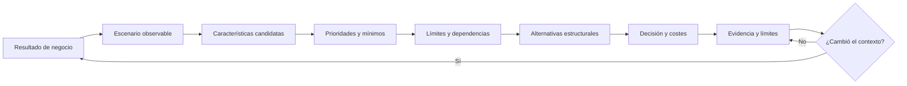

# Método completo para tomar decisiones arquitectónicas

[Inicio del libro](../00%20Empieza%20aqu%C3%AD.md) → [Apoyo y repaso](00%20%C3%8Dndice.md)

Esta nota reúne los cinco capítulos en un método operativo. Es una **síntesis didáctica propia** basada en los conceptos de las 73 páginas disponibles; no añade páginas ausentes ni pretende que exista una receta universal. Úsala después de las notas temáticas o como mapa para saber qué releer.

## La cadena que no debe romperse

Cada enlace exige una justificación. Una decisión desconectada de un resultado puede ser solo una preferencia técnica; una promesa sin evidencia sigue siendo una esperanza; una prueba sin condiciones límite puede ocultar precisamente el pico o fallo relevante.

## Paso 1 · Entender el resultado y el contexto

Empieza por la pérdida o ganancia que importa. «Queremos crecer» puede significar más clientes registrados, más pedidos simultáneos, más locales, más países o cambios más frecuentes. Las cuatro dimensiones del capítulo 1 ayudan a no reducir arquitectura a cajas:

- **Características:** bajo qué condiciones debe tener éxito.
- **Componentes lógicos:** qué responsabilidades y decisiones existen.
- **Estilo:** cómo se organiza la solución como punto de partida.
- **Decisiones:** qué restricciones se adoptan y por qué.

Registra restricciones económicas, de equipo, plazo, regulación y operación. La mejor alternativa cambia cuando cambia el contexto; por eso toda decisión implica compensaciones y su justificación dura más que su mecanismo.

## Paso 2 · Escribir escenarios verificables

Usa la forma **actor + operación + condición/carga + respuesta esperada + medida**. «Alta disponibilidad» no basta. Un escenario útil sería: «durante horario comercial, si el proveedor de mapas no responde en 500 ms, el cliente puede confirmar un pedido con direcciones básicas; se registran el fallo y la degradación».

Distingue hechos, supuestos y preguntas:

| Tipo | Ejemplo | Acción |
|---|---|---|
| Hecho observado | El 55 % de pedidos llega entre 12:00 y 13:00 según ocho semanas. | Conservar fuente, período y segmentación. |
| Supuesto | La próxima promoción multiplicará por cuatro la demanda. | Diseñar prueba o acordar margen; no presentarlo como dato. |
| Pregunta | ¿Cuántos pedidos puede preparar cada local por franja? | Asignar responsable y fecha de respuesta. |

## Paso 3 · Derivar características sin coleccionar «-idades»

Combina requisitos explícitos, preocupaciones de negocio y conocimiento implícito del dominio. Después concreta cada candidata:

- Rendimiento: operación, percentil, carga, datos y punto de medición.
- Escalabilidad: aumento sostenido de carga, recursos añadidos, límite y costo.
- Elasticidad: rapidez para aumentar y reducir capacidad ante cambios.
- Disponibilidad: función accesible, período, exclusiones y criterio de éxito.
- Recuperabilidad: servicio y datos restaurados, RTO, RPO e integridad.
- Modificabilidad/agilidad: tipo de cambio y recorrido completo hasta producción.

Una característica compuesta exige encontrar su cuello de botella. Mejorar programación no crea agilidad si las pruebas y aprobaciones conservan ocho días de espera.

## Paso 4 · Priorizar conductoras y conservar mínimos

Una conductora merece influir en estructura. Un mínimo debe cumplirse, aunque no diferencie alternativas. Una considerada permanece documentada con el hecho que obligaría a revisarla. Limitar el conjunto principal obliga a reconocer costos: optimizar todo simultáneamente produce complejidad y no elimina tensiones.

Preguntas útiles:

1. ¿Qué candidata cambiaría realmente los límites, datos, despliegue u operación?
2. ¿Qué ocurre si la quitamos del top 3?
3. ¿Qué costo introduce optimizarla?
4. ¿Qué mínimo sigue siendo obligatorio?
5. ¿Qué evidencia haría cambiar la selección?

## Paso 5 · Diseñar límites lógicos antes de separar despliegues

Agrupa lo que cambia por la misma razón. Cohesión describe por qué permanece junto; acoplamiento y connascencia describen qué debe coordinarse. Para cada responsabilidad pregunta:

- ¿Quién posee la regla y el estado?
- ¿Quién puede modificarlo?
- ¿Qué significado comparte el contrato?
- ¿Qué sucede durante fallos, reintentos o mensajes fuera de orden?
- ¿Un cambio exige publicar varias partes juntas?

Un componente lógico no necesita servidor propio. Distribuir límites débiles añade red y operación sin crear autonomía. Una aplicación modular puede conservar fronteras claras; servicios separados pueden compartir datos y seguir coordinados de manera rígida.

## Paso 6 · Comparar al menos dos alternativas

No puntúes estilos en abstracto. Compara consecuencias bajo los escenarios acordados:

| Dimensión | Pregunta de comparación |
|---|---|
| Cambio | ¿Qué partes hay que modificar, probar y desplegar juntas? |
| Datos | ¿Quién posee cada estado y cómo se conserva consistencia? |
| Fallos | ¿Qué se degrada y cómo se recuperan estados intermedios? |
| Carga | ¿Dónde está el cuello de botella y qué recurso puede añadirse? |
| Operación | ¿Cuántas unidades, contratos, alertas y procedimientos aparecen? |
| Equipo | ¿La organización puede mantener esa complejidad y repartir conocimiento? |
| Reversibilidad | ¿Qué evidencia permitiría migrar y cuánto costaría hacerlo? |

## Paso 7 · Registrar la decisión y su costo

Un ADR breve contiene contexto, decisión, alternativas, consecuencias, evidencia y disparador de revisión. Escribe también lo que **empeora**. «Elegimos eventos para desacoplar» está incompleto; pueden disminuir dependencias temporales y aumentar complejidad de contratos, observación, orden e idempotencia.

La decisión debe guiar sin dictar detalles innecesarios. Un principio orienta; una decisión restringe. Ambos pierden valor si nadie puede comprobar su cumplimiento o si el arquitecto se convierte en aprobación obligatoria para todo cambio.

## Paso 8 · Diseñar evidencia y revisar

Prueba la hipótesis, no la tecnología en aislamiento. Una prueba de carga necesita mezcla de operaciones, duración, datos, percentiles, errores y dependencias. Un simulacro de recuperación debe restaurar datos utilizables, claves, permisos y procedimientos. Una prueba de aislamiento debe inyectar lentitud y fallos, no solo apagar un servicio de forma limpia.

Señala límites del resultado: una POC reduce incertidumbre concreta; no certifica producción. Una métrica como LCOM, $A$, $I$ o $D$ localiza preguntas; no demuestra por sí sola buen diseño. Reabre decisiones cuando cambien carga, equipo, dominio, costos o evidencia.

## Caso completo · PedidoClaro durante una promoción

**Resultado:** vender durante el almuerzo sin prometer más pedidos de los que cada cocina puede preparar.

**Escenario provisional:** una campaña produce 100 confirmaciones/s durante quince minutos. El p95 debe quedar por debajo de dos segundos y cada local debe rechazar o reprogramar pedidos cuando su capacidad de franja se agota. Mapas puede fallar sin bloquear la compra. Las cifras son supuestos didácticos.

**Conductoras:** elasticidad ante el pico, disponibilidad de confirmar pedidos y simplicidad operativa para un equipo pequeño. **Mínimos:** autorización por local, integridad de precio y pedido, trazabilidad de pago. **Considerada:** internacionalización, hasta que exista una fecha y alcance.

**Límites lógicos:** Pedidos posee el ciclo de vida y el precio aceptado; Preparación posee capacidad por local y franja; Pagos verifica estados del proveedor; Mapas enriquece la navegación, pero no decide si un pedido existe.

**Alternativa A:** aplicación modular, una publicación principal y configuración por local. Favorece operación sencilla y transacciones locales, pero escala toda la unidad y exige disciplina para conservar límites.

**Alternativa B:** servicios separados para Pedidos y Preparación. Permite escalar y desplegar ciertas responsabilidades de forma independiente, pero introduce comunicación remota, estados intermedios, observabilidad y reconciliación.

**Decisión provisional:** comenzar modular, medir el cuello de botella y proteger contratos internos. Separar Preparación si su escala o ciclo de cambio demuestra independencia suficiente. No se afirma que esta elección sea universal.

**Evidencia:** prueba de quince minutos con mezcla documentada; cocina saturada; mapas lento y caído; respuesta perdida seguida de reintento; restauración desde copia. Registrar p95, errores, pedidos duplicados, compromisos imposibles y trabajo manual de operación.

**Disparadores:** incumplimiento medido, equipos independientes, expansión internacional confirmada o reglas por franquicia que ya no puedan tratarse como datos/configuración.

## Errores que este método intenta evitar

> [!danger] Atajos engañosos
> - Elegir microservicios, eventos o nube antes de definir el problema.
> - Confundir muchas cajas con modularidad.
> - Diseñar con promedios e ignorar picos y colas.
> - Declarar todas las características «prioridad máxima».
> - Mejorar una métrica sin demostrar menor costo de cambio o mejor comportamiento.
> - Ocultar supuestos dentro de diagramas o cifras precisas.
> - Registrar solo beneficios y llamar «decisión» a una preferencia.
> - Hacer que el arquitecto sea la única persona capaz de implementar o aprobar.

## Comprobación final

1. ¿Por qué un escenario debe preceder a una decisión?
2. ¿Qué diferencia una conductora de un mínimo?
3. ¿Por qué separar despliegues no garantiza bajo acoplamiento?
4. ¿Qué debe contener una prueba para refutar una hipótesis arquitectónica?
5. ¿Cuándo debe reabrirse una decisión?

> [!success]- Respuestas orientativas
> 1. Porque define el comportamiento y condiciones que justifican el costo; sin él no sabemos qué optimizar. 2. La conductora domina decisiones estructurales; el mínimo debe cumplirse aunque no las diferencie. 3. Puede persistir coordinación por contratos, datos, tiempo o despliegue conjunto. 4. Carga/fallo representativo, medida y umbral, observaciones de error y límites conocidos. 5. Cuando cambian contexto o evidencia, o se alcanza el disparador registrado.

---

[← Índice de apoyo](00%20%C3%8Dndice.md) · [Practicar en el laboratorio](02%20Laboratorio%20integrador.md) · [Consultar el glosario](03%20Glosario%20y%20repaso.md)
