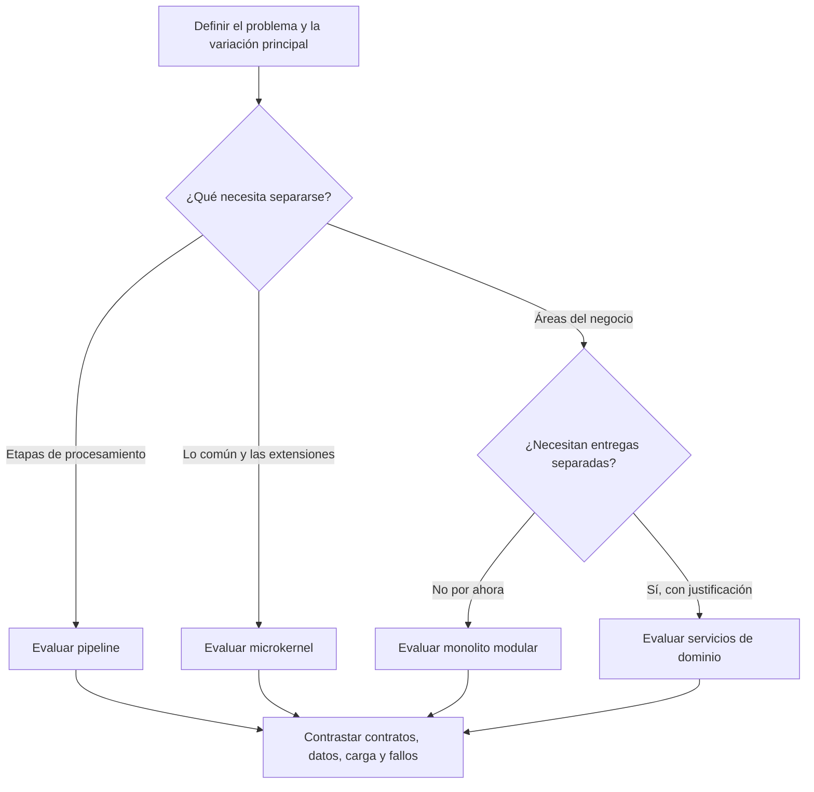

# Módulos, filtros, plugins y servicios: qué separa cada estilo

[[Obsidian/lecturas/Fundamentals of Software Architecture/00 Empieza aquí|← Inicio del libro]] · [[Obsidian/lecturas/Fundamentals of Software Architecture/06 Apoyo y repaso/00 Índice|Apoyo y repaso]]

**Los estilos de los capítulos 11–14 separan el software por razones distintas.** Entender la diferencia exige preguntar qué se agrupa, qué puede cambiar sin tocar el resto, qué se publica junto y qué dependencias siguen compartidas. Una caja llamada «módulo», «filtro» o «servicio» no responde por sí sola a esas preguntas.

Esta comparación es una elaboración propia apoyada en los capítulos recibidos. No añade un capítulo nuevo del libro ni reconstruye secciones ausentes. Los ejemplos de PedidoClaro son didácticos.

## 1. Cuatro formas de organizar una misma aplicación

En el monolito modular, los bloques azules representan áreas del negocio dentro de una entrega común. En pipeline, los bloques son etapas y las flechas indican el avance del dato. En microkernel, el verde es el núcleo que coordina y el amarillo son extensiones para variaciones concretas; las flechas representan llamadas iniciadas por el núcleo, aunque los resultados se devuelvan por su contrato. En la arquitectura basada en servicios, los bordes gruesos rodean entregas separadas: la interfaz accede a servicios de dominio que en esta variante usan una base compartida. Los bordes separan despliegues; el color diferencia responsabilidades, no procesos.

La imagen muestra variantes típicas. El libro admite un pipeline distribuido, plugins remotos y una arquitectura basada en servicios con varias bases o interfaces. Cambiar esa topología requiere volver a evaluar dependencias y costos; el diagrama no impone una única implementación posible.

| Estilo | Primera pregunta que resuelve | Criterio de separación | Dependencia que conserva |
|---|---|---|---|
| Monolito modular | ¿A qué área del negocio pertenece esta función? | Dominios o subdominios | Una entrega compartida y contratos entre módulos |
| Pipeline | ¿Qué tarea del procesamiento hace esta etapa? | Leer, seleccionar, transformar, terminar | Contratos y orden del flujo |
| Microkernel | ¿Qué parte es común y qué parte varía? | Núcleo y extensiones | Contrato del núcleo con sus plugins |
| Basada en servicios | ¿Qué capacidad de dominio merece su propia entrega? | Servicios relativamente grandes por dominio | Contratos de red y, si existe, base compartida |

## 2. Un ejemplo de PedidoClaro en cada estilo

### Monolito modular: reunir lo que cambia por negocio

PedidoClaro puede tener módulos `pedidos`, `pagos` y `envios`, cada uno con sus reglas y acceso a datos. Cambiar la forma de cancelar pedidos debería concentrarse en `pedidos`, si sus fronteras están bien protegidas. Publicar el cambio sigue requiriendo entregar la aplicación completa.

El beneficio es localizar decisiones y código por negocio. El costo aparece cuando un cambio técnico transversal —por ejemplo, sustituir una tecnología que usa cada módulo— debe repetirse en todos ellos. Un módulo también puede perder su independencia lógica si otros acceden libremente a sus clases o tablas internas.

### Pipeline: repartir un procesamiento en tareas

La importación diaria de pedidos puede encadenar lectura → validación → cálculo → persistencia. El cálculo trabaja sobre registros válidos y no necesita saber si llegaron desde CSV o desde otra fuente. Cambiar el origen conserva el cálculo si el lector nuevo entrega el mismo contrato.

Aquí las cajas no representan áreas completas del negocio: representan tareas del recorrido. Cambiar el orden o introducir una dependencia de ida y vuelta puede afectar varias etapas. La separación es útil cuando el trabajo progresa con pasos conocidos; una negociación continua entre participantes obliga a revisar los límites o el estilo.

### Microkernel: concentrar variaciones en plugins

PedidoClaro puede tener un núcleo que recoge la solicitud, valida la información común, selecciona una estrategia y prepara la respuesta. Un plugin para cada franquicia aplica una regla promocional específica. Añadir una regla de franquicia no debería exigir llenar el núcleo de condicionales si el contrato ya permite expresar esa variación.

El núcleo no es «todo lo importante» ni necesariamente unas pocas líneas. Conserva lo común; los plugins contienen lo que conviene variar. Si el núcleo conoce las clases internas y las excepciones particulares de todos los plugins, la extensión existe en el dibujo pero la variación sigue mezclada.

Que un plugin sea reemplazable conceptualmente no demuestra que pueda reemplazarse en producción sin republicar. Los plugins integrados en compilación pueden exigir una entrega completa; los cargados en ejecución requieren un mecanismo de descubrimiento, compatibilidad y gestión de su ciclo de vida. El capítulo 13 desarrolla ambas opciones.

### Basada en servicios: publicar capacidades de dominio por separado

PedidoClaro puede publicar Pedidos, Pagos y Envíos como servicios separados. Cada uno puede contener varios componentes y sus propias capas. «Servicio grande» significa que reúne una capacidad sustancial del dominio; no significa que su código deba ser una función gigante.

El servicio Pedidos puede cambiar internamente y publicarse sin republicar Pagos si respeta los contratos y los datos que este necesita. Esa condición es decisiva. Si Pagos lee directamente las mismas tablas o necesita una versión nueva del API, el cambio requiere coordinación aunque ambos ejecutables estén separados.

La base compartida simplifica algunas operaciones y evita distribuir todo el almacenamiento desde el comienzo, pero introduce una dependencia común. El capítulo 14 enseña a limitar la propagación de cambios mediante una organización y un gobierno explícitos de los datos.

## 3. «Independiente» necesita un complemento

Las cuatro filas distinguen cambiar el código, publicar una pieza, cambiar datos y contener fallos. Cada una necesita una protección distinta. Un filtro puede ser fácil de modificar y seguir publicándose dentro de un monolito. Un servicio puede publicarse por separado y seguir condicionado por un esquema compartido. Un plugin puede cargarse en ejecución y seguir compartiendo memoria con el núcleo. La frase «es independiente» queda incompleta hasta indicar cuál de esas dimensiones se ha conseguido y bajo qué condiciones.

| Afirmación | Evidencia necesaria | Lo que no basta |
|---|---|---|
| «El cálculo está aislado» | Contrato claro y ausencia de acceso a detalles internos ajenos | Un archivo con nombre distinto |
| «Puedo desplegar el servicio solo» | Compatibilidad con consumidores y datos de producción | Un ejecutable separado |
| «Puedo cambiar esta tabla solo» | Accesos conocidos y transición compatible | Que la tabla esté en un esquema de nombre propio |
| «El plugin no derriba al núcleo» | Aislamiento de ejecución y recursos o controles de fallo apropiados | Una interfaz o una anotación |

Los **quanta** se estudian con esa misma disciplina: cuentan unidades con independencia relevante y sus dependencias, no cajas de responsabilidad. La ficha monolítica de pipeline presenta un quantum. El capítulo de microkernel también mantiene un quantum en su ejemplo de plugins remotos que necesitan al núcleo. En arquitectura basada en servicios, una base compartida puede vincular servicios que sí tienen publicaciones separadas. Por eso no se deduce el número de quanta contando servicios ni bases sin examinar sus relaciones.

## 4. Elegir empieza por el cambio que importa

La primera decisión parte del motivo de separación. La segunda pregunta, en la rama del negocio, distingue organización lógica de publicación. Todas las rutas llegan a contrastar restricciones: un estilo que localiza cambios puede seguir siendo inadecuado para el volumen o el aislamiento requerido. El diagrama plantea candidatos, no una selección automática.

Tampoco hay que elegir un estilo para cada línea del sistema. El interior de un servicio de dominio puede usar módulos; una importación dentro de ese servicio puede usar pipeline; una variación específica puede encapsularse mediante plugins. El límite externo y la estructura interna resuelven preguntas diferentes. La combinación requiere fronteras explicables, para que el nombre del estilo no sustituya el análisis.

## 5. Tres ejercicios de contraste

> [!question]- Una importación cambia de CSV a JSON. ¿Qué candidato concentra mejor el cambio?
> Pipeline permite sustituir el productor que interpreta el formato y conservar validación, cálculo y salida si el contrato intermedio no cambia. «JSON» por sí solo no decide la arquitectura completa del negocio; describe la variación de esta parte del procesamiento.

> [!question]- Una franquicia añade una regla promocional distinta cada mes. ¿Qué candidato reduce condicionales comunes?
> Microkernel puede aislar reglas en plugins detrás de un contrato. El núcleo mantiene la selección y lo común. Si cada regla exige alterar el contrato del núcleo, la frontera de extensión debe revisarse antes de atribuirle facilidad de evolución.

> [!question]- Pedidos debe publicarse semanalmente y Envíos mensualmente. Ambos leen la misma tabla que va a cambiar. ¿Separar servicios resuelve todo?
> Facilita separar entregas, pero el cambio de tabla conserva una coordinación de datos. Hay que conocer sus lectores y definir una transición compatible. No basta con tener dos procesos para demostrar independencia en todos los cambios.

## Fuentes y relación con la guía

- [[Obsidian/lecturas/Fundamentals of Software Architecture/11 Monolito modular/00 Índice|Capítulo 11 · Monolito modular]]: organización por negocio con entrega común.
- [[Obsidian/lecturas/Fundamentals of Software Architecture/12 Arquitectura pipeline/00 Índice|Capítulo 12 · Pipeline]]: filtros, contratos y recuperación.
- [[Obsidian/lecturas/Fundamentals of Software Architecture/13 Arquitectura microkernel/00 Índice|Capítulo 13 · Microkernel]]: núcleo, plugins, registro y variantes.
- [[Obsidian/lecturas/Fundamentals of Software Architecture/14 Arquitectura basada en servicios/00 Índice|Capítulo 14 · Basada en servicios]]: servicios gruesos, datos y decisiones.
- [[Obsidian/lecturas/Fundamentals of Software Architecture/Materiales/10 Arquitectura microkernel.pdf#page=2|Capítulo 13 · PDF 2–8 · impresas 194–200 · figuras 13-1 a 13-7]].
- [[Obsidian/lecturas/Fundamentals of Software Architecture/Materiales/11 Arquitectura basada en servicios.pdf#page=1|Capítulo 14 · PDF 1–10 · impresas 209–218 · figuras 14-1 a 14-7]].

Las dos imágenes son diagramas originales, no figuras copiadas. Su generador se conserva en `Recursos visuales/Comparación capítulos 11 a 14/generar_comparacion.py`. La comparación no asigna puntuaciones nuevas ni convierte las estrellas del libro en datos medidos.

---

[[Obsidian/lecturas/Fundamentals of Software Architecture/06 Apoyo y repaso/00 Índice|← Apoyo y repaso]] · [[Obsidian/lecturas/Fundamentals of Software Architecture/14 Arquitectura basada en servicios/00 Índice|Estudiar el capítulo 14 →]]
