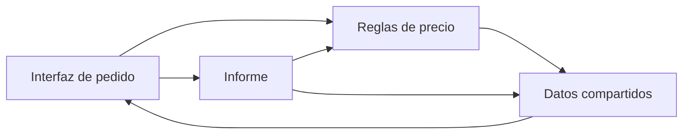

[[Obsidian/lecturas/Fundamentals of Software Architecture/09 Fundamentos de estilos arquitectónicos/00 Índice|← Índice del capítulo 9]]

# Estilos, patrones y estructura

**La arquitectura necesita un vocabulario que explique cómo se organiza el sistema y qué costos introduce esa organización.** Un nombre como «microservicios» es útil si comunica esas decisiones; resulta peligroso si sustituye su análisis.

## 1. Qué describe un estilo

Un **estilo arquitectónico** reúne una organización reconocible de componentes, relaciones y decisiones físicas. El capítulo lo caracteriza mediante cinco dimensiones:

| Dimensión | Pregunta concreta | Ejemplo didáctico |
|---|---|---|
| Topología de componentes | ¿Qué partes existen y quién depende de quién? | Presentación depende de negocio; negocio accede a persistencia |
| Arquitectura física | ¿El código se entrega junto o en unidades distribuidas? | Un ejecutable modular frente a varios servicios |
| Despliegue | ¿Cuál es la unidad de entrega y qué coordinación necesita? | Publicar todos los módulos juntos o desplegar servicios separados |
| Comunicación | ¿Cómo colaboran las partes? | Llamada local, petición remota o mensaje |
| Topología de datos | ¿Cómo se organizan y comparten los datos? | Base común, esquemas delimitados o almacenes propios |

La frecuencia de entrega habitual de un estilo no es una garantía. Un monolito puede automatizar despliegues frecuentes; tener servicios separados no concede autonomía si cada cambio obliga a publicarlos juntos. Conviene diferenciar la **posibilidad estructural** de la capacidad que el equipo consigue en la práctica.

Un **patrón** captura una solución aplicable a un problema dentro de un contexto. «Capas» puede aparecer como parte de un estilo completo o como patrón dentro de un módulo. La distinción del libro busca precisión al discutir el alcance; en otras fuentes los términos pueden solaparse. Cuando alguien dice «patrón de arquitectura», pide que describa qué organiza y bajo qué condiciones.

**Ejemplo propio.** Una aplicación de pedidos tiene módulos Pedidos, Inventario y Entrega, un despliegue y una base de datos. «Monolito modular» describe su organización general. Dentro de Pedidos, separar adaptación HTTP, reglas y persistencia describe otra decisión de menor alcance. Ningún nombre demuestra por sí solo que existan buenas fronteras.

**Fuente:** PDF pp. 2–3, impresas 131–132.

## 2. Los estilos surgen de problemas y capacidades

Los estilos no nacen de un comité que decide cuál será obligatorio. Se consolidan cuando una combinación de prácticas y herramientas permite resolver ciertos problemas y otros equipos reconocen la solución. El libro usa microservicios para relacionar avances de automatización operativa, plataformas y diseño orientado al dominio.

La consecuencia práctica es doble: hay que comprender **qué problema motivó un estilo** y **qué capacidades presupone**. Copiar su forma sin disponer de observabilidad, automatización o límites adecuados puede conservar sus costos y perder sus beneficios. «Micro» tampoco significa reducir cada servicio al mínimo número de líneas: la frontera necesita una responsabilidad coherente.

## 3. Big Ball of Mud: cuando los cambios se propagan sin límites claros

Una *Big Ball of Mud* es una estructura que ha crecido con dependencias difíciles de comprender y límites erosionados o inexistentes. Puede aparecer por decisiones acumuladas bajo presión, no necesariamente por falta de conocimiento individual. Un sistema de pocos archivos también puede desarrollar este problema; un monolito grande no lo tiene automáticamente.

En la figura 9-1, los puntos del perímetro representan clases y las conexiones muestran su acoplamiento; las líneas más fuertes indican vínculos más fuertes. La imagen no es un mapa de servidores. Su mensaje es que modificar una pieza obliga a considerar muchas consecuencias difíciles de anticipar.

En este esquema propio, las flechas expresan dependencias. El ciclo A → B → C → A dificulta cambiar una pieza de forma aislada. Informe depende tanto de reglas como de datos y además es llamado por la interfaz. El dibujo no demuestra que cada dependencia sea incorrecta: señala dónde investigar responsabilidades, ciclos y efectos de cambio. Es una ilustración conceptual, no una reproducción de la figura 9-1.

Una salida razonada empieza por observar cambios reales, identificar reglas que deberían tener dueño y proteger fronteras mientras se refactoriza. Separar el mismo entramado en servicios puede transformarlo en un sistema distribuido que sigue exigiendo coordinación global.

**Fuente:** PDF pp. 4–5, impresas 133–134, figura 9-1.

## 4. De una máquina a cliente/servidor y tres niveles

El capítulo recorre tres formas históricas para mostrar cómo aparecen fronteras:

- **Unitaria:** el sistema se ejecuta esencialmente en una máquina; es una unidad física, no una prueba de ausencia de módulos.
- **Cliente/servidor:** separa interacción y procesamiento o datos. Sus variantes incluyen escritorio con servidor de base de datos, navegador con servidor web y cliente JavaScript rico.
- **Tres niveles:** distingue presentación, procesamiento de aplicación y datos. Herramientas y protocolos históricos facilitaron esa colaboración remota.

Aquí conviene distinguir **capa lógica** de **nivel físico**. Tres responsabilidades no implican tres máquinas, y una aplicación monolítica puede usar una base remota. El propio libro advierte una ambigüedad de vocabulario: algunos llaman «dos niveles» al conjunto navegador/backend aun cuando el servidor de datos esté separado. Un diagrama con límites explícitos comunica más que el número aislado.

## 5. Qué aprender de la observación sobre Java

El recuadro de la impresa 136 utiliza la serialización de Java para advertir que una decisión ligada a una moda arquitectónica puede durar mucho más que esa moda. **La lección de diseño es válida, pero la afirmación de que todo objeto Java implementa una interfaz que exige serialización es incorrecta.**

La documentación oficial establece que una clase habilita esa capacidad al implementar `java.io.Serializable`; también puede heredar esa implementación. `java.lang.Object` no implementa esa interfaz. Por ello no se puede deducir que cualquier objeto sea serializable. Ver [API oficial de Serializable](https://docs.oracle.com/en/java/javase/25/docs/api/java.base/java/io/Serializable.html) y [explicación técnica publicada por Oracle](https://www.oracle.com/technical-resources/articles/java/serializationapi.html).

La conclusión útil es conservar opciones: una decisión profundamente incorporada al lenguaje, contrato o modelo de datos puede imponer costos de compatibilidad futuros. La simplicidad necesita evaluarse por la facilidad de cambiar sin romper consumidores, no solo por lo rápido que resulta programar hoy.

**Fuente:** PDF pp. 5–7, impresas 134–136; precisión técnica contrastada con Oracle.

> [!question] ¿Un sistema con una base de datos es necesariamente monolítico?
> No. La unidad de despliegue del código y la organización de los datos son dimensiones distintas. Varios servicios pueden compartir una base; hay que analizar el acoplamiento que eso introduce.

> [!question] ¿Un patrón dentro de un módulo cambia automáticamente el estilo del sistema?
> No. Puede mejorar la organización local sin modificar el límite de despliegue, la comunicación entre módulos ni la partición de primer nivel.

## Fuente principal

- [[Obsidian/lecturas/Fundamentals of Software Architecture/Materiales/06 Fundamentos de estilos arquitectónicos.pdf#page=2|Fundamentals of Software Architecture, 2.ª ed., capítulo 9, PDF pp. 2–7; impresas 131–136]].

Las explicaciones, diagramas y ejemplos identificados como propios son elaboraciones didácticas; las páginas indicadas permiten contrastar los conceptos con el escaneo.

---

[[Obsidian/lecturas/Fundamentals of Software Architecture/09 Fundamentos de estilos arquitectónicos/00 Índice|← Índice del capítulo 9]] · [[Obsidian/lecturas/Fundamentals of Software Architecture/09 Fundamentos de estilos arquitectónicos/02 Partición técnica y por dominio|Siguiente →]]
