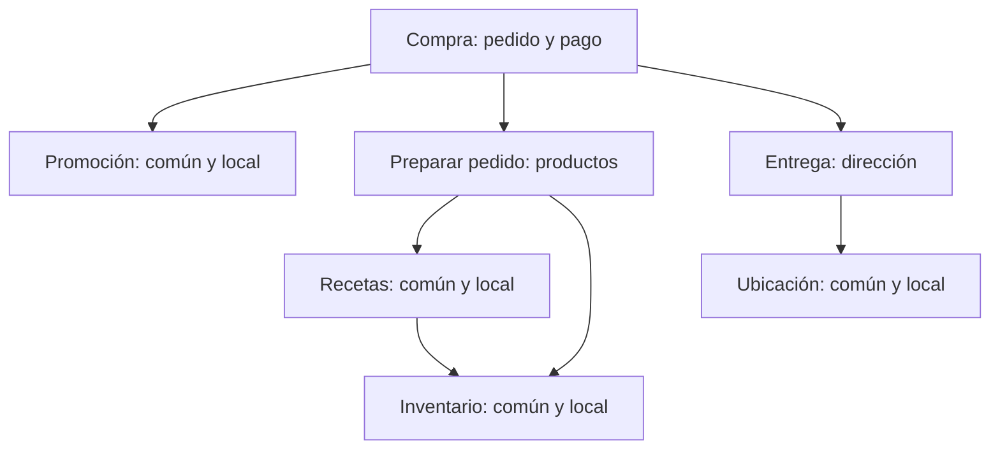
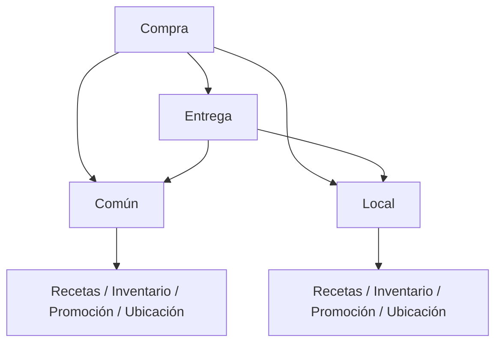

[[Obsidian/lecturas/Fundamentals of Software Architecture/09 Fundamentos de estilos arquitectónicos/00 Índice|← Índice del capítulo 9]]

# Silicon Sandwiches y decisiones de partición

La kata **Silicon Sandwiches** representa una tienda de sándwiches con reglas comunes y variantes locales. El capítulo 9 retoma ese caso para estudiar **dónde colocar las diferencias**, sin cambiar automáticamente su despliegue. Su presentación anterior está en las notas del capítulo 5.

**Objetivo:** poder justificar si conviene localizar el código por responsabilidad de negocio o por condición común/local. No hay una respuesta independiente de los cambios esperados.

## 1. Primera alternativa: cada dominio conserva sus variaciones

La figura 9-5 separa `Purchase`, `Promotion`, `MakeOrder`, `ManageInventory`, `Recipes`, `Delivery` y `Location`. Compra contiene responsabilidades de pedido y pago; entrega contiene dirección. Varios dominios contienen variantes `Common` y `Local`.

Las flechas muestran colaboraciones entre responsabilidades. Para cambiar una promoción local, se empieza por Promoción; la condición local no es una razón suficiente para moverla al mismo módulo que una receta local. El diagrama es una simplificación propia de la organización del ejemplo: las cajas no fijan servicios, protocolo, orden temporal ni modelo transaccional.

Agrupar por dominio permite conversar con el negocio usando sus responsabilidades y formar equipos que trabajen sobre una capacidad completa. También ofrece un punto de partida para una futura extracción. **Punto de partida no significa migración trivial:** datos compartidos, transacciones y referencias internas todavía pueden impedir separar el módulo.

## 2. Segunda alternativa: común y local son las primeras divisiones

En la figura 9-6, `Common` y `Local` son contenedores de primer nivel. Cada uno agrupa conceptos como recetas, inventario, promoción y ubicación. `Purchase` y `Delivery` siguen representando flujos que colaboran con ellos.

Aquí cada caja grande responde a «¿es compartido o local?» antes que a «¿de qué responsabilidad trata?». Las flechas agrupan dependencias para hacer visible el criterio; no reproducen todas las conexiones de la figura original. La organización concentra la personalización, pero hace que Compra y Entrega dependan de contenedores amplios. Los conceptos del negocio pueden tener representaciones en ambos.

**Fuente de ambas alternativas:** PDF pp. 11–13, impresas 140–142, figuras 9-5 y 9-6.

## 3. Diferenciar dispersión de duplicación

Que haya `Common` y `Local` dentro de varios dominios no demuestra por sí mismo duplicación de lógica. Una receta local y una promoción local pueden tener reglas completamente diferentes. Reutilizar el mismo motor para ambas solo porque son «locales» puede crear una abstracción que obliga a coordinar cambios sin una razón real.

Por otro lado, si todos aplican exactamente el mismo mecanismo de resolución de configuración, repetir ese mecanismo sí merece revisión. Es posible compartir una biblioteca pequeña y mantener las reglas de cada dominio en su lugar. La decisión exige distinguir **mecanismo técnico común** de **política de negocio específica**.

Esta precisión es elaboración propia para interpretar la desventaja del libro: el código de personalización aparece en distintos lugares en la partición por dominio; no implica que cada línea deba copiarse.

## 4. Ejemplo resuelto con dos cambios distintos

**Supuesto A:** cada sucursal puede cambiar la receta de un sándwich, pero los precios y la entrega no cambian. En la partición por dominio, Recetas es el centro del cambio. En la partición común/local, se buscará Recetas dentro de Local y se revisarán sus dependencias. Ambas pueden resolverlo; la primera expresa de forma directa el vocabulario de la modificación.

**Supuesto B:** se introduce una política uniforme para activar o desactivar toda personalización local por sucursal. La partición común/local facilita localizar ese eje. En la partición por dominio puede ser necesario introducir un contrato o mecanismo común y comprobar su uso en varios módulos.

No basta contar archivos modificados. En A importa si una modificación de receta obliga a desplegar o probar promociones sin necesidad. En B importa si centralizar un interruptor termina convirtiendo Common/Local en dueños de reglas que no les corresponden.

| Evidencia por obtener | Por qué cambia la decisión |
|---|---|
| Frecuencia de cambios por dominio frente a cambios globales de personalización | Indica qué agrupación coincide mejor con el trabajo habitual |
| Qué reglas son realmente comunes | Evita compartir solo por semejanza superficial |
| Equipos que necesitan coordinarse | Expone el costo humano de una dependencia |
| Tablas y transacciones que cruza cada modificación | Revela acoplamiento que el dibujo de componentes no muestra |
| Probabilidad y razón de separar despliegues | Permite valorar una frontera preparada para extracción |

## 5. Una decisión defendible

**Decisión didáctica:** empezar con módulos por dominio en un solo despliegue porque la mayoría de cambios esperados afecta una capacidad de negocio, y conservar un mecanismo pequeño para resolver configuración por sucursal. Cada dominio interpreta esa configuración mediante sus propias reglas.

**Costo aceptado:** varias responsabilidades deben adoptar de forma consistente el mecanismo de configuración. **Condición para revisar:** aparecen cambios transversales de personalización que obligan constantemente a modificar muchos módulos o se repite una regla idéntica en varios lugares.

Esto no es la solución oficial de la kata. Es una decisión condicionada por supuestos explícitos; con otra distribución de cambios podría preferirse otra organización.

> [!question] ¿Por qué Common puede convertirse en una dependencia problemática?
> Porque su amplitud puede hacer que numerosos componentes dependan de él. Cambiar un contrato o estructura compartida amplía el conjunto que necesita revisión. El problema es su responsabilidad y estabilidad, no la palabra inglesa.

> [!question] ¿Por qué no separar cada caja como microservicio desde el principio?
> Porque los dibujos comparan particiones lógicas. Distribuir requiere justificar beneficios operacionales y asumir costos de red, datos, observabilidad y despliegue. Son decisiones relacionadas, pero diferentes.

## Fuente principal

- [[Obsidian/lecturas/Fundamentals of Software Architecture/Materiales/06 Fundamentos de estilos arquitectónicos.pdf#page=11|Fundamentals of Software Architecture, 2.ª ed., capítulo 9, PDF pp. 11–13; impresas 140–142]].

Las explicaciones, diagramas y ejemplos identificados como propios son elaboraciones didácticas; las páginas indicadas permiten contrastar los conceptos con el escaneo.

---

[[Obsidian/lecturas/Fundamentals of Software Architecture/09 Fundamentos de estilos arquitectónicos/02 Partición técnica y por dominio|← Anterior]] · [[Obsidian/lecturas/Fundamentals of Software Architecture/09 Fundamentos de estilos arquitectónicos/04 Monolitos distribución y fiabilidad|Siguiente →]]
