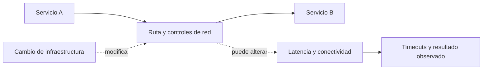

[[Obsidian/lecturas/Fundamentals of Software Architecture/09 Fundamentos de estilos arquitectónicos/00 Índice|← Índice del capítulo 9]]

# Seguridad, topología y coordinación

Las falacias 4, 5, 6 y 8 recuerdan que una arquitectura distribuida depende de una infraestructura real, compartida y cambiante. El diagrama de servicios es incompleto si ignora controles de acceso, rutas, administración e interoperabilidad.

## 1. Falacia 4: «La red es segura»

El libro cuestiona confiar automáticamente en una VPN, firewall o red interna. Cada endpoint remoto abre una superficie que debe protegerse frente a solicitudes indebidas. Que el tráfico venga de dentro no demuestra que el actor esté autorizado a ejecutar una operación.

**Ejemplo propio.** Inventario ofrece `liberarReserva`. Si cualquier servicio interno puede invocarlo con cualquier identificador, un error de otro componente puede liberar una reserva ajena. Cifrar la conexión no resuelve por sí solo quién está autorizado a modificar qué recurso.

Conviene distinguir mecanismos: autenticar identifica al interlocutor; autorizar decide qué puede hacer; validar comprueba la forma y condiciones de la solicitud; proteger el transporte dificulta leer o alterar los datos en tránsito. Son responsabilidades relacionadas pero distintas. La selección concreta necesita el contexto del sistema.

**Costo de la decisión:** controles, configuración, credenciales y procesamiento adicionales. **Error de interpretación:** eliminar controles solo porque añaden trabajo o latencia. Esa tensión debe entrar en el diseño y el presupuesto operacional.

**Fuente:** PDF pp. 17–18, impresas 146–147, figura 9-10.

## 2. Falacia 5: «La topología nunca cambia»

La topología incluye rutas, routers, switches, firewalls, balanceadores y otros elementos de comunicación. Puede cambiar sin un nuevo despliegue de la aplicación. Una modificación altera latencia, accesibilidad o conexiones existentes; las suposiciones anteriores dejan de describir el entorno.

El ejemplo del libro presenta timeouts tras una actualización de red. La aplicación no cambió, pero sí una dependencia de su funcionamiento. Culpar solo al último cambio de código impediría encontrar la causa.

La flecha punteada expresa influencia, no un mensaje de negocio. Un cambio en R puede afectar el resultado aunque A y B mantengan el mismo código. El diagrama no dice que toda actualización cause un incidente; muestra qué dependencia hay que observar.

**Respuesta de diseño propia:** conservar la configuración del ensayo de rendimiento, relacionar cambios operacionales con métricas y acordar cómo se comunican ventanas de modificación. Aumentar todos los timeouts sin investigar puede ocultar saturación y retener recursos más tiempo.

**Fuente:** PDF p. 18, impresa 147, figura 9-11.

## 3. Falacia 6: «Existe un único administrador»

En una organización grande, red, seguridad, plataforma, bases de datos y aplicaciones pueden tener responsables distintos. La persona que conoce una ruta puede no poder cambiar un firewall. Decir «ya hablé con infraestructura» no garantiza que todos los participantes conozcan un cambio.

La lección no es crear reuniones permanentes, sino identificar dependencias y responsabilidades concretas. ¿Quién conoce la capacidad? ¿Quién anuncia cambios de rutas? ¿Quién puede diagnosticar un rechazo de acceso? ¿Quién atiende una degradación que cruza dominios?

| Situación propia | Coordinación necesaria | Evidencia útil |
|---|---|---|
| Nuevos timeouts | Aplicación, plataforma y red | Distribución de latencias y cambios recientes |
| Acceso denegado a un servicio | Identidad, seguridad y dueño del servicio | Identidad invocante y regla aplicada, sin exponer secretos |
| Saturación en hora pico | Dueños de consumidor y proveedor | Tasa de solicitudes, tamaño de mensajes y recursos |
| Migración de ruta | Operación y equipos afectados | Dependencias y comparación antes/después |

La organización puede reducir fricción con servicios internos claros y autoservicio, pero eso no elimina los dueños ni la necesidad de coordinar cambios significativos.

**Fuente:** PDF p. 19, impresa 148, figura 9-12.

## 4. Falacia 8: «La red es homogénea»

La octava falacia se refiere en este capítulo a infraestructura de distintos fabricantes y comportamientos que no siempre coinciden perfectamente. Los estándares ayudan a interoperar; no demuestran que toda combinación bajo toda carga esté probada.

No hay que generalizar que mezclar fabricantes falla siempre, ni que comprar uno solo elimina problemas. La conclusión es comprobar supuestos en la red real: compatibilidad, configuración, límites y efectos bajo carga. Esta falacia se conecta con fiabilidad, latencia y ancho de banda porque una diferencia de comportamiento puede afectar cualquiera de ellos.

**Ejemplo propio.** Dos entornos ejecutan el mismo binario, pero solo uno introduce un intermediario con un límite de duración de conexión distinto. Una prueba que solo existe en el entorno simple puede no descubrir la diferencia. La solución comienza por comparar el recorrido real, no por afirmar que los binarios iguales garantizan comportamiento igual.

**Fuente:** PDF p. 20, impresa 149, figura 9-14.

## 5. Cómo integrarlas en una revisión

Para un recorrido importante, describe quién llama a quién, qué identidad usa, qué infraestructura atraviesa, cuánto espera y quién es responsable de cada dependencia. Después ensaya qué cambia si una de esas condiciones varía. Una revisión útil termina en supuestos verificables y responsabilidades claras.

> [!question] Si no se publicó código, ¿puede haber una regresión operacional?
> Sí. Pueden haber cambiado red, configuración, carga, datos o dependencias. «No hubo despliegue» reduce una hipótesis, no demuestra ausencia de cambios.

> [!question] ¿Una VPN reemplaza la autorización del servicio?
> No. Controlar el acceso a la red no decide por sí mismo qué operación puede ejecutar una identidad sobre un recurso.

> [!question] ¿Más reuniones resuelven la falacia del administrador único?
> No necesariamente. Hace falta identificar responsables y canales efectivos para las dependencias concretas; sumar participantes sin propósito puede aumentar el costo de coordinación.

## Fuente principal

- [[Obsidian/lecturas/Fundamentals of Software Architecture/Materiales/06 Fundamentos de estilos arquitectónicos.pdf#page=17|Fundamentals of Software Architecture, 2.ª ed., capítulo 9, PDF pp. 17–20; impresas 146–149]].

Las explicaciones, diagramas y ejemplos identificados como propios son elaboraciones didácticas; las páginas indicadas permiten contrastar los conceptos con el escaneo.

---

[[Obsidian/lecturas/Fundamentals of Software Architecture/09 Fundamentos de estilos arquitectónicos/05 Latencia ancho de banda y costo|← Anterior]] · [[Obsidian/lecturas/Fundamentals of Software Architecture/09 Fundamentos de estilos arquitectónicos/07 Versionado compensación y observabilidad|Siguiente →]]
